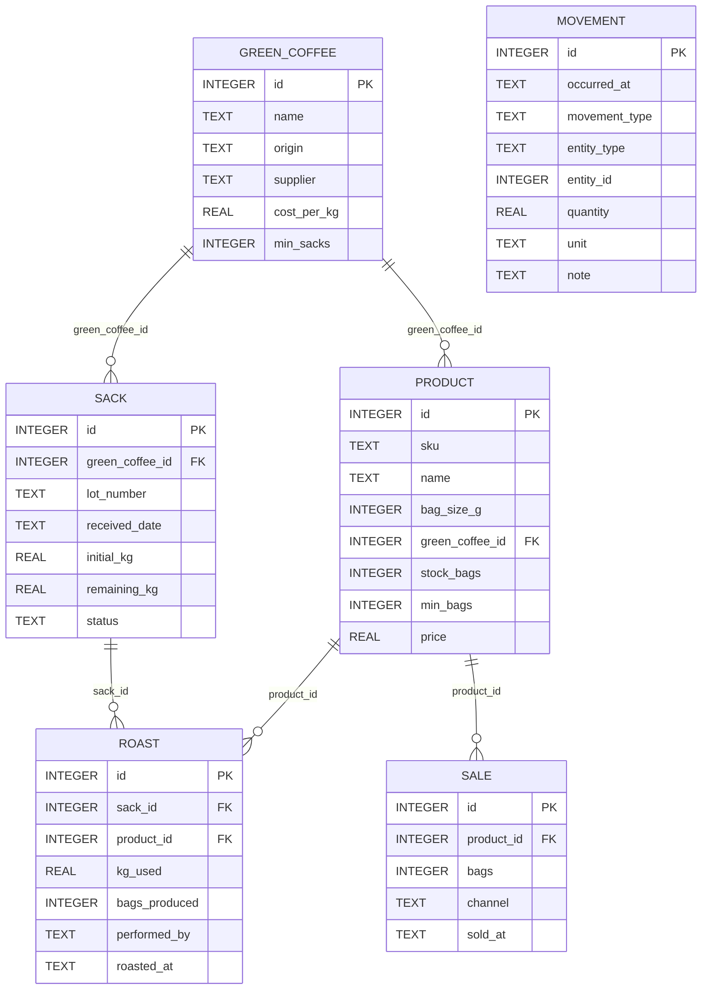
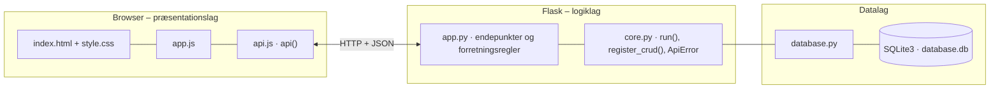

# StockUP – dokumentation af prototypen

Internt lagersystem til Strandvejsristeriet ApS. Prototypen holder styr på **sække med grønne kaffebønner** og **kaffeposer klar til salg**
efter princippet om lavest mulig investering: der vejes ikke, men registreres. En sæk modtages altid med 80 kg, og en ristning bruger altid 25 kg.

Kravgrundlag: [`README.md`](README.md) (gruppens beskrivelse af StockUP).
Gruppens README beskriver en React/Express-løsning. Prototypen her er bygget med holdets fælles Flask + HTML/CSS/JS-struktur,
men har samme datamodel, forretningsregler og endepunkter.

## Hvad kan prototypen

| Skærm | Funktion |
|---|---|
| **Dashboard** | Nøgletal (sække, kg, mulige ristninger, poser, varer under minimum), sække med status og salgsklare varer med salg pr. dag og dækning i dage. Knappen *Afslut rest* på sække under 25 kg |
| **Registrér** | Registrér ristning (vælg sæk og vare, poseantal foreslås), registrér salg, modtag sæk (altid 80 kg) og fortryd en ristning |
| **Råkaffe og varer** | CRUD for råkaffetyper og salgsklare varer |
| **Bevægelser** | Append-only log over alt, der har ændret lageret |

## Fra krav til kode

| Krav / regel | Implementering |
|---|---|
| Sæk modtages med 80 kg uden vejning | `register_crud("sacks", defaults={"initial_kg": SACK_KG, "remaining_kg": SACK_KG})` |
| Ristning trækker altid 25 kg | `register_roast()` – konstanten `ROAST_KG` |
| Der kan ikke ristes fra en sæk med under 25 kg | `register_roast()` afviser med 400 |
| En vare kan kun ristes fra sin egen råkaffetype (blandinger undtaget) | `register_roast()` sammenligner `green_coffee_id` |
| Poseantallet må ikke overstige, hvad 25 kg kan give | `max_bags()` – forslag via `suggested_bags()` med 16 % svind |
| Der kan ikke sælges flere poser end på lager | `register_sale()` + `CHECK (stock_bags >= 0)` |
| Lot-numre er unikke | `UNIQUE` i `schema.sql` → 409 Conflict |
| Sæk kan kun afsluttes under 25 kg | `close_sack()` |
| Ristning kan kun fortrydes, hvis poserne ikke er solgt | `undo_roast()` |
| En ristning ændrer tre ting på én gang | `with transaction()`: sæk, vare, ristning og to bevægelser gemmes atomart |
| Beholdningen kan dokumenteres | Tabellen `movement` skrives kun (append-only). Lagerbeholdningen på varer ændres ikke via CRUD (`stock_bags` er ikke i `fields`) |

**Sækkens livscyklus** (`sack_status()`):

```
PAA_LAGER (80 kg) → I_BRUG (55, 30 kg) → REST (< 25 kg) → TOM (afslut rest)
```

## Datamodel



| Tabel | Rolle |
|---|---|
| `green_coffee` | Råkaffetyper med oprindelse, leverandør og minimumsantal sække |
| `sack` | Den enkelte sæk: lot-nummer, restmængde og status |
| `product` | Salgsklare varer (SKU, posestørrelse, beholdning, minimum, pris) |
| `roast` · `sale` | Registrerede ristninger og salg |
| `movement` | Append-only log over alle lagerændringer |

## Eksempel på dataudveksling

Registrér en ristning fra sæk ET-26-04 til varen *Filter Helsingør*. Sækken går fra 80 til 55 kg, og der lægges 84 poser på lager:

```bash
curl -X POST http://localhost:5101/api/roasts \
  -H 'Content-Type: application/json' \
  -d '{"sack_id": 2, "product_id": 1, "bags_produced": 84, "performed_by": "Anders"}'
```

Svar `201`:

```json
{
  "roast": {
    "id": 7,
    "sack_id": 2,
    "product_id": 1,
    "kg_used": 25.0,
    "bags_produced": 84,
    "performed_by": "Anders",
    "roasted_at": "2026-09-29 15:50:35"
  },
  "sack": {
    "id": 2,
    "green_coffee_id": 1,
    "lot_number": "ET-26-04",
    "received_date": "2026-09-10",
    "initial_kg": 80.0,
    "remaining_kg": 55.0,
    "status": "I_BRUG",
    "coffee_name": "Yirgacheffe",
    "origin": "Etiopien",
    "roasts_left": 2
  },
  "product": {
    "id": 1,
    "sku": "FV-0210",
    "name": "Filter Helsingør",
    "bag_size_g": 250,
    "green_coffee_id": 1,
    "stock_bags": 172,
    "min_bags": 40,
    "price": 95.0
  },
  "suggested_bags": 84
}
```

## Kør prototypen

```bash
cd backend
python3 -m venv .venv && source .venv/bin/activate   # første gang
pip install -r requirements.txt                       # første gang
python app.py
```

Terminalen skriver ` * Åbn http://localhost:5101`. Åbn adressen i browseren. Flask serverer både API'et (`/api/...`) og frontenden.

- **Port:** Prototypen bruger port **5101** (5100 + projektnummer). Er porten optaget, vælger `run()` i `core.py` selv den næste ledige og skriver fx ` * Port 5101 er optaget – bruger port 5102 i stedet`. Du kan også vælge port selv med `PORT=5200 python app.py`.
- **Stop serveren** med `Ctrl` + `C` i terminalen, hvor den kører.
- **Kodeændringer:** Serveren kører i debug-tilstand og genstarter selv, når du gemmer en `.py`-fil. Den bliver på samme port. Ændringer i `frontend/` kræver kun, at du genindlæser siden.
- **Database:** `backend/database.db` oprettes med testdata ved første start. Nulstil den med `python database.py --reset`, mens serveren er stoppet.
- **Tjek at backenden svarer:** `curl http://localhost:5101/api/health`

### Fejlfinding

| Problem | Årsag | Løsning |
|---|---|---|
| ` * Port 5101 er optaget – bruger port …` | En anden proces, ofte en glemt server, bruger porten | Brug den adresse, der står i terminalen. Se hvad der optager porten med `lsof -nP -iTCP:5101 -sTCP:LISTEN`. En Flask-server i debug-tilstand er to processer, så stop dem begge med `lsof -t -iTCP:5101 -sTCP:LISTEN \| xargs kill` |
| `ModuleNotFoundError: No module named 'flask'` | Det virtuelle miljø er ikke aktiveret, eller Flask er ikke installeret | `source .venv/bin/activate` og `pip install -r requirements.txt` |
| Siden viser "Kan ikke hente data fra backenden" | Serveren kører ikke, eller `index.html` er åbnet direkte fra disken, mens serveren kører på en anden port | Start serveren og åbn adressen fra terminalen i stedet for filen |
| Tallene passer ikke efter mange tests | Databasen indeholder testdata fra tidligere afprøvninger | Stop serveren og kør `python database.py --reset` |
| `no such table …` | `database.db` er tom eller ødelagt | `python database.py --reset` |

## Arkitektur

Prototypen følger holdets fælles tre-lags struktur (se [`../README.md`](../README.md)):



| Fil | Lag | Indhold |
|---|---|---|
| `frontend/index.html` | Præsentation | Skærmbilleder som faneblade og formularer. Projektets farver og `data-api-port` |
| `frontend/app.js` | Præsentation | Henter data med `api()`, tegner dem i DOM'en og sender formularer |
| `frontend/api.js` | Præsentation | Fælles for alle prototyper: `api()` (fetch + JSON), `h()`, `renderTable()`, `fillSelect()`, `formToJson()`, `bindCrudForm()` og `toast()` |
| `frontend/style.css` | Præsentation | Fælles responsivt design |
| `backend/app.py` | Logik | Projektets forretningsregler og endepunkter |
| `backend/core.py` | Logik | Fælles: `create_app()` (Flask, CORS, JSON-fejl), `run()` (start på ledig port), `ApiError` og `register_crud()` |
| `backend/database.py` | Data | Fælles: forbindelse, `query_all/query_one/execute`, `transaction()` og `init_db()` |
| `backend/schema.sql` · `seed.sql` | Data | Tabeller og fiktive testdata |

Alle fejl returneres som JSON (`{"error": "…", "path": "/api/…"}`) med statuskode 400, 401, 403, 404 eller 409 og vises som en rød besked i frontenden.
Nederst på siden kan man åbne **"Seneste JSON-svar fra API'et"** og se den rå dataudveksling.
Den fulde endepunktsliste står i [`backend/README.md`](backend/README.md).

## Design og responsivitet

- Samme stylesheet i alle prototyper. Kun farverne (`--brand`, `--brand-dark`, `--brand-soft`) sættes i `index.html`.
- Layoutet virker fra mobil (375 px) til desktop uden vandret scroll. Kort lægger sig under hinanden på små skærme, og brede tabeller scroller inde i deres kort.
- Formularfelter kan ikke blive bredere end deres kort. En `<select>` med lange valgmuligheder skubber altså ikke formularen ud over kanten.
- Beskeder vises kort i toppen (grøn = gennemført, rød = fejl fra serveren).


## Testdata

4 råkaffetyper, 6 sække (én med rest på 5 kg), 5 varer (én under minimum), historiske ristninger, salg og bevægelser.

## Afgrænsning

Emballage, indkøbsordrer, integration til webshop/kasse og login indgår ikke (jf. gruppens afgrænsning).
