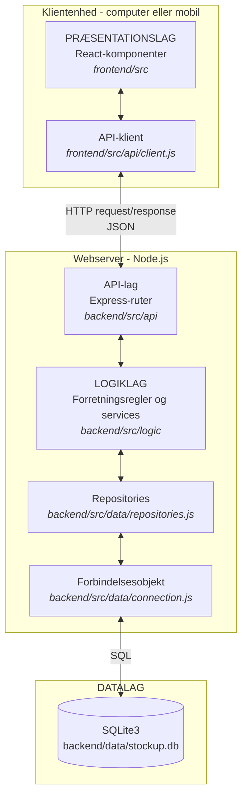
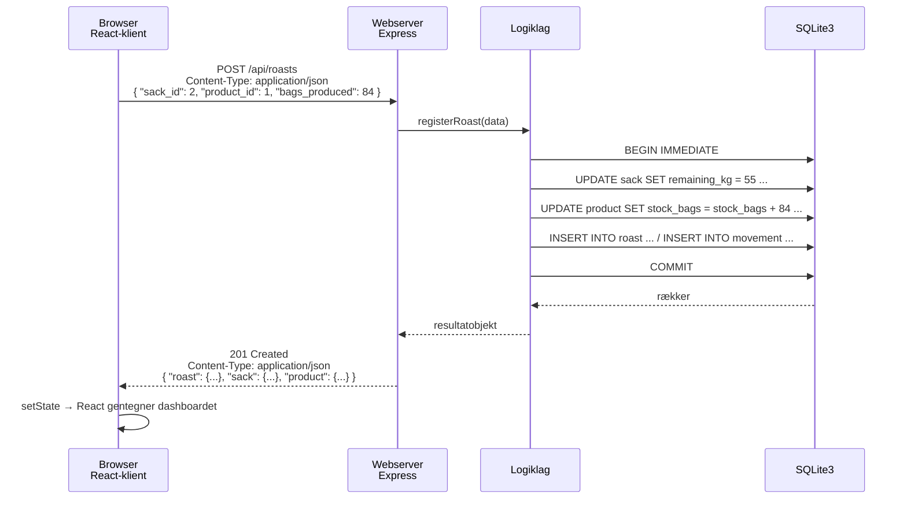
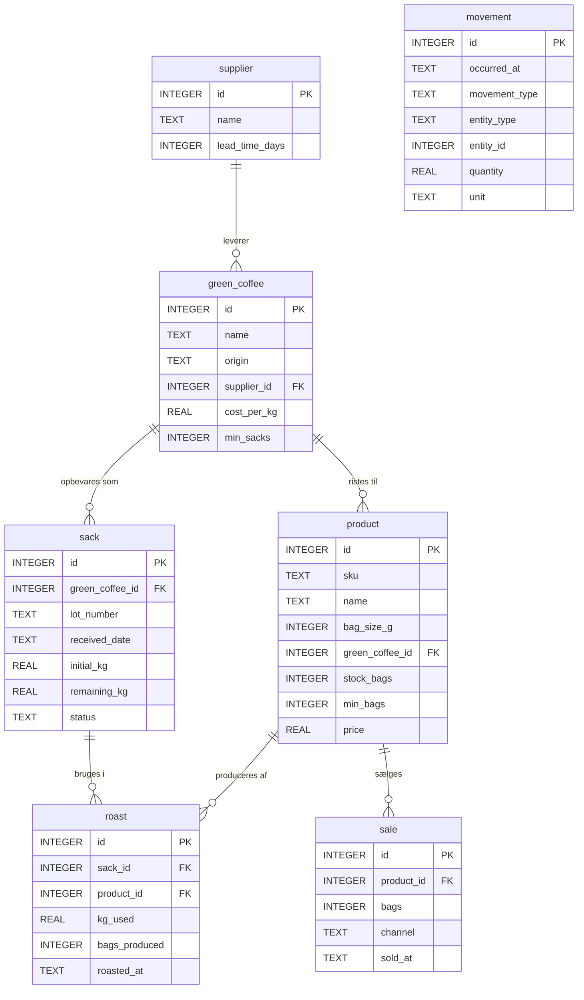

# StockUP – Strandvejsristeriet

Internt lagersystem til Strandvejsristeriet ApS. Systemet holder styr på to ting:

1. **Sække med grønne kaffebønner.** En sæk modtages med 80 kg. Hver gang der ristes, bruges 25 kg.
2. **Kaffeposer klar til salg.** Poserne kommer fra ristningerne og forsvinder igen, når de sælges.

Prototypen er bygget efter princippet om **lavest mulig investering**. Der skal ikke anskaffes vægte, scannere eller andet udstyr. Medarbejderen vælger en sæk på skærmen og trykker "registrér ristning" – systemet ved, at det altid er 25 kg. Poserne tælles, og tallet indtastes. Al lagerstatus udledes af de registreringer.

> Kravgrundlaget findes i [Kravspecifikation StockUP.md](Kravspecifikation%20StockUP.md).

---

## Indhold

- [Teknologistak](#teknologistak)
- [Arkitektur](#arkitektur)
- [Netværksarkitektur og datakommunikation](#netværksarkitektur-og-datakommunikation)
- [Projektstruktur](#projektstruktur)
- [Datamodel](#datamodel)
- [API-endepunkter](#api-endepunkter)
- [Forretningsregler](#forretningsregler)
- [DevOps: kør projektet på din Mac](#devops-kør-projektet-på-din-mac)
- [Byg og deploy](#byg-og-deploy)

---

## Teknologistak

| Lag | Teknologi | Version | Rolle i projektet |
| --- | --- | --- | --- |
| Præsentation | **React** | 18.3 | Klientside-kode der kører i brugerens browser |
| Præsentation | **Vite** | 6.x | Udviklingsserver og build-værktøj der samler klienten til statiske filer |
| Præsentation | **CSS** | – | Håndskrevet stylesheet, ingen UI-framework |
| Logik | **Node.js** | ≥ 18 (udviklet på 24) | Kørselsmiljø for serversiden |
| Logik | **Express** | 4.21 | Webserver og HTTP-API |
| Logik | **cors** | 2.8 | Tillader klienten at kalde API'et fra en anden port under udvikling |
| Data | **SQLite3** | 5.1 (`sqlite3`-pakken) | Filbaseret relationsdatabase |
| Dataformat | **JSON** | – | Både kildedata og alle svar fra API'et |

### Hvorfor denne stak

**Node.js i begge ender** betyder ét sprog – JavaScript – i hele projektet. Det halverer, hvad der skal læres, og gør det muligt at flytte kode og begreber mellem klient og server.

**SQLite3 frem for en databaseserver** passer til kravet om lav investering. Hele databasen er én fil (`backend/data/stockup.db`). Der skal ikke installeres, konfigureres eller betales for en databaseserver, og filen kan kopieres som backup. Skulle virksomheden senere vokse ud af det, er SQL'en standard nok til, at skiftet til PostgreSQL eller MySQL primært rammer datalaget.

**Express frem for et større framework** holder API'et gennemskueligt. Ruterne fylder én fil, og der er ingen skjult opsætning at forklare til en eksamen.

**React frem for almindelig HTML og JavaScript**, fordi brugerfladen løbende skal afspejle en tilstand, der ændrer sig: beholdninger ændrer sig ved hver registrering. React genberegner skærmbilledet ud fra data i stedet for, at koden skal opdatere DOM'en manuelt.

### Versionsvalg

Express er bevidst fastlåst til **4.x**. Version 5 er udgivet, men ændrer bl.a. hvordan wildcard-ruter skrives. 4.x er den version, langt størstedelen af dokumentation og undervisningsmateriale beskriver.

---

## Arkitektur

Projektet er bygget med **separation of concerns** i en **tre-lags arkitektur**. Hvert lag har ét ansvar og kender kun laget under sig.



### Ansvarsfordeling

| Lag | Må | Må ikke |
| --- | --- | --- |
| **Præsentation** | Vise data, tage imod input, kalde API'et | Indeholde forretningsregler. Klienten regner ikke selv ud, om en ristning er tilladt – den spørger serveren og viser svaret |
| **Logik** | Håndhæve regler, beregne, styre transaktioner | Skrive SQL eller kende til HTTP-statuskoder |
| **Data** | Gemme og hente data, sikre referentiel integritet | Træffe forretningsbeslutninger |

Grænsen holdes af, hvad hver fil importerer: `logic/`-filerne importerer aldrig `sqlite3`, og `data/`-filerne importerer aldrig `express`.

### Forbindelsesobjektet mellem logiklag og datalag

`backend/src/data/connection.js` er det eneste sted i projektet, der kender SQLite-driveren. Det udstiller en lille, promise-baseret grænseflade:

```js
connection.all(sql, params)     // hent flere rækker
connection.get(sql, params)     // hent én række
connection.run(sql, params)     // INSERT / UPDATE / DELETE → { id, changes }
connection.exec(sql)            // kør et helt script, fx schema.sql
connection.transaction(work)    // kør flere operationer som én atomar enhed
```

`transaction()` er afgørende for korrektheden. En ristning ændrer tre ting: sækkens restmængde, varens antal poser og bevægelsesloggen. Sker kun en del af det, stemmer lageret ikke. Transaktionen sikrer, at enten sker alt, eller også sker intet:

```js
return connection.transaction(async () => {
  await sackRepository.update(sack_id, { remaining_kg: remainingAfter, status: statusAfter });
  await productRepository.adjustStock(product_id, bags);
  const roast = await roastRepository.create({ ... });
  await movementRepository.create({ ... });   // træk fra sækken
  await movementRepository.create({ ... });   // tilgang på varen
  return { roast, sack, product };
});
```

---

## Netværksarkitektur og datakommunikation

Applikationen er en **webapplikation til World Wide Web**. Klientkoden kører på brugerens egen enhed – computer eller mobiltelefon – i en webbrowser, og kommunikerer med webserveren over **HTTP**.



**Dataformatet er JSON i begge retninger.** Klienten sender JSON i request-body og læser JSON fra response-body:

```js
// frontend/src/api/client.js
const response = await fetch(`${BASE_URL}/api${path}`, {
  method,
  headers: body ? { 'Content-Type': 'application/json' } : undefined,
  body: body ? JSON.stringify(body) : undefined,
});
const payload = await response.json();
```

Resultatet lægges i React-state, og komponenterne gentegnes med de nye tal.

### HTTP-statuskoder

| Kode | Bruges når |
| --- | --- |
| `200 OK` | Opslag og opdateringer lykkedes |
| `201 Created` | En ny sæk, vare, ristning eller et salg blev oprettet |
| `204 No Content` | Sletning lykkedes |
| `400 Bad Request` | En forretningsregel blev overtrådt |
| `404 Not Found` | Ressourcen eller endepunktet findes ikke |
| `409 Conflict` | Konflikt med eksisterende data, fx et lot-nummer der allerede findes |
| `500 Internal Server Error` | Uventet serverfejl |

Fejl svares altid som JSON med samme form, så klienten kan vise beskeden direkte:

```json
{
  "fejl": "Sæk BR-26-08 har 5 kg tilbage og kan ikke dække en ristning på 25 kg.",
  "kode": "FORRETNINGSREGEL",
  "sti": "/api/roasts"
}
```

### To porte under udvikling, én i drift

Under udvikling kører Vite på `5173` og Express på `3001`. Vite proxyer `/api` videre til backenden, så klientkoden kan bruge relative stier begge steder. I drift serverer Express både API'et og den byggede klient fra samme port – så er der ingen CORS, og kun én proces at starte.

---

## Projektstruktur

```
Strandvejsristeriet/
├── README.md                      ← dette dokument
├── Kravspecifikation StockUP.md   ← kravgrundlag (Volere-skabelon)
│
├── docs/
│   └── stockup-data.json          ← kildedata der indlæses i databasen
│
├── backend/                       ← LOGIKLAG + DATALAG
│   ├── package.json
│   ├── server.js                  ← indgang: starter Express, åbner databasen
│   ├── data/
│   │   └── stockup.db             ← SQLite3-databasefilen (oprettes automatisk)
│   └── src/
│       ├── api/                   ← HTTP-grænsefladen
│       │   ├── routes.js          ← alle endepunkter
│       │   └── errorHandler.js    ← oversætter fejl til JSON-svar
│       ├── logic/                 ← FORRETNINGSLOGIK
│       │   ├── rules.js           ← 80 kg pr. sæk, 25 kg pr. ristning, svind
│       │   ├── inventoryService.js    ← sække og råkaffetyper
│       │   ├── productionService.js   ← ristning og salg
│       │   ├── catalogService.js      ← salgsklare varer
│       │   ├── dashboardService.js    ← samler nøgletal
│       │   └── errors.js          ← forretningsfejl med HTTP-status
│       └── data/                  ← DATAADGANG
│           ├── connection.js      ← forbindelsesobjektet
│           ├── repositories.js    ← CRUD pr. tabel
│           ├── schema.sql         ← tabeldefinitioner
│           └── seed.js            ← indlæser docs/stockup-data.json
│
└── frontend/                      ← PRÆSENTATIONSLAG
    ├── package.json
    ├── vite.config.js             ← build-opsætning og dev-proxy til /api
    ├── index.html
    ├── .env.example
    ├── dist/                      ← bygget klient (genereres af npm run build)
    └── src/
        ├── main.jsx               ← monterer React i DOM'en
        ├── App.jsx                ← dashboardet, henter og opdaterer tilstand
        ├── styles.css
        ├── api/
        │   └── client.js          ← eneste sted i klienten der kender HTTP
        └── components/
            ├── KpiCards.jsx
            ├── SackTable.jsx
            ├── ProductTable.jsx
            ├── RegisterForms.jsx
            └── MovementList.jsx
```

**Separationen er fysisk.** `frontend/` og `backend/` har hver sin `package.json` og hver sine afhængigheder. De deler ingen kode og kan bygges, versioneres og udrulles hver for sig. Det eneste, der binder dem sammen, er HTTP-kontrakten.

---

## Datamodel



`movement` er en **append-only log** over alt, der ændrer lageret. Posterne rettes aldrig – en fejl modsvares af en korrektionspost. Beholdningen er dermed ikke bare et tal, men summen af hændelser, og det kan altid dokumenteres, hvordan den er opstået.

### Kildedata

`docs/stockup-data.json` indeholder startdata: 2 leverandører, 4 råkaffetyper, 6 sække, 5 varer samt historiske ristninger og salg. `seed.js` læser filen, opretter skemaet og indsætter alt i SQLite3 i én transaktion. Kører automatisk ved første serverstart.

```bash
npm run seed    # indlæser kun hvis databasen er tom
npm run reset   # sletter alt og indlæser forfra
```

---

## API-endepunkter

Alle svar er JSON. Basissti: `/api`.

| Metode | Endepunkt | Gør |
| --- | --- | --- |
| `GET` | `/health` | Systemstatus |
| `GET` | `/dashboard` | Alle nøgletal, sække, varer og bevægelser i ét kald |
| `GET` | `/green-coffees` | Råkaffetyper med antal sække og samlet kg |
| `POST` | `/green-coffees` | Opret råkaffetype |
| `PUT` | `/green-coffees/:id` | Opdatér råkaffetype |
| `DELETE` | `/green-coffees/:id` | Slet råkaffetype |
| `GET` | `/sacks` | Alle sække. Filtrér med `?status=PAA_LAGER` |
| `GET` | `/sacks/roastable` | Sække med mindst 25 kg tilbage |
| `GET` | `/sacks/:id` | Én sæk |
| `POST` | `/sacks` | **Modtag sæk** – oprettes med 80 kg |
| `PUT` | `/sacks/:id` | Opdatér sæk |
| `POST` | `/sacks/:id/close` | **Afslut restmængde** under 25 kg |
| `DELETE` | `/sacks/:id` | Slet sæk |
| `GET` | `/products` | Varer med status, dækning i dage og salg pr. dag |
| `GET` | `/products/:id` | Én vare |
| `POST` | `/products` | Opret vare |
| `PUT` | `/products/:id` | Opdatér vare |
| `DELETE` | `/products/:id` | Slet vare |
| `GET` | `/roasts` | Ristninger |
| `POST` | `/roasts` | **Registrér ristning** – trækker 25 kg, lægger poser til |
| `DELETE` | `/roasts/:id` | Fortryd ristning |
| `GET` | `/sales` | Salg |
| `POST` | `/sales` | **Registrér salg** |
| `GET` | `/movements` | Lagerbevægelser |

CRUD er implementeret fuldt ud for `green_coffee`, `sack` og `product`.

### Eksempel

```bash
curl -X POST http://localhost:3001/api/roasts \
  -H 'Content-Type: application/json' \
  -d '{"sack_id": 2, "product_id": 1, "bags_produced": 84, "performed_by": "Anders"}'
```

```json
{
  "roast": { "id": 7, "sack_id": 2, "kg_used": 25, "bags_produced": 84 },
  "sack": { "lot_number": "ET-26-04", "remaining_kg": 55, "status": "I_BRUG", "roasts_left": 2 },
  "product": { "sku": "FV-0210", "name": "Filter Helsingør", "stock_bags": 172 },
  "suggested_bags": 84
}
```

---

## Forretningsregler

Reglerne ligger samlet i `backend/src/logic/rules.js`.

| Regel | Værdi | Hvorfor |
| --- | --- | --- |
| Sækvægt | 80 kg | Standardstørrelsen fra leverandøren. Registreres uden vejning |
| Ristemængde | 25 kg | Fast portion. Derfor kan forbrug tælles i stedet for at vejes |
| Ristesvind | 16 % | Bruges kun til at *foreslå* et poseantal |
| Restmængde | < 25 kg | 80 kg giver 3 ristninger og efterlader 5 kg. Sækken får status `REST` og afsluttes manuelt |

**Sækkens livscyklus:**

```
PAA_LAGER  →  I_BRUG  →  REST  →  TOM
  80 kg       55, 30 kg   5 kg     0 kg
             (ristning)         (afslut rest)
```

**Valideringer der håndhæves i logiklaget:**

- Der kan ikke ristes fra en sæk med under 25 kg tilbage.
- En vare kan kun ristes fra sin egen råkaffetype. Varer uden råkaffetype regnes som blandinger.
- Poseantallet må ikke overstige, hvad 25 kg realistisk kan give.
- Der kan ikke sælges flere poser, end der er på lager.
- Lot-numre er unikke.
- En sæk kan ikke afsluttes, hvis den stadig kan bruges til en ristning.
- En ristning kan kun fortrydes, hvis poserne ikke allerede er solgt.

Svind beregnes ikke ud fra vejning, men foreslås: 25 kg × (1 − 16 %) = 21 kg ristet kaffe. Ved 250 g-poser bliver det 84 poser. Medarbejderen tæller de faktiske poser og retter tallet – det er den eneste måde at ramme rigtigt uden en vægt.

---

## DevOps: kør projektet på din Mac

Denne guide forudsætter ingen forhåndsviden om terminalen. Følg trinnene i rækkefølge – de fire første skal kun gøres én gang.

### 1. Åbn Terminal

Terminal er det program, hvor du skriver kommandoer til din Mac. Vælg én af disse:

- **Spotlight (hurtigst):** tryk `⌘ Cmd` + `mellemrum`, skriv `terminal`, tryk `Retur`.
- **Launchpad:** åbn Launchpad → mappen **Andet** → **Terminal**.
- **Finder:** `Programmer` → `Hjælpeprogrammer` → `Terminal`.

Du får et vindue med en linje, der ender på `%`. Det kaldes en prompt, og det er her, du skriver.

Nyttige tastaturgenveje i Terminal:

| Genvej | Gør |
| --- | --- |
| `⌘ Cmd` + `T` | Nyt faneblad i samme vindue |
| `⌘ Cmd` + `N` | Helt nyt vindue |
| `⌘ Cmd` + `⇧ Shift` + `[` og `]` | Skift mellem faneblade |
| `Ctrl` + `C` | Stopper det program, der kører lige nu |
| `⌘ Cmd` + `K` | Rydder skærmen |
| Pil op | Henter den forrige kommando frem igen |

### 2. Tjek at Node.js er installeret

Skriv i Terminal og tryk `Retur`:

```bash
node -v
npm -v
```

Får du to versionsnumre – fx `v24.21.0` og `11.19.0` – er du klar. Node.js skal være version 18 eller nyere.

Får du i stedet `zsh: command not found: node`, mangler Node.js. Installér det på én af to måder:

**A – hent installationsprogrammet (nemmest):** gå til [nodejs.org](https://nodejs.org), hent LTS-versionen til macOS, åbn `.pkg`-filen og klik dig igennem. **Luk Terminal og åbn den igen** bagefter, ellers kender den ikke `node` endnu.

**B – med Homebrew,** hvis du allerede har det:

```bash
brew install node
```

### 3. Gå til projektmappen

Terminalen starter i din hjemmemappe. Du skal "gå ind i" projektmappen med kommandoen `cd` (change directory):

```bash
cd "$HOME/Library/Mobile Documents/com~apple~CloudDocs/EK/3. Semester/Strandvejsristeriet"
```

Anførselstegnene er nødvendige, fordi stien indeholder mellemrum. Bemærk `$HOME` frem for `~` – tilde-tegnet virker ikke inde i anførselstegn.

> **Genvej:** skriv `cd`  (med mellemrum efter), træk derefter projektmappen fra Finder ind i Terminal-vinduet og slip. Stien indsættes automatisk og korrekt. Tryk `Retur`.

Tjek at du står det rigtige sted:

```bash
ls
```

Du skal se `backend`, `frontend`, `docs` og `README.md` i listen.

### 4. Installér afhængigheder (kun første gang)

Projektet består af to selvstændige dele, som hver har sine egne pakker. De skal installeres hver for sig:

```bash
cd backend
npm install

cd ../frontend
npm install

cd ..
```

`npm install` henter pakkerne ned i en mappe ved navn `node_modules`. Det tager typisk under et minut pr. del og skal kun gøres igen, hvis pakkelisten ændrer sig.

### 5. Start backenden (faneblad 1)

```bash
cd "$HOME/Library/Mobile Documents/com~apple~CloudDocs/EK/3. Semester/Strandvejsristeriet/backend"
npm start
```

Du skal se:

```
StockUP backend kører på http://localhost:3001
API:      http://localhost:3001/api/dashboard
Database: .../backend/data/stockup.db
```

**Terminalen "hænger" nu – og det er meningen.** Serveren kører, så længe fanebladet er åbent. Du kan ikke skrive nye kommandoer her. Databasen bliver oprettet og fyldt automatisk fra `docs/stockup-data.json`, første gang du starter.

### 6. Start frontenden (faneblad 2)

Åbn et **nyt faneblad** med `⌘ Cmd` + `T` og skriv:

```bash
cd "$HOME/Library/Mobile Documents/com~apple~CloudDocs/EK/3. Semester/Strandvejsristeriet/frontend"
npm run dev
```

Du skal se:

```
  VITE v6.4.3  ready in 254 ms

  ➜  Local:   http://localhost:5173/
```

### 7. Åbn i browseren

Gå til **http://localhost:5173** i Safari eller Chrome. Dashboardet henter sine data fra backenden på port 3001.

I Terminal kan du åbne adressen direkte:

```bash
open http://localhost:5173
```

Mens begge kører, opdaterer siden sig selv, når du gemmer en ændring i `frontend/src`.

### Sådan stopper du igen

Klik på det faneblad, der kører, og tryk `Ctrl` + `C`. Gør det i begge faneblade.

Lukker du Terminal-vinduet ved et uheld, mens serverne kører, kan de blive hængende i baggrunden. Så stopper du dem med:

```bash
pkill -f "node server.js"   # backend
pkill -f vite               # frontend
```

### Daglig rutine, kort version

Når alt er installeret, er det kun disse fire kommandoer i to faneblade:

```bash
# Faneblad 1
cd "$HOME/Library/Mobile Documents/com~apple~CloudDocs/EK/3. Semester/Strandvejsristeriet/backend" && npm start

# Faneblad 2 (Cmd+T)
cd "$HOME/Library/Mobile Documents/com~apple~CloudDocs/EK/3. Semester/Strandvejsristeriet/frontend" && npm run dev
```

| Del | Port | Adresse |
| --- | --- | --- |
| Backend, API | 3001 | http://localhost:3001/api/dashboard |
| Frontend, dashboard | 5173 | http://localhost:5173 |

### Vil du nøjes med ét faneblad?

Byg klienten og lad backenden servere den. Så kører alt på port 3001:

```bash
cd "$HOME/Library/Mobile Documents/com~apple~CloudDocs/EK/3. Semester/Strandvejsristeriet"
cd frontend && npm run build
cd ../backend && npm start
```

Åbn **http://localhost:3001**. Ulempen er, at du skal køre `npm run build` igen, hver gang du ændrer noget i frontenden – derfor er to faneblade bedst under udvikling.

### Fejlfinding

| Fejlbesked | Hvad der er galt | Løsning |
| --- | --- | --- |
| `zsh: command not found: node` | Node.js er ikke installeret, eller Terminal blev ikke genstartet efter installationen | Se trin 2. Luk og åbn Terminal igen |
| `Error: listen EADDRINUSE :::3001` | Port 3001 er optaget – typisk en gammel server, du glemte at stoppe | `lsof -ti:3001 \ | xargs kill` og prøv igen |
| `Port 5173 is in use, trying another one...` | Vite fandt selv en anden port | Brug den adresse, Vite skriver i stedet |
| `npm ERR! code ENOENT ... package.json` | Du står i den forkerte mappe | `pwd` viser hvor du er. Gå til `backend` eller `frontend` |
| `Cannot find module 'express'` | `npm install` er ikke kørt i `backend` | Se trin 4 |
| Dashboardet siger "Kan ikke hente data" | Backenden kører ikke | Start den i faneblad 1. Tjek med `curl localhost:3001/api/health` |
| Tallene ser forkerte ud efter test | Databasen er fyldt med testdata | `cd backend && npm run reset` nulstiller til kildedata |
| `Operation not permitted` i `~/Library` | macOS beder om adgang til iCloud-mappen | Giv Terminal adgang under `Systemindstillinger` → `Anonymitet & sikkerhed` → `Fuld diskadgang` |

**Tjek hurtigt om backenden svarer**, uden at åbne browseren:

```bash
curl http://localhost:3001/api/health
```

Svarer den `{"status":"ok",...}`, kører den som den skal.

### Scripts

**backend**

| Kommando | Gør |
| --- | --- |
| `npm start` | Starter webserveren |
| `npm run dev` | Starter med automatisk genstart ved filændringer |
| `npm run seed` | Indlæser kildedata, hvis databasen er tom |
| `npm run reset` | Nulstiller databasen og indlæser forfra |

**frontend**

| Kommando | Gør |
| --- | --- |
| `npm run dev` | Udviklingsserver med hot reload og proxy til `/api` |
| `npm run build` | Bygger klienten til `dist/` |
| `npm run preview` | Viser det byggede resultat lokalt |

---

## Byg og deploy

### Byg klienten

```bash
cd frontend
npm run build
```

Resultatet er statiske filer i `frontend/dist/` – HTML, CSS og JavaScript, som enhver webserver kan levere.

### Udrulning: samme server

Enklest. `server.js` opdager automatisk `frontend/dist` og serverer den:

```bash
cd frontend && npm run build
cd ../backend && npm start
```

Hele applikationen kører nu på `http://localhost:3001` – API på `/api`, klienten på alle andre stier. Ingen CORS-opsætning og kun én proces at holde kørende.

### Udrulning: adskilt klient og server

Klienten kan også lægges på en statisk hosting-tjeneste og tale med en backend på et andet domæne. Sæt API-adressen ved build:

```bash
cd frontend
VITE_API_URL=https://api.stockup.example npm run build
```

`client.js` lægger værdien foran alle kald. Er variablen tom, bruges relative stier – hvilket er det rigtige ved udrulning på samme server.

Backenden kan sættes på en anden port med miljøvariablen `PORT`, og databasefilen kan flyttes med `DB_PATH`:

```bash
PORT=8080 DB_PATH=/var/lib/stockup/stockup.db npm start
```

### Backup

Databasen er én fil: `backend/data/stockup.db`. Kopiér den, og du har en fuld backup.

---

## Afgrænsning

Prototypen dækker bevidst kun sække med grønne kaffebønner og salgsklare kaffeposer. Følgende er **ikke** med, og er behandlet i kravspecifikationens afsnit 26 (Waiting Room):

- Emballage- og udstyrslager
- Indkøbsordrer og genbestillingsforslag til leverandør
- Integration til webshop, kassesystem og økonomisystem
- Brugerlogin og rollebaseret adgang – prototypen har ingen autentificering
- Kaffebarens eget forbrug af bønner pr. kop
