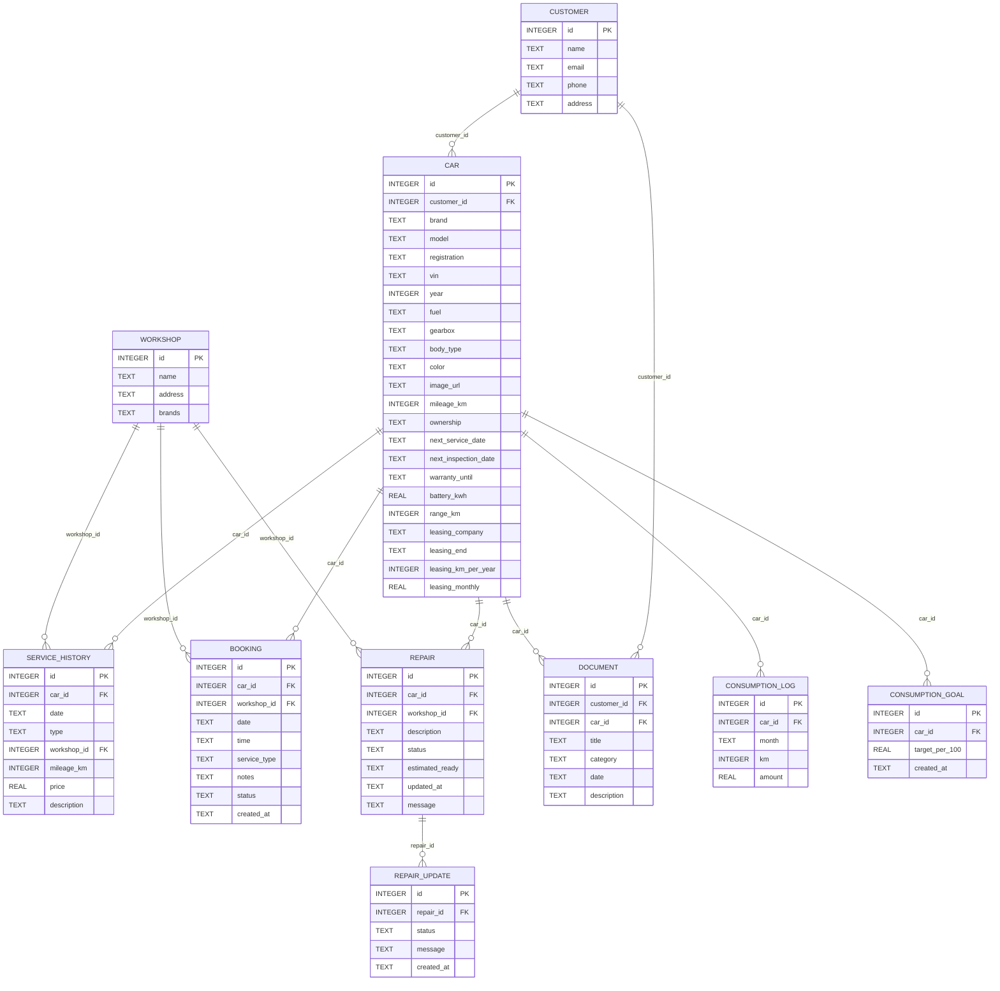
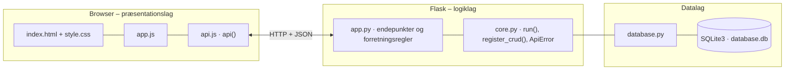

# Min Hessel – kundeportal – dokumentation af prototypen

En samlet digital kundeportal for Ejner Hessels kunder. Kunden får **ét overblik over sine biler på tværs af mærker**
(Mercedes-Benz, Renault, Dacia og Ford) med biloplysninger, servicehistorik, reparationsstatus, værkstedsbookinger, aftaler, dokumenter samt forbrug og klima.

Kravgrundlag: [`kravspecifikation.md`](kravspecifikation.md) og ændringerne i [`kravspecifikation-2.md`](kravspecifikation-2.md) (version 2).

Kravspecifikationen nævner React og Node/Express. Prototypen følger holdets fælles Flask + HTML/CSS/JavaScript-struktur,
men opfylder de samme krav: webapplikation, tre-lags arkitektur, SQLite, HTTP og JSON, CRUD og kun testdata.

## Hvad kan prototypen

**Kundevisning** (vælg en testkunde i toppen):

| Skærm | Funktion |
|---|---|
| **Mine biler** | Bilkort med billede af bilen, mærke, model, nummerplade, årgang, drivmiddel, gearkasse, km, ejerform, næste booking, service og syn samt reparationsstatus. Notifikationer øverst |
| **Biloplysninger** | Alle data om bilen inkl. gearkasse, næste syn, garanti, leasing (selskab, udløb, måneder tilbage, km pr. år og ydelse) og for elbiler batterikapacitet og rækkevidde. Servicehistorik og dokumenter for bilen |
| **Værkstedsbooking** | Booking i fem tydelige trin: 1. bil → 2. værksted (kun dem, der servicerer mærket) → 3. type og dato → 4. ledigt tidspunkt → 5. oversigt og *Bekræft booking*. Se, ret og aflys bookinger |
| **Reparationsstatus** | Status med statuslinje, forventet færdigtidspunkt, værksted og alle beskeder fra værkstedet samlet i en tidslinje |
| **Aftaler og dokumenter** | Søg i titel og beskrivelse, filtrér efter bil og kategori, og brug knapperne *Åbn* og *Download* |
| **Forbrug og klima** | Forbrug pr. måned (liter eller kWh pr. 100 km) i et diagram, udgift og CO₂ pr. år, et mål for forbruget med beregnet besparelse i kroner og CO₂, registrering af en ny måned og gode råd |

**Medarbejdervisning** (vælg *Medarbejder (værksted)* i toppen) – kunden ser ikke denne fane:

| Skærm | Funktion |
|---|---|
| **Værksted** | Øverst *Registrér service*, nedenunder *Opdatér reparationsstatus* (status, forventet klar og ny besked til kunden pr. reparation) og *Opret reparation* |

## Ændringer i version 2

| Ønske (kravspecifikation-2.md) | Implementering |
|---|---|
| Mere gennemført Hessel-design med logo | `frontend/logo.svg` i headeren og som favicon. Ensartet mørkeblå farve, skrift og knapper. Logoet er en enkel pladsholder, som kan udskiftes med Ejner Hessels officielle logofil |
| Billeder af bilerne | `carImage()` tegner en illustration af bilens karrosseri (`car.body_type`) i bilens farve (`car.color`). Har bilen `image_url`, vises det rigtige billede i stedet |
| 10 ekstra biler i testdata | 14 biler fordelt på 5 testkunder og alle 4 mærker |
| Tilpasning til mobil | Kort og formularfelter lægges under hinanden under 700 px. Navigationen kan scrolles, og knapperne er mindst 44 px høje |
| Medarbejdersiden: *Registrér service* øverst | Rækkefølgen i fanen *Værksted* er byttet om |
| Separat fane *Reparationsstatus* | `GET /api/customers/<id>/repairs`. Hver ændring af status eller besked logges af SQLite-triggere i tabellen `repair_update` |
| Flere biloplysninger | Nye felter på `car`: `gearbox`, `next_inspection_date`, `warranty_until`, `battery_kwh`, `range_km` og `leasing_*`. Afledt: `warranty_active`, `inspection_due_soon` og `leasing_months_left` |
| Mere læsbare tabeller og datoer som 12.10.2026 | Dato, nummerplade og bilnavn brydes ikke (`nowrap`), og `day()` viser alle datoer som DD.MM.ÅÅÅÅ. Valgmuligheder står i fuld bredde |
| Tydeligere bookingforløb med oversigt | `renderBookingStep()` med trinlinje og en oversigt før bekræftelse |
| Lettere adgang til dokumenter | `GET /api/documents/<id>/file` (åbn) og `?download=1` (download). Søgefelt og filter på bil |
| Adskilt kunde- og medarbejdervisning | To navigationer. Kunden ser kun sine egne faner |
| Fjern "Seneste JSON-svar fra API'et" | Feltet er fjernet fra `index.html` (`api.js` springer det over, når feltet ikke findes) |
| Ny fane *Forbrug og klima* | Tabellerne `consumption_log` og `consumption_goal`. `GET/POST /api/cars/<id>/consumption` og `PUT /api/cars/<id>/goal` |

**Beregning af besparelse:** forbrug nu = gennemsnit af de seneste 3 måneder. Km pr. år = gennemsnit pr. måned × 12.
Sparede enheder pr. år = (forbrug nu − mål) / 100 × km pr. år. Kroner og CO₂ = enheder × pris og CO₂ pr. enhed (`FUEL` i `app.py`: benzin 13,50 kr. og 2,37 kg CO₂ pr. liter, diesel 12,50 kr. og 2,64 kg, strøm 2,50 kr. og 0,10 kg pr. kWh – antagelser).

## Fra krav til kode

| Krav (afsnit 5–8) | Implementering |
|---|---|
| Oversigt over kundens biler | `GET /api/customers/<id>/overview` → `enrich_car()` |
| Oplysninger om den enkelte bil | `GET /api/cars/<id>/details` |
| Servicehistorik | Tabellen `service_history` |
| Kommende værkstedsbookinger | `next_booking` pr. bil + bookinglisten |
| Oprette, redigere og slette en booking | CRUD `/api/bookings` med `validate_booking()` |
| Status på igangværende reparation | `active_repair` og fanen *Reparationsstatus*. `REPAIR_STEPS` |
| Aftaler og dokumenter | Tabellen `document` og `GET /api/documents/<id>/file` |
| JSON mellem frontend og backend, SQLite, CRUD | Fælles `core.py` og `database.py` |
| Tydelig besked ved gennemført handling og forståelig fejlbesked | Grøn/rød `toast()` med serverens fejltekst |
| Data opdateres efter en ændring | Frontenden genindlæser efter hvert kald |
| Kun testdata | `seed.sql` indeholder kun opdigtede personer og biler |
| Fremtidsidé: notifikationer | `notifications` i overblikket: service inden for 30 dage uden booking, syn inden for 60 dage og beskeder fra værkstedet |

**Bookingregler (`validate_booking()`)**

- Datoen skal være fra i morgen og frem og på en hverdag.
- Tidspunktet skal være et af værkstedets faste tider (`SLOTS`). `GET /api/available-times` viser ledige tider.
- Værkstedet skal servicere bilens mærke (`workshop.brands`). Bookingforløbet viser kun de værksteder, der gør.
- Samme værksted, dato og tid kan ikke bookes to gange (409).
- Aflyste bookinger valideres ikke igen og frigiver tiden.

**Reparationsforløb:** `MODTAGET → DIAGNOSE → VENTER_PÅ_DELE → I_GANG → KLAR_TIL_AFHENTNING → AFHENTET`.
SQLite-triggere opdaterer `updated_at` (`repair_touch`) og logger hver ændring af status og besked i `repair_update` (`repair_log_insert` og `repair_log_update`).

## Datamodel



## Eksempel på dataudveksling

Lars' Mercedes-Benz EQA bruger 21,4 kWh/100 km. Med et mål på 17 kWh/100 km viser prototypen besparelsen:

```bash
curl http://localhost:5110/api/cars/1/consumption
```

Svar `200` (forkortet):

```json
{
  "car": { "id": 1, "brand": "Mercedes-Benz", "model": "EQA 250+", "registration": "EH 12 345", "fuel": "El" },
  "unit_per_100": "kWh/100 km",
  "current_per_100": 21.4,
  "yearly_km": 11183,
  "yearly_cost": 5983,
  "yearly_co2_kg": 239,
  "goal": { "car_id": 1, "target_per_100": 17.0 },
  "savings": { "target_per_100": 17.0, "units_per_year": 492, "kr_per_year": 1230, "co2_kg_per_year": 49, "reached": false },
  "logs": [ { "month": "2026-09", "km": 845, "amount": 180.4, "per_100": 21.3, "cost": 451, "co2_kg": 18.0 } ]
}
```

## Kør prototypen

```bash
cd backend
python3 -m venv .venv && source .venv/bin/activate   # første gang
pip install -r requirements.txt                       # første gang
python app.py
```

Terminalen skriver ` * Åbn http://localhost:5110`. Åbn adressen i browseren. Flask serverer både API'et (`/api/...`) og frontenden.

- **Port:** Prototypen bruger port **5110** (5100 + projektnummer). Er porten optaget, vælger `run()` i `core.py` selv den næste ledige og skriver fx ` * Port 5110 er optaget – bruger port 5111 i stedet`. Du kan også vælge port selv med `PORT=5200 python app.py`.
- **Stop serveren** med `Ctrl` + `C` i terminalen, hvor den kører.
- **Kodeændringer:** Serveren kører i debug-tilstand og genstarter selv, når du gemmer en `.py`-fil. Den bliver på samme port. Ændringer i `frontend/` kræver kun, at du genindlæser siden.
- **Database:** `backend/database.db` oprettes med testdata ved første start. Nulstil den med `python database.py --reset`, mens serveren er stoppet.
- **Tjek at backenden svarer:** `curl http://localhost:5110/api/health`

### Fejlfinding

| Problem | Årsag | Løsning |
|---|---|---|
| ` * Port 5110 er optaget – bruger port …` | En anden proces, ofte en glemt server, bruger porten | Brug den adresse, der står i terminalen. Se hvad der optager porten med `lsof -nP -iTCP:5110 -sTCP:LISTEN`. En Flask-server i debug-tilstand er to processer, så stop dem begge med `lsof -t -iTCP:5110 -sTCP:LISTEN \| xargs kill` |
| `ModuleNotFoundError: No module named 'flask'` | Det virtuelle miljø er ikke aktiveret, eller Flask er ikke installeret | `source .venv/bin/activate` og `pip install -r requirements.txt` |
| Siden viser "Kan ikke hente data fra backenden" | Serveren kører ikke, eller `index.html` er åbnet direkte fra disken, mens serveren kører på en anden port | Start serveren og åbn adressen fra terminalen i stedet for filen |
| Tallene passer ikke efter mange tests | Databasen indeholder testdata fra tidligere afprøvninger | Stop serveren og kør `python database.py --reset` |
| `no such table …` | `database.db` er tom eller ødelagt | `python database.py --reset` |

## Arkitektur

Prototypen følger holdets fælles tre-lags struktur (se [`../README.md`](../README.md)):



| Fil | Lag | Indhold |
|---|---|---|
| `frontend/index.html` | Præsentation | Skærmbilleder som faneblade og formularer. Projektets farver og `data-api-port` |
| `frontend/app.js` | Præsentation | Henter data med `api()`, tegner dem i DOM'en og sender formularer |
| `frontend/api.js` | Præsentation | Fælles for alle prototyper: `api()` (fetch + JSON), `h()`, `renderTable()`, `fillSelect()`, `formToJson()`, `bindCrudForm()` og `toast()` |
| `frontend/style.css` | Præsentation | Fælles responsivt design |
| `backend/app.py` | Logik | Projektets forretningsregler og endepunkter |
| `backend/core.py` | Logik | Fælles: `create_app()` (Flask, CORS, JSON-fejl), `run()` (start på ledig port), `ApiError` og `register_crud()` |
| `backend/database.py` | Data | Fælles: forbindelse, `query_all/query_one/execute`, `transaction()` og `init_db()` |
| `backend/schema.sql` · `seed.sql` | Data | Tabeller og fiktive testdata |

Alle fejl returneres som JSON (`{"error": "…", "path": "/api/…"}`) med statuskode 400, 401, 403, 404 eller 409 og vises som en rød besked i frontenden.
Feltet "Seneste JSON-svar fra API'et" er fjernet fra brugerfladen i version 2. Dataudvekslingen kan ses i browserens udviklerværktøjer (Network).
Den fulde endepunktsliste står i [`backend/README.md`](backend/README.md).

## Design og responsivitet

- Samme fælles stylesheet som de andre prototyper. Hessel-designet (logo, farver, skrift, knapper, bilkort, bookingtrin og forbrugsdiagram) ligger som projektets egen CSS i `index.html`.
- Under 700 px lægges kort, formularfelter og bookingvalg under hinanden, og knapper og faner får større trykflader.
- Datoer, nummerplader og bilnavne brydes ikke over flere linjer. Brede tabeller scroller inde i deres kort.
- Beskeder vises kort i toppen (grøn = gennemført, rød = fejl fra serveren).

## Testdata

5 kunder, 3 værksteder med forskellige mærker og 14 biler (Mercedes-Benz, Renault, Dacia og Ford – købt og leaset, el, benzin, diesel og hybrid, fra lille bybil til varevogn).
11 serviceposter, 5 bookinger, 3 reparationer med forløb og beskeder (venter på dele, i gang og klar til afhentning), 17 dokumenter og 9 måneders forbrug for hver bil. Lars har mål for to af sine biler.

## Afgrænsning

Ingen login (kunde eller medarbejder vælges i toppen), betaling eller integration til Ejner Hessels systemer og bilmærkernes apps.
Bilbillederne er illustrationer, indtil der tilføjes rigtige billeder via `image_url`. Dokumenterne genereres som HTML ud fra testdata.
Priser og CO₂-faktorer for forbrug er antagelser.
