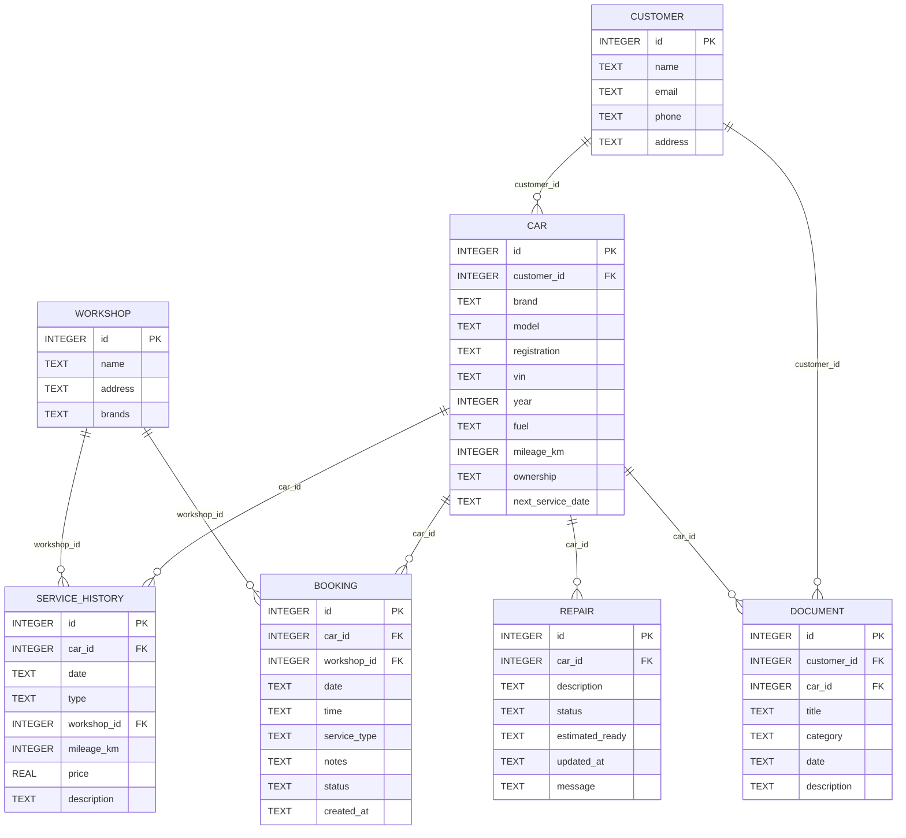
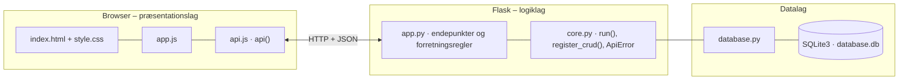

# Min Hessel – kundeportal – dokumentation af prototypen

En samlet digital kundeportal for Ejner Hessels kunder. Kunden får **ét overblik over sine biler på tværs af mærker**
(Mercedes-Benz, Renault, Dacia og Ford) med biloplysninger, servicehistorik, reparationsstatus, værkstedsbookinger, aftaler og dokumenter.

Kravgrundlag: [`kravspecifikation.md`](kravspecifikation.md)

Kravspecifikationen nævner React og Node/Express. Prototypen følger holdets fælles Flask + HTML/CSS/JavaScript-struktur,
men opfylder de samme krav: webapplikation, tre-lags arkitektur, SQLite, HTTP og JSON, CRUD og kun testdata.

## Hvad kan prototypen

| Skærm | Funktion |
|---|---|
| **Mine biler** | Kort pr. bil med mærke, model, nummerplade, km, ejerform, næste booking, næste service og reparation med statuslinje. Notifikationer øverst |
| **Biloplysninger** | Alle data om bilen, servicehistorik og dokumenter for bilen |
| **Værkstedsbooking** | Opret booking (bil, værksted, type, dato og ledig tid), se, ret, aflys og slet |
| **Aftaler og dokumenter** | Alle kundens aftaler, fakturaer og garantier, filtreret på kategori |
| **Værksted (medarbejder)** | Opdatér reparationsstatus, opret reparation og registrér service. Ændringer ses straks hos kunden |

Testkunden vælges i toppen.

## Fra krav til kode

| Krav (afsnit 5–8) | Implementering |
|---|---|
| Oversigt over kundens biler | `GET /api/customers/<id>/overview` → `enrich_car()` |
| Oplysninger om den enkelte bil | `GET /api/cars/<id>/details` |
| Servicehistorik | Tabellen `service_history` |
| Kommende værkstedsbookinger | `next_booking` pr. bil + bookinglisten |
| Oprette, redigere og slette en booking | CRUD `/api/bookings` med `validate_booking()` |
| Status på igangværende reparation | `active_repair` med `step`/`steps` → statuslinjen. `REPAIR_STEPS` |
| Aftaler og dokumenter | Tabellen `document` |
| JSON mellem frontend og backend, SQLite, CRUD | Fælles `core.py` og `database.py` |
| Tydelig besked ved gennemført handling og forståelig fejlbesked | Grøn/rød `toast()` med serverens fejltekst |
| Data opdateres efter en ændring | Frontenden genindlæser overblikket efter hvert kald |
| Kun testdata | `seed.sql` indeholder kun opdigtede personer og biler |
| Fremtidsidé: notifikationer om service og reparation | `notifications` i overblikket (service inden for 30 dage uden booking og beskeder fra værkstedet) |

**Bookingregler (`validate_booking()`)**

- Datoen skal være fra i morgen og frem og på en hverdag.
- Tidspunktet skal være et af værkstedets faste tider (`SLOTS`). `GET /api/available-times` viser ledige tider.
- Værkstedet skal servicere bilens mærke (`workshop.brands`).
- Samme værksted, dato og tid kan ikke bookes to gange (409).
- Aflyste bookinger valideres ikke igen og frigiver tiden.

**Reparationsforløb:** `MODTAGET → DIAGNOSE → VENTER_PÅ_DELE → I_GANG → KLAR_TIL_AFHENTNING → AFHENTET`.
En SQLite-trigger (`repair_touch`) opdaterer `updated_at`, hver gang værkstedet ændrer status.

## Datamodel



## Eksempel på dataudveksling

Lars booker årligt eftersyn til sin Mercedes-Benz EQA hos Ejner Hessel Glostrup. Backenden tjekker dato, tidspunkt, mærke og ledig tid:

```bash
curl -X POST http://localhost:5110/api/bookings \
  -H 'Content-Type: application/json' \
  -d '{"car_id": 1, "workshop_id": 1, "date": "2026-10-21", "time": "10:00", "service_type": "Årligt eftersyn"}'
```

Svar `201`:

```json
{
  "id": 4,
  "car_id": 1,
  "workshop_id": 1,
  "date": "2026-10-21",
  "time": "10:00",
  "service_type": "Årligt eftersyn",
  "notes": null,
  "status": "BEKRÆFTET",
  "created_at": "2026-09-29 15:50:35"
}
```

## Kør prototypen

```bash
cd backend
python3 -m venv .venv && source .venv/bin/activate   # første gang
pip install -r requirements.txt                       # første gang
python app.py
```

Terminalen skriver ` * Åbn http://localhost:5110`. Åbn adressen i browseren. Flask serverer både API'et (`/api/...`) og frontenden.

- **Port:** Prototypen bruger port **5110** (5100 + projektnummer). Er porten optaget, vælger `run()` i `core.py` selv den næste ledige og skriver fx ` * Port 5110 er optaget – bruger port 5111 i stedet`. Du kan også vælge port selv med `PORT=5200 python app.py`.
- **Stop serveren** med `Ctrl` + `C` i terminalen, hvor den kører.
- **Kodeændringer:** Serveren kører i debug-tilstand og genstarter selv, når du gemmer en `.py`-fil. Den bliver på samme port. Ændringer i `frontend/` kræver kun, at du genindlæser siden.
- **Database:** `backend/database.db` oprettes med testdata ved første start. Nulstil den med `python database.py --reset`, mens serveren er stoppet.
- **Tjek at backenden svarer:** `curl http://localhost:5110/api/health`

### Fejlfinding

| Problem | Årsag | Løsning |
|---|---|---|
| ` * Port 5110 er optaget – bruger port …` | En anden proces, ofte en glemt server, bruger porten | Brug den adresse, der står i terminalen. Se hvad der optager porten med `lsof -nP -iTCP:5110 -sTCP:LISTEN`. En Flask-server i debug-tilstand er to processer, så stop dem begge med `lsof -t -iTCP:5110 -sTCP:LISTEN \| xargs kill` |
| `ModuleNotFoundError: No module named 'flask'` | Det virtuelle miljø er ikke aktiveret, eller Flask er ikke installeret | `source .venv/bin/activate` og `pip install -r requirements.txt` |
| Siden viser "Kan ikke hente data fra backenden" | Serveren kører ikke, eller `index.html` er åbnet direkte fra disken, mens serveren kører på en anden port | Start serveren og åbn adressen fra terminalen i stedet for filen |
| Tallene passer ikke efter mange tests | Databasen indeholder testdata fra tidligere afprøvninger | Stop serveren og kør `python database.py --reset` |
| `no such table …` | `database.db` er tom eller ødelagt | `python database.py --reset` |

## Arkitektur

Prototypen følger holdets fælles tre-lags struktur (se [`../README.md`](../README.md)):



| Fil | Lag | Indhold |
|---|---|---|
| `frontend/index.html` | Præsentation | Skærmbilleder som faneblade og formularer. Projektets farver og `data-api-port` |
| `frontend/app.js` | Præsentation | Henter data med `api()`, tegner dem i DOM'en og sender formularer |
| `frontend/api.js` | Præsentation | Fælles for alle prototyper: `api()` (fetch + JSON), `h()`, `renderTable()`, `fillSelect()`, `formToJson()`, `bindCrudForm()` og `toast()` |
| `frontend/style.css` | Præsentation | Fælles responsivt design |
| `backend/app.py` | Logik | Projektets forretningsregler og endepunkter |
| `backend/core.py` | Logik | Fælles: `create_app()` (Flask, CORS, JSON-fejl), `run()` (start på ledig port), `ApiError` og `register_crud()` |
| `backend/database.py` | Data | Fælles: forbindelse, `query_all/query_one/execute`, `transaction()` og `init_db()` |
| `backend/schema.sql` · `seed.sql` | Data | Tabeller og fiktive testdata |

Alle fejl returneres som JSON (`{"error": "…", "path": "/api/…"}`) med statuskode 400, 401, 403, 404 eller 409 og vises som en rød besked i frontenden.
Nederst på siden kan man åbne **"Seneste JSON-svar fra API'et"** og se den rå dataudveksling.
Den fulde endepunktsliste står i [`backend/README.md`](backend/README.md).

## Design og responsivitet

- Samme stylesheet i alle prototyper. Kun farverne (`--brand`, `--brand-dark`, `--brand-soft`) sættes i `index.html`.
- Layoutet virker fra mobil (375 px) til desktop uden vandret scroll. Kort lægger sig under hinanden på små skærme, og brede tabeller scroller inde i deres kort.
- Formularfelter kan ikke blive bredere end deres kort. En `<select>` med lange valgmuligheder skubber altså ikke formularen ud over kanten.
- Beskeder vises kort i toppen (grøn = gennemført, rød = fejl fra serveren).


## Testdata

2 kunder, 3 værksteder med forskellige mærker, 4 biler (Mercedes-Benz, Dacia, Ford, Renault – købt og leaset),
6 serviceposter, 3 bookinger, 1 igangværende reparation (venter på dele) og 7 dokumenter.

## Afgrænsning

Ingen login, betaling, integration til Ejner Hessels systemer eller bilmærkernes apps og ingen mobilapp (jf. afsnit 4).
