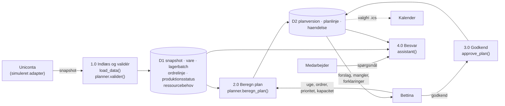
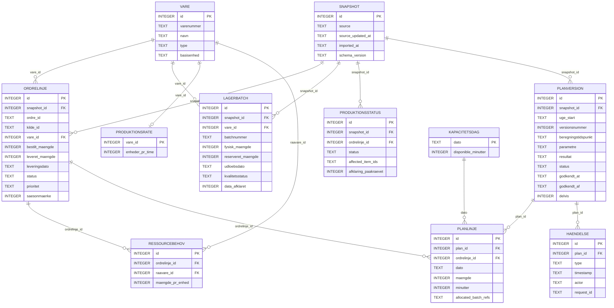
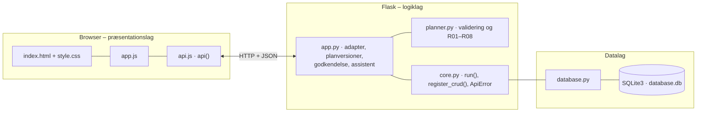

# Sunny AI – beslutningsstøtte til ugeplan og opslag – dokumentation af prototypen

Prototypen undersøger, om Sunny Juice kan spare administrativ tid ved at samle ordre- og lageroplysninger og få et **forslag til en produktionsugeplan**.
Data kommer fra en **simuleret Uniconta-adapter**. Planmotoren kontrollerer datakvaliteten, fordeler produktionen på ugens dage og forklarer hver planlinje og blokering.
Planlæggeren justerer og **godkender lokalt**. En **regelbaseret demoassistent** svarer på spørgsmål ud fra de samme tal.

Kravgrundlag: [`kravspecifikation.md`](kravspecifikation.md)

## Hvad kan prototypen

| Skærm | Funktion |
|---|---|
| **Overblik** | Nøgletal (ordrer til planlægning, råvarer der mangler, planlagte timer, forhold der kræver kontrol), ugens fem dage og en liste over forhold, der kræver handling |
| **Ugeplan** | Vælg uge, ordrer, prioritet og timer pr. dag. *Beregn forslag* gemmer en ny planversion. Dagkolonner med planlinjer, uplanlagte ordrer med årsagskode, råvarebehov, beregningsgrundlag for hver linje, delvis godkendelse, versionshistorik og kalenderfil |
| **Lager og ordrer** | Søg på ordrenummer, varenummer eller navn. Detaljer med mængde, enhed, dato, status, kilde-id og kildeopdatering |
| **Spørg Sunny AI** | Regelbaseret demoassistent. Svarer med kilder og snapshot-tidspunkt, beder om valg ved tvetydige varenavne og svarer “ikke fundet” frem for at gætte |
| **Datastatus** | Snapshot, demo-ur, kendte dataproblemer, simulerede ændringer i kildedata (T02, T03, T05), snapshothistorik, hændelseslog og nulstilling |

Øverst på alle skærme står, at datakilden er simuleret, hvornår data er fra, og hvor mange forhold der kræver kontrol (F01).
Demobrugeren vælges i toppen og gemmes kun som navn på en godkendelse. Det er ikke adgangskontrol (N10).

## Planlægningen (DFD niveau 0 og 1)



Proces 2 er brudt ned som i kravspecifikationens bilag B:

| Trin | Regel | Hvor i `planner.beregn_plan()` |
|---|---|---|
| 2.1 Afgræns og sortér åbne ordrelinjer | R03, F06, F08 | `sorteringsnoegle()`: høj prioritet → leveringsdato → aktivt sæsonmærke → id |
| 2.2 Allokér færdigvarer og beregn produktionsbehov | R02, R04 | `alloker()` med FEFO. Produktionsbehov = max(0, rest − lagerfradrag) |
| 2.3 Beregn og kontrollér råvarer | R05 | Midlertidig allokering på hver brugsdato. Mangler noget, afvises hele linjens produktion |
| 2.4 Fordel produktion på dage | R06 | `max_maengde()` og `minutter_for()`: tidligst mulige hverdage, tid rundet op |
| 2.5 Saml plan, advarsler og uplanlagte | R07 | Bruttobehov pr. råvare, `uplanlagte` med årsagskoder og `advarsler` |

## Fra krav til kode

| Krav | Implementering |
|---|---|
| F01 Versionsmærket snapshot fra simuleret adapter | `load_data()` og `POST /api/source/import`. Hvert nyt snapshot er en kopi, og det gamle ændres aldrig. Banner på alle skærme |
| F02 Datakvalitet før beregning | `planner.valider()` og `batch_status()`: manglende enhed, negativ beholdning, reservation > fysisk, ukendt udløb, ukendt ressourcebehov, uafklaret færdigmelding |
| F03 Søg i ordrer og lager | `GET /api/orders?q=` og `GET /api/stock?q=` |
| F04 Datastatus og afvigelser. Kildetal rettes ikke | `usikre_varer()`: berørte ordrer får `DATA_MISSING`, og disponibelt vises som *uafklaret* (`null`), ikke 0 |
| F05 Gamle råvarer | Udløb inden for 7 dage giver advarsel. Udløbne og spærrede batches udelukkes. Ukendt udløb er en datafejl |
| F06 Uge og åbne ordrelinjer | Annullerede og afsluttede linjer kan ikke vælges (400). Restmængden bruges |
| F07 Deterministisk plan | Ren funktion. Samme snapshot, tidspunkt og parametre giver samme resultat (testet i T01) |
| F08 Sæsonprioritet | `saeson_aktiv()`: sæsonmærke og leveringsdato i september–november |
| F09 Råvarer og mangler | FEFO-allokering i arbejdskopi. Samme lager disponeres ikke to gange |
| F10 Forklaring af linjer og blokeringer | `forklaring` og `aarsager` på hver linje. Vises under *Beregningsgrundlag* |
| F11 Justering giver ny version | `POST /api/plans`. Tidligere versioner for ugen bliver `stale`. `manuelle_parametre` markeres |
| F12 Aktiv godkendelse, delvis kun efter accept | `approve_plan()` gemmer version, snapshot, demobruger og tidspunkt. Kræver `accepter_uplanlagte` ved mangler |
| F13–F14 Afgrænset assistent | `assistant()` bruger `current_plan()`, altså samme plan som skærmene. Kilder og snapshot-tidspunkt i hvert svar |
| F15 Lagring og nulstilling | SQLite bevarer tilstand ved genindlæsning. `POST /api/reset` kræver bekræftelse |
| F16 Kalenderfil (Should) | `GET /api/plans/<id>/calendar.ics`, kun for godkendte versioner, med stabilt `UID` |
| F17 Vidensbase (Should) | **Ikke implementeret.** Assistenten svarer, at der ingen godkendt vejledning findes |
| R01 Snapshot > 24 timer | `snapshot_alder()`. Planen kan beregnes, men ikke godkendes (409) |
| R08 Godkendelse knyttet til version | Nyt snapshot, nyt demo-ur eller ny version gør planer `stale`. `haendelse.request_id` er `UNIQUE`, så et dobbeltklik giver én godkendelse |
| R09 AI | Regelbaseret og mærket som sådan. Ingen sprogmodel, ingen opskrifter og ingen egne beregninger |
| N07 Adskillelse og navngivne parametre | `planner.py` kender hverken Flask eller SQLite. `STANDARD_KAPACITET_MIN`, `SAESON_MAANEDER`, `SNAPSHOT_MAX_ALDER_TIMER` og `UDLOEB_ADVARSEL_DAGE` er navngivne konstanter |

**Eksempel fra testdata (T01):** O1 (100 stk P1, frist mandag) får 20 stk fra lager og 80 stk produktion: 4 timer og 40 L R1.
O2 (60 stk P1) kræver 30 L R1, men der er kun 20 L tilbage, så den blokeres med `MATERIAL_SHORTAGE` og binder ingen tid.
O3 (200 stk P2) fordeles med 80 stk mandag og 120 stk tirsdag. Behovslisten viser R1: 70 L behov, 60 L disponibelt, 10 L mangel.

## Datamodel



| Tabel | Rolle |
|---|---|
| `snapshot`, `lagerbatch`, `ordrelinje`, `produktionsstatus`, `ressourcebehov` | D1: kildedata. Hvert snapshot er uforanderligt |
| `vare`, `produktionsrate`, `kapacitetsdag` | Stamdata og standardkapacitet (480 min pr. hverdag) |
| `planversion`, `planlinje` | D2: planforslag med parametre, resultat og status `draft`, `approved` eller `stale` |
| `haendelse` | Historik og sikring mod dobbelt godkendelse |
| `indstilling` | Demo-uret (`beregningstidspunkt`), så testresultater kan gentages |
| `bruger` | Demobrugere. Ikke et login |

Alle mængder er heltal i **tusindedele af basisenheden** (20 stk = `20000`, 0,5 L = `500`). Tid er hele minutter og datoer `YYYY-MM-DD`.
Ukendte værdier er `NULL`: en manglende enhed, udløbsdato eller et manglende ressourcebehov bliver aldrig til 0.

## Eksempel på dataudveksling

Spørg assistenten om O2. Svaret bruger præcis samme beregning som ugeplanen (T06):

```bash
curl -X POST http://localhost:5111/api/assistant \
  -H 'Content-Type: application/json' \
  -d '{"spoergsmaal": "Kan ordre O2 produceres?"}'
```

Svar `200`:

```json
{
  "type": "svar",
  "svar": "Ordre O2 (60 stk Æblejuice 1 L, levering tirsdag 06.10.2026) kan ikke produceres i planforslaget. Råvaremangel: R1 Æblemost mangler 10 L (behov 30 L, tilbage 20 L efter tidligere ordrer). Produktionen er ikke planlagt, og der er ikke reserveret tid eller råvarer.",
  "kilder": [
    { "type": "snapshot", "id": 1, "label": "Snapshot #1" },
    { "type": "ordre", "id": 2, "label": "Ordre O2 (UC-ORD-1002)" },
    { "type": "vare", "id": 4, "label": "R1 Æblemost" },
    { "type": "plan", "id": null, "label": "Foreløbig beregning (ikke gemt)" }
  ],
  "spoergsmaal": "Kan ordre O2 produceres?",
  "assistent": "Regelbaseret demoassistent (ingen sprogmodel)",
  "snapshot_tidspunkt": "2026-10-05 08:00",
  "snapshot_id": 1,
  "plan": { "id": null, "label": "Foreløbig beregning (ikke gemt)", "status": "preview" }
}
```

Beregn og godkend en plan:

```bash
curl -X POST http://localhost:5111/api/plans -H 'Content-Type: application/json' \
  -d '{"uge_start": "2026-10-05", "kapacitet": {"2026-10-05": 240}}'          # → 201, version 1

curl -X POST http://localhost:5111/api/plans/1/approve -H 'Content-Type: application/json' \
  -d '{"request_id": "abc-1", "accepter_uplanlagte": true}'                   # → 200, delvis godkendelse
```

## Kør prototypen

```bash
cd backend
python3 -m venv .venv && source .venv/bin/activate   # første gang
pip install -r requirements.txt                       # første gang
python app.py
```

Terminalen skriver ` * Åbn http://localhost:5111`. Åbn adressen i browseren. Flask serverer både API'et (`/api/...`) og frontenden.

- **Port:** Prototypen bruger port **5111** (5100 + projektnummer). Er porten optaget, vælger `run()` i `core.py` selv den næste ledige og skriver fx ` * Port 5111 er optaget – bruger port 5112 i stedet`. Du kan også vælge port selv med `PORT=5200 python app.py`.
- **Stop serveren** med `Ctrl` + `C` i terminalen, hvor den kører.
- **Kodeændringer:** Serveren kører i debug-tilstand og genstarter selv, når du gemmer en `.py`-fil. Ændringer i `frontend/` kræver kun, at du genindlæser siden.
- **Database:** `backend/database.db` oprettes med testdata ved første start. Nulstil med knappen *Nulstil demo* under Datastatus eller med `python database.py --reset`, mens serveren er stoppet.
- **Test:** `python tests.py` kører T01–T10 og N04 på en midlertidig database.
- **Tjek at backenden svarer:** `curl http://localhost:5111/api/health`

### Fejlfinding

| Problem | Årsag | Løsning |
|---|---|---|
| ` * Port 5111 er optaget – bruger port …` | En anden proces, ofte en glemt server, bruger porten | Brug den adresse, der står i terminalen. Stop den gamle med `lsof -t -iTCP:5111 -sTCP:LISTEN \| xargs kill` |
| `ModuleNotFoundError: No module named 'flask'` | Det virtuelle miljø er ikke aktiveret | `source .venv/bin/activate` og `pip install -r requirements.txt` |
| Siden viser "Kan ikke hente data fra backenden" | Serveren kører ikke | Start serveren og åbn adressen fra terminalen |
| *Godkend* giver "forældet" | Snapshot eller demo-ur er ændret efter beregningen | Tryk *Beregn forslag* igen |
| Banneret viser "Data er … t gamle – forældet" | Demo-uret ligger over 24 timer efter kildetidspunktet | Indlæs et nyt snapshot under Datastatus, eller sæt uret tilbage |

## Arkitektur

Prototypen følger holdets fælles tre-lags struktur (se [`../README.md`](../README.md)). Planmotoren ligger i sin egen fil, fordi kravspecifikationen kræver, at beregningslogik, UI og datakildeadapter er adskilt og kan testes alene (N07).



| Fil | Lag | Indhold |
|---|---|---|
| `frontend/index.html` | Præsentation | Fem skærme som faneblade. Projektets farver, ugegitter og synligt tastaturfokus |
| `frontend/app.js` | Præsentation | Henter data med `api()` og tegner dem. Beregner ingen nøgletal selv |
| `frontend/api.js` · `style.css` | Præsentation | Fælles for alle prototyper |
| `backend/app.py` | Logik | Datakildeadapter (`load_data`, `copy_snapshot`), planversioner, godkendelse, assistent og endepunkter |
| `backend/planner.py` | Logik | Datavalidering og planberegning. Ren Python uden Flask og SQLite |
| `backend/tests.py` | Test | Accepttests T01–T10 og ydeevne (N04) |
| `backend/core.py` · `database.py` | Logik/data | Fælles for alle prototyper |
| `backend/schema.sql` · `seed.sql` | Data | Tabeller og fiktive testdata |

Den fulde endepunktsliste står i [`backend/README.md`](backend/README.md).

## Design og responsivitet

- Samme stylesheet som de andre prototyper. Sunny Juice-orange (`--brand`) sættes i `index.html`. Der bruges intet logo, fordi der ikke er stillet et godkendt logo til rådighed (N01).
- Status vises altid med både farve, ikon og tekst: **✓ Planlagt/Klar** (grøn), **⚠ Kræver kontrol/Advarsel** (gul), **⛔ Blokeret** (rød).
- Ugeplanen har fem dagskolonner med en kapacitetsbjælke. På smalle skærme lægger dagene sig under hinanden. Layoutet er testet ved 1440, 768 og 375 px uden vandret scroll.
- Alle handlinger er almindelige knapper og formularer med labels, så planforløbet kan gennemføres med tastaturet (T11). Fokus er tydeligt markeret.
- Godkendelsen siger udtrykkeligt, at der ikke oprettes noget i Uniconta, og at “godkendt” ikke betyder, at produktionen er gennemført.

## Testdata

| Data | Indhold |
|---|---|
| Uge og tid | Testuge 5.–9. oktober 2026. Snapshot kl. 08.00, beregning kl. 09.00 samme dag |
| Færdigvarer | P1 Æblejuice (20 stk på lager, 20 stk/t), P2 Gløgg (intet lager, 20 stk/t), P3 Ingefærshot |
| Råvarer | R1 Æblemost 60 L, R2 Gløggbase 500 kg, R3 Ingefær 15 kg (udløber 9.10 og viser udløbsadvarslen) |
| Ordrer | O1 100 stk P1 (mandag), O2 60 stk P1 (tirsdag), O3 200 stk P2 (onsdag, sæson), O4 annulleret |
| Demobrugere | Bettina (planlægger), Niklas (lageransvarlig), kontormedarbejder |

Alle navne, varer, behov og kapaciteter er fiktive. R3, P3 og O4 er tilføjet ud over kravspecifikationens eksempel for at vise udløbsadvarsler og annullerede ordrer. De påvirker ikke T01.

## Afgrænsning og afvigelser fra kravspecifikationen

- **Teknologi:** Kravspecifikationen foreslår TypeScript og React som et løsningsforslag, ikke et forretningskrav. Prototypen bruger holdets fælles Flask/SQLite/HTML-stak.
- **Lagring:** Tilstanden gemmes i SQLite på serveren i stedet for i browserens lokale lagring. Det opfylder F15 og tåler genindlæsning.
- **Ikke implementeret:** F17 vidensbase og en rigtig sprogmodel (Should). Ingen live Uniconta-integration, automatisk bestilling eller kalenderpublicering, og det vises aldrig som om det findes.
- **Ressourcebehov** er knyttet til ordrelinjen som i datakontrakten. En ny demoordre kopierer behovet fra en linje med samme vare.
- **Én demobruger ad gangen** og ingen adgangskontrol, som beskrevet i N06 og N10.
