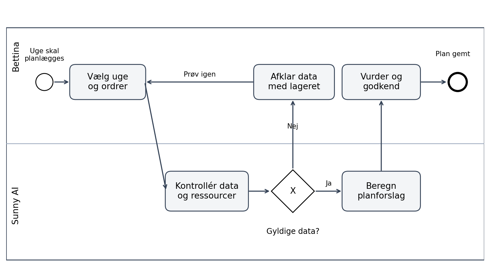
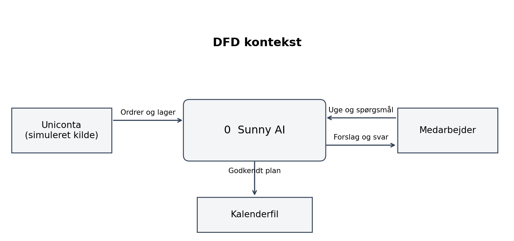
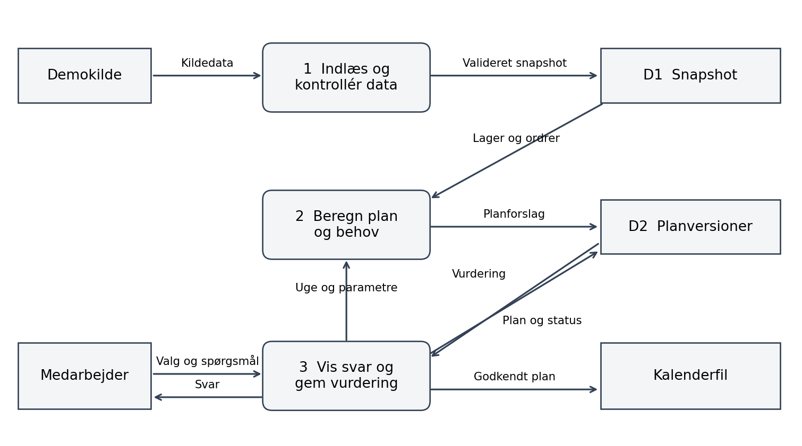
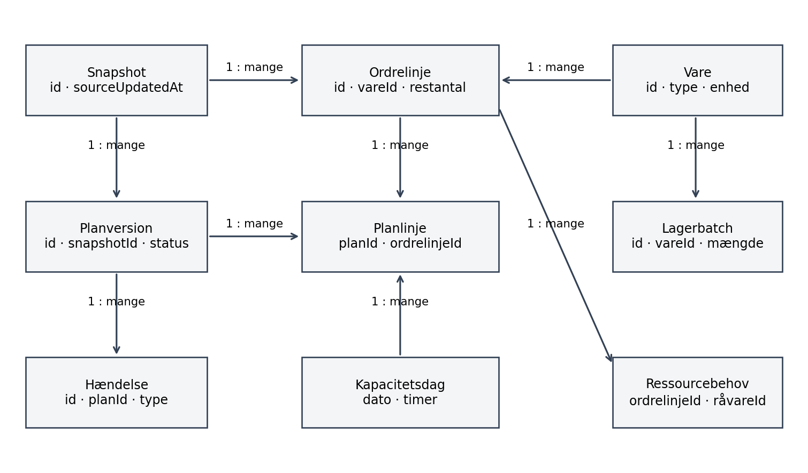
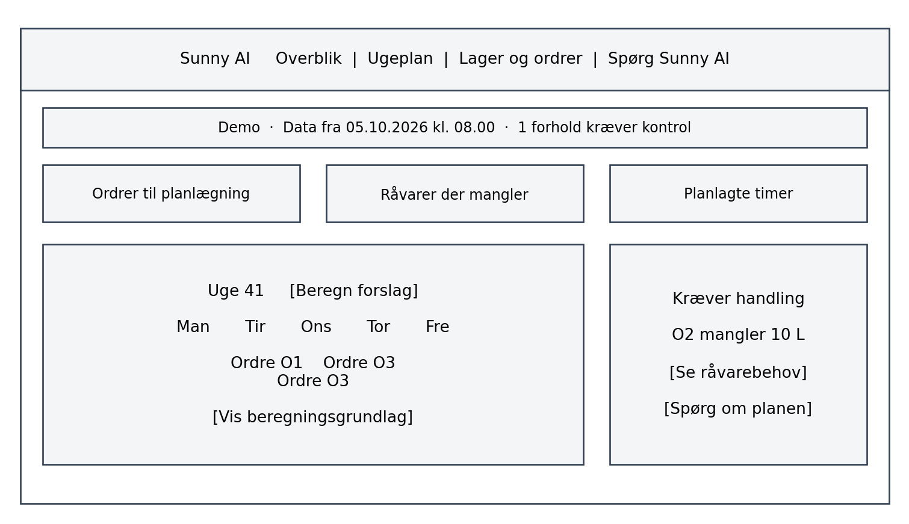

# Sunny AI kravspecifikation

> Konverteret til markdown fra `Sunny_AI_Kravspecifikation_24_punkter_v0_2.docx`. Tekst og figurer er gengivet som i originaldokumentet.

Version 0.2 · 30. september 2026 · Sunny Juice Innovationsopgave

Kravspecifikationen beskriver en prototype, der skal gøre det hurtigere at udarbejde en produktionsugeplan og finde lager- og ordreoplysninger. Den følger punkt 1–24 i underviserens “The Template” og omsætter business casens “Løsning og fordele” til afgrænsede og testbare krav. Kravene vedrører prototypen; en senere driftsløsning kræver særskilt validering og integration.

## 1 Projektets formål

*The Purpose of the Project*

Sunny AI skal reducere administrativt arbejde ved at samle ordre- og lageroplysninger og udarbejde et forslag til en produktionsugeplan. Ifølge business casen skal Bettina i dag kontrollere lageret fysisk, og kolleger er afhængige af Niklas for at finde oplysninger og anvende Uniconta. Forsinket færdigmelding betyder samtidig, at lagertallene kan være upålidelige. [BC: Baggrund og problem]

Den primære gevinst er frigivet arbejdstid. Bedre indkøbsgrundlag og færre råvarer, der bliver for gamle, er sekundære gevinster. Prototypen skal teste, om brugeren kan finde information og udarbejde et forståeligt planforslag; den dokumenterer ikke i sig selv realiserede besparelser. [BC: Løsning og fordele]

Foreslåede testmål er, at Bettina kan gennemføre planforløbet med eksempeldata på højst fem minutter, og at en medarbejder kan finde status på en ordre på højst ét minut. Tidsbesparelsen skal senere måles mod samme opgaver i den nuværende arbejdsgang.

## 2 Kunde og øvrige interessenter

*The Client, the Customer, and other Stakeholders*

| Interessent | Interesse og bidrag |
|---|---|
| Sunny Juice og Bettina | Forretningsmæssig modtager; vurderer planens anvendelighed og prioriterer behov. |
| Niklas og lageret | Validerer lageroplysninger, dataproblemer og arbejdsgange omkring Uniconta. |
| Buster og produktionen | Bidrager med råvare- og produktionsviden samt realistiske kapacitetsantagelser. |
| Kontormedarbejdere | Skal kunne finde information og løse gentagne opgaver mere selvstændigt. |
| Projektgruppe og underviser | Udvikling, dokumentation, afprøvning og faglig vurdering af prototypen. |
| Kunder og teknisk partner | Kunders opskrifter skal beskyttes. En Uniconta-partner kan afklare en senere integration. |

## 3 Brugere af produktet

*Users of the Product*

Primære brugere er Bettina som planlægger og Niklas som lageransvarlig. Øvrige medarbejdere bruger søgning og assistent til opslag. Brugerfladen skal anvende kendte driftsbegreber og fungere uden viden om AI eller programmering. Rollebetegnelserne er arbejdsroller; prototypens valg af rolle er ikke et sikkert login.

## 4 Begrænsninger for krav og løsning

*Requirements Constraints*

Prototypen skal kunne demonstreres med fiktive data uden adgang til Sunny Juices driftssystem. Den skal vise en simuleret Uniconta-datakilde, en fungerende planberegning og en assistent, der bruger samme datagrundlag. Uniconta er den planlagte kilde i den fremtidige løsning; konkret API-adgang, datadækning, licens og skriveadgang er ikke fastlagt.

Der må ikke oprettes virkelige ordrer, ændres lager i Uniconta eller sendes beskeder. En kalenderintegration demonstreres gennem en kalenderfil, som brugeren selv kan importere. Automatisk publicering til Bettinas kalender ligger uden for prototypen.

Kundeopskrifter, personoplysninger og virkelige adgangsnøgler må ikke indgå i eksempeldata. Planlægningsregler og kapacitet skal være synlige antagelser. Der er ingen automatisk læring af historisk efterspørgsel i første version.

## 5 Navngivning og definitioner

*Naming Conventions and Definitions*

| Begreb | Betydning i specifikationen |
|---|---|
| Sunny AI | Beslutningsstøtte til planlægning og opslag hos Sunny Juice. |
| Snapshot | Samlet kopi af kildedata med kilde-id og opdateringstidspunkt. |
| Disponibelt lager | Frigivet, ikke-udløbet og valideret lager minus kendte reservationer. |
| Ugeplan | Forslag med ordrelinje, dag, produktionsmængde, tidsforbrug og status. |
| Færdigmelding | Registrering af afsluttet produktion i kildesystemet. Sunny AI udfører den ikke i prototypen. |
| Ressourcebehov | Angivet råvaremængde pr. produceret enhed samt tidsbehov; demoen bruger fiktive værdier. |
| Blokeret | Kan ikke planlægges på det nuværende datagrundlag; årsagen skal vises. |
| F01 og N01 | Entydige id’er for henholdsvis funktionelle og ikke-funktionelle krav. |

## 6 Relevante fakta og antagelser

*Relevant Facts and Assumptions*

Business casen beskriver Uniconta, forsinket færdigmelding, papirregistrering, separate ark og afhængighed af nøglepersoner. Den beskriver også gløggsæsonen fra september til november og begrænset spild i selve produktionen. Oplysningerne anvendes som projektgrundlag med business casen som kilde; de oprindelige interviews er ikke selvstændigt verificeret her.

Arbejdsantagelser til demoen: én virksomhed, ét samlet lager, ét produktionscenter, fem hverdage pr. uge og otte disponible timer pr. dag. En ordre må deles mellem dage, men ikke mellem flere produktionscentre. Omstillingstid indgår i den angivne produktionsrate eller er nul i eksempeldata. Disse antagelser skal valideres før en pilot i drift.

Planen er et forslag med menneskelig godkendelse. Systemet kan opdage kendte dataproblemer, men kan ikke bevise, at en registreret beholdning svarer til det fysiske lager. Kundernes opskrifter deles ikke med en sprogmodel.

## 7 Arbejdsområdets omfang

*The Scope of the Work*

Arbejdsområdet omfatter modtagelse af kundeordrer, kontrol af færdigvare- og råvarelager, ugeplanlægning, vurdering af indkøbsbehov og medarbejdernes informationssøgning. Selve produktionen, den fysiske optælling og korrekt færdigmelding er fortsat medarbejdernes og kildesystemets opgaver.

Business use case BUC01 er “Planlæg næste produktionsuge”. Udløsende hændelse er en ny planlægningsuge eller en ændring i ordrer. Bettina vælger relevante ordrer, kontrollerer datagrundlaget, undersøger kapacitet og råvarer og beslutter en plan. Hvis data ikke er troværdige, skal de afklares med lageret før en plan kan godkendes. Et BPMN-overblik findes i bilag A.

Business use case BUC02 er “Besvar et spørgsmål om lager eller ordre”. En medarbejder finder informationen i Sunny AI og får vist kilde og tidspunkt. Ved manglende oplysninger henvises til datakontrol eller relevant ansvarlig; assistenten må ikke gætte.

## 8 Produktets omfang

*The Scope of the Product*

Produktet skal omfatte fem skærme: Overblik, Ugeplan, Lager og ordrer, Spørg Sunny AI samt Datastatus. Overblik prioriterer afvigelser og handlinger. Datastatus gør det tydeligt, om en plan bygger på friske, komplette og validerede data.

| Prioritet | Funktioner |
|---|---|
| Must | Simuleret kilde; datavalidering; ordre- og lageropslag; ugeplan med råvare- og kapacitetskontrol; behovsliste; udløbsadvarsler; forklaringer; lokal godkendelse og historik; regelbaseret assistent; nulstilling. |
| Should | Kalenderfil fra godkendt plan; afgrænset vidensbase med validerede vejledninger; reel sprogmodel via serveradapter. |
| Could | Historiske prognoser, leverandørers minimumskøb, flere produktionscentre og avanceret optimering. |
| Uden for prototype | Live ændringer i Uniconta, automatisk bestilling, autonom produktion, fuld lagerregistrering, maskinintegration og dokumenterede økonomiske gevinster. |

Grænsefladen til den simulerede datakilde skal kunne udskiftes med en rigtig integration. Prototypen må ikke påstå at være forbundet til Uniconta. Godkendelse af en plan gemmer alene en lokal beslutning, ikke en produktionsordre i ERP.

Product use case PUC01: Vælg uge → kontrollér datastatus → vælg ordrer → beregn plan → undersøg blokeringer → justér prioritet eller kapacitet → genberegn → godkend. PUC02: Stil spørgsmål → se svar med kilde → åbn ordren eller lagerposten. Brugerrejsen er specificeret i bilag A.

## 9 Funktionelle krav og datakrav

*Functional and Data Requirements*

Alle F-krav nedenfor er Must, medmindre Should står udtrykkeligt. Acceptkriterierne er testmål for prototypen. Kravene til produktion, sæsoner og råvarebehov er afledt af “Løsning og fordele”; datakontrol og opslag understøtter business casens beskrevne registreringsproblemer og personafhængighed.

### Funktionelle krav til data og opslag

| ID | Systemet skal | Acceptkriterium |
|---|---|---|
| F01 | Indlæse et versionsmærket snapshot fra en simuleret Uniconta-adapter. | Start og nulstilling giver de samme eksempeldata. “Simuleret datakilde” og kildetidspunkt vises på alle skærme. |
| F02 | Kontrollere datakvalitet før beregning. | Manglende enhed, negativ beholdning, ukendt ressourcebehov eller en kendt uafklaret færdigmelding giver en specifik fejl eller blokering på berørte varer/ordrer. |
| F03 | Søge i ordrer og lager. | Ordrenummer, varenummer og navn kan findes. Detaljer viser mængde, enhed, dato, status, kilde-id og kildeopdatering. |
| F04 | Vise datastatus og kendte afvigelser. | En berørt ordre må ikke vises klar til produktion, når en nødvendig råvares beholdning er uafklaret. Systemet må ikke selv “rette” kildetallet. |
| F05 | Vise risiko for gamle råvarer. | Positive batches med udløb inden for syv dage fremhæves. Udløbne og blokerede batches udelukkes fra disponibelt lager. Ukendt udløb vises som datamangel. |

### Funktionelle krav til planlægning

| ID | Systemet skal | Acceptkriterium |
|---|---|---|
| F06 | Lade planlæggeren vælge uge og åbne ordrelinjer. | Annullerede og afsluttede linjer kan ikke planlægges. Restmængden anvendes, og hver linje optræder højst én gang som behov. |
| F07 | Beregne et deterministisk ugeplanforslag. | Samme snapshot og parametre giver samme plan. Dagens tildelte timer må ikke overskride kapaciteten. Planen viser små og store ordrer samt eventuel opdeling. |
| F08 | Tage højde for angivet sæsonprioritet. | I september–november prioriteres en sæsonmærket ordre før en umærket ved samme frist og brugerprioritet. Sæson skaber ikke ekstra efterspørgsel. |
| F09 | Kontrollere råvarer og vise mangler. | Behov beregnes ud fra produktionsmængde. Samme lager må ikke disponeres to gange. En ordre med råvaremangel planlægges ikke automatisk. |

### Funktionelle krav til vurdering og assistent

| ID | Systemet skal | Acceptkriterium |
|---|---|---|
| F10 | Forklare hver planlinje og blokering. | Brugeren kan se ordre, leveringsfrist, lagerfradrag, produktionsmængde, råvarebehov, rate og tidsforbrug samt anvendte antagelser. |
| F11 | Tillade justering af prioritet og dagskapacitet med genberegning. | En ændring giver en ny planversion. Det gamle forslag kan ikke godkendes som aktuelt. Manuelle parametre markeres. |
| F12 | Kræve en aktiv godkendelse af planforslaget. | Godkendelse gemmer planversion, snapshot-id, demobruger og tidspunkt. En plan med kendte mangler kan kun godkendes delvist efter accept af listen over uplanlagte ordrer. |
| F13 | Besvare afgrænsede spørgsmål på dansk. | “Kan ordre O2 produceres?” giver den samme status og råvaremangel som planen og linker til beregningsgrundlaget. |
| F14 | Angive manglende viden og datakilder i svar. | Spørgsmål uden for tilgængelige data giver ingen opdigtede svar. Tvetydigt varenavn kræver valg. Svar om lager viser snapshot-tidspunkt. |
| F15 | Bevare lokale planer og beslutninger samt kunne nulstilles. | Genindlæsning bevarer tilstand. Nulstilling kræver bekræftelse og genskaber demoen. Fejl ved lagring vises uden falsk succes. |
| F16 | Eksportere godkendte planlinjer til kalenderfil, Should. | Eksport indeholder kun godkendt version, stabilt event-id, dato, titel og ordre-id. Den sender intet automatisk. |
| F17 | Besvare enkle vejledningsspørgsmål fra en valideret vidensbase, Should. | Svaret henviser til en vejlednings titel, ejer og godkendelsesdato. Uden en godkendt vejledning gives ingen opdigtet Uniconta-instruks. |

### Hændelser og reaktioner

| Hændelse | Input | Systemets reaktion |
|---|---|---|
| Snapshot indlæst | Varer, lager, ordrer, produktionsstatus | Validér og beregn datastatus. Markér eksisterende plan som forældet, hvis input ændres. |
| Uge valgt eller parametre ændret | Dato, valgte ordrer, prioritet, kapacitet | Opret nyt planforslag; tidligere godkendelse overføres ikke. |
| Spørgsmål stillet | Tekst og evt. ordre-id | Hent strukturerede data, generér afgrænset svar og kildereferencer. |
| Plan godkendt | Planversion og brugerens accept | Gem beslutning én gang. Ingen ændring i kilde-ERP. |
| Udløbsdato passeret | Beregningsdato | Genberegn disponibelt lager og markér berørte forslag som forældede. |

### Datamodel og datakontrakter

Alle poster har stabile id’er. Mængder gemmes i tusindedele af varens basisenhed, tid i hele minutter og datoer som YYYY-MM-DD. Præsentationen er dansk. Beregningsdato og tidspunkt kan fastlåses i test. Et diagram over relationerne findes i bilag C.

| Entitet | Centrale felter og regler |
|---|---|
| Snapshot | id, source, sourceUpdatedAt, importedAt, schemaVersion. source er “demo” i prototypen. |
| Vare | id, varenummer, navn, type, basisenhed. Type er råvare eller færdigvare. Enhed er L, kg eller stk. |
| Lagerbatch | id, snapshotId, vareId, fysiskMængde, reserveretMængde, udløbsdato, kvalitetsstatus, dataAfklaret. Reservation må ikke overstige fysisk mængde. |
| Ordrelinje | id, snapshotId, ordreId, vareId, bestiltMængde, leveretMængde, leveringsdato, status, prioritet, sæsonmærke. Restmængde er bestilt minus leveret. |
| Produktionsstatus | id, snapshotId, ordrelinjeId, status, affectedItemIds, afklaringPåkrævet. Understøtter en kendt registreringsafvigelse; ændrer ikke automatisk lager. |
| Ressourcebehov | ordrelinjeId, råvareId, mængdePrEnhed. Knyttes til fiktive ordrelinjer i demoen; ukendt er ikke nul. |
| Produktionsrate | vareId, enhederPrTime. Positiv rate; én ressource og ingen separate omstillinger i demoen. |
| Kapacitetsdag | dato, disponibleMinutter. Standard 480 minutter mandag–fredag; 0–1.440 tillades som eksplicit demoændring. |
| Planversion | id, snapshotId, ugeStart, parametre, oprettetAt, status, godkendtAt, godkendtAf. Status er draft, approved eller stale. |
| Planlinje | id, planId, ordrelinjeId, dato, mængde, minutter, allocatedBatchRefs. Summer af delmængder må højst være ordrelinjens produktionsbehov. |
| Hændelse | id, planId, type, timestamp, actor, requestId. Bruges til historik og sikring mod dobbelt godkendelse. |

Planforslaget indeholder desuden uplanlagte ordrelinjer med årsagskode, råvarebehov og manglende data. Koder er DATA_MISSING, MATERIAL_SHORTAGE, CAPACITY_SHORTAGE og DEADLINE_RISK. Ukendte felter er null; systemet må ikke omfortolke dem til nul.

### Tre lag i løsningen

Præsentationslaget viser overblik, ugeplan, lister og assistent. Logiklaget validerer data, beregner disponibelt lager, allokerer ressourcer og forklarer resultatet. Datalaget indeholder snapshot, parametre, planer og historik. UI og assistent anvender samme logik; ingen af dem har egne kopier af beregnede nøgletal.

En datakildeadapter henter demo-snapshot. En lagringsadapter gemmer lokal tilstand. Ved senere integration udskiftes adapteren, mens datakontrakter og tests genbruges. Prototypen foreslås bygget i TypeScript og React; teknologivalget er et løsningsforslag og ikke et forretningskrav.

### Forretningsregler for planberegning

R01 Datagrundlag: Et snapshot over 24 timer gammelt markeres som forældet og kan ikke bruges til godkendelse. Grænsen er en testantagelse. En kendt uafklaret færdigmelding gør de angivne affectedItemIds usikre, indtil et nyt, afklaret snapshot modtages. Systemet må ikke gætte forbrugt mængde.

R02 Disponibelt lager: Kun validerede, frigivne batches med kendt udløb indgår. Disponibel mængde er fysisk minus reserveret. Ved planlagt brug må udløbsdatoen ikke ligge før brugsdatoen. Batch vælges efter først udløb først ud. Manglende enhed eller dato blokerer anvendelse af den berørte batch.

R03 Sortering: Åbne ordrelinjer sorteres efter brugerprioritet (høj før normal), derefter leveringsdato stigende, sæsonmærke i aktiv sæson og til sidst ordrelinje-id. Sæsonmærke er aktivt ved leveringsdato i september–november. Forfaldne ordrer vises særskilt; en forsinkelse må ikke skjules.

R04 Produktionsbehov: Allokér disponible færdigvarer til hver ordrelinje i sorteringsrækkefølge. Færdigvarer skal kunne holde til leveringsdatoen. Produktionsbehov er max(0, restmængde minus allokerede færdigvarer). Allokering sker i planens arbejdskopi og ændrer ikke kildelageret.

R05 Materialer: Råvarebehov er produktionsbehov ganget med angivet mængde pr. enhed. Planlæggeren prøver en midlertidig dagfordeling og kontrollerer holdbarhed på hver brugsdato. Mangler en nødvendig råvare, dato eller rate, afvises hele ordrelinjens produktion i denne version. Ingen timer eller råvarer bindes af det afviste forsøg. Færdigvarer, som allerede er allokeret til ordren, forbliver reserveret i planforslaget.

R06 Kapacitet: Tid beregnes ud fra mængde og produktionsrate, afrundet op til hele minutter. Fordel produktionen på tidligst mulige hverdage i valgt uge. Delmængder vælges, så afrundet tidsforbrug holder sig inden for resterende kapacitet. Ved utilstrækkelig ugekapacitet beholdes den mulige del og vises et restbehov. En sen planlinje får DEADLINE_RISK. Brugerens godkendelse må ikke få advarslen til at forsvinde.

R07 Indkøbsbehov: Vis råvarebehov for både planlagt og uplanlagt produktion, disponibelt lager og mangel. Summer efter råvare og enhed; råvarer tælles ikke dobbelt på tværs af ordrelinjer. Manglende fremtidigt lager må ikke erstattes af et løfte om levering. Listen er et bruttobehov til vurdering, ikke en automatisk købsordre. Leveringstider, minimumskøb og kommende indkøb indgår ikke i demoen.

R08 Godkendelse: Godkendelsen knyttes til præcis planversion, snapshot og parametre. Nye data, ny beregningsdato eller ændrede parametre kræver genberegning. Dobbeltklik med samme requestId giver én hændelse. Råvare- og lagerallokeringer er kun forslag; godkendelsen bekræfter ikke fysisk produktion.

R09 AI: Basisversionen bruger en regelbaseret demoassistent og mærkes sådan. En eventuel sprogmodel må forklare validerede resultater, men må ikke beregne alternative lagertal, ændre planer eller modtage kunders opskrifter. AI kan ikke rette manglende registreringer alene ved at analysere dem.

### Eksempeldata og accepttests

Testuge er 5.–9. oktober 2026. Snapshot er opdateret 5. oktober kl. 08.00; beregning udføres kl. 09.00 samme dag. Alle navne, varer, behov og kapaciteter nedenfor er fiktive. Alle batches er frigivne, validerede, uden reservationer og udløber 31. oktober, medmindre en test ændrer det.

P1 har 20 stk. på lager, produceres med 20 stk./time og kræver 0,5 L råvare R1 pr. stk. R1 har 60 L disponibelt. O1 omfatter 100 stk. P1 med frist mandag; O2 omfatter 60 stk. P1 med frist tirsdag. Begge har normal prioritet. Kapaciteten er otte timer pr. hverdag.

O1 dækkes af 20 stk. lager og 80 stk. produktion: fire timer og 40 L R1. O2 mangler derefter 10 L, fordi behovet er 30 L og restlageret 20 L. O2 blokeres og reserverer ikke produktionstid. Den samlede behovsliste viser 70 L råvarebehov, 60 L disponibelt og 10 L mangel.

En separat vare P2 har intet færdigvarelager, 20 stk./time og kræver 1 kg R2 pr. stk. R2 har 500 kg. O3 er 200 stk. P2 med frist onsdag. O3 fordeles med 80 stk. mandag og 120 stk. tirsdag. Planen har dermed otte timer mandag og seks timer tirsdag.

| Test | Forventet resultat |
|---|---|
| T01 Startdata og plan | O1 får 80 stk. produktion; O2 blokeres med 10 L mangel; O3 fordeles 80/120 stk. Ingen dag overstiger otte timer. |
| T02 Råvare opbrugt eller udløbet | Ved ændring af R1 til udløbet må den ikke indgå. Berørte ordrer får en forklaring; ingen negativ beholdning. |
| T03 Forsinket færdigmelding | Flag R1 som uafklaret. O1 og O2 får datablokering frem for et sikkert numerisk lagerudsagn. |
| T04 Ændret kapacitet | Sæt mandag til fire timer. O1 fylder mandag; O3 flyttes til tirsdag/onsdag. Resultatet får ny version. |
| T05 Sæson og lighed | To nye ordrer med samme frist og prioritet sorteres med sæsonmærket først i oktober; uden for sæson afgør id. |
| T06 Assistent og tal | Spørg om O2. Svaret angiver samme mangel som planen, viser snapshot-tidspunkt og linker til O2/R1. |
| T07 Ukendt og tvetydigt | Ukendt ordre giver “ikke fundet”; flere varematch giver valg. Ingen oplysninger opfindes. |
| T08 Godkendelse og genindlæsning | Delvis plan kræver accept af O2 som uplanlagt. Genindlæsning bevarer godkendelse; ændret snapshot gør den forældet. |
| T09 Dobbeltklik og fejl | Samme requestId giver én godkendelse. Lagringsfejl giver ingen falsk succes. |
| T10 Ugekapacitet mangler | Sæt hele ugen til fire timer i alt. Kun den mulige produktion planlægges; resten vises som kapacitetsmangel. |
| T11 Tastatur og nulstilling | Planforløbet kan gennemføres med tastatur. Nulstilling efter bekræftelse genskaber samme startdata. |

Tests køres på friske data, bortset fra eksplicitte ændringer. Kalender og vidensbase testes særskilt, hvis Should-funktionerne vælges.

## 10 Krav til udseende

*Look and Feel Requirements*

N01 Brugerfladen skal være rolig og overskuelig med tydelig navigation og en ugeplan med fem dagskolonner. Farver bruges konsekvent til klar, kræver kontrol og blokeret; status angives også med tekst og ikon. Et foreslået wireframe findes i bilag C. Sunny Juice-logo anvendes kun, hvis et godkendt logo stilles til rådighed.

Kontrol: Overblik, ugeplan og lagerliste skal bruge samme labels, datoformat og statusfarver. Ingen demo-knap må foregive at udføre en ikke-implementeret funktion.

## 11 Brugervenlighed og menneskelige hensyn

*Usability and Humanity Requirements*

N02 Brugeren skal kunne gennemføre kerneforløbet uden teknisk viden. Ukendte begreber forklares ved feltet. Fejlmeddelelser skal sige, hvad der mangler, og hvilken handling brugeren kan tage. Formularer skal have labels, synligt tastaturfokus og entydige bekræftelser.

N03 En brugertest med Bettina og Niklas eller repræsentative testpersoner skal måle opgavetid, antal fejl og behov for hjælp. Målene i punkt 1 er foreløbige acceptmål. Brugeren skal kunne forklare mindst én blokering og se forskel på et forslag og en godkendt plan.

## 12 Ydeevne og pålidelighed

*Performance Requirements*

N04 En plan med 100 ordrelinjer, 200 varer og 1.000 batches skal beregnes på højst to sekunder på udviklingsmaskinen. Søgning og filtrering skal reagere inden for 500 ms. Testmiljø og måling dokumenteres.

N05 Beregninger må aldrig give negative disponible mængder, dobbelte allokeringer eller skjulte kapacitetsoverskridelser. Afrunding sker efter de dokumenterede regler. Plan og assistent skal give konsistente resultater. Tomme data og fejl skal give en forklaring frem for NaN, nulresultater eller falsk succes.

## 13 Driftsmiljø og omgivelser

*Operational and Environmental Requirements*

N06 Prototypen skal fungere i browser på almindelig computer og tablet ved mindst 1440 × 900 og 768 × 1024. Browser og version dokumenteres ved test. Den regelbaserede version skal fungere lokalt uden et betalt AI-API.

Én aktiv demobruger og én skrivende browserfane understøttes. Lokal lagring er til demonstration. En senere fælles løsning kræver server, database, adgangsstyring, backup og afklaring af Uniconta-miljøet. Hardware som håndscannere er en forudsætning i den bredere digitalisering, men udvikles ikke i Sunny AI-prototypen.

## 14 Vedligeholdelse og support

*Maintainability and Support Requirements*

N07 Beregningslogik, UI og datakildeadapter skal være adskilt. Kapacitet, sæsonperiode og datagrænser skal være navngivne parametre frem for skjulte tal i koden. En ændring skal kunne testes uden at gennemgå alle skærme manuelt.

N08 Der leveres en README med installation, opstart, test, eksempeldata, nulstilling og kendte begrænsninger. Projektgruppen har ansvar for prototypens fejlrettelser. Niklas kan bidrage med domæneviden, men må ikke uden en aftale gøres ansvarlig for teknisk support af den fremtidige løsning.

## 15 Sikkerhed og fortrolighed

*Security Requirements*

N09 Prototypen anvender fiktive data. API-nøgler og legitimationsoplysninger må ikke placeres i browserkode eller i versionsstyring. Alle data valideres ved indlæsning; noter, varenavne og AI-spørgsmål behandles som indhold og må ikke udføres som kode eller systeminstruktioner.

N10 Virkelige kundeopskrifter må ikke overføres til en ekstern AI-tjeneste. Fiktive ressourcebehov bruges i demoen. I en senere løsning skal nødvendige mængder beregnes i en kontrolleret komponent, og en sprogmodel må kun modtage godkendte, minimale resultater. En rolleknap i demoen må ikke præsenteres som adgangskontrol.

Kontrol: Inspicér eksempeldata, netværkskald og konfiguration. Ingen rigtige opskrifter, nøgler eller persondata må forekomme. Ændring af en plan skal kunne ses i versionshistorikken.

## 16 Kulturelle og organisatoriske krav

*Cultural Requirements*

N11 Sprog, datoer, decimaler og enheder skal passe til dansk arbejdsbrug. Betegnelser som ordre, råvare og færdigmelding skal anvendes konsekvent. Assistenten skal formulere konkrete svar frem for teknisk AI-sprog.

Løsningen skal støtte medarbejdernes erfaring og gøre information lettere tilgængelig. Individuel overvågning, ranglister over medarbejdere og automatiske vurderinger af deres indsats indgår ikke. Introduktion og test skal give plads til, at medarbejderne kan afvise et forslag og forklare hvorfor.

## 17 Juridiske krav

*Legal Requirements*

N12 Demoen skal kun indeholde fiktive data og materiale, projektet har ret til at anvende. Tredjepartskomponenter skal have dokumenterede licenser. Kundenavne, opskrifter og andre fortrolige forhold må ikke genbruges uden afklaring.

Før en pilot med virkelige data skal Sunny Juice og den tekniske leverandør afklare relevante krav til databeskyttelse, behandlingsgrundlag, leverandøraftaler, fortrolighed, adgang og sletning. Klassifikation og eventuelle forpligtelser ved den valgte AI-anvendelse skal også afklares. Dette er et implementeringskrav om juridisk afklaring, ikke en konklusion om, at en bestemt løsning allerede er lovlig eller compliant.

## 18 Åbne spørgsmål

*Open Issues*

| Afklaring | Hvorfor den betyder noget | Midlertidig beslutning |
|---|---|---|
| Hvilke Uniconta-data kan hentes, og hvor ofte? | Afgør integrationens gennemførlighed og datakvalitet. | Simuleret adapter og snapshot. |
| Hvilke batch-, reservations- og færdigmeldingsfelter findes? | Afgør disponibel beholdning og datablokering. | Eksplicitte fiktive felter. |
| Hvilke kapaciteter, omstillinger og minimumsbatches gælder? | Kan ændre ugeplanen væsentligt. | Ét center og synlige rater. |
| Hvordan håndteres kundeopskrifter og beregnet råvarebehov? | Nødvendigt for planlægning og fortrolighed. | Kun fiktive ressourcebehov. |
| Hvilken kalender og opgavestyring anvender Bettina? | Afgør senere integration. | Valgfri kalenderfil. |
| Skal prototypen anvende en rigtig sprogmodel? | Ændrer server-, test- og omkostningsbehov. | Regelbaseret demoassistent. |
| Hvad er nuværende tidsforbrug på planlægning og opslag? | Nødvendigt for at måle gevinst. | Måles før pilot. |
| Hvem godkender krav og dataklarhed? | Forebygger uklart ansvar. | Projektgruppen koordinerer med Bettina og Niklas. |

## 19 Standardløsninger og eksisterende komponenter

*Off the Shelf Solutions*

Uniconta er virksomhedens eksisterende ERP ifølge business casen. Før egen udvikling til drift bør projektet undersøge, om konfiguration, rapporter eller eksisterende udvidelser kan løse dele af behovet. Specifikationen antager ikke, at en bestemt Uniconta-funktion eller integration allerede er tilgængelig.

Til prototypen kan et etableret frontend-framework, datovalidering og komponenter til tabeller og kalender bruges. De konkrete versioner fastlåses ved implementering. Der er ikke behov for at træne en egen AI-model. En eventuel standardmodel vælges efter krav til data, kvalitet og omkostninger, ikke som en forudsætning for demoen.

## 20 Nye problemer som løsningen kan skabe

*New Problems*

Et overbevisende planforslag kan få brugerne til at overse dårlige kildedata. Derfor vises datatidspunkt, blokeringer og beregningsgrundlag. En ny separat plan kan skabe dobbeltregistrering; derfor er prototypens lokale plan tydeligt mærket og må ikke udgive sig for at være ERP-status.

Medarbejderne kan blive afhængige af endnu et system, og vedligeholdelse kan ende hos Niklas. Derfor skal roller, oplæring og support aftales før drift. For mange advarsler kan gøre brugerne mindre opmærksomme; brugertesten skal undersøge, om prioriteringen hjælper dem.

## 21 Opgaver frem mod implementering

*Tasks*

Udviklingen skal følge en iterativ strategi: færdiggør et sammenhængende forløb, vis det til brugerne og justér på baggrund af observerede problemer. Dette følger undervisningsmaterialets fokus på hyppige leverancer og feedback. [UV: Strategier for kravspecifikationer]

| Trin | Leverance og kontrol |
|---|---|
| 1 Afklar problem og data | Gennemgå denne specifikation med gruppen; afklar åbne spørgsmål og indsamling af tidsbaseline. |
| 2 Byg datagrundlag | Opret typer, eksempeldata, adapter, datavalidering og tests for datamangler. |
| 3 Byg planmotor | Implementer R01–R08 og T01–T05 samt T10 som automatiske tests. |
| 4 Byg brugerforløb | Implementer skærme, forklaringer, lokal godkendelse og versionshistorik. |
| 5 Tilføj assistent | Brug samme resultater som UI; test fejl, tvetydighed og kildereferencer. |
| 6 Test og revider | Gennemfør T01–T11, brugertest, skærmkontrol og dokumentation. |
| 7 Vurder pilot | Beslut først derefter integration, sikkerhed, ansvar og evt. rigtig sprogmodel. |

Færdigkriterium for prototypen: Must-krav og accepttests består, opstart og nulstilling virker, datakilde er tydeligt simuleret, og kendte begrænsninger er dokumenteret. Kalender og vidensbase er ikke nødvendige for at bestå Must-scope.

## 22 Overgang til det nye produkt

*Migration to the New Product*

Der sker ingen migration af virkelige virksomhedsdata i prototypen. En senere overgang bør starte med oprydning i varer, lokationer, ordrer og registreringsrutiner i Uniconta, efterfulgt af afstemning mod fysisk lager. Business casen peger på optællingen den 30. december som et muligt startpunkt og på afprøvning uden for gløggsæsonen; konkret år og projektplan skal aftales. [BC: Implementering]

En pilot skal først køre parallelt med den nuværende planlægning på et begrænset datasæt. Sunny AI-forslag sammenlignes med medarbejdernes plan, og afvigelser undersøges. Ved fejl fortsætter den kendte arbejdsgang. Før egentlig overgang skal kildeadgang, datakvalitet, brugeransvar, oplæring og tilbagefaldsprocedure være aftalt.

## 23 Risici

*Risks*

| Risiko | Vurdering fra projektgrundlaget | Håndtering |
|---|---|---|
| Forsinket eller manglende registrering | Høj prioritet; allerede beskrevet i business casen. | Datastatus, afstemning og ansvar for registrering. |
| Urealistiske planparametre | Høj konsekvens; sandsynlighed ikke målt. | Valider rater og kapacitet med produktionen. |
| Utilgængelig integration | Uafklaret sandsynlighed. | Afklar med partner; hold adapteren udskiftelig. |
| Lav anvendelse | Uafklaret sandsynlighed. | Tidlig test, enkel brugerflade og oplæring. |
| Fortrolige oplysninger deles | Høj konsekvens. | Fiktive data, adgangskontrol før pilot og ingen opskrifter til model. |

## 24 Omkostninger

*Costs*

Business casens beløb vedrører den fremtidige implementering i virksomheden. De er ikke prisen på studieprototypen. Timer er projektets skøn, og satserne er gengivet fra business casen; de er ikke genindhentede tilbud. [BC: Hvad det koster]

| Post | Beregning efter business casens input | Beløb |
|---|---|---|
| Programmering | 60 timer × 1.295 kr. | 77.700 kr. |
| Dataklargøring | 30 timer × 1.650 kr. | 49.500 kr. |
| Konsulent til oplæring | 8 timer × 1.650 kr. | 13.200 kr. |
| Medarbejdertid til oplæring | 8 personer × 8 timer × 383 kr. | 24.512 kr. |
| Opstart i alt | Sum af ovenstående | 164.912 kr. |
| Årlig support | 5 timer × 12 måneder × 1.295 kr. | 77.700 kr. |
| Årlig datavedligeholdelse | 2 timer × 52 uger × 383 kr. | 39.832 kr. |
| Årlig drift i alt | Support og datavedligeholdelse | 117.532 kr. |

Business casen bruger både cirka 117.400 kr. og 117.600 kr. om årlig drift. Ovenstående giver et ensartet beregningsgrundlag på cirka 117.500 kr. De oplyste satser kan være afrundede; budgettet skal afstemmes før en investeringsbeslutning. Licenser, modelbrug, hosting og eventuelle integrationsudgifter er ikke særskilt prissat og skal afklares.

Med 383 kr. pr. frigivet time svarer driften til cirka 5,9 timer om ugen ved 52 uger. Frigivet tid er en kapacitetsgevinst og er ikke automatisk en kontant besparelse. Den økonomiske effekt afhænger af, hvordan tiden anvendes.

Til studieprototypen foreslås et foreløbigt arbejdsestimat på 30–45 timer: afklaring og data 5–7, planmotor 10–15, brugerflade og assistent 10–15 samt test og dokumentation 5–8. Estimatet er et planlægningsforslag og ikke et tilbud. Udviklingsmiljø forudsættes tilgængeligt. En rigtig sprogmodel eller live integration budgetteres særskilt.

### Sporbarhed til business casens løsning og fordele

| Udsagn i business casen | Omsat til krav |
|---|---|
| Integration med Uniconta og samlet information | F01–F04; adapter og snapshot i punkt 8–9. |
| Ugeplanlægning for små og store ordrer | F06–F12; R03–R08 og planeksemplet. |
| Sæsonudsving og gløgg | F08; eksplicit sæsonprioritet, ikke en udokumenteret prognose. |
| Overblik over indkøb og gamle råvarer | F05 og F09; behovsliste og udløbskontrol. |
| Frigivet administrativ tid | Mål i punkt 1 og brugertest i punkt 11; ingen påstået realiseret effekt. |

## Bilag A Proces og brugerrejse

BPMN-overblikket nedenfor viser den foreslåede fremtidige arbejdsgang for BUC01. Cirkler er start/slut, afrundede bokse er aktiviteter, og diamanten er et eksklusivt valg. De to baner viser ansvar mellem Bettina og Sunny AI. Detaljer om råvarer, delplaner og godkendelse er fastlagt i punkt 9.

### Brugerrejse for planlæggeren

| Trin | Brugerens handling | Systemets svar og værdi |
|---|---|---|
| 1 Få overblik | Åbn næste uge. | Vis datastatus, åbne ordrer og kendte problemer. |
| 2 Afklar grundlag | Undersøg en datablokering. | Vis berørte varer og grunden til, at data kræver kontrol. |
| 3 Få planforslag | Vælg ordrer og beregn. | Vis dagfordeling, råvarebehov og uplanlagte ordrer. |
| 4 Vurdér | Åbn en planlinje; justér prioritet. | Vis beregningsgrundlag og genberegn i ny version. |
| 5 Beslut | Godkend eller fortsæt arbejdet. | Gem lokal beslutning; vis fortsat mangler og advarsler. |

Brugertesten skal observere, hvor deltageren stopper, misforstår et tal eller søger hjælp. Den skal også undersøge, om brugeren kan se, at Uniconta-kilden er simuleret, og at “godkendt” ikke betyder, at produktionen er gennemført.

## Bilag B Dataflow og processer

Kontekstdiagrammet viser produktgrænsen. Input er ordre- og lagerdata samt brugerens ugevalg, parametre og spørgsmål. Output er planforslag, behov og forklaringer. Kalenderfilen er en valgfri udgående leverance; der skrives ikke tilbage til ERP.

Niveau 0 viser hovedforløbet for planlægning. D1 og D2 er datalagre. Assistentens direkte opslag i D1 er beskrevet i F13–F14. Kalenderfilen er et valgfrit output.

### Nedbrydning af proces 2 til niveau 1

2.1 Afgræns og sortér åbne ordrelinjer. 2.2 Allokér gyldige færdigvarer og beregn produktionsbehov. 2.3 Beregn og kontrollér råvarer. 2.4 Fordel produktion på tilgængelige dage. 2.5 Saml plan, advarsler og uplanlagte mængder. Inddata og uddata er de samme som for proces 2 i niveau 0; forretningsreglerne R01–R08 beskriver den videre detaljering.

Niveau 2 og 3 er ikke særskilt tegnet i denne prototypebeskrivelse. Hvis underviseren kræver alle DFD-niveauer som selvstændige diagrammer, skal proces 2.3 og 2.4 detaljeres yderligere. Den tekniske adfærd er specificeret i punkt 9 og kan testes uden ekstra diagramniveauer.

## Bilag C Datamodel og visuelt design

Relationerne er et logisk ER-overblik. “1 : mange” angiver kardinalitet. Diagrammet fremhæver planens sporbarhed til snapshot og ordrelinje; den fulde feltliste i punkt 9 gælder også for produktionsstatus og produktionsrate. Ressourcebehov refererer desuden til råvaren via råvareId, og lagerbatch til snapshot via snapshotId.

Wireframet er et forslag til præsentationslaget. Ugeplan og afvigelser prioriteres over en stor chatflade. De viste labels og eksempler er demonstrationsindhold. Der er ikke gennemført lightning demos eller crazy 8’s som dokumenteret brugerundersøgelse; sådanne aktiviteter kan bruges til at sammenligne alternative layout før næste iteration.

## Kilder og overdragelse til udvikling

### Kilder

[UV] Ideudvikling med teknologi og data.pdf, undervisningsmateriale, Forløb 3.1. “The Template”, PDF-side 19–23, indeholder punkterne 1–24. PDF-side 24 fortsætter med 25–27. Afleveringsbeskrivelsen på PDF-side 40 nævner business use case, product use case, trelagsarkitektur, dataflow, ER-diagram og funktionelle samt ikke-funktionelle krav.

[BC] Business Case.docx, projektets business case, version modtaget 30. september 2026. Særligt “Løsning og fordele”, “Baggrund og problem”, “Gennemførlighed”, “Interessenter, roller og kommunikation”, “Implementering” og “Hvad det koster”. Henvisninger til interviews i business casen er sekundære henvisninger i denne kravspecifikation.

### Faglig præcisering af løsning og fordele

Business casens løsning er her omsat til beslutningsstøtte med et planforslag, som brugeren vurderer. Tidsbesparelse er hovedhypotesen. Indkøbsgrundlag og risiko for for gamle råvarer er sekundære. Produktionsspild er ikke gjort til hovedproblem, fordi business casen beskriver det som begrænset.

Et AI-værktøj gør ikke upålidelige lagertal pålidelige uden bedre registrering. Derfor er datakvalitet både en forudsætning og en synlig funktion. Sæsonhåndtering i demoen betyder en eksplicit prioriteringsregel; en egentlig prognose kræver historik, metodevalg og validering.

Denne version erstatter version 0.1 som fagligt implementeringsgrundlag. Den tidligere versions fokus på selvstændig spildregistrering og simple genbestillingspunkter er ikke videreført som kernefunktioner. Produktionsplanlægning og adgang til Uniconta-oplysninger er nu centrale.

### Instruks til den AI der skal kode

Implementér Sunny AI-prototypen efter denne kravspecifikation version 0.2. Begynd med datakontrakter, eksempeldata og R01–R09. Byg derefter de fem skærme og F01–F15. Brug samme beregninger i UI og den regelbaserede demoassistent. Vis kilde, tidspunkt, usikkerhed og blokeringer tydeligt. Implementér planversioner og lokal godkendelse uden at foregive live integration eller færdigmelding i Uniconta. Brug kun fiktive data og ressourcebehov. Tilføj ikke Should-funktioner, før Must-scope virker. Lever automatiske tests for beregningsregler, et sammenhængende brugerforløb samt README med start, test og nulstilling. Rapportér afvigelser fra kravene og uafklarede forhold; opfind ikke virksomhedsregler eller API-funktioner.

### Kontrol før aflevering

Kontrollér, at alle 24 punkter er behandlet, at krav-id’er og tests stemmer, og at gruppen kan forklare forholdet mellem business case, prototype og fremtidig løsning. Diagrammerne beskriver den foreslåede løsning; de er ikke en dokumentation af en allerede gennemført implementering. Kravene er klar til review og prototypeudvikling, men er ikke godkendt af Sunny Juice alene ved at stå i dette dokument.

