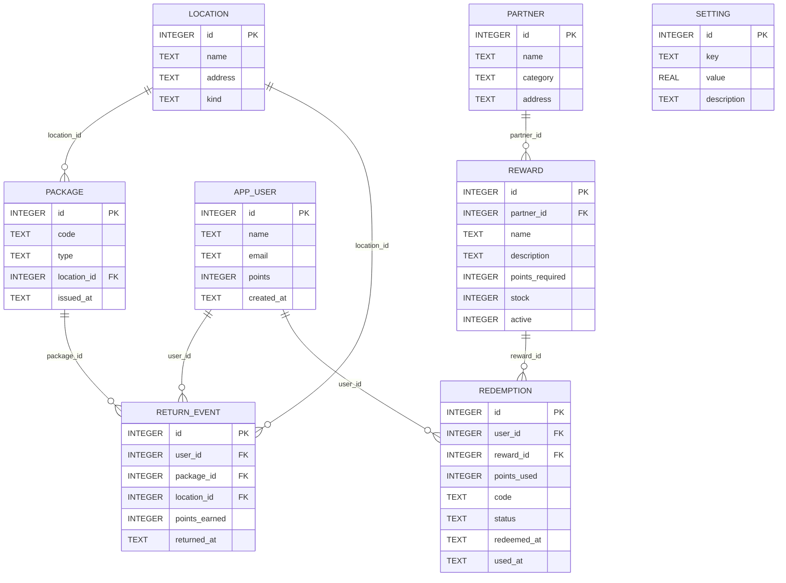
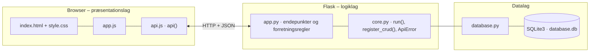

# LoopAAS – New Loop – dokumentation af prototypen

**LoopAAS** gør New Loops retursystem mere motiverende med **gamification**. Brugeren **returnerer** New Loop-emballage ved at scanne emballagens kode og optjener **LoopPoints**.
Pointene kan bruges på **rewards** hos samarbejdspartnere, fx en gratis kaffe. Niveauer, badges og en ugestreak gør det mere engagerende at returnere.

Kravgrundlag: [`Kravspecifikationer.md`](Kravspecifikationer.md)

## Hvad kan prototypen

| Skærm | Funktion |
|---|---|
| **Min side** | Pointsaldo, niveau (Bronze → Sølv → Guld → Platin) med fremdrift, antal returneringer, uger i træk, anslået CO₂-besparelse, badges og en stor knap *Returnér emballage* |
| **Returnér** | Skriv eller scan koden på emballagen og vælg returpunkt. Godkendt returnering giver straks point, evt. nyt niveau og nye badges. Ugyldige koder og dobbelt-returnering giver en tydelig fejlbesked. Eksempelkoder fra testdata kan klikkes |
| **Rewards** | Katalog med partner, pris i point, lager og hvor mange point der mangler. *Indløs* giver en kode til partneren |
| **Historik** | Aktive koder, der er klar til brug, og alle returneringer og indløsninger med pointændring |
| **Samarbejdspartner** | Partneren godkender kundens kode (kun egne rewards, kun én gang) og administrerer rewards (CRUD, lager, aktiv/inaktiv) |
| **New Loop** | Nøgletal (brugere, udleverede emballager, returrate, point optjent/brugt), flest returneringer, indløsninger pr. partner, CRUD for partnere, pointsatser og brugere |

Brugeren vælges i toppen (simuleret login).

## Fra krav til kode

| Krav | Implementering |
|---|---|
| FR01 Identificere en bruger | `app_user` og brugervalget i toppen (`email` er unik) |
| FR02 Registrere en returnering | `POST /api/returns` med emballagens kode og returpunkt |
| FR03 Tildele LoopPoints efter godkendt returnering | Point efter emballagetype (`setting`: kop 10, skål 15, madboks 20), lagt til `app_user.points` i samme transaktion |
| FR04 Se pointsaldo | `GET /api/users/<id>/profile` (saldo, niveau, streak og badges) |
| FR05 Se tilgængelige rewards | `GET /api/catalog?user_id=` (kun aktive, med manglende point og udsolgt) |
| FR06 Indløse en reward | `POST /api/redemptions` giver en unik kode (`LOOP-XXXX`). Partneren bekræfter med `POST /api/redemptions/verify` |
| FR07 Kontrollere, om brugeren har nok point | `redeem()` afviser med 409 og fortæller, hvor mange point der mangler |
| FR08 Reducere pointsaldoen efter indløsning | `UPDATE app_user SET points = points - ? WHERE points >= ?` i samme transaktion som indløsningen (kan ikke gå i minus) |
| FR09 Se historik | `GET /api/users/<id>/history` (returneringer og indløsninger samlet) |
| FR10 Gemme brugere, returneringer, point og rewards | Tabellerne `app_user`, `return_event`, `reward`, `redemption`, `partner`, `package` og `location` |
| Validere returneringer | Koden skal findes (404) og må ikke være returneret før (`return_event.package_id UNIQUE`, 409). Højst 15 returneringer pr. dag (429) |
| Gøre returprocessen mere engagerende | `level_for()` (niveauer efter optjente point i alt), `week_streak()` og 5 badges |
| Håndtere fejl | Alle fejl returneres som JSON med en forståelig besked og vises i rødt |
| Kunne udvides med flere rewards og partnere | CRUD for `partner` og `reward` (lager og aktiv/inaktiv). Pointsatser i `setting` kan ændres uden ny kode |
| Mobilvenligt, let at forstå | Stor saldo og én tydelig handling på forsiden, store knapper og kort, der lægger sig under hinanden |

**Events:** Returnering registreres → Point tildeles → Reward vælges (point kontrolleres) → Reward indløses (point trækkes) → Partner bekræfter koden. Fejl giver en fejlbesked.

## Datamodel

Følger ER-forslaget i afsnit 10 (User, Return, Reward, Partner og Redemption), udvidet med `package` (emballagens kode), `location` (restaurant/returpunkt) og `setting`.



## Eksempel på dataudveksling

Sara afleverer en kop ved returstanderen på Nørreport St.:

```bash
curl -X POST http://localhost:5112/api/returns \
  -H 'Content-Type: application/json' \
  -d '{"user_id": 1, "code": "NL-K1056", "location_id": 4}'
```

Svar `201`:

```json
{
  "approved": true,
  "code": "NL-K1056",
  "type": "KOP",
  "points_earned": 10,
  "new_balance": 110,
  "level_up": null,
  "new_badges": [],
  "message": "Tak! Din kop er returneret – du har fået 10 LoopPoints."
}
```

Samme kode igen giver `409`: "Emballagen NL-K1056 er allerede returneret … – point gives kun én gang."

## Kør prototypen

```bash
cd backend
python3 -m venv .venv && source .venv/bin/activate   # første gang
pip install -r requirements.txt                       # første gang
python app.py
```

Terminalen skriver ` * Åbn http://localhost:5112`. Åbn adressen i browseren. Flask serverer både API'et (`/api/...`) og frontenden.

- **Port:** Prototypen bruger port **5112** (5100 + projektnummer). Er porten optaget, vælger `run()` i `core.py` selv den næste ledige og skriver fx ` * Port 5112 er optaget – bruger port 5113 i stedet`. Du kan også vælge port selv med `PORT=5200 python app.py`.
- **Stop serveren** med `Ctrl` + `C` i terminalen, hvor den kører.
- **Kodeændringer:** Serveren kører i debug-tilstand og genstarter selv, når du gemmer en `.py`-fil. Den bliver på samme port. Ændringer i `frontend/` kræver kun, at du genindlæser siden.
- **Database:** `backend/database.db` oprettes med testdata ved første start. Nulstil den med `python database.py --reset`, mens serveren er stoppet.
- **Tjek at backenden svarer:** `curl http://localhost:5112/api/health`

### Fejlfinding

| Problem | Årsag | Løsning |
|---|---|---|
| ` * Port 5112 er optaget – bruger port …` | En anden proces, ofte en glemt server, bruger porten | Brug den adresse, der står i terminalen. Se hvad der optager porten med `lsof -nP -iTCP:5112 -sTCP:LISTEN`. En Flask-server i debug-tilstand er to processer, så stop dem begge med `lsof -t -iTCP:5112 -sTCP:LISTEN \| xargs kill` |
| `ModuleNotFoundError: No module named 'flask'` | Det virtuelle miljø er ikke aktiveret, eller Flask er ikke installeret | `source .venv/bin/activate` og `pip install -r requirements.txt` |
| Siden viser "Kan ikke hente data fra backenden" | Serveren kører ikke, eller `index.html` er åbnet direkte fra disken, mens serveren kører på en anden port | Start serveren og åbn adressen fra terminalen i stedet for filen |
| Tallene passer ikke efter mange tests | Databasen indeholder testdata fra tidligere afprøvninger | Stop serveren og kør `python database.py --reset` |
| `no such table …` | `database.db` er tom eller ødelagt | `python database.py --reset` |

## Arkitektur

Prototypen følger holdets fælles tre-lags struktur (se [`../README.md`](../README.md)):



| Fil | Lag | Indhold |
|---|---|---|
| `frontend/index.html` | Præsentation | Skærmbilleder som faneblade og formularer. Projektets farver og `data-api-port` |
| `frontend/app.js` | Præsentation | Henter data med `api()`, tegner dem i DOM'en og sender formularer |
| `frontend/api.js` | Præsentation | Fælles for alle prototyper: `api()` (fetch + JSON), `h()`, `renderTable()`, `fillSelect()`, `formToJson()`, `bindCrudForm()` og `toast()` |
| `frontend/style.css` | Præsentation | Fælles responsivt design |
| `backend/app.py` | Logik | Projektets forretningsregler og endepunkter |
| `backend/core.py` | Logik | Fælles: `create_app()` (Flask, CORS, JSON-fejl), `run()` (start på ledig port), `ApiError` og `register_crud()` |
| `backend/database.py` | Data | Fælles: forbindelse, `query_all/query_one/execute`, `transaction()` og `init_db()` |
| `backend/schema.sql` · `seed.sql` | Data | Tabeller og fiktive testdata |

Alle fejl returneres som JSON (`{"error": "…", "path": "/api/…"}`) med statuskode 400, 401, 403, 404 eller 409 og vises som en rød besked i frontenden.
Nederst på siden kan man åbne **"Seneste JSON-svar fra API'et"** og se den rå dataudveksling.
Den fulde endepunktsliste står i [`backend/README.md`](backend/README.md).

## Design og responsivitet

- Samme stylesheet i alle prototyper. Kun farverne (`--brand`, `--brand-dark`, `--brand-soft`) sættes i `index.html`.
- Layoutet virker fra mobil (375 px) til desktop uden vandret scroll. Kort lægger sig under hinanden på små skærme, og brede tabeller scroller inde i deres kort.
- Formularfelter kan ikke blive bredere end deres kort. En `<select>` med lange valgmuligheder skubber altså ikke formularen ud over kanten.
- Beskeder vises kort i toppen (grøn = gennemført, rød = fejl fra serveren).


## Testdata

4 brugere (Sara, Ali, Mikkel og Freja), 3 restauranter og 2 returstandere i København, 60 udleverede emballager (kopper, skåle og madbokse), hvoraf 48 er returneret i august og september 2026.
4 samarbejdspartnere med 6 rewards (én inaktiv) og 3 indløsninger. Sara har en aktiv kode, og fanen *Returnér* viser emballager, der endnu ikke er returneret.

## Afgrænsning

Ingen rigtig betaling, integration med New Loops system, fysisk returhardware eller partnernes kassesystemer (jf. afsnit 4). QR-scanning er erstattet af at skrive eller klikke koden.
Login er simuleret. CO₂-besparelsen er et groft skøn (50 g pr. genbrugt emballage).
