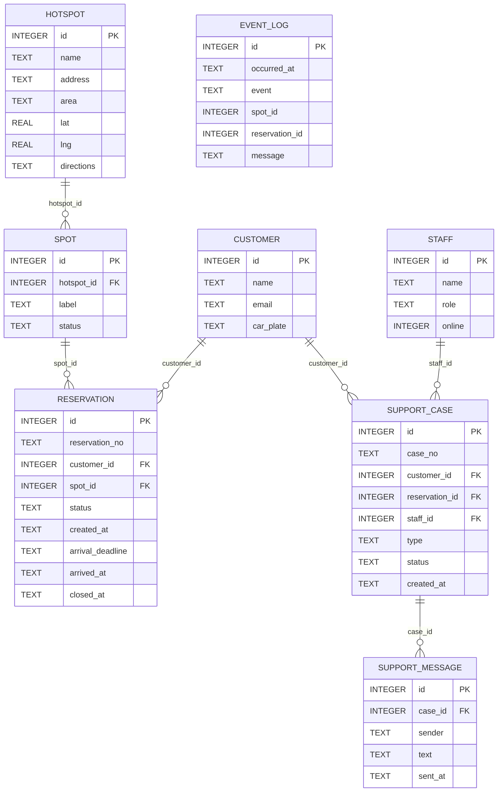
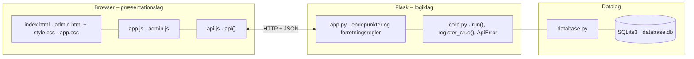

# GreenMobility – dokumentation af prototypen

Prototypen lader en GreenMobility-kunde **reservere en ledig parkeringsplads ved et hotspot** før ankomst,
så usikkerheden om at kunne parkere mindskes. Kundesiden er enkel og mobilvenlig. Administratoren har sin egen side,
hvor bilers ankomst og afgang simuleres, tallene kontrolleres, og kundehenvendelser besvares.

Kravgrundlag: [`Kravspecifikation.MD`](Kravspecifikation.MD)

## Hvad kan prototypen

**Kundeside** (`/`, mobil først)

| Del | Funktion |
|---|---|
| **Hotspotliste** | Kompakte rækker med navn, adresse, antal ledige pladser og *Reservér*. Søgefelt øverst og *Nær mig* (sortér efter afstand) |
| **Bekræft booking** | Før booking vises hvor længe pladsen holdes, og hvad reservation, annullering og udeblivelse koster |
| **Fuldt hotspot** | Knappen *Alternativer* viser de nærmeste hotspots med ledige pladser. Tages den sidste plads lige før kunden, vises de også |
| **Din reservation** | Øverst: pladsnummer, sted, nedtælling med bjælke og ankomstfrist. *Jeg er ankommet* (reserveret → optaget) og *Annullér* (pladsen bliver ledig) |
| **Problem med pladsen?** | *Min plads er optaget* → ny plads ved samme hotspot, ellers gratis annullering + alternativer. *Jeg kan ikke finde pladsen* → vejvisning, og en medarbejder får besked |
| **Hjælp** (grøn knap) | *AI-chat* (tydeligt markeret som AI), *Medarbejder* (åbningstider, ring, vælg medarbejder eller første ledige, chat) og *Meld problem* |
| **Menu** (☰) | Mine reservationer, Regler og vilkår, Privatliv |

**Administratorside** (`/admin.html`)

| Fane | Funktion |
|---|---|
| **Overblik** | Ledige + reserverede + optagede + spærrede = i alt pr. hotspot, og reserverede = aktive reservationer (✓/✗). Testkunder med link til kundesiden. Hændelseslog |
| **Pladser** | Simulér *Bil kører*, *Bil parkerer*, *Spær* / *Ophæv spærring* |
| **Reservationer** | Alle reservationer med *Registrér ankomst* og *Simulér udløb* |
| **Henvendelser** | Chat med kunder, svar som en bestemt medarbejder, luk henvendelser. Medarbejdere sættes online/offline |
| **Opsætning** | CRUD for hotspots (inkl. koordinater og vejvisning) og pladser. Seneste rå JSON-svar |

Kundesiden viser kunde 1. Vælg en anden testkunde med `?kunde=2` i adressen eller via *Testkunder* på administratorsiden.

## Fra krav til kode

| Regel (afsnit 6 og 8.7) | Implementering |
|---|---|
| En reservation holder pladsen i 20 minutter | `HOLD_MINUTES = 20`. `arrival_deadline` beregnes i `create_reservation()` |
| Højst én aktiv reservation pr. kunde | Kontrol i `create_reservation()` (409) + unikt delvist indeks `one_active_per_customer` |
| Højst én aktiv reservation pr. plads – ingen dobbeltbooking | `create_reservation()` tager skrivelåsen med `BEGIN IMMEDIATE` (`begin_write()`), før den vælger en ledig plads, så to samtidige requests ikke kan få samme plads. Unikt delvist indeks `one_active_per_spot` som sidste værn. Testet med samtidige requests i `tests.py` |
| Optagede, reserverede og spærrede pladser kan ikke reserveres | Kun pladser med status `LEDIG` vælges |
| Ingen ledig plads → afvisning + alternativer | 409, og `GET /api/hotspots/<id>/alternatives` giver de nærmeste hotspots med ledige pladser (afstand ud fra koordinater) |
| Tal der stemmer | `with_check()`: ledige + reserverede + optagede + spærrede = i alt, og reserverede = aktive reservationer |
| Gebyrer og regler vises før booking | `HOLD_MINUTES`, `RESERVATION_FEE_KR`, `CANCEL_FEE_KR`, `NO_SHOW_FEE_KR` → `GET /api/info`, så teksterne altid passer med reglerne |
| Meld et problem | `report_problem()`: plads optaget → ny plads eller gratis annullering. Kan ikke finde → vejvisning + henvendelse |
| AI-hjælp | `assistant()`: regelbaseret demo (nøgleord → svar). Ingen sprogmodel, intet gemmes. Kan ikke svare → tilbyder medarbejder |
| Kontakt medarbejder | `create_case()` / `add_message()`. Vælg medarbejder direkte eller første ledige. Åbningstider i `SUPPORT_HOURS` |
| Annullering frigiver pladsen | `cancel_reservation()` |
| Manglende ankomst → udløb | `expire_overdue()` kører før hvert API-kald (`@app.before_request`) |
| Ankomst: reserveret → optaget | `register_arrival()` |
| Pladsen bliver først ledig ved afgang | `simulate_departure()` (administrator) |
| Kun aktiv, ikke-udløbet reservation kan benyttes eller annulleres | `require_active()` |
| Administrator kan kun spærre/åbne ledige pladser | `validate_spot()` |

**Tilstande**

```
Reservation:  AKTIV → BENYTTET | ANNULLERET | UDLOEBET
Plads:        LEDIG → RESERVERET → OPTAGET → LEDIG (ved afgang)
              LEDIG ↔ SPAERRET (administrator)
```

## Datamodel



| Tabel | Rolle |
|---|---|
| `customer` | Fiktive testkunder |
| `hotspot` · `spot` | Hotspots (med koordinater og vejvisning) og deres pladser med status |
| `reservation` | Reservationsnummer, frist og status |
| `staff` | Medarbejdere, som kunden kan vælge i chatten |
| `support_case` · `support_message` | Henvendelser (chat, plads optaget, kan ikke finde plads) og deres beskeder |
| `event_log` | Hændelser: oprettet, annulleret, udløbet, ankomst og afgang |

## Eksempel på dataudveksling

Kunde 1 (Gustav) reserverer en plads ved Fisketorvet. Systemet vælger første ledige plads og sætter ankomstfristen 20 minutter frem:

```bash
curl -X POST http://localhost:5102/api/reservations \
  -H 'Content-Type: application/json' \
  -d '{"customer_id": 1, "hotspot_id": 2}'
```

Svar `201`:

```json
{
  "id": 4,
  "reservation_no": "R-1004",
  "customer_id": 1,
  "spot_id": 5,
  "status": "AKTIV",
  "created_at": "2026-09-29 15:50:35",
  "arrival_deadline": "2026-09-29 16:10:35",
  "arrived_at": null,
  "closed_at": null,
  "customer_name": "Gustav Jensen",
  "spot_label": "B1",
  "spot_status": "RESERVERET",
  "hotspot_id": 2,
  "hotspot_name": "Fisketorvet",
  "…": "1 felter mere"
}
```

## Kør prototypen

```bash
cd backend
python3 -m venv .venv && source .venv/bin/activate   # første gang
pip install -r requirements.txt                       # første gang
python app.py
```

Terminalen skriver ` * Åbn http://localhost:5102`. Åbn adressen i browseren. Flask serverer både API'et (`/api/...`) og frontenden.

- **Port:** Prototypen bruger port **5102** (5100 + projektnummer). Er porten optaget, vælger `run()` i `core.py` selv den næste ledige og skriver fx ` * Port 5102 er optaget – bruger port 5103 i stedet`. Du kan også vælge port selv med `PORT=5200 python app.py`.
- **Stop serveren** med `Ctrl` + `C` i terminalen, hvor den kører.
- **Kodeændringer:** Serveren kører i debug-tilstand og genstarter selv, når du gemmer en `.py`-fil. Den bliver på samme port. Ændringer i `frontend/` kræver kun, at du genindlæser siden.
- **Database:** `backend/database.db` oprettes med testdata ved første start. Nulstil den med `python database.py --reset`, mens serveren er stoppet.
- **Tjek at backenden svarer:** `curl http://localhost:5102/api/health`

### Fejlfinding

| Problem | Årsag | Løsning |
|---|---|---|
| ` * Port 5102 er optaget – bruger port …` | En anden proces, ofte en glemt server, bruger porten | Brug den adresse, der står i terminalen. Se hvad der optager porten med `lsof -nP -iTCP:5102 -sTCP:LISTEN`. En Flask-server i debug-tilstand er to processer, så stop dem begge med `lsof -t -iTCP:5102 -sTCP:LISTEN \| xargs kill` |
| `ModuleNotFoundError: No module named 'flask'` | Det virtuelle miljø er ikke aktiveret, eller Flask er ikke installeret | `source .venv/bin/activate` og `pip install -r requirements.txt` |
| Siden viser "Kan ikke hente data fra backenden" | Serveren kører ikke, eller `index.html` er åbnet direkte fra disken, mens serveren kører på en anden port | Start serveren og åbn adressen fra terminalen i stedet for filen |
| Tallene passer ikke efter mange tests | Databasen indeholder testdata fra tidligere afprøvninger | Stop serveren og kør `python database.py --reset` |
| `no such table …` | `database.db` er tom eller ødelagt | `python database.py --reset` |

## Arkitektur

Prototypen følger holdets fælles tre-lags struktur (se [`../README.md`](../README.md)):



| Fil | Lag | Indhold |
|---|---|---|
| `frontend/index.html` · `app.js` | Præsentation | Kundesiden: hotspotliste, reservation, menu og hjælpeark |
| `frontend/admin.html` · `admin.js` | Præsentation | Administratorsiden: faneblade, tabeller og formularer |
| `frontend/app.css` | Præsentation | Projektets farver og komponenter – bruges af begge sider |
| `frontend/api.js` | Præsentation | Fælles for alle prototyper: `api()` (fetch + JSON), `h()`, `renderTable()`, `fillSelect()`, `formToJson()`, `bindCrudForm()` og `toast()` |
| `frontend/style.css` | Præsentation | Fælles responsivt design |
| `backend/app.py` | Logik | Projektets forretningsregler og endepunkter |
| `backend/core.py` | Logik | Fælles: `create_app()` (Flask, CORS, JSON-fejl), `run()` (start på ledig port), `ApiError` og `register_crud()` |
| `backend/database.py` | Data | Fælles: forbindelse, `query_all/query_one/execute`, `transaction()` og `init_db()` |
| `backend/schema.sql` · `seed.sql` | Data | Tabeller og fiktive testdata |
| `backend/tests.py` | Test | Automatiske tests af reglerne: tal der stemmer, ingen dobbeltbooking, problemer, chat og assistent |

Alle fejl returneres som JSON (`{"error": "…", "path": "/api/…"}`) med statuskode 400, 401, 403, 404 eller 409 og vises som en rød besked i frontenden.
Nederst på administratorsiden kan man åbne **"Seneste JSON-svar fra API'et"** og se den rå dataudveksling.
Den fulde endepunktsliste står i [`backend/README.md`](backend/README.md).

## Design og responsivitet

- Clean og lyst: lys baggrund, hvide afrundede bokse, grønne knapper og korte tekster. Farver, knapper og skrift står i `app.css`, som begge sider bruger, så appen føles sammenhængende.
- Kundesiden er bygget til mobil (375 px) uden vandret scroll. Hotspots er kompakte rækker (adressen afkortes med … på smalle skærme), så man ser flere steder ad gangen.
- Ark (bekræft booking, hjælp, regler osv.) glider op fra bunden på mobil og vises centreret på større skærme.
- Beskeder vises kort i toppen (grøn = gennemført, rød = fejl fra serveren).

## Testdata

3 kunder, 9 hotspots, 29 pladser og 3 medarbejdere (én offline). Nørreport har kun én ledig plads, og Lyngbyvej og Valby er helt optaget,
så alternativer og *Min plads er optaget* uden ledig plads kan afprøves. Telefonnummeret er fiktivt.

## Afgrænsning

Betaling, sensorer, nummerpladegenkendelse, reservation frem i tiden, rigtig login og integration til GreenMobilitys app indgår ikke.
Gebyrerne er sat til 0 kr. (`*_FEE_KR` i `app.py`), indtil prisen er besluttet. AI-assistenten er regelbaseret og kan udskiftes med en sprogmodel bag samme endepunkt.
Tid simuleres med knappen *Simulér udløb*, så man ikke skal vente 20 minutter.
