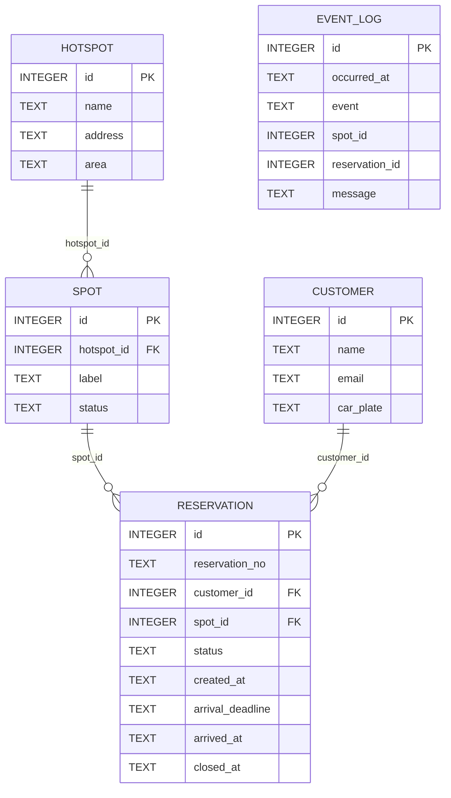
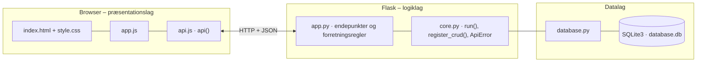

# GreenMobility – dokumentation af prototypen

Prototypen lader en GreenMobility-kunde **reservere en ledig parkeringsplads ved et hotspot** før ankomst,
så usikkerheden om at kunne parkere mindskes. En administrator kan simulere bilers ankomst og afgang.

Kravgrundlag: [`Kravspecifikation.MD`](Kravspecifikation.MD)

## Hvad kan prototypen

| Skærm | Funktion |
|---|---|
| **Hotspots** | Oversigt over hotspots med antal ledige, reserverede og optagede pladser. Knappen *Reservér plads* |
| **Mine reservationer** | Aktiv reservation med reservationsnummer, plads, ankomstfrist og nedtælling. Knapperne *Jeg er ankommet* og *Annullér*, plus historik |
| **Administrator** | Alle pladser med knapper til at simulere *Bil kører*, *Bil parkerer* og *Spær*. Alle reservationer med *Simulér udløb*, CRUD for hotspots og pladser, samt hændelseslog |

Testkunden vælges i toppen (*Testbruger*), så man kan afprøve flere kunder mod de samme pladser.

## Fra krav til kode

| Regel (afsnit 6 og 8.7) | Implementering |
|---|---|
| En reservation holder pladsen i 20 minutter | `HOLD_MINUTES = 20`. `arrival_deadline` beregnes i `create_reservation()` |
| Højst én aktiv reservation pr. kunde | Kontrol i `create_reservation()` (409) + unikt delvist indeks `one_active_per_customer` |
| Højst én aktiv reservation pr. plads | Unikt delvist indeks `one_active_per_spot` |
| Optagede, reserverede og spærrede pladser kan ikke reserveres | Kun pladser med status `LEDIG` vælges |
| Ingen ledig plads → afvisning | 409: "Der er ingen ledige pladser ved …" |
| Annullering frigiver pladsen | `cancel_reservation()` |
| Manglende ankomst → udløb | `expire_overdue()` kører før hvert API-kald (`@app.before_request`) |
| Ankomst: reserveret → optaget | `register_arrival()` |
| Pladsen bliver først ledig ved afgang | `simulate_departure()` (administrator) |
| Kun aktiv, ikke-udløbet reservation kan benyttes eller annulleres | `require_active()` |
| Administrator kan kun spærre/åbne ledige pladser | `validate_spot()` |

**Tilstande**

```
Reservation:  AKTIV → BENYTTET | ANNULLERET | UDLOEBET
Plads:        LEDIG → RESERVERET → OPTAGET → LEDIG (ved afgang)
              LEDIG ↔ SPAERRET (administrator)
```

## Datamodel



| Tabel | Rolle |
|---|---|
| `customer` | Fiktive testkunder |
| `hotspot` · `spot` | Hotspots og deres pladser med status |
| `reservation` | Reservationsnummer, frist og status |
| `event_log` | Hændelser: oprettet, annulleret, udløbet, ankomst og afgang |

## Eksempel på dataudveksling

Kunde 1 (Gustav) reserverer en plads ved Fisketorvet. Systemet vælger første ledige plads og sætter ankomstfristen 20 minutter frem:

```bash
curl -X POST http://localhost:5102/api/reservations \
  -H 'Content-Type: application/json' \
  -d '{"customer_id": 1, "hotspot_id": 2}'
```

Svar `201`:

```json
{
  "id": 4,
  "reservation_no": "R-1004",
  "customer_id": 1,
  "spot_id": 5,
  "status": "AKTIV",
  "created_at": "2026-09-29 15:50:35",
  "arrival_deadline": "2026-09-29 16:10:35",
  "arrived_at": null,
  "closed_at": null,
  "customer_name": "Gustav Jensen",
  "spot_label": "B1",
  "spot_status": "RESERVERET",
  "hotspot_id": 2,
  "hotspot_name": "Fisketorvet",
  "…": "1 felter mere"
}
```

## Kør prototypen

```bash
cd backend
python3 -m venv .venv && source .venv/bin/activate   # første gang
pip install -r requirements.txt                       # første gang
python app.py
```

Terminalen skriver ` * Åbn http://localhost:5102`. Åbn adressen i browseren. Flask serverer både API'et (`/api/...`) og frontenden.

- **Port:** Prototypen bruger port **5102** (5100 + projektnummer). Er porten optaget, vælger `run()` i `core.py` selv den næste ledige og skriver fx ` * Port 5102 er optaget – bruger port 5103 i stedet`. Du kan også vælge port selv med `PORT=5200 python app.py`.
- **Stop serveren** med `Ctrl` + `C` i terminalen, hvor den kører.
- **Kodeændringer:** Serveren kører i debug-tilstand og genstarter selv, når du gemmer en `.py`-fil. Den bliver på samme port. Ændringer i `frontend/` kræver kun, at du genindlæser siden.
- **Database:** `backend/database.db` oprettes med testdata ved første start. Nulstil den med `python database.py --reset`, mens serveren er stoppet.
- **Tjek at backenden svarer:** `curl http://localhost:5102/api/health`

### Fejlfinding

| Problem | Årsag | Løsning |
|---|---|---|
| ` * Port 5102 er optaget – bruger port …` | En anden proces, ofte en glemt server, bruger porten | Brug den adresse, der står i terminalen. Se hvad der optager porten med `lsof -nP -iTCP:5102 -sTCP:LISTEN`. En Flask-server i debug-tilstand er to processer, så stop dem begge med `lsof -t -iTCP:5102 -sTCP:LISTEN \| xargs kill` |
| `ModuleNotFoundError: No module named 'flask'` | Det virtuelle miljø er ikke aktiveret, eller Flask er ikke installeret | `source .venv/bin/activate` og `pip install -r requirements.txt` |
| Siden viser "Kan ikke hente data fra backenden" | Serveren kører ikke, eller `index.html` er åbnet direkte fra disken, mens serveren kører på en anden port | Start serveren og åbn adressen fra terminalen i stedet for filen |
| Tallene passer ikke efter mange tests | Databasen indeholder testdata fra tidligere afprøvninger | Stop serveren og kør `python database.py --reset` |
| `no such table …` | `database.db` er tom eller ødelagt | `python database.py --reset` |

## Arkitektur

Prototypen følger holdets fælles tre-lags struktur (se [`../README.md`](../README.md)):



| Fil | Lag | Indhold |
|---|---|---|
| `frontend/index.html` | Præsentation | Skærmbilleder som faneblade og formularer. Projektets farver og `data-api-port` |
| `frontend/app.js` | Præsentation | Henter data med `api()`, tegner dem i DOM'en og sender formularer |
| `frontend/api.js` | Præsentation | Fælles for alle prototyper: `api()` (fetch + JSON), `h()`, `renderTable()`, `fillSelect()`, `formToJson()`, `bindCrudForm()` og `toast()` |
| `frontend/style.css` | Præsentation | Fælles responsivt design |
| `backend/app.py` | Logik | Projektets forretningsregler og endepunkter |
| `backend/core.py` | Logik | Fælles: `create_app()` (Flask, CORS, JSON-fejl), `run()` (start på ledig port), `ApiError` og `register_crud()` |
| `backend/database.py` | Data | Fælles: forbindelse, `query_all/query_one/execute`, `transaction()` og `init_db()` |
| `backend/schema.sql` · `seed.sql` | Data | Tabeller og fiktive testdata |

Alle fejl returneres som JSON (`{"error": "…", "path": "/api/…"}`) med statuskode 400, 401, 403, 404 eller 409 og vises som en rød besked i frontenden.
Nederst på siden kan man åbne **"Seneste JSON-svar fra API'et"** og se den rå dataudveksling.
Den fulde endepunktsliste står i [`backend/README.md`](backend/README.md).

## Design og responsivitet

- Samme stylesheet i alle prototyper. Kun farverne (`--brand`, `--brand-dark`, `--brand-soft`) sættes i `index.html`.
- Layoutet virker fra mobil (375 px) til desktop uden vandret scroll. Kort lægger sig under hinanden på små skærme, og brede tabeller scroller inde i deres kort.
- Formularfelter kan ikke blive bredere end deres kort. En `<select>` med lange valgmuligheder skubber altså ikke formularen ud over kanten.
- Beskeder vises kort i toppen (grøn = gennemført, rød = fejl fra serveren).


## Testdata

3 kunder, 4 hotspots og 15 pladser. Nørreport har kun én ledig plads, og Lyngbyvej er helt optaget, så afvisningen kan afprøves.

## Afgrænsning

Betaling, sensorer, nummerpladegenkendelse, reservation frem i tiden og integration til GreenMobilitys app indgår ikke.
Tid simuleres med knappen *Simulér udløb*, så man ikke skal vente 20 minutter.
