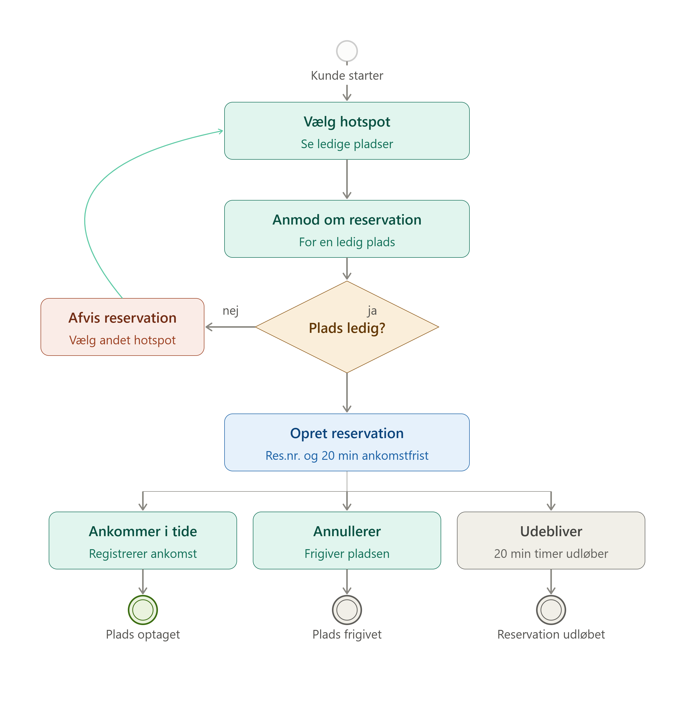
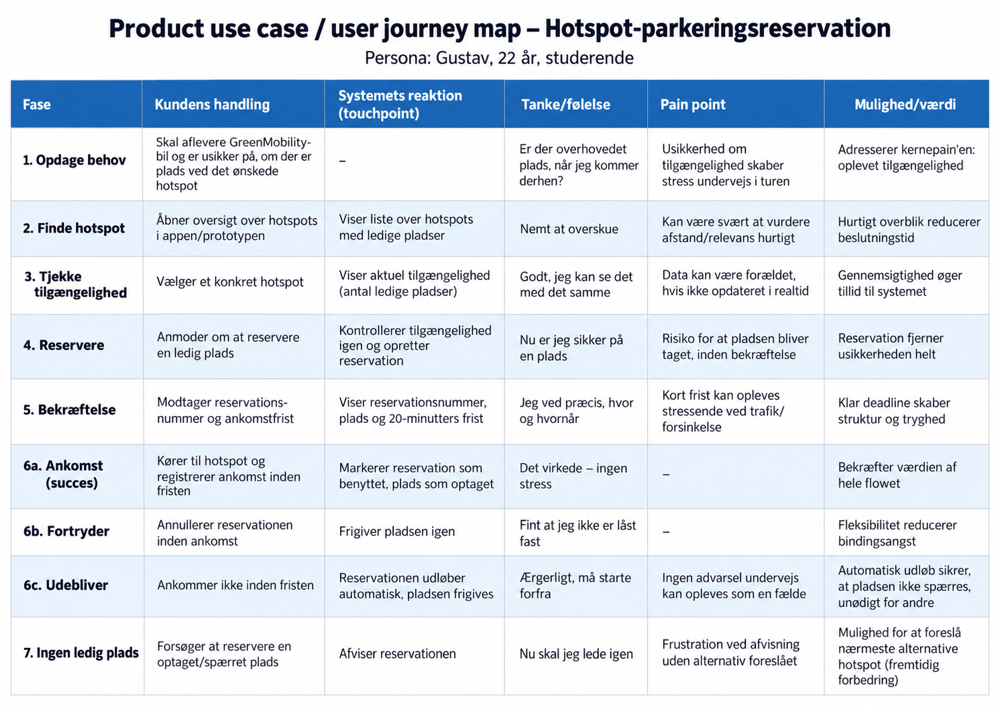

# Kravspecifikation – Reservation af hotspotparkering

## 1. Formål

Prototypen skal gøre det muligt for en GreenMobility-kunde
at reservere en ledig parkeringsplads ved et hotspot inden
ankomst.

Formålet er at mindske kundens usikkerhed om muligheden
for at parkere ved det ønskede hotspot.

## 2. Problem

Vi undersøger, om usikkerhed om ledige parkeringspladser
ved hotspots gør det vanskeligt for kunderne at planlægge
afleveringen af deres bil.

Prototypen skal bruges til at teste et reservationsforløb
og den logik, der styrer pladsernes tilgængelighed.

## 3. Brugere

### Kunde
Kunden skal kunne finde et hotspot, reservere en plads,
se sin reservation, annullere og registrere ankomst.

### Administrator
Administratoren skal kunne se reservationer og pladser
samt simulere bilers ankomst og afgang.

## 4. Prototypens omfang

Prototypen skal indeholde:

- Oversigt over hotspots og ledige pladser.
- Reservation af en plads, der er ledig nu.
- Bekræftelse med reservationsnummer og ankomstfrist.
- Oversigt over kundens reservationer.
- Annullering af en reservation.
- Automatisk udløb ved manglende ankomst.
- Registrering af ankomst.
- Administratorfunktion til at simulere bilers afgang.

## 5. Afgrænsning

Prototypen anvender fiktive kunder, biler, hotspots og pladser.

Der etableres ikke forbindelse til GreenMobilitys
eksisterende app eller systemer.

Betaling, sensorer, nummerpladegenkendelse og fysisk
adgangskontrol indgår ikke.

Reservation til en senere dato indgår ikke.
En plads reserveres fra bestillingstidspunktet.

Registrering af parkering i prototypen afslutter ikke
en rigtig GreenMobility-leje.

## 6. Foreslåede regler for prototypen

- En reservation holder pladsen i 20 minutter.
- Kunden skal ankomme inden ankomstfristen.
- En kunde kan højst have én aktiv reservation ad gangen.
- En optaget, reserveret eller spærret plads kan ikke reserveres.
- Annullering frigiver pladsen.
- Manglende ankomst får reservationen til at udløbe.
- Ved ankomst ændres pladsen fra reserveret til optaget.
- Pladsen bliver først ledig igen, når bilens afgang registreres.

## 7. Antagelser og åbne spørgsmål

- Vi antager, at pladsernes belægning kan registreres pålideligt.
- Vi antager, at reserverede pladser kan holdes til rådighed
  for den rette kunde i en virkelig løsning.
- Vi skal undersøge, om kunderne har behov for funktionen.
- Vi skal afklare, om 20 minutter er en passende reservationsfrist.

## 8. Business Use Case – Reservation af hotspotparkering

### 8.1 Formål

Kunden skal kunne reservere en ledig parkeringsplads ved et hotspot inden ankomst. Reservationen skal mindske kundens usikkerhed om muligheden for at parkere ved det ønskede hotspot.

### 8.2 Aktører

- **Kunde:** Vælger hotspot, anmoder om reservation, annullerer eller registrerer ankomst.
- **Reservationssystem:** Kontrollerer tilgængelighed, opretter reservationen og håndterer bekræftelse, annullering, ankomst og udløb.

### 8.3 Forudsætninger

- Kunden er identificeret med en testbruger i prototypen.
- Hotspots og parkeringspladser er oprettet som testdata.
- Kunden har ikke allerede en aktiv reservation.

### 8.4 Hovedforløb

1. Kunden åbner oversigten over hotspots.
2. Systemet viser hotspots og antallet af ledige pladser.
3. Kunden vælger et hotspot og anmoder om en reservation.
4. Systemet kontrollerer, at kunden ikke har en aktiv reservation, og at en plads stadig er ledig.
5. Systemet opretter reservationen og markerer den tildelte plads som reserveret. Pladsen kan derefter ikke reserveres af andre.
6. Systemet viser reservationsnummer, hotspot, plads og ankomstfrist.
7. Kunden ankommer og registrerer sin ankomst inden fristen.
8. Systemet kontrollerer, at reservationen stadig er aktiv og ikke udløbet.
9. Systemet markerer reservationen som benyttet og pladsen som optaget.

### 8.5 Alternative forløb

| Situation | Systemets reaktion | Kundens mulighed |
|---|---|---|
| Ingen ledig plads ved reservation | Systemet afviser anmodningen og viser en besked. | Kunden kan vælge et andet hotspot. |
| Kunden har allerede en aktiv reservation | Systemet afviser en ny reservation og henviser til den eksisterende. | Kunden kan se eller annullere sin aktive reservation. |
| Kunden annullerer en aktiv reservation | Systemet markerer reservationen som annulleret og frigiver pladsen. | Kunden kan oprette en ny reservation. |
| Kunden registrerer ikke ankomst inden fristen | Systemet markerer reservationen som udløbet og frigiver pladsen. | Kunden kan forsøge at oprette en ny reservation. |
| Kunden forsøger at registrere ankomst med en udløbet eller annulleret reservation | Systemet afviser registreringen og viser en besked. | Kunden kan forsøge at oprette en ny reservation. |

### 8.6 Resultat

Ved vellykket ankomst er reservationen benyttet, bilen registreret som parkeret og pladsen optaget.

Pladsen bliver først ledig igen, når bilens afgang registreres. Den oprindelige ankomstfrist frigiver derfor ikke en plads, hvor kunden allerede har registreret ankomst.

Ved annullering eller udløb frigives pladsen, og reservationen kan ikke længere benyttes.

### 8.7 Regler for forløbet

- Reservationen gælder fra oprettelsestidspunktet.
- Ankomstfristen er 20 minutter efter oprettelsen.
- Ankomst skal registreres før ankomstfristen. Ved eller efter fristen er reservationen udløbet.
- En kunde kan højst have én aktiv reservation ad gangen.
- En plads kan højst have én aktiv reservation ad gangen.
- Optagede, reserverede og spærrede pladser kan ikke reserveres.
- Kun en aktiv reservation, der ikke er udløbet, kan benyttes eller annulleres.

Reservationsfristen på 20 minutter er en foreløbig regel, som skal vurderes gennem brugertest.

### 8.8 BPMN-diagram

Diagrammet viser reservationsforløbet samt alternativerne ved afvisning, annullering og manglende ankomst.

*Figur 1: Reservationsforløb for hotspotparkering.*

## 9. Product Use Case – User Journey Map

### 9.1 Formål

Brugerrejsen beskriver kundens handlinger og kontakt med prototypen fra behovet for parkering opstår, til reservationen benyttes, annulleres eller udløber.

Formålet er at identificere, hvilken information og hvilke funktioner kunden har brug for undervejs.

### 9.2 Persona og scenarie

Gustav er 22 år og studerende. Han benytter en GreenMobility-bil og ønsker at afslutte sin tur ved et bestemt hotspot.

Inden han kører mod hotspottet, åbner han prototypen for at undersøge tilgængeligheden og reservere en parkeringsplads.

### 9.3 Brugerrejse

Tankerne, følelserne og udfordringerne i tabellen er antagelser, som skal undersøges gennem brugertest. De er ikke dokumenterede brugerudsagn.

()

Fase 4a er et alternativ til en vellykket reservation. Fase 6a, 6b og 6c er alternative afslutninger på reservationsforløbet.

### 9.4 Betydning for prototypens design

Brugerrejsen peger på følgende behov i brugergrænsefladen:

- En overskuelig liste over hotspots og ledige pladser.
- En tydelig knap til at reservere.
- En bekræftelse med reservationsnummer, hotspot, plads og ankomstfrist.
- En oversigt, hvor kunden kan se sin reservation og dens status.
- Tydelige knapper til annullering og registrering af ankomst.
- Forståelige beskeder ved afvisning, annullering og udløb.

Brugertesten skal undersøge, om kunden kan gennemføre reservationen, forstå ankomstfristen og finde funktionerne til annullering og registrering af ankomst.