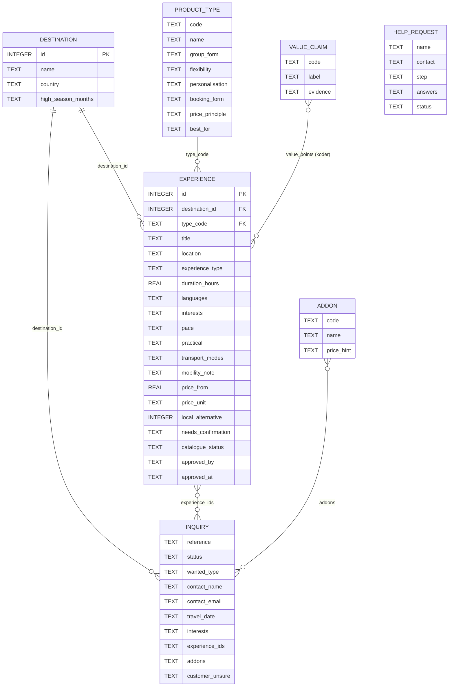
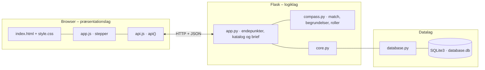

# Amitylux Experience Compass – dokumentation af prototypen

Prototype 2 for Amitylux. Den bygger på **Idé 1 – Amitylux Experience Compass** i [`prototype-ideer.md`](prototype-ideer.md)
og på kravene K1–K12 i [`kravspecifikation-2.md`](kravspecifikation-2.md).
Den første prototype (oplevelsesvælger med anbefaling af produkttype, [`Kravspecifikation.md`](Kravspecifikation.md)) findes i git-historikken.

Kompasset omsætter rejsegruppe, interesser, tempo, sprog og praktiske hensyn til **højst tre begrundede oplevelsesforslag**
fra et godkendt Amitylux-katalog. Brugeren kan justere sine svar og se, hvad der ændrer sig, sammenligne public, private
og customised og sende en struktureret forespørgsel til en medarbejder. "AI" er simuleret med en regelbaseret og
deterministisk matchmotor, som aldrig opfinder priser, kapacitet eller adgang. Brugerfladen er på engelsk.

## Brugerrejsen (K10)

Seks trin med fremdriftslinje, "Step x of 6", altid synlige valg (chips) og en *Back*-knap. Svarene bevares, når man går tilbage.
Mangler et påkrævet svar, vises en rød besked under feltet, og brugeren kommer ikke videre. API'et tjekker svarene igen.

| Trin | Skærm | Krav |
|---|---|---|
| 1 | **Start**: vælg destination (København eller Rom) | K1, K11 |
| 2 | **Your preferences**: hvem, antal, interesser, tempo, guidesprog, praktiske hensyn, dato (valgfri) | K1 |
| 3 | **Check your answers**: opsummering med *Change* pr. svar | K1 |
| 4 | **Your suggestions**: 1–3 forslag (*Classic*, *Local*, *Balanced*) + justering og "What changed" | K2, K3, K5–K7, K9, K12 |
| 5 | **Public, private or customised?**: sammenligning og valg af type | K4 |
| 6 | **Send to a local expert**: tilvalg, usikkerheder, kontakt og live-forhåndsvisning af briefen → kvittering | K8 |
| – | **Talk to a person** i toppen på alle trin. Svarene sendes med | K8 |
| – | **Staff view**: forespørgsler med brief, hjælpeanmodninger med gemte svar og katalogkontrol | K8, K9 |

## Fra krav til kode

| Krav | Prioritet | Implementering | Test i `tests.py` |
|---|---|---|---|
| **K1** Præferencer, kan gennemses og ændres | Skal | `GET /api/options` giver svarmulighederne; `compass.validate()` afviser manglende svar; trin 3 har *Change* | `test_k1_*` |
| **K2** Højst tre forslag | Skal | `compass.suggest()` fylder rollerne *Classic*, *Local* og *Balanced*, `MAX_SUGGESTIONS = 3` | `test_k2_*` |
| **K3** Begrundelse med ≥ 2 præferencer + justering | Skal | `compass.score()` knytter hver begrundelse til en præference; forslag med under 2 udelades. `POST /api/compass` med `previous` returnerer `changes` (ændrede svar, nye/fjernede forslag, nye begrundelser) | `test_k3_*` |
| **K4** Public / private / customised | Skal | Tabellen `product_type` (gruppe, fleksibilitet, personalisering, booking, prisprincip, bedst til) i trin 5; typen står på hvert forslag | `test_k4_*` |
| **K5** Konkrete felter pr. forslag | Skal | `compass.describe()`: navn, beskrivelse, lokation, oplevelsestype, varighed, gruppe, transport, inkluderet/ikke inkluderet, pris/prisprincip | `test_k5_*` |
| **K6** Lokalt alternativ, når relevant | Bør | *Local*-rollen vælges kun blandt `local_alternative = 1` med interessematch. `local_note` begrunder det som oplevelse, ikke miljøgevinst | `test_k6_*` |
| **K7** Amitylux' merværdi | Skal | Tabellen `value_claim` med kilde (`evidence`). Mærker på hvert forslag og boksen "Why book with Amitylux?" | `test_k7_*` |
| **K8** Struktureret overlevering | Skal | `POST /api/inquiries/preview` viser præcis hvad der sendes; `POST /api/inquiries` giver kvittering og brief. Hjælpeanmodninger gemmer svarene i `help_request.answers` | `test_k8_*` |
| **K9** Kun godkendt katalog, usikkert = "requires confirmation" | Skal | `approved_catalogue()` bruger kun godkendte og komplette rækker. `needs_confirmation`, kort varsel og højsæson vises som *requires confirmation*. `GET /api/catalogue/audit` til Amitylux | `test_k9_*` |
| **K10** Kort, mobilvenlig, fremdrift og tilbage | Skal | Stepper i `app.js`; testet ved 375 px og 1440 px uden vandret scroll | Browsertest (manuel/Playwright) |
| **K11** Genbrug på tværs af destinationer | Bør | Samme datamodel, motor og kort for København og Rom | `test_k11_*` |
| **K12** Neutral mobilitetsmærkning | Kan | `transport_modes` + `mobility_note` ("Getting around") uden klimapåstande | `test_k12_*` |

## Matchmotoren (`backend/compass.py`)

Ren Python uden Flask og SQLite. Samme svar og samme katalog giver altid samme forslag.

1. **Udeluk** oplevelser, hvor gruppestørrelsen ikke passer, ingen interesse matcher, et trinfrit behov ikke opfyldes,
   eller sproget ikke findes (customised undtaget – her bliver sproget et "requires confirmation"-punkt).
2. **Point og begrundelser** – hvert point har en tekst, der peger på brugerens eget svar:

| Svar | Point | Eksempel på begrundelse |
|---|---|---|
| Interesse matcher | +3 pr. interesse (customised +1) | "Matches your interest in history and food." |
| Guidesprog findes | +2 | "Guided in German." |
| Samme tempo | +2 (modsat tempo −3 og en note) | "Relaxed pace, as you asked." |
| Solo/par + public | +2 | "Easy to join as a couple – a small group of max 12 guests." |
| Par/familie/venner + private | +2 | "Only your family of 4 – no other guests." |
| Over 8 personer + customised | +3 | "A party of 14 gets coordinated guides and logistics." |
| Praktisk hensyn opfyldt | +2 (ikke opfyldt −2 og en note) | "Suitable for children." |
| Customised | −3 + 2 pr. kompleksitetstegn (> 8 personer, ≥ 3 interesser, ≥ 2 praktiske hensyn, sprog uden fast guide) | – |

3. **Mindst to forskellige præferencer** skal ligge bag begrundelserne (K3), ellers vises forslaget ikke.
4. **Roller:** *Classic* = bedste public/private, der ikke er lokalt alternativ · *Local* = bedste lokale alternativ ·
   *Balanced* = bedste resterende af en anden produkttype. Tomme roller fyldes med de næstbedste, højst tre i alt.
5. **Forbehold:** katalogets `needs_confirmation` + kort varsel (< 14 dage) og højsæson ud fra rejsedatoen.

## Datamodel



| Felt | Betydning |
|---|---|
| `experience.catalogue_status` | `approved` eller `draft`. Nye rækker oprettet via API'et er `draft`, indtil Amitylux godkender dem (K9) |
| `experience.needs_confirmation` | `;`-adskilte punkter, der altid vises som *requires confirmation* og aldrig som fakta (K9) |
| `experience.price_unit` | `person`, `group` (op til `max_group`) eller `request` (pris efter dialog) |
| `experience.value_points` | Koder fra `value_claim`. En ukendt kode gør rækken ubrugelig i katalogkontrollen (K7) |
| `experience.local_alternative` · `local_note` | Lokalt alternativ og begrundelsen for det (K6) |
| `inquiry.status` | `NEW` → `IN_PROGRESS` → `ANSWERED` → `CLOSED` |
| `help_request.answers` | JSON med brugerens svar på det tidspunkt, hvor der blev bedt om hjælp (K8) |

## Eksempel på dataudveksling

`POST /api/compass`

```json
{ "preferences": { "destination_id": 1, "group_type": "family", "group_size": 4,
                   "interests": ["history", "food"], "pace": "relaxed", "language": "English",
                   "practical": ["kid_friendly"] } }
```

Svar (forkortet):

```json
{
  "checked": { "approved_in_destination": 8, "matching": 6, "shown": 3 },
  "suggestions": [
    { "slot": "classic", "experience": { "title": "Private Royal Copenhagen", "price_label": "€480 per group (up to 6)", "…": "…" },
      "reasons": [ { "preference": "interests", "text": "Matches your interest in history." },
                   { "preference": "group", "text": "Only your family of 4 – no other guests." } ],
      "requires_confirmation": ["Guide in your language on your date", "Rosenborg entry time"],
      "amitylux_value": [ { "label": "Local guides", "evidence": "Interview section 4; company data – services" } ] },
    { "slot": "local", "experience": { "title": "Nørrebro Local Life & Street Food", "…": "…" } },
    { "slot": "balanced", "experience": { "title": "Nordic Food Walk in Vesterbro", "…": "…" } }
  ]
}
```

Sendes `"previous": {…tidligere svar…}` med, indeholder svaret også `changes`, fx
`{"changed_preferences": [{"field": "pace", "from": "relaxed", "to": "active"}], "added": ["Tailor-made Copenhagen Day"], …}`.

Mangler svar, returneres `400` med fx `{"error": "Please check your answers: Choose who is travelling; Choose a pace", "path": "/api/compass"}`.

`POST /api/inquiries` (K8). `POST /api/inquiries/preview` tager samme body uden kontaktoplysninger og returnerer kun briefen, uden at gemme noget.

```json
{ "destination_id": 1, "group_type": "family", "group_size": 4, "interests": ["history", "food"],
  "pace": "relaxed", "language": "German", "practical": ["kid_friendly"], "travel_date": "2026-12-10",
  "wanted_type": "customised", "experience_ids": [4], "addons": ["boat"],
  "customer_unsure": "Boat with a 7-year-old",
  "contact_name": "Laura Schmidt", "contact_email": "laura@example.com" }
```

Svar `201` (forkortet):

```json
{
  "receipt": { "reference": "AMX-1003", "next_steps": ["A personal planner reads your request – you will not be asked the same questions again", "…"] },
  "brief": {
    "wanted_type": "Customised",
    "trip": { "destination": "Copenhagen", "travel_date": "2026-12-10", "group": "4 · Family" },
    "preferences": { "interests": ["History", "Food"], "pace": "Relaxed", "language": "German", "practical": ["Suitable for children"] },
    "selected": { "experiences": ["Private Royal Copenhagen (Private, €480 per group (up to 6))"], "add_ons": ["Boat trip"] },
    "uncertainties": [
      "Private Royal Copenhagen: Guide in your language on your date",
      "Private Royal Copenhagen: Rosenborg entry time",
      "Availability in high season (December)",
      "Customer is unsure: Boat with a 7-year-old"
    ],
    "next_action": "Planner checks the items marked 'requires confirmation' and sends a first proposal within 24 hours"
  }
}
```

## Vigtigste endepunkter

| Metode | Endepunkt | Formål |
|---|---|---|
| `GET` | `/api/options` | Svarmuligheder til præferenceflowet (K1) |
| `POST` | `/api/compass` | Højst tre begrundede forslag, med `previous` også `changes` (K2, K3) |
| `GET` | `/api/catalogue` | Godkendt katalog i samme kortstruktur som forslagene (K5, K11) |
| `GET` | `/api/catalogue/audit` | Katalogkontrol for Amitylux (K9) |
| `POST` | `/api/inquiries/preview` · `/api/inquiries` | Forhåndsvisning og afsendelse af forespørgslen (K8) |
| `GET` · `PUT` | `/api/inquiries/<id>/brief` · `/api/inquiries/<id>` | Brief og status i medarbejdervisningen |
| `POST` | `/api/help-requests` | *Talk to a person* med de gemte svar (K8) |

Derudover er der CRUD for `destinations`, `product-types`, `value-claims`, `experiences` og `addons`.
Den fulde liste står i [`backend/README.md`](backend/README.md).

## Kør prototypen

```bash
cd backend
python3 -m venv .venv && source .venv/bin/activate   # første gang
pip install -r requirements.txt                       # første gang
python app.py
```

Terminalen skriver ` * Åbn http://localhost:5103`. Åbn adressen i browseren. Flask serverer både API'et (`/api/...`) og frontenden.

- **Port:** Prototypen bruger port **5103** (5100 + projektnummer). Er porten optaget, vælger `run()` i `core.py` selv den næste ledige og skriver fx ` * Port 5103 er optaget – bruger port 5104 i stedet`. Du kan også vælge port selv med `PORT=5200 python app.py`.
- **Stop serveren** med `Ctrl` + `C` i terminalen, hvor den kører.
- **Kodeændringer:** Serveren kører i debug-tilstand og genstarter selv, når du gemmer en `.py`-fil. Den bliver på samme port. Ændringer i `frontend/` kræver kun, at du genindlæser siden.
- **Database:** `backend/database.db` oprettes med testdata ved første start. Nulstil den med `python database.py --reset`, mens serveren er stoppet.
- **Tjek at backenden svarer:** `curl http://localhost:5103/api/health`
- **Fra prototype 1 til 2:** Skemaet er ændret. Kør `python database.py --reset` én gang, både lokalt og på serveren (port 8003), før serveren genstartes.

### Fejlfinding

| Problem | Årsag | Løsning |
|---|---|---|
| ` * Port 5103 er optaget – bruger port …` | En anden proces, ofte en glemt server, bruger porten | Brug den adresse, der står i terminalen. Se hvad der optager porten med `lsof -nP -iTCP:5103 -sTCP:LISTEN`. En Flask-server i debug-tilstand er to processer, så stop dem begge med `lsof -t -iTCP:5103 -sTCP:LISTEN \| xargs kill` |
| `ModuleNotFoundError: No module named 'flask'` | Det virtuelle miljø er ikke aktiveret, eller Flask er ikke installeret | `source .venv/bin/activate` og `pip install -r requirements.txt` |
| Siden viser "Cannot reach the backend: …" | Serveren kører ikke, eller `index.html` er åbnet direkte fra disken, mens serveren kører på en anden port | Start serveren og åbn adressen fra terminalen i stedet for filen |
| Tallene passer ikke efter mange tests | Databasen indeholder testdata fra tidligere afprøvninger | Stop serveren og kør `python database.py --reset` |
| `no such table …` | `database.db` er tom eller ødelagt | `python database.py --reset` |
| `no such column …` eller `no such table: value_claim` | `database.db` er lavet med skemaet fra prototype 1 | `python database.py --reset` |
| "Please check your answers: …" | Et påkrævet svar mangler (K1) | Udfyld feltet, der står under i rødt |

### Kør testene

```bash
cd backend
python tests.py      # 20 tests af K1–K12 på en midlertidig database
```

## Arkitektur

Prototypen følger holdets fælles tre-lags struktur (se [`../README.md`](../README.md)). Matchreglerne ligger i
`compass.py`, så de kan testes uden server og database.



| Fil | Indhold |
|---|---|
| `frontend/index.html` | Seks trin, medarbejdervisning, dialogen *Talk to a person*. Projektets farver og stepper-CSS |
| `frontend/app.js` | Stepper, chips, forslagskort, justering, sammenligning, forhåndsvisning af brief og medarbejdervisning |
| `frontend/api.js` · `style.css` | Fælles for alle prototyper |
| `backend/compass.py` | Svarmuligheder, validering, match, roller, datoforbehold og `compare()` |
| `backend/app.py` | Endepunkter, katalogkontrol (K9), brief og forespørgsler (K8) |
| `backend/tests.py` | Automatiske tests af K1–K12 |
| `backend/core.py` · `database.py` | Fælles for alle prototyper |
| `backend/schema.sql` · `seed.sql` | Tabeller og fiktive eksempeldata |

Alle fejl returneres som JSON (`{"error": "…", "path": "/api/…"}`) og vises som en rød besked i toppen.
Nederst på siden kan man åbne **"Latest JSON response from the API"** og se den rå dataudveksling.

## Design og responsivitet (K10)

- Fælles stylesheet for alle prototyper. Amitylux' farver (`--brand` mørkeblå, `--brand-soft` sand) og CSS til stepper,
  valg-chips og forslagskort står i `index.html`.
- Valg vises som store chips i stedet for dropdowns, så de er lette at ramme på mobil. De kan også betjenes med tastatur.
- Hvert forslagskort har samme rækkefølge: rolle og type → begrundelse → lokal note → fakta → *requires confirmation* →
  Amitylux-værdi → anmeldelse → kilde → *Add to my request*.
- Testet ved 375 px og 1440 px uden vandret scroll. På mobil ligger faktafelterne under hinanden.

## Testdata

2 destinationer (København og Rom), 14 godkendte oplevelser og 1 kladde (*Royal Palace After Hours*, som aldrig må blive foreslået),
3 produkttyper, 6 dokumenterede værdipåstande, 6 tilvalg og 2 forespørgsler. Priser, anmeldelser og godkendelser er
fiktive eksempeldata og er mærket sådan i brugerfladen.

## Brugertest (fra kravspecifikationen)

Automatiske tests dækker de tekniske forudsætninger. Selve brugertestene gennemføres med prototypen:

- Kan brugeren gennemføre flowet på mobil uden instruktion og ændre et svar (K1, K10)?
- Kan brugeren forklare med egne ord, hvorfor et forslag er vist, og virker resultatet logisk efter en justering (K3)?
- Kan brugeren forklare forskellen på public, private og customised (K4) og nævne to grunde til at vælge Amitylux (K7)?
- Skelner brugeren mellem anbefaling og bekræftet tilgængelighed (K9)?
- Kan en Amitylux-medarbejder arbejde videre fra briefen uden at stille de grundlæggende spørgsmål igen (K8)?

## Afgrænsning

Ingen betaling, bindende booking, live-kapacitet eller generativ AI. Anbefalingen er regelbaseret, så den altid kan
forklares og spores til kataloget. Login til medarbejdervisningen er ikke en del af prototypen.
