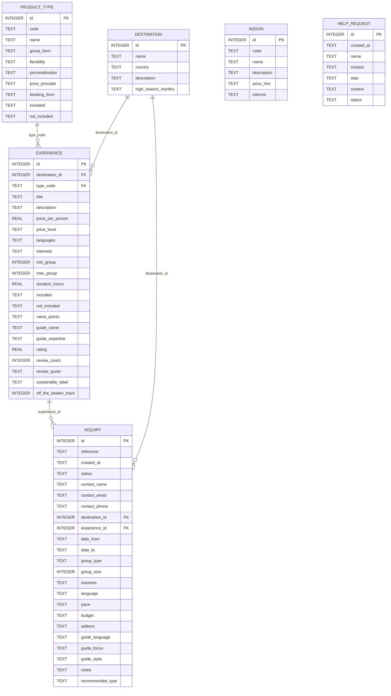
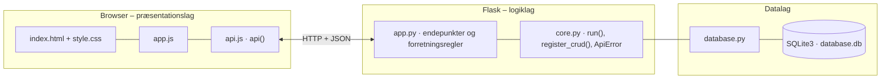

# Amitylux – dokumentation af prototypen

En **digital oplevelsesvælger og forespørgselsrejse**: kunden guides fra behovsafdækning til en begrundet anbefaling
og kan sende et struktureret oplæg til en Amitylux-medarbejder. Løsningen er digital selvbetjening med menneskelig overlevering,
ikke en fuldautomatisk rejseplanlægger. Brugerfladen er på engelsk (NF-02).

Kravgrundlag: [`Kravspecifikation.md`](Kravspecifikation.md)

## Hvad kan prototypen

| Skærm | Funktion |
|---|---|
| **1. Your trip** | Behovsafdækning: destination, datoer, gruppetype og -størrelse, sprog, tempo, budget og interesser |
| **2. Compare** | Sammenligning af public, private og customised |
| **3. Recommendation** | Primær anbefaling og op til to alternativer med begrundelser, kapacitetsadvarsel, alternativ væk fra turiststrømmen, kontekstuelle forslag og filtrering af alle oplevelser |
| **4. Summary & send** | Tilvalg, guideønsker, kontaktoplysninger, live-opsummering og kvittering |
| **Staff: inquiries** | Medarbejdervisning med forespørgsler, status og en standardiseret brief. Hjælpeanmodninger |
| *Talk to a person* | Knap i toppen på alle trin. Indtastede svar går ikke tabt |

## Fra krav til kode

| Krav | Implementering |
|---|---|
| F-01 Behovsafdækning, kan ændres | `#needs-form`. Fanerne skjuler kun indhold, så svarene bevares |
| F-02 Sammenligning af produkttyper | Tabellen `product_type` → `GET /api/product-types` |
| F-03 1 primær + højst 2 alternativer med begrundelse | `score_product_types()` giver point og en begrundelse for hvert svar. `POST /api/recommendations` |
| F-04 Filtrering med synlige og nulstillelige filtre | `GET /api/experiences/search` returnerer `active_filters` |
| F-05 Pris eller "price on request" + inkluderet/ikke inkluderet | `enrich_experience()` → `price_label`. Felterne `included` og `not_included` |
| F-06 Merværdi | `value_points` pr. oplevelse vises som mærker |
| F-07 Tilvalg (guide, museum, mad, transport, båd, aktivitet) | Tabellen `addon` → afkrydsning i trin 4 |
| F-08 Overlevering med kvittering | `POST /api/inquiries` → `receipt` + `brief` |
| F-09 Personlig hjælp på alle trin | `help_request` og dialogen *Talk to a person* |
| F-10 Tillid: anmeldelser og guidekompetence | `rating`, `review_quote`, `guide_name` og `guide_expertise` på produktkortet |
| F-11 Guidepræferencer som ønsker | `guide_language/focus/style`. Briefen markerer dem som "Wishes – not guaranteed" |
| F-12 Kort varsel og højsæson | `capacity_warning()` (under 14 dage eller måned i `high_season_months`) |
| F-13 Alternativ uden for turistområder | `off_the_beaten_track` + `sustainable_label` → `less_crowded_alternative` |
| F-14 Højst 3 kontekstuelle forslag | `contextual_suggestions` (tilvalg og anden destination), afkortet til 3 |
| F-15 Standardiseret brief | `build_brief()`: kunde, rejse, præferencer, ønsker, tilvalg, usikkerheder og næste handling |
| NF-01 Mobil (375 px) | Fælles responsivt stylesheet. Testet uden vandret scroll |
| NF-04 Transparens og kontrol | "Based on your answers" vises med knappen *Change answers* |
| NF-05 Samme struktur på tværs af destinationer | Én `experienceCard()` for København og Rom |
| NF-07 Kontaktdata først ved afsendelse | Kontaktfelter findes kun i trin 4 og vises i opsummeringen |

**Anbefalingslogik (eksempler fra `score_product_types()`)**

| Svar | Point |
|---|---|
| Budget *low* | public +3 |
| Budget *premium* | customised +3, private +2 |
| Par eller familie | private +2 |
| Over 8 personer | customised +2 |
| Fuld fleksibilitet | customised +2, private +1 |
| 3+ interesser eller 2+ tilvalg | customised +2 |
| Andet sprog end engelsk/dansk | private +1 |

## Datamodel



## Eksempel på dataudveksling

En familie på 5 med høj budgetramme og interesse for historie, mad og natur beder om en anbefaling til København:

```bash
curl -X POST http://localhost:5103/api/recommendations \
  -H 'Content-Type: application/json' \
  -d '{"destination_id": 1, "group_type": "family", "group_size": 5, "budget": "high", "pace": "relaxed", "language": "German", "interests": ["history", "food", "nature"], "addons": ["food"]}'
```

Svar `200`:

```json
{
  "based_on": {
    "destination_id": 1,
    "group_type": "family",
    "group_size": 5,
    "budget": "high",
    "pace": "relaxed",
    "language": "German",
    "interests": [
      "history",
      "food",
      "… (forkortet)"
    ],
    "addons": [
      "food"
    ]
  },
  "destination": {
    "id": 1,
    "name": "Copenhagen",
    "country": "Denmark",
    "description": "Harbour city of design, food and royal history.",
    "high_season_months": "6,7,8,12"
  },
  "primary": {
    "type_code": "private",
    "type_name": "Private tour",
    "score": 7,
    "reasons": [
      "Your budget allows a private guide just for your party.",
      "As a family, a private tour lets you set the pace and focus together.",
      "… (forkortet)"
    ],
    "experiences": [
      {
        "id": 3,
        "destination_id": 1,
        "type_code": "private",
        "title": "Private Royal Copenhagen",
        "description": "Your own guide through palaces and the crown jewels – at your pace.",
        "price_per_person": 160.0,
        "price_level": "high",
        "languages": [
          "English",
          "Danish",
          "… (forkortet)"
        ],
        "interests": [
          "history",
          "art",
          "… (forkortet)"
        ],
        "min_group": 1,
        "max_group": 8,
        "duration_hours": 4.0,
        "included": "Private guide; tickets for Rosenborg",
        "not_included": "Meals; transport",
        "…": "10 felter mere"
      },
      {
        "id": 4,
        "destination_id": 1,
        "type_code": "private",
        "title": "Private Harbour & Design by Bike",
        "description": "Cycle the new harbour districts and design icons.",
        "price_per_person": 120.0,
        "price_level": "medium",
        "languages": [
          "English",
          "Danish"
        ],
        "interests": [
          "architecture",
          "nature",
          "… (forkortet)"
        ],
        "min_group": 1,
        "max_group": 8,
        "duration_hours": 3.0,
        "included": "Private guide; bikes and helmets",
        "not_included": "Food",
        "…": "10 felter mere"
      }
    ]
  },
  "alternatives": [
    {
      "type_code": "customised",
      "type_name": "Customised experience",
      "score": 3,
      "reasons": [
        "Your budget leaves room for a few tailor-made elements.",
        "You combine 3 interests (history, food, nature) – best put together by a planner."
      ],
      "experiences": [
        {
          "id": 5,
          "destination_id": 1,
          "type_code": "customised",
          "title": "Tailor-made Copenhagen Day",
          "description": "A day designed around your party: culture, food, boats and more.",
          "price_per_person": null,
          "price_level": "premium",
          "languages": [
            "English",
            "Danish",
            "… (forkortet)"
          ],
          "interests": [
            "history",
            "art",
            "… (forkortet)"
          ],
          "min_group": 1,
          "max_group": 40,
          "duration_hours": 8.0,
          "included": "Planner; matched guide; combined services",
          "not_included": "Flights and hotels",
          "…": "10 felter mere"
        }
      ]
    },
    {
      "type_code": "public",
      "type_name": "Public small-group tour",
      "score": 0,
      "reasons": [],
      "experiences": [
        {
          "id": 2,
          "destination_id": 1,
          "type_code": "public",
          "title": "Nordic Food Walk",
          "description": "Tastings at five local producers in Vesterbro.",
          "price_per_person": 89.0,
          "price_level": "medium",
          "languages": [
            "English"
          ],
          "interests": [
            "food"
          ],
          "min_group": 1,
          "max_group": 10,
          "duration_hours": 3.0,
          "included": "Guide; 5 tastings",
          "not_included": "Extra drinks",
          "…": "10 felter mere"
        },
        {
          "id": 1,
          "destination_id": 1,
          "type_code": "public",
          "title": "Copenhagen Old Town Walk",
          "description": "The classic walk through Nyhavn, Amalienborg and the medieval centre.",
          "price_per_person": 45.0,
          "price_level": "low",
          "languages": [
            "English",
            "Danish"
          ],
          "interests": [
            "history",
            "architecture"
          ],
          "min_group": 1,
          "max_group": 12,
          "duration_hours": 2.5,
          "included": "Guide; route map",
          "not_included": "Entrance fees; drinks",
          "…": "10 felter mere"
        }
      ]
    }
  ],
  "capacity_warning": null,
  "less_crowded_alternative": {
    "id": 2,
    "destination_id": 1,
    "type_code": "public",
    "title": "Nordic Food Walk",
    "description": "Tastings at five local producers in Vesterbro.",
    "price_per_person": 89.0,
    "price_level": "medium",
    "languages": [
      "English"
    ],
    "interests": [
      "food"
    ],
    "min_group": 1,
    "max_group": 10,
    "duration_hours": 3.0,
    "included": "Guide; 5 tastings",
    "not_included": "Extra drinks",
    "…": "11 felter mere"
  },
  "contextual_suggestions": [
    {
      "kind": "addon",
      "id": 4,
      "code": "transport",
      "name": "Private transport",
      "description": "Car or minivan with driver",
      "price_hint": "From €180 per half day",
      "interest": null
    },
    {
      "kind": "addon",
      "id": 5,
      "code": "boat",
      "name": "Boat or harbour trip",
      "description": "Private boat on the harbour / river",
      "price_hint": "From €300 per boat",
      "interest": "nature"
    },
    "… (forkortet)"
  ]
}
```

## Kør prototypen

```bash
cd backend
python3 -m venv .venv && source .venv/bin/activate   # første gang
pip install -r requirements.txt                       # første gang
python app.py
```

Terminalen skriver ` * Åbn http://localhost:5103`. Åbn adressen i browseren. Flask serverer både API'et (`/api/...`) og frontenden.

- **Port:** Prototypen bruger port **5103** (5100 + projektnummer). Er porten optaget, vælger `run()` i `core.py` selv den næste ledige og skriver fx ` * Port 5103 er optaget – bruger port 5104 i stedet`. Du kan også vælge port selv med `PORT=5200 python app.py`.
- **Stop serveren** med `Ctrl` + `C` i terminalen, hvor den kører.
- **Kodeændringer:** Serveren kører i debug-tilstand og genstarter selv, når du gemmer en `.py`-fil. Den bliver på samme port. Ændringer i `frontend/` kræver kun, at du genindlæser siden.
- **Database:** `backend/database.db` oprettes med testdata ved første start. Nulstil den med `python database.py --reset`, mens serveren er stoppet.
- **Tjek at backenden svarer:** `curl http://localhost:5103/api/health`

### Fejlfinding

| Problem | Årsag | Løsning |
|---|---|---|
| ` * Port 5103 er optaget – bruger port …` | En anden proces, ofte en glemt server, bruger porten | Brug den adresse, der står i terminalen. Se hvad der optager porten med `lsof -nP -iTCP:5103 -sTCP:LISTEN`. En Flask-server i debug-tilstand er to processer, så stop dem begge med `lsof -t -iTCP:5103 -sTCP:LISTEN \| xargs kill` |
| `ModuleNotFoundError: No module named 'flask'` | Det virtuelle miljø er ikke aktiveret, eller Flask er ikke installeret | `source .venv/bin/activate` og `pip install -r requirements.txt` |
| Siden viser "Kan ikke hente data fra backenden" | Serveren kører ikke, eller `index.html` er åbnet direkte fra disken, mens serveren kører på en anden port | Start serveren og åbn adressen fra terminalen i stedet for filen |
| Tallene passer ikke efter mange tests | Databasen indeholder testdata fra tidligere afprøvninger | Stop serveren og kør `python database.py --reset` |
| `no such table …` | `database.db` er tom eller ødelagt | `python database.py --reset` |

## Arkitektur

Prototypen følger holdets fælles tre-lags struktur (se [`../README.md`](../README.md)):



| Fil | Lag | Indhold |
|---|---|---|
| `frontend/index.html` | Præsentation | Skærmbilleder som faneblade og formularer. Projektets farver og `data-api-port` |
| `frontend/app.js` | Præsentation | Henter data med `api()`, tegner dem i DOM'en og sender formularer |
| `frontend/api.js` | Præsentation | Fælles for alle prototyper: `api()` (fetch + JSON), `h()`, `renderTable()`, `fillSelect()`, `formToJson()`, `bindCrudForm()` og `toast()` |
| `frontend/style.css` | Præsentation | Fælles responsivt design |
| `backend/app.py` | Logik | Projektets forretningsregler og endepunkter |
| `backend/core.py` | Logik | Fælles: `create_app()` (Flask, CORS, JSON-fejl), `run()` (start på ledig port), `ApiError` og `register_crud()` |
| `backend/database.py` | Data | Fælles: forbindelse, `query_all/query_one/execute`, `transaction()` og `init_db()` |
| `backend/schema.sql` · `seed.sql` | Data | Tabeller og fiktive testdata |

Alle fejl returneres som JSON (`{"error": "…", "path": "/api/…"}`) med statuskode 400, 401, 403, 404 eller 409 og vises som en rød besked i frontenden.
Nederst på siden kan man åbne **"Seneste JSON-svar fra API'et"** og se den rå dataudveksling.
Den fulde endepunktsliste står i [`backend/README.md`](backend/README.md).

## Design og responsivitet

- Samme stylesheet i alle prototyper. Kun farverne (`--brand`, `--brand-dark`, `--brand-soft`) sættes i `index.html`.
- Layoutet virker fra mobil (375 px) til desktop uden vandret scroll. Kort lægger sig under hinanden på små skærme, og brede tabeller scroller inde i deres kort.
- Formularfelter kan ikke blive bredere end deres kort. En `<select>` med lange valgmuligheder skubber altså ikke formularen ud over kanten.
- Beskeder vises kort i toppen (grøn = gennemført, rød = fejl fra serveren).


## Testdata

2 destinationer (København og Rom), 10 oplevelser fordelt på de tre typer, 6 tilvalg og 2 forespørgsler.

## Afgrænsning

Ingen betaling, bindende booking, kapacitetsintegration eller AI-genereret rejseplan (jf. afsnit 8).
Anbefalingen er regelbaseret, så den altid kan forklares.
