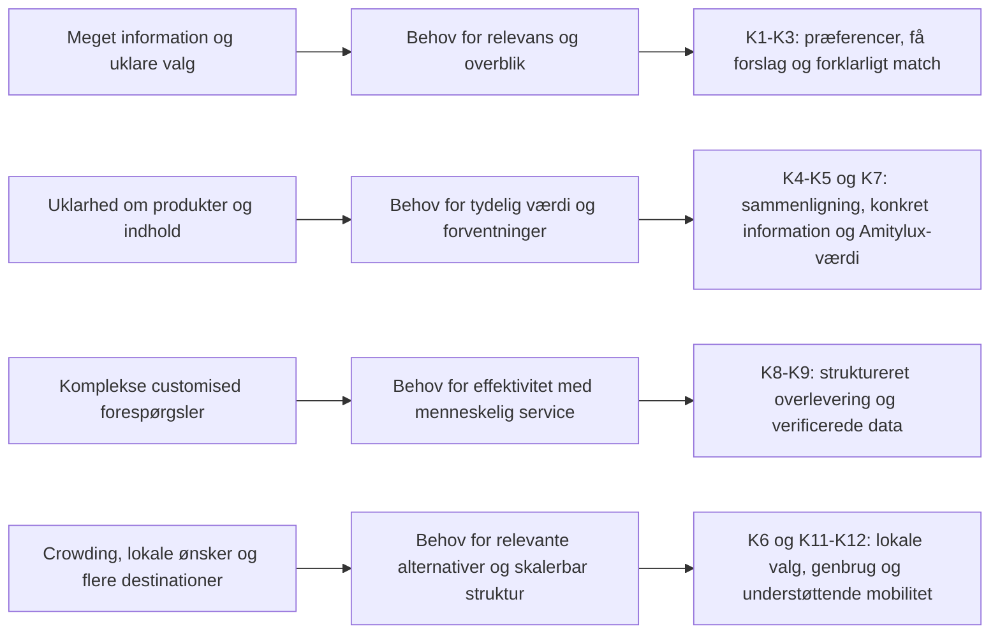

# Kravspecifikation for Amitylux' AI-baserede oplevelseskompas

## Formål og afgrænsning

Kravspecifikationen omsætter projektets dokumenterede problemfelt, virksomhedsinterview, virksomhedsdata og bedømmelseskriterier til krav for en prototype af et AI-baseret oplevelseskompas. Løsningen skal hjælpe rejsende med at finde relevante oplevelser uden at udvikle sig til en generisk rejseplatform eller erstatte Amitylux' personlige service.

Den tilgængelige [akademiske rapport](../analyser/Akademisk%20rapport.md) indeholder på nuværende tidspunkt kun en titel og giver derfor ikke et selvstændigt analysegrundlag. Sporbarheden nedenfor bygger på de øvrige tilgængelige projektkilder. Kravene bør genbesøges, når rapporten er udfyldt.

### Dokumenteret problem og målgruppe

- Projektets problemfelt er, at rejsende møder store mængder information, men kan have svært ved at finde oplevelser, der passer til deres interesser og behov.
- Den dokumenterede B2C-målgruppe består især af internationale par, familier, vennegrupper og mindre private grupper, som søger personlige og fleksible oplevelser. Der er ikke tilstrækkeligt grundlag for at fastlægge en bestemt aldersgruppe.
- Amitylux vil differentiere sig gennem små grupper, lokal viden, fleksibilitet, personlig service og customised oplevelser – ikke laveste pris eller størst volumen.
- Private og customised forespørgsler kan være værdifulde, men kræver mere kommunikation og koordinering end public tours.

Prioriteringen anvender **Skal**, **Bør** og **Kan**. “Skal” er nødvendigt for at demonstrere løsningens kerneværdi i prototypen; “Bør” er vigtigt, men kan simuleres eller afgrænses; “Kan” er relevant videreudvikling.

## Samlet kravtabel

| Krav-ID | Krav | Kravtype | Begrundelse: indsigt → krav | Analyse, empiri eller indsigt | Prioritet | Test eller vurdering i prototype |
|---|---|---|---|---|---|---|
| **K1** | Løsningen skal indsamle de præferencer, der er nødvendige for at skabe relevante forslag: destination, rejsegruppe, interesser, ønsket tempo/fleksibilitet, sprog og relevante praktiske hensyn. Brugeren skal kunne gennemse og ændre svarene. | Funktionelt krav | Rejsende mangler hjælp til at sortere store informationsmængder, og Amitylux' kunder søger personlige og fleksible oplevelser. Derfor skal løsningen tage udgangspunkt i brugerens kontekst frem for generel popularitet. | [Amitylux.md](../Amitylux.md), afsnittene *Problemfelt*, *Løsningsretning* og *Målgruppe*; [interview](../data/Amitylux%20interview%20.pdf), afsnit 1, 3 og 6; [virksomhedsdata](../data/Data%20Amitylux%28Ark1%29.csv), kundesegmenter, kundehenvendelser og challenges. | **Skal** | En testbruger gennemfører præferenceforløbet, går tilbage og ændrer mindst ét svar og kan efterfølgende genkende sine valg i opsummeringen. Amitylux vurderer, om felterne er nødvendige og tilstrækkelige. |
| **K2** | Løsningen skal omsætte brugerens præferencer til et lille, overskueligt udvalg af personlige oplevelsesforslag. I prototypen vises højst tre forslag ad gangen. | Funktionelt krav | Projektets centrale problem er ikke mangel på information, men vanskeligheden ved at finde det relevante. Få forslag reducerer informationsbelastningen og gør løsningens personalisering synlig. | [Amitylux.md](../Amitylux.md), *Problemfelt* og *Løsningsretning*; [interview](../data/Amitylux%20interview%20.pdf), afsnit 3 og 10; [bedømmelseskriterier](bed%C3%B8mmelseskriterier-id%C3%A9konkurrencen-for-produkt-og-service_dansk_festival-2024%20%281%29.pdf), idé og værdiskabelse. | **Skal** | Testbrugeren modtager 1–3 forskellige forslag og kan udpege, hvilket der passer bedst. Der observeres, om antallet giver overblik eller opleves som for begrænset. |
| **K3** | Hvert forslag skal forklare, hvorfor det matcher mindst to af brugerens valgte præferencer. Brugeren skal kunne justere præferencerne og se, at forslag eller begrundelser ændres. | Funktionelt og brugervenlighedskrav | Personalisering skaber kun værdi, hvis brugeren kan forstå og kontrollere den. Interviewet understreger, at teknologi skal gøre noget reelt lettere uden at fjerne personlig service. | [Amitylux.md](../Amitylux.md), *Løsningsretning*; [interview](../data/Amitylux%20interview%20.pdf), afsnit 3 og 10; [bedømmelseskriterier](bed%C3%B8mmelseskriterier-id%C3%A9konkurrencen-for-produkt-og-service_dansk_festival-2024%20%281%29.pdf), idé, målgruppe og værdiskabelse. | **Skal** | Brugeren forklarer med egne ord, hvorfor et forslag er vist, ændrer én præference og vurderer, om det nye resultat virker logisk. Uforklarlige eller uændrede resultater registreres som fejl. |
| **K4** | Løsningen skal tydeligt skelne mellem public small-group, private og customised oplevelser og vise forskelle i gruppetype, fleksibilitet, personalisering, bookingform samt pris eller prisprincip. | Funktionelt og forretningsmæssigt krav | Kunder forventer undertiden mere fleksibilitet fra standard public tours og kan misforstå, hvad der er inkluderet. Samtidig ønsker Amitylux at udvikle private og customised forløb, som kan have højere værdi pr. booking. | [Interview](../data/Amitylux%20interview%20.pdf), afsnit 3 og 6; [virksomhedsdata](../data/Data%20Amitylux%28Ark1%29.csv), bookingtype samt *Klager/challenges*; private/customised værdi er en virksomhedsvurdering med middel datastyrke. | **Skal** | Efter at have set prototypen beskriver testbrugeren korrekt forskellen mellem de tre produkttyper og vælger en type med en forståelig begrundelse. Amitylux kontrollerer, at beskrivelser og prisprincipper er realistiske. |
| **K5** | Hvert oplevelsesforslag skal mindst vise navn, kort beskrivelse, destination/lokation, oplevelsestype, forventet varighed, gruppetype, relevante transportformer, inkluderet/ikke inkluderet og pris eller prisprincip. | Datakrav og brugervenlighedskrav | Misforståelser om indhold er en dokumenteret udfordring, og digitale kanaler gør det let at sammenligne alternativer. Forslag skal derfor være konkrete og sammenlignelige frem for blot inspirerende. | [Virksomhedsdata](../data/Data%20Amitylux%28Ark1%29.csv), *Klager/challenges*, services og efterspurgte oplevelser; [interview](../data/Amitylux%20interview%20.pdf), afsnit 3, 5 og 9; [Amitylux.md](../Amitylux.md), *Problemfelt*. | **Skal** | Testbrugeren finder uden hjælp information om indhold, varighed, gruppeform og prisprincip og kan sammenligne to forslag. Manglende eller uklare felter noteres. |
| **K6** | Løsningen bør kunne vise mindst ét relevant alternativ med lokalt præg eller uden for de mest belastede turistområder, når brugerens interesser og Amitylux' faktiske tilbud gør det relevant. Alternativet skal begrundes som et oplevelsesvalg – ikke som en udokumenteret miljøgevinst. | Funktionelt krav og bæredygtighedskrav | Crowded attractions er en dokumenteret udfordring, og kunder efterspørger også mere personlige og lokale oplevelser. Samtidig foregår et estimeret 85–90 % af standard sightseeing i eller omkring centrum. Efterspørgslen efter alternative områder er dog mindre hyppig, så funktionen skal være relevant og valgfri. | [Interview](../data/Amitylux%20interview%20.pdf), afsnit 5 og 6; [virksomhedsdata](../data/Data%20Amitylux%28Ark1%29.csv), *Efterspurgte oplevelser*, *Klager/challenges*, *Geografi* og *Alternative områder*. Geografital har lav–middel datastyrke. | **Bør** | En bruger med interesse for lokalkultur får et relevant alternativ og kan forklare forskellen fra et klassisk forslag. Amitylux vurderer leverbarheden. Brugeren må ikke få indtryk af, at en miljøeffekt er dokumenteret, hvis den ikke er det. |
| **K7** | Løsningen skal synliggøre Amitylux' dokumenterede merværdi tæt på beslutningen: lokal guideviden, små grupper, personlig opmærksomhed, fleksibilitet, organisation/kommunikation og relevante anmeldelser eller anden social proof. | Forretnings- og indholdskrav | Amitylux vil differentiere sig fra generelle platforme og konkurrerer ikke på laveste pris. Anmeldelser og anbefalinger er vigtige, fordi en oplevelse er vanskelig at vurdere på forhånd. | [Amitylux.md](../Amitylux.md), *Problemfelt*; [interview](../data/Amitylux%20interview%20.pdf), afsnit 1, 4, 5 og 9; [virksomhedsdata](../data/Data%20Amitylux%28Ark1%29.csv), *Kundetilfredshed*; [bedømmelseskriterier](bed%C3%B8mmelseskriterier-id%C3%A9konkurrencen-for-produkt-og-service_dansk_festival-2024%20%281%29.pdf), idé og værdiskabelse. | **Skal** | Efter resultatvisningen kan testbrugeren nævne mindst to konkrete grunde til at vælge Amitylux frem for en generel oplevelsesliste. Amitylux verificerer, at alle værdipåstande kan dokumenteres. |
| **K8** | Ved private eller customised ønsker skal løsningen samle præferencer, valgte elementer, usikkerheder og kontaktoplysninger i en struktureret forespørgsel og tydeligt overlevere den til en medarbejder. Personlig hjælp skal være tilgængelig uden tab af indtastede oplysninger. | Funktionelt og forretningsmæssigt krav | Customised forløb involverer ofte sprog, museer, biler, både, restauranter og flere leverandører og kræver derfor megen kommunikation. Amitylux ønsker effektivitet uden at fjerne personlig service. | [Interview](../data/Amitylux%20interview%20.pdf), afsnit 3, 6, 8, 10 og 11; [virksomhedsdata](../data/Data%20Amitylux%28Ark1%29.csv), kundehenvendelser og svære forespørgsler. | **Skal** | Testbrugeren gennemfører en customised forespørgsel og ser præcis, hvad der sendes, samt næste trin. En Amitylux-medarbejder vurderer, om briefen kan behandles uden at gentage de grundlæggende spørgsmål. |
| **K9** | Alle anbefalinger skal bygge på et godkendt Amitylux-katalog. Prototypen må ikke præsentere AI-genererede priser, åbningstider, kapacitet, guidebekræftelser eller specialadgang som fakta. Usikre forhold skal markeres som “kræver bekræftelse”. | Datakrav og kvalitetskrav | Peakperioder og korte varsler påvirker tilgængeligheden af guider, transport, restauranter, både og billetter. AI skaber ikke værdi, hvis den giver urealistiske løfter eller øger medarbejdernes afklaringsarbejde. | [Interview](../data/Amitylux%20interview%20.pdf), afsnit 8 og 10; [virksomhedsdata](../data/Data%20Amitylux%28Ark1%29.csv), sæson og svære forespørgsler; [bedømmelseskriterier](bed%C3%B8mmelseskriterier-id%C3%A9konkurrencen-for-produkt-og-service_dansk_festival-2024%20%281%29.pdf), realiserbarhed. | **Skal** | Gennemgå alle prototypeforslag med Amitylux. Hver faktuel påstand skal kunne spores til eksempeldata eller tydeligt være markeret som ubekræftet. Testbrugere spørges, hvad de opfatter som endeligt bekræftet. |
| **K10** | Brugerrejsen skal være kort, mobilvenlig og visuelt konsistent. Kerneflowet fra start til relevante forslag skal kunne gennemføres uden instruktion, og brugeren skal hele tiden kunne se fremdrift, aktive valg og mulighed for at gå tilbage. | Brugervenligheds- og ikke-funktionelt krav | Løsningen skal reducere kompleksitet og skabe overblik. Bedømmelseskriterierne vægter en tydelig idé, målgruppefit og en prototype, der kan understøtte et kort pitch. | [Amitylux.md](../Amitylux.md), *Problemfelt* og *Design Thinking*; [interview](../data/Amitylux%20interview%20.pdf), afsnit 3 og 10; [bedømmelseskriterier](bed%C3%B8mmelseskriterier-id%C3%A9konkurrencen-for-produkt-og-service_dansk_festival-2024%20%281%29.pdf), målgruppe, pitch og realiserbarhed. | **Skal** | Gennemfør en opgavetest på mobilbredde og desktop. Registrér om brugeren når et forslag uden hjælp, hvor vedkommende går i stå, og om tilbage-navigation bevarer svar. Brugeren forklarer flowets formål efter testen. |
| **K11** | Løsningens indholdsstruktur og centrale komponenter bør kunne genbruges på tværs af mindst to Amitylux-destinationer, mens lokale oplevelser, guider og praktiske forhold fortsat kan variere. | Forretnings- og kvalitetskrav | Amitylux opererer i flere byer og ønsker at styrke eksisterende destinationer, men peger samtidig på konsistent kvalitet og lokal viden som udfordringer ved vækst. | [Interview](../data/Amitylux%20interview%20.pdf), afsnit 2, 4, 9 og 11; [virksomhedsdata](../data/Data%20Amitylux%28Ark1%29.csv), kundemarked og kvalitetsudfordringer; [bedømmelseskriterier](bed%C3%B8mmelseskriterier-id%C3%A9konkurrencen-for-produkt-og-service_dansk_festival-2024%20%281%29.pdf), realiserbarhed og værdiskabelse. | **Bør** | Vis samme flow og datamodel med eksempelindhold fra København og én anden eksisterende destination. Vurdér om strukturen kan genbruges uden at gøre det lokale indhold generisk. |
| **K12** | Løsningen kan vise gang, cykel, offentlig transport eller andre relevante mobilitetsvalg og forklare dem neutralt, når oplysningerne er verificerede og passer til oplevelsen. Klima- og miljøhensyn må ikke overskygge relevans, tryghed og oplevelsesværdi. | Bæredygtigheds- og datakrav | Projektmaterialet nævner ansvarlige transportmuligheder og pres fra turismens klimaaftryk, men den valgte problemstilling er primært relevans og personalisering. Hensynet bør derfor være understøttende. | [Virksomhedsdata](../data/Data%20Amitylux%28Ark1%29.csv), transportbehov, crowding og geografi; [interview](../data/Amitylux%20interview%20.pdf), afsnit 5, 6 og 8; [bedømmelseskriterier](bed%C3%B8mmelseskriterier-id%C3%A9konkurrencen-for-produkt-og-service_dansk_festival-2024%20%281%29.pdf), bæredygtighed. | **Kan** | Vis mobilitetsmærkning på mindst ét relevant forslag. Test om brugeren forstår mærkningen, om den påvirker valget, og om formuleringen undgår udokumenterede klima- eller miljøpåstande. |

## Rød tråd fra empiri til krav

## Centrale krav for idéudvikling og prototype

De mest centrale krav er:

1. **K1 – relevant præferencegrundlag:** Uden relevante brugerinput kan løsningen ikke skabe reel personalisering.
2. **K2 og K3 – få, forklarlige forslag med brugerens kontrol:** Dette er oplevelseskompassets kerneværdi og den vigtigste forskel fra en almindelig inspirationsliste.
3. **K4 – tydelig produktforståelse:** Kunden skal kunne skelne mellem public, private og customised og forstå merværdien.
4. **K8 – struktureret menneskelig overlevering:** Løsningen skal reducere kompleksitet uden at fjerne den personlige service, som Amitylux differentierer sig på.
5. **K9 – verificerede og realistiske anbefalinger:** En troværdig prototype skal tydeligt adskille anbefaling fra faktisk bekræftet pris, kapacitet og adgang.

Disse fem områder bør udgøre prototypefasens minimum. K6, K11 og K12 er relevante udvidelser, men bør ikke gøre det første testflow unødigt komplekst.
