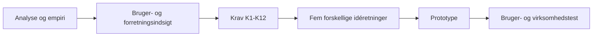

# Prototype- og løsningsidéer for Amitylux

## Ideate-fasens udgangspunkt

Idéerne er udviklet ud fra [kravspecifikationen](Kriterier/kravspecifikation.md), [Amitylux.md](Amitylux.md), [virksomhedsinterviewet](data/Amitylux%20interview%20.pdf), [virksomhedsdata](data/Data%20Amitylux%28Ark1%29.csv) og [bedømmelseskriterierne](Kriterier/bed%C3%B8mmelseskriterier-id%C3%A9konkurrencen-for-produkt-og-service_dansk_festival-2024%20%281%29.pdf). Den [akademiske rapport](analyser/Akademisk%20rapport.md) indeholder aktuelt kun en titel og giver derfor ikke yderligere evidens.

Den røde tråd er:

Idéerne er bevidst forskellige. Kun den første er et egentligt AI-kompas. De øvrige undersøger menneskelig rådgivning, guidekvalitet, nye lokale oplevelser og B2B-samarbejde. Ingen idé vælges automatisk som vinder.

---

## Idé 1: Amitylux Experience Compass

### 1. Navn på idéen

**Amitylux Experience Compass – få, forklarlige oplevelsesvalg**

### 2. Kort beskrivelse

Et AI-understøttet værktøj, der omsætter brugerens rejsegruppe, interesser, tempo, sprog og praktiske hensyn til højst tre begrundede oplevelsesforslag. Forslagene bygger på et godkendt Amitylux-katalog og kan justeres af brugeren.

### 3. Brugerproblem

Rejsende møder store informationsmængder og kan have svært ved at finde det relevante. De kan samtidig være usikre på forskellen mellem public small-group, private og customised oplevelser. Konceptet reducerer valgbelastning og gør personalisering og produktforskelle forståelige.

**Rød tråd:** informationsmængde og uklare produkter → behov for relevans og overblik → K1–K5 og K9 → forklarligt AI-kompas.

### 4. Krav fra kravspecifikationen

- **Direkte:** K1, K2, K3, K4, K5, K7, K9 og K10.
- **Som udvidelse:** K6, K8, K11 og K12.

### 5. Værdi for brugeren

- Hurtigere vej fra inspiration til et overskueligt valg.
- Forklaring på, hvorfor hvert forslag passer.
- Mulighed for at ændre præferencer og bevare kontrollen.
- Tydelig pris/prisprincip, indhold og fleksibilitet.
- Adgang til personlig hjælp ved komplekse ønsker.

### 6. Værdi for Amitylux

- Synliggør lokal ekspertise, små grupper og personlig service.
- Kan skabe mere kvalificerede direkte henvendelser.
- Gør private/customised merværdi mere konkret.
- Kan reducere indledende afklaringsspørgsmål.
- Skaber en genbrugelig struktur på tværs af destinationer.

Forretningseffekterne er hypoteser, som skal måles.

### 7. Centrale funktioner

- Kort præferenceflow.
- Højst tre forslag, eksempelvis **Classic**, **Balanced** og **Local**.
- “Derfor passer det til jer” koblet til mindst to brugerinput.
- Sammenligning af public, private og customised.
- Oplevelseskort med K5-oplysninger.
- Justering af præferencer og opdaterede resultater.
- “Kræver bekræftelse” ved kapacitet, priser eller specialadgang.
- Struktureret overlevering til medarbejder.

### 8. Fordele

- Dækker flest kernekrav i ét flow.
- Let at demonstrere: præferencer ind, tre forklarlige valg ud.
- Kan testes regelbaseret uden fungerende AI.
- AI har en tydelig funktion: sortering, match og forklaring.

### 9. Begrænsninger og udfordringer

- Kan ligne andre anbefalingsløsninger, hvis Amitylux' indhold og service ikke er tydelig.
- Kræver korrekte, strukturerede produktdata.
- AI kan skabe falske forventninger.
- Et langt præferenceflow kan modarbejde K10.

### 10. Prototype

En klikbar mobilprototype med syv skærme: start, præferencer, opsummering, tre resultater, sammenligning, justering og medarbejderbrief. København bruges som eksempel. AI, betaling og live-kapacitet simuleres.

### 11. Test

- Kan brugeren gennemføre flowet uden instruktion og ændre et svar?
- Kan brugeren forklare matchet og forskellen mellem produkttyperne?
- Opleves tre forslag som relevante og overskuelige?
- Kan Amitylux verificere oplysningerne og arbejde videre fra briefen?
- Skelner brugeren mellem anbefaling og bekræftet tilgængelighed?

---

## Idé 2: Amitylux Travel Atelier

### 1. Navn på idéen

**Amitylux Travel Atelier – personlig co-design af oplevelsen**

### 2. Kort beskrivelse

En hybrid service, hvor kunden først udfylder et kort visuelt behovskort og derefter gennemfører en fokuseret video- eller hotelsamtale med en Amitylux travel designer. Samtalen afsluttes med et visuelt oplevelsesoplæg og næste trin.

### 3. Brugerproblem

Komplekse private/customised ønsker er vanskelige at beskrive i en kontaktformular. Kunden kan være usikker på muligheder, prisprincip og realiserbarhed, mens Amitylux bruger tid på gentagne mails. Travel Atelier strukturerer den personlige dialog uden at automatisere den væk.

**Rød tråd:** komplekse forespørgsler og ønske om personlig service → behov for effektiv menneskelig afklaring → K1, K4, K5, K7–K10 → co-design-service.

### 4. Krav fra kravspecifikationen

- **Direkte:** K1, K4, K5, K7, K8, K9 og K10.
- **Som inspiration:** K6, K11 og K12.
- **Delvist:** K2 og K3, fordi forslag skabes med en medarbejder.

### 5. Værdi for brugeren

- Personlig rådgivning og tryghed ved komplekse valg.
- Kunden behøver ikke kende hele udbuddet på forhånd.
- Realistiske forventninger om pris, kapacitet og næste trin.
- Visuelt oplæg, som gruppen kan forstå og diskutere.

### 6. Værdi for Amitylux

- Samler nødvendige oplysninger før samtalen.
- Gør medarbejdernes ekspertise til synlig premiumværdi.
- Kan reducere ukoordinerede mailrunder.
- Muliggør afprøvning af en betalt rådgivningsservice. Betalingsmodellen er en antagelse.

### 7. Centrale funktioner

- Behovskort med gruppe, interesser, tempo, sprog og hensyn.
- Valg af digital samtale eller samtale gennem hotel/concierge.
- Medarbejdervisning med struktureret kundeprofil.
- “Experience canvas” med 1–3 retninger, prisprincip og forbehold.
- Markering af bekræftet og ubekræftet indhold.
- Delbar opsummering og næste handling.

### 8. Fordele

- Bevarer Amitylux' personlige service.
- Mere original end en almindelig booking- eller anbefalingsside.
- Kan afprøves næsten uden teknisk udvikling.
- Passer til private, customised og VIP-forløb.

### 9. Begrænsninger og udfordringer

- Medarbejdertung og mindre skalerbar.
- Betalingsvillighed er ikke dokumenteret.
- Kvaliteten afhænger af medarbejderkompetencer og en ensartet proces.
- Tidszoner, svartid og kapacitet kan skabe friktion.

### 10. Prototype

En serviceprototype med fem touchpoints: landingsside, behovskort, tidsbestilling, simuleret samtale og digitalt experience canvas. En studerende spiller travel designer ud fra et fast manuskript.

### 11. Test

- Giver behovskortet medarbejderen tilstrækkelig forberedelse?
- Opleves samtalen som premiumværdi?
- Forstår kunden prisprincip, forbehold og næste trin?
- Reduceres antallet af afklaringsspørgsmål?
- Vil kunden reservere tid og eventuelt betale for servicen?

---

## Idé 3: Amitylux GuideMatch & Guest Card

### 1. Navn på idéen

**Amitylux GuideMatch & Guest Card – bedre match mellem gæst og guide**

### 2. Kort beskrivelse

En service, hvor private/customised kunder angiver ønsket sprog, tempo, fagligt fokus og kommunikationsstil. Amitylux matcher manuelt eller regelbaseret med en passende guide, som modtager et kort Guest Card før oplevelsen.

### 3. Brugerproblem

Virksomhedsdata viser, at guidekommunikation, guiding style og tempo ikke altid matcher forventningerne. Interviewet understreger, at en guide både skal have viden, læse gæsterne og tilpasse oplevelsen. Problemet handler derfor om den menneskelige leverance – ikke kun aktiviteten.

**Rød tråd:** varierende guideoplevelse → behov for forventningsafstemning → K1, K3, K7–K9 og K11 → GuideMatch og Guest Card.

### 4. Krav fra kravspecifikationen

- **Direkte:** K1, K3, K7, K8, K9 og K11.
- **Understøttende:** K4, K5 og K10.
- **Når relevant:** K6 og K12.

### 5. Værdi for brugeren

- Større tryghed om sprog, tempo og oplevelsesstil.
- Bedre chance for et passende guidematch.
- Mulighed for at formulere nødvendige hensyn.
- Personlig service uden at designe hele turen selv.

### 6. Værdi for Amitylux

- Styrker ensartet kvalitet på tværs af guider og destinationer.
- Giver guider bedre forberedelse.
- Kan reducere mismatch og styrke anmeldelser; effekten skal valideres.
- Gør guidekompetencer til en tydelig differentieringsfaktor.

### 7. Centrale funktioner

- Spørgsmål om sprog, tempo, fagligt fokus, gruppetype og stil.
- Guideprofiler med verificerede kompetencer og selvvalgte arbejdsstile.
- Forklaret match med kapacitetsforbehold.
- Guest Card med relevante præferencer og hensyn.
- Medarbejdergodkendelse af faktisk guide.
- Kort efter-tur feedback.

### 8. Fordele

- Løser en konkret udfordring fra virksomhedsdata.
- Differentierer gennem menneskelig service frem for en generisk algoritme.
- Kan prototypes uden AI og rigtige guideprofiler.
- Skaber social værdi gennem kommunikation og hensyn.

### 9. Begrænsninger og udfordringer

- Ønsket om aktivt stilvalg er ikke dokumenteret.
- Match kan ikke garanteres ved kort varsel eller sjældne sprog.
- Risiko for popularitetsbias eller urimelig rangering af guider.
- Kræver co-design, samtykke og fairnessprincipper.

### 10. Prototype

En klikbar prototype med fire fiktive guidearketyper, fem præferencespørgsmål, et forklaret match, et Guest Card og feedback. En guidevisning viser, hvilke oplysninger guiden modtager.

### 11. Test

- Forstår kunderne stil-dimensionerne?
- Skaber forklaringen tryghed uden at love en bestemt guide?
- Oplever guider Guest Card som støtte eller kontrol?
- Indeholder kortet passende information?
- Kan strukturen genbruges i to destinationer?

---

## Idé 4: Amitylux Local Editions

### 1. Navn på idéen

**Amitylux Local Editions – kuraterede alternativer med lokalt præg**

### 2. Kort beskrivelse

En serie små, sæson- eller tidsbestemte oplevelser, der kombinerer en lokal guide med mad, kultur, håndværk eller en bydel uden for den mest traditionelle sightseeing-rute. Hver edition er et konkret produkt – ikke kun en digital anbefaling.

### 3. Brugerproblem

Kunder efterspørger personlige og lokale oplevelser, mens crowded attractions er en udfordring. Standardture er samtidig lette at sammenligne og kopiere. Local Editions giver et håndgribeligt alternativ uden at antage, at alle vil undgå centrum.

**Rød tråd:** lokal interesse og crowding → behov for særegne, leverbare alternativer → K5–K7, K9, K11 og K12 → Local Editions.

### 4. Krav fra kravspecifikationen

- **Direkte:** K5, K6, K7, K9 og K11.
- **Understøttende:** K1–K4, K10 og K12.
- **Ved customised forespørgsler:** K8.

### 5. Værdi for brugeren

- Lokal ekspertise og kulturel fordybelse.
- Små grupper og tydeligt kurateret format.
- Lokalt indhold uden nødvendigvis at fravælge alle højdepunkter.
- Klar information om indhold, varighed, transport og forbehold.

### 6. Værdi for Amitylux

- Nye og mere særprægede produkter.
- Mulighed for direkte omsætning og revenue share med lokale aktører.
- Styrker brandet omkring autenticitet og lokal viden.
- Kan fordele noget aktivitet over sted eller tid; effekten skal måles.

### 7. Centrale funktioner og touchpoints

- Editions som **Neighbourhood Stories**, **Local Table** eller **City Before Breakfast**.
- Produktside med vært/guide, fortælling, gruppeform, varighed og prisprincip.
- Sammenligning med et klassisk produkt.
- Kapacitets-, sæson- og vejrbetingelser.
- Fysisk velkomst- eller story card.
- Feedback fra gæst, guide og lokal partner.

### 8. Fordele

- Innovationen ligger i oplevelsen, ikke kun brugerfladen.
- Tydelig kulturel, social og potentiel lokal økonomisk værdi.
- Stærkt visuelt og sanseligt pitch.
- En enkelt edition kan piloteres uden en platform.

### 9. Begrænsninger og udfordringer

- Efterspørgsel uden for traditionelle ruter er mindre hyppig.
- Lokale aktører kan have begrænset kapacitet.
- Kræver aftaler om kvalitet, ansvar, betaling og aflysninger.
- Må ikke flytte trængsel til boligområder eller bruge udokumenterede miljøpåstande.

### 10. Prototype

Ét komplet eksempel på en Copenhagen Local Edition: digital produktside, story card, guide-/værtsbrief og service-blueprint. En fysisk bord- eller rutemockup kan understøtte præsentationen. Pris og partnere markeres som eksempeldata.

### 11. Test

- Opleves editionen som premium og autentisk?
- Vil målgruppen vælge eller betale ekstra for formatet?
- Kan guide og lokal partner levere oplevelsen?
- Er partnerens rolle, betaling og kapacitet rimelig?
- Forstår gæsten, hvad der er eksempelindhold?

---

## Idé 5: Amitylux Partner Brief

### 1. Navn på idéen

**Amitylux Partner Brief – hurtigere forespørgsler fra hotel og rejsebureau**

### 2. Kort beskrivelse

Et B2B-værktøj, hvor hotel-, concierge- og rejsebureaupartnere kan samle gæstens behov i en standardbrief, se relevante Amitylux-servicekategorier og modtage et godkendt, delbart oplæg.

### 3. Brugerproblem

Private/customised forespørgsler kan involvere sprog, transport, museer, restauranter, både og flere leverandører. Partner og Amitylux risikerer gentagne afklaringer. Projektet dokumenterer partnernes betydning, men ikke deres konkrete arbejdsgangsproblemer; disse skal undersøges først.

**Rød tråd:** komplekse henvendelser og gentagne B2B-relationer → behov for ensartet informationsudveksling → K1, K4, K5 og K7–K11 → Partner Brief.

### 4. Krav fra kravspecifikationen

- **Direkte:** K1, K4, K5, K7, K8, K9, K10 og K11.
- **Valgfrit indhold:** K6 og K12.
- **Indirekte:** K2 og K3, fordi medarbejderen kvalificerer forslagene.

### 5. Værdi for brugeren

Slutgæsten får hurtigere og mere konsistent service gennem en betroet partner. Partneren kan se manglende oplysninger og formidle prisprincip og næste trin tydeligt.

### 6. Værdi for Amitylux

- Mere komplette B2B-henvendelser og mindre dobbeltindtastning.
- Ensartet håndtering på tværs af destinationer.
- Styrker relationer til hoteller, concierge og bureauer.
- Synliggør bredere services uden generisk mersalg.

### 7. Centrale funktioner

- Partneridentitet og destination.
- Struktureret gæstebrief.
- Servicekategorier: guide, museum/kultur, mad, transport, båd og aktiviteter.
- Status: modtaget, kræver afklaring, forslag klar eller bekræftet.
- Godkendt Amitylux-oplæg med prisprincip og forbehold.
- Delbar gæsteversion uden interne noter.
- Genbrugelig struktur på tværs af destinationer.

### 8. Fordele

- Understøtter B2B- og flerdestinationsambitionen.
- Kan prototypes som manuel service bag en digital facade.
- Klar forretningsværdi uden at fjerne medarbejderens kvalitetssikring.
- Adresserer customised-kompleksitet fra en anden brugergruppe.

### 9. Begrænsninger og udfordringer

- Partnerbehov er ikke dokumenteret gennem interviews.
- Værktøjet skaber ikke værdi ved lav volumen eller præference for e-mail.
- Kræver samtykke og sikker deling af gæsteoplysninger.
- CRM-, kapacitets- og betalingsintegration bør ligge efter pilot.

### 10. Prototype

En klikbar partnerportal med seks skærme: dashboard, ny brief, servicevalg, manglende oplysninger, Amitylux-svar og delbar gæsteversion. Backoffice simuleres manuelt. København og én anden destination vises.

### 11. Test

- Hvor opstår den største friktion i partnerprocessen?
- Indeholder briefen nok information uden at blive for lang?
- Vil partneren bruge værktøjet frem for e-mail?
- Kan Amitylux svare med færre afklaringsrunder?
- Forstår slutgæsten tilbud, forbehold og næste trin?

---

## Sammenligning af idéerne

Sammenligningen er kvalitativ og skal støtte en faglig beslutning; den er ikke en rangering.

| Idé | Kravspecifikation | Brugerbehov | Værdi for Amitylux | Bedømmelseskriterier | Prototype og test | Centrale svagheder |
|---|---|---|---|---|---|---|
| **Experience Compass** | Bred direkte dækning af K1–K5, K7, K9 og K10. | Relevans, overblik, kontrol og produktforståelse. | Kvalificerede leads, differentiering og mulig proceslettelse. | Let at kommunikere; originaliteten afhænger af Amitylux-indhold og forklarlighed. | Høj realiserbarhed med foruddefineret logik og B2C-test. | Risiko for generisk anbefalingsmotor og stort databehov. |
| **Travel Atelier** | Stærk på K1, K4, K5 og K7–K10; K2–K3 løses menneskeligt. | Tryghed og hjælp ved komplekse valg. | Produktiserer ekspertise og strukturerer dialog. | Stærk menneskelig fortælling og premiumværdi. | Meget realistisk serviceprototype. | Medarbejdertungt og ukendt betalingsvillighed. |
| **GuideMatch & Guest Card** | Stærk på K1, K3, K7–K9 og K11. | Match i sprog, tempo, stil og forventninger. | Kvalitetslæring og ensartet service. | Original, social og tæt på virksomhedens menneskelige kerne. | Realistisk med fiktive profiler; kræver også guidetest. | Fairness, privatliv, kapacitet og udokumenteret stilbehov. |
| **Local Editions** | Stærk på K5–K7, K9, K11 og K12. | Lokal autenticitet, små grupper og alternativer. | Nyt produkt og mulige lokale indtægtsrelationer. | Stærk på idé, kulturel/social værdi, partnere og pitch. | Ét produkt kan prototypes fysisk-digitalt. | Partnerkapacitet og svagere evidens for alternativ geografi. |
| **Partner Brief** | Stærk på K1, K4, K5 og K7–K11. | Hurtigere service gennem en betroet partner. | Understøtter B2B, customised og flerdestinationer. | Stærk forretnings- og partnerdimension; indirekte slutkundeværdi. | Klikbar portal med manuel backoffice er realistisk. | Mangler partnerempiri og kan være overflødig ved lav volumen. |

## Tværgående vurdering

- **Kravspecifikationen:** Experience Compass tester den samlede digitale retning mest direkte. De øvrige idéer undersøger, om værdien snarere ligger i service, guidekvalitet, produktinnovation eller B2B-processer.
- **Brugerbehov:** Experience Compass og Travel Atelier adresserer valg og kompleksitet. GuideMatch fokuserer på leverancen. Local Editions fokuserer på oplevelsens autenticitet. Partner Brief hjælper slutkunden indirekte.
- **Amitylux' forretning:** Travel Atelier, Partner Brief og Experience Compass kan forbedre private/customised forespørgsler. GuideMatch adresserer kvalitet. Local Editions skaber et nyt produkt.
- **Bedømmelseskriterierne:** Local Editions og GuideMatch har stærke originale fortællinger. Experience Compass har tydeligst kravsporbarhed. Travel Atelier konkretiserer personlig service. Partner Brief har en stærk partner- og realiserbarhedsdimension, men kræver ny empiri.
- **Prototypeegnethed:** Experience Compass, GuideMatch og Partner Brief egner sig til klikbare flows. Travel Atelier egner sig til rollespil og service-blueprint. Local Editions egner sig til en fysisk-digital konceptprototype.

Den endelige beslutning bør baseres på, hvilket usikkert spørgsmål projektgruppen først vil lære om – ikke på hvilken idé der indeholder flest funktioner.
