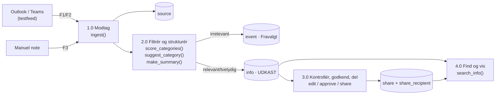
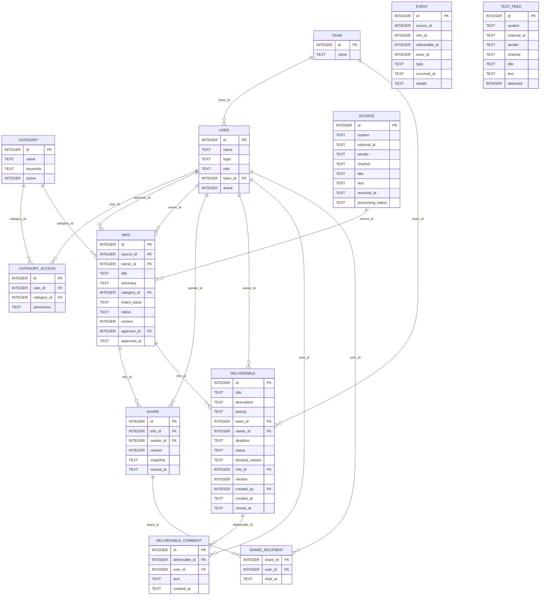
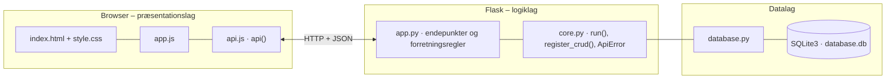

# AGC Biologics – QC Informationshub – dokumentation af prototypen

Prototypen undersøger, hvordan et samlet informationssystem kan reducere QC-lederes manuelle arbejde med at finde, samle og sortere information.
Kildeposter fra Outlook og Teams modtages **automatisk** gennem simulerede connectors. Systemet vurderer relevans, foreslår kategori og resumé,
og lederen **kontrollerer, godkender og deler**, men skal ikke selv kopiere information ind.

Efter fokusgruppen den 29. september 2026 er løsningen udvidet med **Leverancer & Prioritering**: et fælles overblik over, hvilke leverancer
der er vigtigst, hvem der har ansvaret, hvornår de skal være færdige, og hvor langt de er. Informationshubben er uændret.

Kravgrundlag: [`Kravspecifikation.md`](Kravspecifikation.md) og den reviderede kravspecifikation [`AGC_revideret_kravspecifikation_informationshub_prioritering (1).md`](<AGC_revideret_kravspecifikation_informationshub_prioritering (1).md>)

## Hvad kan prototypen

| Skærm | Funktion |
|---|---|
| **Home** | Nøgletal (Business Critical, overskredne, blokerede, aktive), de fem vigtigste leverancer, seneste information, kategorigenveje og søgefelt |
| **Leverancer & Prioritering** | Oversigt sorteret efter prioritet og deadline med filtre for prioritet, status, team, person, aktive/afsluttede og overskredne. Lederen ændrer prioritet direkte i oversigten. Leverancedetalje med ansvarlig, deadline, blokeringsgrund, koblet information, kommentarer og historik. Formular til at oprette og redigere leverancer (kun ledere) |
| **Til kontrol** (leder) | Kø med relevante og tvetydige udkast. Detaljevisning med originalkilde, "hvorfor fanget", rettelse (ny version), godkendelse, fravalg, deling med forhåndsvisning samt delings- og hændelseshistorik |
| **Information** | Fritekst i titel/resumé kombineret med kategori, kildesystem og status. Kun tilladt indhold vises. *Åbn* viser informationsdetaljen med resumé, relevante teams og kilde |
| **Delt med mig** (medarbejder) | Delte snapshots med knappen *Markér som læst* |
| **Kilder og testfeed** | *Modtag næste testpost* sender en fiktiv Outlook- eller Teams-post gennem connectoren. Manuel note og hændelseslog |
| **Administration** | CRUD for kategorier med nøgleord og for kategoriadgang (læs/redigér) |

Testkontoen vælges i toppen og sendes med hvert kald i headeren `X-User-Id` (simuleret login).

## Informationsflowet (DFD level 0–3)



## Fra krav til kode

| Krav | Implementering |
|---|---|
| F01 Roller og kategoriadgang | `current_user()`, `require_role()`, `can_view()`, `can_edit()`. Andres poster giver 403 |
| F02 To simulerede connectors, ingen dubletter | `POST /api/connectors/outlook\|teams` + `UNIQUE(system, external_id)` → 409 |
| F03 Relevans via regler/nøgleord, fravalg logges | `score_categories()`. Uden match: `processing_status = FRAVALGT` + hændelse |
| F04 Entydigt kategoriforslag, ellers Uklassificeret | `suggest_category()`: højeste score skal være > 0 og entydig (BR6) |
| F05 Redigerbart resumé med kildehenvisning | `make_summary()` (to første sætninger). `info.source_id` peger på originalen |
| F06 Rettelse øger version og ophæver godkendelse | `edit_info()`. `check_version()` kræver `expected_version` (optimistisk låsning, 409) |
| F07 Kun godkendt info deles. Én ugyldig modtager afviser alt | `share_info()` + transaktion |
| F08 Søgning og filtrering, tom tilstand | `GET /api/info?q=&category_id=&system=&status=` |
| F09 Medarbejdere ser kun godkendt/delt indhold | `can_view()` for rollen medarbejder + `GET /api/shared-with-me` (snapshots) |
| F10 Manuel note gennemgår samme flow | `POST /api/notes` → `ingest(manual=True)` |
| F11 Hændelseslog | Tabellen `event`: E01 modtaget … E06 delt, samt fravalg |
| F12 Historik | `GET /api/info/<id>` returnerer `shares` og `history` |
| F13 Admin vedligeholder kategorier, regler og adgang. Brugt kategori kan ikke slettes | CRUD. Fremmednøgle → 409 ved sletning |
| F14 Markér som læst | `POST /api/shares/<id>/read` → `read_at` |
| BR1 Intet deles automatisk | `ingest()` opretter altid `UDKAST` |
| BR5 Delt version er uforanderlig | `share.snapshot` gemmer en JSON-kopi af den godkendte version |
| BR7 Administrator ser ikke kildetekst | `can_view()` returnerer `False` for administrator |

### Revideret krav: Leverancer & Prioritering

Kravnumrene herunder er fra den reviderede kravspecifikation.

| Krav | Implementering |
|---|---|
| F05 Relevans for teams/personer | `GET /api/info/<id>` returnerer `relevant_teams`: teams, hvis medlemmer har adgang til postens kategori |
| F06, F07 Åbn information med opsummering | *Åbn* under Information og links på Home viser informationsdetaljen med resumé |
| F08 Opret leverance | `POST /api/deliverables` (kun leder). Leverancen vises straks i oversigten |
| F09 Prioritet | `PRIORITIES = Business Critical, High, Normal, Low`. Andre værdier giver 400 |
| F10, BR2, NF02 Vigtigste øverst og tydeligt markeret | `ORDER BY priority_rank, deadline`. Business Critical-rækker har rød kant og baggrund, og prioriteten vises med symbol og tekst (▲▲, ▲, ●, ▽) |
| F11 Ansvarligt team/person | `team_id` og `owner_id`. Mindst én skal være udfyldt |
| F12, F13, NF03 Deadline og status i oversigten | Kolonnerne Prioritet, Leverance, Ansvarlig, Deadline og Status |
| F14, BR4 Ændr prioritet | Lederen vælger ny prioritet direkte i oversigten → `PUT /api/deliverables/<id>`, og rækkefølgen opdateres med det samme |
| F15 Ændr ansvarlig, deadline og status | *Redigér leverance* → `PUT /api/deliverables/<id>` med `expected_version` (409, hvis en anden har ændret den) |
| F16 Kombinerede filtre | `GET /api/deliverables?priority=&status=&team_id=&owner_id=&overdue=1&view=` |
| F17, E07 Overskredne deadlines | `overdue` beregnes: deadline før i dag og status ikke Afsluttet. Vises med rød dato og ⚠ Overskredet |
| F18 Historik | Hver ændring logges i `event` med `deliverable_id`, bruger og tidspunkt: E03 oprettet, E04 prioritet, E05 ansvarlig, E06 status, E08 afsluttet, samt deadline og rettelser |
| F19 Kobling til information | `info_id` på leverancen. Kun godkendt information kan kobles, og informationsdetaljen viser koblede leverancer |
| BR1 Titel, prioritet, ansvarlig og deadline | `validate_deliverable()` giver 400 med en forklaring |
| BR3, NF10 Kun relevante brugere ændrer prioritet | Kun rollen leder kan oprette og ændre. Medarbejdere ser oversigten og kan kommentere |
| BR5, E08 Afsluttede kan stadig findes | Afsluttede er skjult fra *Aktive*, men findes under *Afsluttede* og *Alle* |
| BR6 Blokeret kræver begrundelse | `blocked_reason` er påkrævet ved status Blokeret og vises på detaljen |
| BR7 To adskilte funktioner, der kan forbindes | Egne tabeller og faneblade. Forbindes kun via det valgfri `info_id` |
| NF07 Ingen dubletter ved gentagne klik | Knappen låses under kaldet, og en åben leverance med samme titel afvises med 409 |
| Visuelt design: farve er ikke eneste indikator | Prioritet og status har altid symbol og tekst (fx ⛔ Blokeret, ✓ Afsluttet) |

**Eksempel på kategoriregel:** Bemanding har nøgleordene *vagtplan, bemanding, ferie, sygdom, vikar, overarbejde*.
"Ny vagtplan … ferie … vikarer" giver score 3 → Bemanding. "Kalibrering … bemanding" giver 1 til både Udstyr og Bemanding → Uklassificeret.

## Datamodel



| Tabel | Rolle (D-numre fra DFD) |
|---|---|
| `source` | D1: original kildepost, ændres aldrig |
| `info` | D2: udkast/godkendt post med resumé, kategori og version |
| `category` · `category_access` | D3: kategorier, nøgleord og adgang |
| `share` · `share_recipient` | D4: delinger med snapshot og læst-tidspunkt |
| `event` | D5: hændelseslog for både information og leverancer |
| `team` | Teams, som brugere og leverancer tilhører |
| `deliverable` · `deliverable_comment` | D6: leverancer med prioritet, ansvarlig, deadline og status samt kommentarer |
| `test_feed` | Fiktive Outlook/Teams-poster, som connectoren afleverer |

## Eksempel på dataudveksling

Den simulerede Outlook-connector afleverer en ny mail. Systemet finder nøgleordene *audit, sop, gmp*, foreslår Quality og opretter et udkast:

```bash
curl -X POST http://localhost:5104/api/connectors/outlook \
  -H 'Content-Type: application/json' \
  -d '{"external_id": "MSG-9001", "sender": "qa@agc.test", "title": "Audit næste uge", "text": "Husk at læse SOP QC-014 før audit. GMP-kravene til dokumentation er skærpet."}'
```

Svar `201`:

```json
{
  "source_id": 1,
  "relevant": true,
  "info": {
    "id": 1,
    "source_id": 1,
    "owner_id": 1,
    "title": "Audit næste uge",
    "summary": "Husk at læse SOP QC-014 før audit. GMP-kravene til dokumentation er skærpet.",
    "category_id": 2,
    "match_basis": "Quality: audit, sop, gmp (score 3)",
    "status": "UDKAST",
    "version": 1,
    "approver_id": null,
    "approved_at": null,
    "category_name": "Quality",
    "system": "Outlook",
    "external_id": "MSG-9001",
    "…": "6 felter mere"
  },
  "candidates": [
    {
      "category_id": 2,
      "name": "Quality",
      "score": 3,
      "keywords": [
        "audit",
        "sop",
        "… (forkortet)"
      ]
    }
  ]
}
```

## Kør prototypen

```bash
cd backend
python3 -m venv .venv && source .venv/bin/activate   # første gang
pip install -r requirements.txt                       # første gang
python app.py
```

Terminalen skriver ` * Åbn http://localhost:5104`. Åbn adressen i browseren. Flask serverer både API'et (`/api/...`) og frontenden.

- **Port:** Prototypen bruger port **5104** (5100 + projektnummer). Er porten optaget, vælger `run()` i `core.py` selv den næste ledige og skriver fx ` * Port 5104 er optaget – bruger port 5105 i stedet`. Du kan også vælge port selv med `PORT=5200 python app.py`.
- **Stop serveren** med `Ctrl` + `C` i terminalen, hvor den kører.
- **Kodeændringer:** Serveren kører i debug-tilstand og genstarter selv, når du gemmer en `.py`-fil. Den bliver på samme port. Ændringer i `frontend/` kræver kun, at du genindlæser siden.
- **Database:** `backend/database.db` oprettes med testdata ved første start. Nulstil den med `python database.py --reset`, mens serveren er stoppet.
- **Tjek at backenden svarer:** `curl http://localhost:5104/api/health`

### Fejlfinding

| Problem | Årsag | Løsning |
|---|---|---|
| ` * Port 5104 er optaget – bruger port …` | En anden proces, ofte en glemt server, bruger porten | Brug den adresse, der står i terminalen. Se hvad der optager porten med `lsof -nP -iTCP:5104 -sTCP:LISTEN`. En Flask-server i debug-tilstand er to processer, så stop dem begge med `lsof -t -iTCP:5104 -sTCP:LISTEN \| xargs kill` |
| `ModuleNotFoundError: No module named 'flask'` | Det virtuelle miljø er ikke aktiveret, eller Flask er ikke installeret | `source .venv/bin/activate` og `pip install -r requirements.txt` |
| Siden viser "Kan ikke hente data fra backenden" | Serveren kører ikke, eller `index.html` er åbnet direkte fra disken, mens serveren kører på en anden port | Start serveren og åbn adressen fra terminalen i stedet for filen |
| Tallene passer ikke efter mange tests | Databasen indeholder testdata fra tidligere afprøvninger | Stop serveren og kør `python database.py --reset` |
| `no such table …` | `database.db` er tom eller ødelagt | `python database.py --reset` |

## Arkitektur

Prototypen følger holdets fælles tre-lags struktur (se [`../README.md`](../README.md)):



| Fil | Lag | Indhold |
|---|---|---|
| `frontend/index.html` | Præsentation | Skærmbilleder som faneblade og formularer. Projektets farver og `data-api-port` |
| `frontend/app.js` | Præsentation | Henter data med `api()`, tegner dem i DOM'en og sender formularer |
| `frontend/api.js` | Præsentation | Fælles for alle prototyper: `api()` (fetch + JSON), `h()`, `renderTable()`, `fillSelect()`, `formToJson()`, `bindCrudForm()` og `toast()` |
| `frontend/style.css` | Præsentation | Fælles responsivt design |
| `backend/app.py` | Logik | Projektets forretningsregler og endepunkter |
| `backend/core.py` | Logik | Fælles: `create_app()` (Flask, CORS, JSON-fejl), `run()` (start på ledig port), `ApiError` og `register_crud()` |
| `backend/database.py` | Data | Fælles: forbindelse, `query_all/query_one/execute`, `transaction()` og `init_db()` |
| `backend/schema.sql` · `seed.sql` | Data | Tabeller og fiktive testdata |

Alle fejl returneres som JSON (`{"error": "…", "path": "/api/…"}`) med statuskode 400, 401, 403, 404 eller 409 og vises som en rød besked i frontenden.
Nederst på siden kan man åbne **"Seneste JSON-svar fra API'et"** og se den rå dataudveksling.
Den fulde endepunktsliste står i [`backend/README.md`](backend/README.md).

## Design og responsivitet

- Samme stylesheet i alle prototyper. Kun farverne (`--brand`, `--brand-dark`, `--brand-soft`) sættes i `index.html`.
- Layoutet virker fra mobil (375 px) til desktop uden vandret scroll. Kort lægger sig under hinanden på små skærme, og brede tabeller scroller inde i deres kort.
- Formularfelter kan ikke blive bredere end deres kort. En `<select>` med lange valgmuligheder skubber altså ikke formularen ud over kanten.
- Beskeder vises kort i toppen (grøn = gennemført, rød = fejl fra serveren).


## Testdata og testkonti

| Rolle | Konti |
|---|---|
| Leder | Hanne (QC, alle kategorier), Peter (QA: Quality, Udstyr), Sofie (QC Træning: Bemanding, Træning) |
| Medarbejder | Ali (QC), Bente (QA), Carl (Stability), Dorte (QC), Emil (QC Træning) med forskellig læseadgang |
| Administrator | Ida |

4 kategorier og 13 testfeed-poster med relevante, irrelevante, tvetydige og én dublet.
De første 8 modtages automatisk, når databasen oprettes, så *Til kontrol* ikke er tom.

4 teams og 7 leverancer, hvis deadlines regnes ud fra dags dato, når databasen oprettes:
Batch Release 245 (Business Critical), Stability Report og CAPA-opfølgning (High, overskredet), Method Update og Kalibrering af HPLC 3 (Normal, blokeret),
Træningsplan (Low) og Vagtplan uge 40 (afsluttet).

**Demoscenarie (afsnit 20 i den reviderede kravspecifikation):** Log ind som Hanne → Home viser de vigtigste leverancer →
*Gå til Leverancer & Prioritering* → skift Method Update til Business Critical i oversigten → leverancen rykker op og fremhæves →
skift til Ali (medarbejder) og se samme rækkefølge uden mulighed for at ændre den.

## Afgrænsning

Ingen rigtig Microsoft Graph-integration, adgangskode eller AI-resumé. Resuméet er de første sætninger, og kategoriseringen er en nøgleordsheuristik, som beskrevet i A4.

For Leverancer & Prioritering gælder desuden:

- **Ingen notifikationer (BR8).** Ændringer ses i oversigten og historikken, så der ikke skabes ny informationsbelastning.
- **Ingen AI-forslag (F20)** og ingen automatisk prioritering. Prioriteten sættes altid af en leder.
- **Alle ledere kan ændre alle leverancer.** Hvem der skal have rettigheden, og om prioriteringen er fælles eller pr. team, er åbne spørgsmål til AGC.
- **Prioriteter og statusser er prototypeforslag** fra kravspecifikationen og skal valideres med AGC.
- Ingen import fra Planner eller Excel.
