# Kravspecifikation for et samlet informationssystem

> Konverteret til markdown fra `AGC_Kravspecifikation_AFLEVERING.dotx`. Tekst og figurer er gengivet som i originaldokumentet.

*AGC Biologics Copenhagen*

*QC og ledere med personaleansvar*

Prototype af intelligent informationshub til automatisk indsamling, strukturering og målrettet videreformidling

Økonomi og IT · Forløb 3.1 · 24. september 2026 · Version 2.0 – afleveringsversion

## 1 Formålet med projektet

Prototypen skal undersøge, hvordan et samlet informationssystem kan reducere QC-lederes manuelle arbejde med at finde, samle og sortere information på tværs af kanaler. Den tilsigtede løsning kobles til eksisterende informationskilder som Outlook og Teams, modtager nye informationsposter, vurderer deres relevans ud fra definerede regler og nøgleord og organiserer relevant information i emnekategorier. Lederen skal primært kontrollere, rette og godkende systemets forslag – ikke selv opsøge og kopiere information ind i systemet.

Den forventede forretningsværdi er mindre manuelt søge- og sorteringsarbejde, et mere samlet overblik og hurtigere adgang til relevant information. Effekten er en hypotese, som skal afprøves. Kravspecifikationen beskriver den tilsigtede løsning, mens den første prototype simulerer integrationerne med fiktive Outlook- og Teams-data og derfor ikke dokumenterer en realiseret tidsbesparelse eller økonomisk rentabilitet.

### Succeskriterier for afprøvningen

En testbruger skal kunne gennemføre kerneforløbet uden først at finde og kopiere information manuelt: En fiktiv kildepost modtages gennem et simuleret feed, systemet identificerer relevans, foreslår kategori og resumé, og lederen kontrollerer, godkender, deler og genfinder informationen. Opgavetid, fejl og oplevet overblik sammenlignes med en tilsvarende manuel opgave.

### Dokumentets opbygning

Afsnit 1 til 6 beskriver formål, brugere og forudsætninger. Afsnit 7 og 8 afgrænser arbejdet og produktet med BPMN, user journey og arkitektur. Afsnit 9 beskriver funktionelle krav, DFD, processer, events og data. Afsnit 10 til 17 omfatter design og kvalitetskrav. Afsnit 18 til 27 beskriver projektforhold. Til sidst følger accepttest og kilder.

## 2 Interessenter

| Interessent | Interesse og ansvar |
|---|---|
| QC ledere med personaleansvar | Primære brugere. Vurderer relevans, godkender indhold og vælger modtagere. |
| QC medarbejdere | Modtager og genfinder information, som vedrører deres arbejde. |
| Ledelsen i QC | Mulig projektejer. Skal validere behov, prioriteringer og en eventuel pilot. |
| IT og informationssikkerhed | Skal ved en pilot afklare integrationer, adgang, drift og sikkerhed. |
| Kvalitetsfunktion og ansvarlige for persondata | Skal afklare tilladt anvendelse og afgrænsning til eksisterende systemer. |
| Projektgruppen | Udarbejder kravspecifikation, udvikler prototype og gennemfører test. |

## 3 Brugere af produktet

QC-lederen arbejder på tværs af flere informationskanaler, men skal i den foreslåede løsning ikke selv samle hovedparten af informationen. Brugerfladen skal i stedet vise en overskuelig kø med automatisk indsamlede poster “Til kontrol”, tydelig kilde, foreslået kategori, resumé, søgning og få handlinger frem mod godkendelse og deling. Medarbejderen har primært behov for at læse og genfinde den information, som er gjort tilgængelig.

En administrator kan oprette testbrugere, mapper og adgangsrettigheder. Administratorrollen giver ikke automatisk adgang til kildetekst. Prototypen bruger særskilte testkonti til leder, medarbejder og administrator.

## 4 Begrænsninger

Prototypen afgrænses til internt informationsflow i QC hos AGC Biologics Copenhagen. Der anvendes fiktive data. Systemet skal ikke erstatte godkendte kvalitetsdokumenter, laboratorieresultater, batchdokumentation eller eksisterende kvalitetssystemer.

Første prototype demonstrerer automatisk informationsflow med fiktive testfeeds, der repræsenterer Outlook og Teams. Der udvikles ikke en produktionsklar integration med AGCs konti, Microsoft Graph, mødeoptagelse eller talegenkendelse. Systemets kernefunktioner skal derimod kunne gennemføres: modtagelse af testdata, relevansvurdering, kategorisering, resumé, kontrol, søgning, lagring, godkendelse og intern deling. Manuel note bevares kun som supplement til information, der ikke findes i de integrerede kanaler, fx en telefonsamtale.

## 5 Begreber og definitioner

| Begreb | Definition |
|---|---|
| Kilde | Den oprindelige informationspost fra et kildesystem eller en manuel note. Kilden gemmes uændret med system, tidspunkt og identifikator. |
| Informationspost | Et redigerbart udkast med resumé, kildehenvisning, kategori, ejer, status og version. |
| Kategori / emnemappe | Et emneområde i informationshubben, fx Bemanding eller Quality. Kategorier har regler/nøgleord og adgangsrettigheder. |
| Til kontrol | Kø med relevante eller tvetydige informationsposter, som systemet har behandlet, men som endnu ikke er godkendt af en leder. |
| Godkendt | En bestemt version, som en leder har kontrolleret og må dele. |
| Deling | En godkendt version gøres tilgængelig for udvalgte brugere. Delingen gemmer et snapshot af den godkendte information. |
| Kildesystem / connector | Den kanal data kommer fra, fx Outlook eller Teams. En connector er grænsefladen, der afleverer kildedata til systemet; i prototypen er den simuleret. |
| BUC og PUC | Business use case beskriver arbejdet. Product use case beskriver brugerens samspil med systemet. |
| DFD og BPMN | DFD viser data og transformationer. BPMN viser rækkefølge, aktører og beslutninger. |

## 6 Fakta og antagelser

Projektets hidtidige behovsafdækning peger på information fra flere kanaler, tid brugt på at finde og vurdere relevans samt udfordringer med overblik og videreformidling. Det danner grundlag for at afprøve et system, der flytter arbejdet fra manuel indsamling til automatisk modtagelse og strukturering. De konkrete kilder, nøgleord, kategorier og adgangsregler skal valideres med QC og IT.

| ID | Antagelse som skal valideres |
|---|---|
| A1 | Lederen kan kontrollere og godkende systemets forslag uden at skabe en ny flaskehals. |
| A2 | Fælles emnekategorier kan dække de vigtigste informationsbehov i det valgte QC-scope. |
| A3 | Godkendte integrationer kan i en senere pilot levere de nødvendige tekst- og metadatafelter fra udvalgte Outlook-/Teams-kilder. |
| A4 | Enkle relevans- og kategoriregler baseret på nøgleord og metadata er tilstrækkelige til at demonstrere princippet i den første prototype. |

## 7 Arbejdets scope

BUC 01 omfatter forløbet fra ny information opstår i en eksisterende kanal, til relevant information er samlet, struktureret, kontrolleret og gjort tilgængelig for relevante medarbejdere. Udløseren er fx en ny mail eller Teams-information. I den foreslåede arbejdsgang indsamler og sorterer systemet først, hvorefter lederen tager stilling til de poster, der kræver kontrol.

### Nuværende arbejdsgang

Figuren er en forenklet model baseret på projektets beskrevne problem. Den skal valideres med en QC leder og er ikke en fuldstændig kortlægning af AGCs nuværende processer.

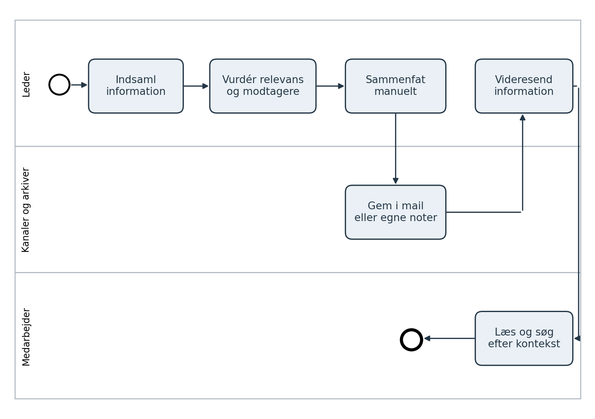

Figur 1. BPMN for den nuværende arbejdsgang. Én proces med tre swimlanes. Cirkler er start og slut, afrundede bokse er aktiviteter, og pile er sekvensflow.

Den centrale udfordring er, at lederen selv skal sammenholde og bearbejde information på tværs af kanaler. Det gør både overblik og efterfølgende genfinding afhængig af den enkelte leders struktur.

## 7 Arbejdets scope fortsat

### Foreslået arbejdsgang

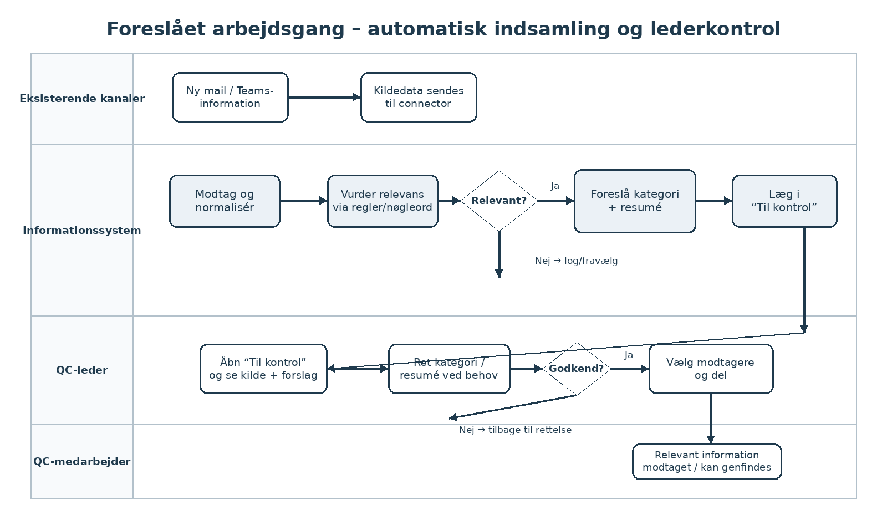

Figur 2. BPMN for den foreslåede arbejdsgang. X er en eksklusiv gateway. Ved afvist godkendelse vender forløbet tilbage til kontrol og rettelse.

I den foreslåede arbejdsgang sender eksisterende kanaler kildedata til informationssystemet. Systemet normaliserer indholdet, vurderer relevans via regler og nøgleord, foreslår emnekategori og resumé og lægger relevante poster i “Til kontrol”. Lederen sammenligner forslaget med kilden, retter efter behov, godkender og vælger modtagere. Systemet gemmer den godkendte version og gør den målrettet tilgængelig.

BPMN viser hovedforløbet samt en rettelsesløkkke ved manglende godkendelse. Irrelevant eller ugyldigt indhold kan fravælges eller logges uden at blive vist som en normal lederopgave. I prototypen simuleres kildedata; reelle integrationsfejl og virksomhedsautentifikation af eksterne systemer ligger uden for implementeringen.

## 8 Produktets scope

Produktets kerne er én webbaseret informationshub med fælles logik og database. Outlook og Teams behandles som tilstødende kildesystemer, der i den tilsigtede løsning leverer information gennem godkendte connectors/API’er. I den første prototype simuleres disse forbindelser med fiktive testfeeds. QC-lederen og QC-medarbejderen er eksterne aktører, og manuel note er et sekundært input til oplysninger, der ikke findes i de integrerede kilder.

### PUC 01 Fra ny information til struktureret og delt viden

Primær aktør: QC-leder. Trigger: En ny fiktiv Outlook- eller Teams-post modtages af systemet. Forudsætning: Lederen er logget ind og har adgang til mindst én kategori; testfeed og regler er indlæst. Efterbetingelse: Relevant information er kontrolleret, placeret i en kategori og kan findes af eller er delt med valgte, autoriserede modtagere.

| Trin | Brugerens handling | Systemets respons og behov |
|---|---|---|
| 1 Modtag | Ingen aktiv handling. En ny fiktiv mail- eller Teams-post opstår i testfeedet. | Connectoren validerer og gemmer kilden. Brugeren skal ikke kopiere information manuelt. |
| 2 Filtrér | Ingen aktiv handling. | Systemet vurderer relevans via regler/nøgleord. Irrelevant indhold fravælges eller logges; relevant/tvetydigt indhold går videre. |
| 3 Skab overblik | Åbner “Til kontrol”. | Viser kilde, resumé, foreslået kategori og hvorfor posten blev fanget. Brugeren skal hurtigt kunne vurdere systemets forslag. |
| 4 Kontrollér | Sammenligner med kilden og retter resumé eller kategori ved behov. | Gemmer rettelser som ny version uden at ændre originalkilden. |
| 5 Godkend og del | Godkender den aktuelle version og vælger relevante modtagere. | Kontrollerer adgang, gemmer godkendelse og deler et snapshot. |
| 6 Genfind | Søger eller åbner en kategori senere. | Viser tilladt information med kilde, kategori, status og delingshistorik. |

User journey map: Rejsen starter ved, at systemet automatisk modtager og behandler ny information. Lederens aktive arbejde begynder først i “Til kontrol”, hvor systemets relevans, resumé og kategoriforslag kan vurderes. Følelsesmæssige reaktioner og faktiske friktioner indsamles under test frem for at blive fremstillet som observerede resultater.

### Supplerende product use cases

PUC 02: Systemet modtager en fiktiv Outlook-post og opretter kun et ledervendt udkast, hvis den vurderes relevant. PUC 03: Systemet modtager Teams-information og foreslår kategori ud fra regler/nøgleord. PUC 04: Lederen retter kategori eller resumé og godkender. PUC 05: Lederen opretter en manuel note som supplement. PUC 06: En medarbejder åbner Delt med mig eller genfinder godkendt information via søgning.

## 8 Tre lags arkitektur

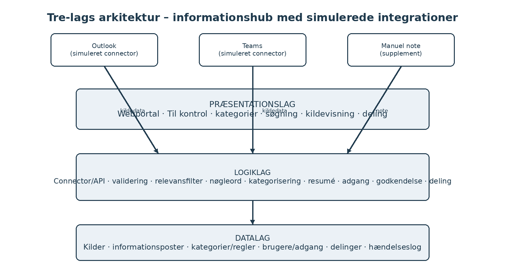

Figur 3. Outlook og Teams ligger som tilstødende kildesystemer. I prototypen repræsenteres de af simulerede connectors, der afleverer fiktive kildedata til logiklaget. Webportalen er præsentationslaget; logiklaget håndterer relevans, kategorisering, resumé, adgang, godkendelse og deling; databasen er datalaget.

| Lag | Ansvar og forslag til prototype |
|---|---|
| Præsentation | HTML, CSS og JavaScript. Webportal med Til kontrol, kategorier, kildevisning, søgning, manuel note som supplement og delingspanel. |
| Logik | Python og Flask som mulig implementering. Connector/API modtager testdata; logikken validerer, deduplikerer, vurderer relevans, udtrækker nøgleord, foreslår kategori/resumé og håndterer adgang, godkendelse, deling og søgning. |
| Data | Relationel database, eksempelvis MySQL. Gemmer kilder med kildesystem/ekstern ID, informationsposter, kategorier/regler, adgangsrettigheder, delinger og hændelseslog. |

Teknologierne er løsningsforslag. Kravene afhænger ikke af et bestemt framework. Browseren må ikke kontakte databasen direkte. Den første prototype skal kunne demonstrere hele informationsflowet uden adgang til AGCs rigtige Outlook- eller Teams-miljø ved at bruge de samme datatyper gennem simulerede connector-input.

### Grænseflader

Eksternt input: fiktive Outlook- og Teams-poster gennem simulerede connector-endpoints. Supplerende input: manuel note. Interne API-kald: modtag kilde, vurder relevans, strukturér, opret udkast, hent Til kontrol, gem rettelse, godkend version, del version og søg. Output: behandlingsstatus, Til kontrol, søgeresultater og intern delingsvisning. Produktionstilslutning til Microsoft-miljøet ligger uden for første implementering.

## 9 Funktionelle krav og datakrav

Must er nødvendigt for det samlede prototypeforløb. Should forbedrer afprøvningen. Could kan udskydes. Alle krav nedenfor er foreslåede produktkrav; testresultater registreres efter implementering.

| ID og prioritet | Krav | Acceptkriterium |
|---|---|---|
| F01 Must | Systemet skal autentificere testbrugere og håndhæve deres roller og kategoriadgang. | Leder og medarbejder ser kun tilladt indhold. Direkte API-opslag på en anden brugers private udkast afvises. |
| F02 Must | Systemet skal kunne modtage fiktive kildedata fra mindst to simulerede connectors, der repræsenterer Outlook og Teams. | En gyldig kildepost med kildesystem, ekstern_id, tidspunkt, titel/emne og tekst gemmes én gang. Gentaget kildesystem + ekstern_id opretter ingen dublet. |
| F03 Must | Systemet skal vurdere, om en modtaget kilde er relevant ud fra definerede regler/nøgleord og metadata. | Et testinput med en relevant regel går videre til strukturering. Et klart irrelevant input opretter ikke en normal post i Til kontrol, men resultatet kan spores i loggen. |
| F04 Must | Systemet skal foreslå en emnekategori for relevant information. | Et entydigt kategorimatch giver ét forslag. Intet eller tvetydigt match giver Uklassificeret, og lederen kan ændre forslaget. |
| F05 Must | Systemet skal oprette et redigerbart resumé og en informationspost med reference til originalkilden. | Relevant eller tvetydigt input giver ét udkast. Kilde, resumé, kategori og matchgrundlag vises sammen i Til kontrol. |
| F06 Must | Lederen skal kunne rette udkast og godkende en bestemt version. | Rettelse øger versionsnummeret og ophæver tidligere godkendelse. Godkender og tidspunkt registreres. |

F02–F05 demonstrerer automatisk indsamling, relevansvurdering og strukturering med fiktive kildeposter, faste regler/nøgleord og eventuelt forberedte resuméer. Det er ikke en påstand om, at prototypen allerede kan forstå vilkårlig kommunikation eller er integreret i AGCs produktionsmiljø.

## 9 Funktionelle krav fortsat

| ID og prioritet | Krav | Acceptkriterium |
|---|---|---|
| F07 Must | Godkendt information skal kunne deles med valgte medarbejdere efter forhåndsvisning. | Udkast kan ikke deles. Alle valgte modtagere skal have adgang til kategorien. Ved én ugyldig modtager afvises hele delingen. |
| F08 Must | Brugeren skal kunne søge og filtrere i tilladt information. | Søgning på titel eller resumé kan kombineres med kategori, kildesystem og status. Ingen resultater vises som en tom tilstand. |
| F09 Must | Medarbejderen skal kunne åbne delinger og godkendt information, som vedkommende har adgang til. | Kun valgte modtagere eller brugere med relevant kategoriadgang kan se den delte/godkendte version. |
| F10 Must | Lederen skal kunne oprette en manuel note som supplement til de automatiske kilder. | En manuel note kræver titel og tekst, mærkes som Manuel og gennemgår samme strukturering, kontrol og godkendelse som øvrige kilder. |
| F11 Must | Systemet skal registrere import, relevansvurdering, godkendelse og deling med aktør/system, version og tidspunkt. | Hændelsesloggen indeholder poster for modtagelse, behandling, godkendelse og deling; fravalg kan spores uden at blive vist som normal information. |
| F12 Should | Lederen skal kunne se historik for en informationspost og dens delinger. | Historikken viser kildesystem, versioner, godkendelse, modtagere og delingstidspunkt. |
| F13 Should | Administrator skal kunne vedligeholde kategorier, relevans-/kategoriregler og brugeradgang. | En ændret regel anvendes på nye testinputs. En anvendt kategori kan ikke slettes uden omplacering. |
| F14 Could | Modtageren skal kunne markere en deling som læst. | Der gemmes læst_tid pr. modtager. Markeringen må ikke fremstilles som bevis for forståelse. |

### Forretningsregler

BR1: Indhold fra et kildesystem bliver aldrig automatisk delt; automatisk behandlet indhold starter som udkast. BR2: Kun poster, der matcher en relevansregel eller markeres til manuel vurdering, vises i Til kontrol. BR3: Kun en leder med ejer- eller redigeringsret må godkende. BR4: Deling kræver godkendelse af den aktuelle version. BR5: En delt version er uforanderlig; senere rettelser kræver ny godkendelse og deling. BR6: Tvetydigt kategorimatch giver Uklassificeret. BR7: Kildeindhold vises kun til autoriserede brugere.

## 9 DFD kontekstdiagram

Kontekstdiagrammet viser informationssystemet som én proces. Outlook og Teams leverer kildedata til systemet, mens QC-lederen primært kontrollerer, godkender, deler og søger. En manuel note kan stadig registreres som supplement. QC-medarbejderen modtager eller genfinder godkendt information. De eksterne kilder er med i produktets kontekst, selv om forbindelserne simuleres i prototypen.

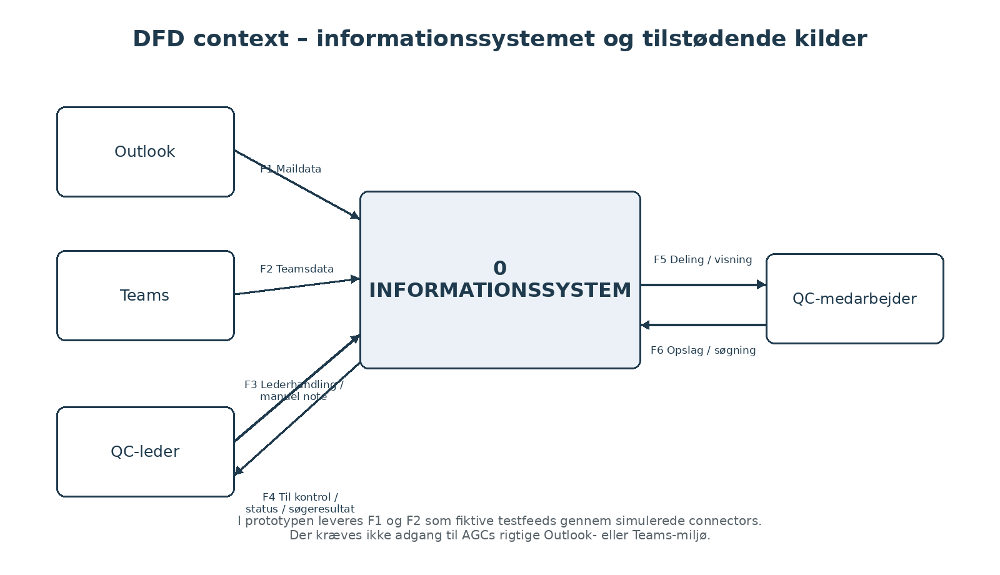

Figur 4. DFD context. Rektangler er eksterne aktører, den afrundede boks er produktet, og pilene er navngivne dataflows. Databaser vises først på level 0.

F1 er maildata fra Outlook, F2 er Teamsdata, F3 er lederhandlinger og eventuel manuel note, F4 er Til kontrol/status/søgeresultater til lederen, F5 er deling eller tilladt visning til medarbejderen, og F6 er medarbejderens opslag/søgning.

DFD viser dataudveksling og transformationer. Tidsrækkefølge og beslutningsgrene vises i BPMN og eventtabellen.

## 9 DFD level 0

Kerneforløbet opdeles i fire processer: 1.0 Modtag kildedata, 2.0 Filtrér og strukturér, 3.0 Kontrollér, godkend og del samt 4.0 Find og vis. D1 gemmer de oprindelige kilder, D2 de bearbejdede informationsposter, D3 kategorier/regler og adgang, D4 delinger og D5 hændelseslog. Login og administration er støttefunktioner uden for den viste nedbrydning.

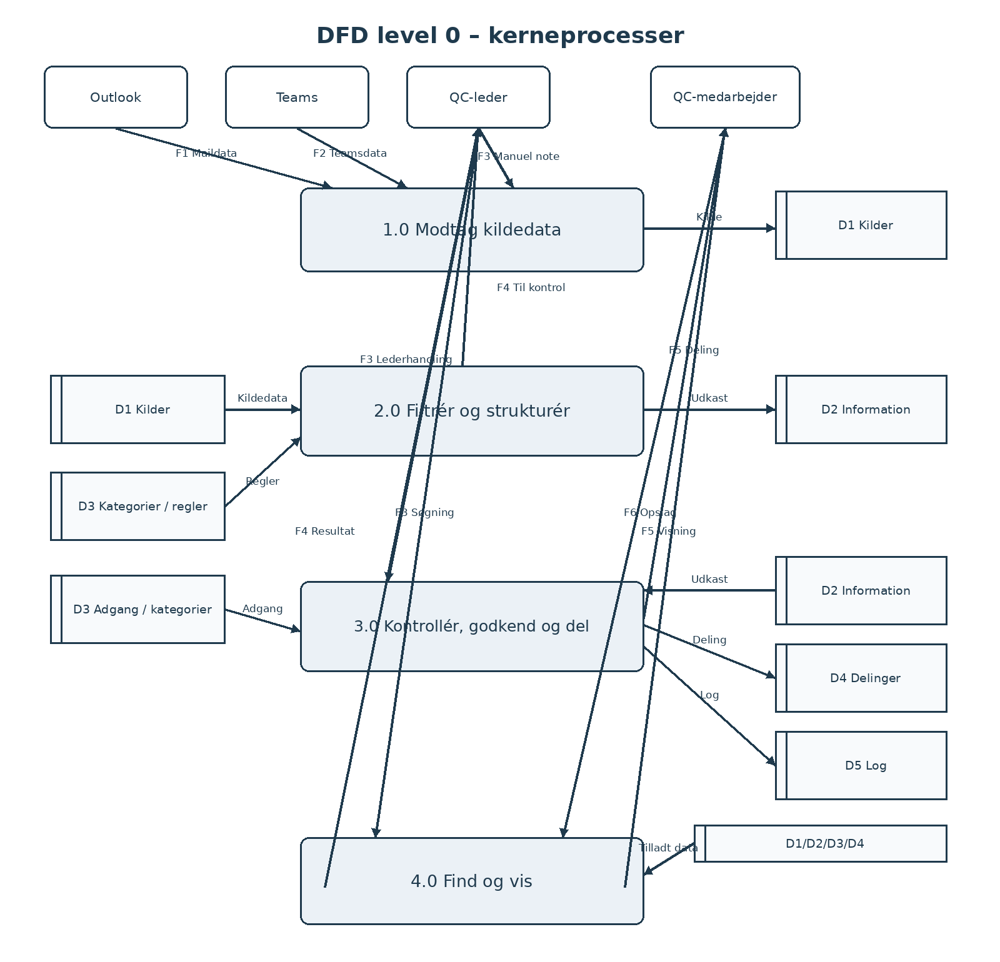

Figur 5. DFD level 0. Outlook- og Teams-flow er med som input, men i den tekniske prototype kommer de fra fiktive testfeeds. Hovedforløbet kræver derfor ikke produktionsadgang til de eksterne systemer.

## 9 DFD level 1

Proces 2.0 Filtrér og strukturér nedbrydes i fire delprocesser. Kildedata læses fra D1, relevans vurderes med regler/nøgleord, relevant indhold sammenholdes med kategorier fra D3, og et ledervendt udkast gemmes i D2. Fravalgt eller fejlbehæftet behandling kan registreres i D5. Output til lederen er F4 Til kontrol.

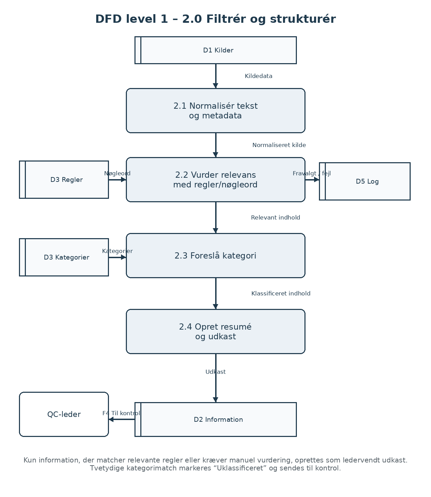

Figur 6. DFD level 1 for 2.0. Samme kildedata, regler/kategorier og lederoutput bevares fra level 0. Figuren viser, at relevansvurdering sker før kategori og udkast.

## 9 DFD level 2

Proces 2.3 Foreslå kategori nedbrydes i udtræk af nøgleord, sammenligning med kategoriregler og valg af forslag. Indholdet føres videre sammen med nøgleord og kandidater, så resumé og kildehenvisning ikke går tabt.

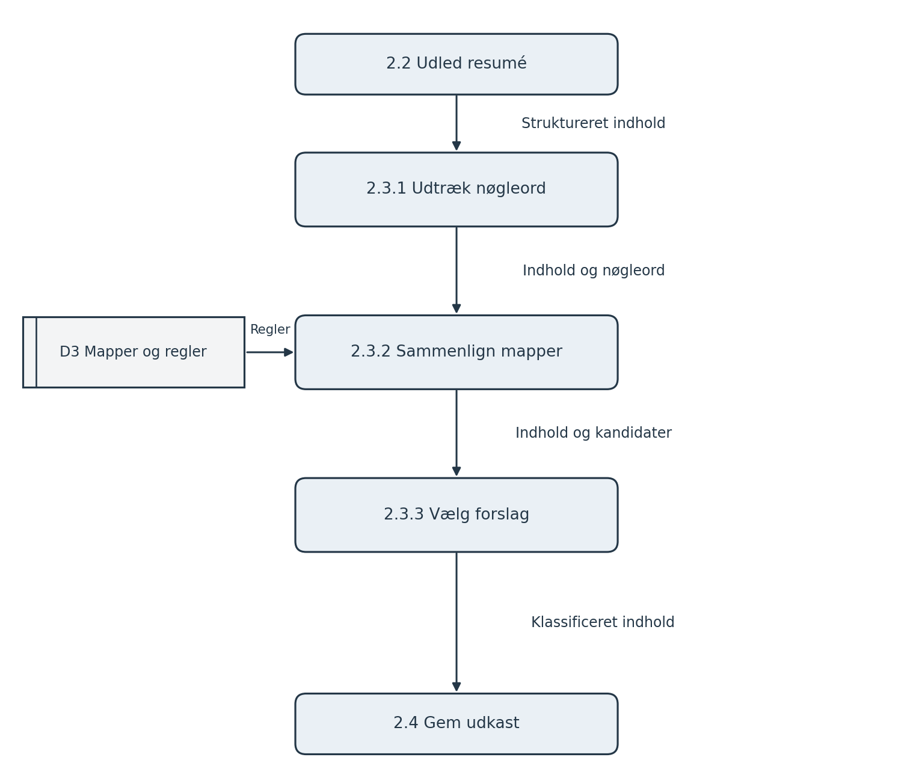

Figur 7. DFD level 2 for 2.3. Bokse 2.2 og 2.4 viser naboprocesser uden for den viste nedbrydning.

## 9 DFD level 3

Proces 2.3.2 Sammenlign kategorier nedbrydes yderligere. Reglerne begrænses til kategorier, som ejeren må oprette information i. Matchscore beregnes ud fra forskellige nøgleord, der findes i både indhold og kategoriregel.

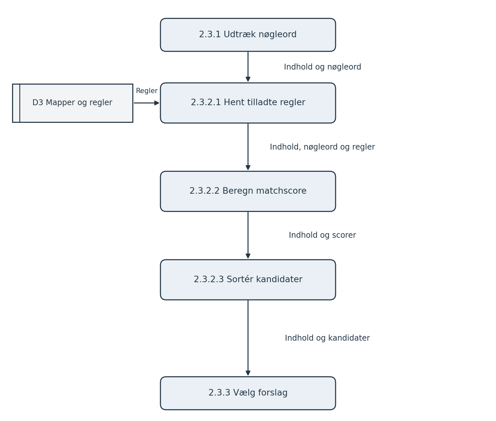

Figur 8. DFD level 3 for 2.3.2. Output er indhold samt en sorteret kandidatliste. Endeligt mappevalg foretages i 2.3.3.

## 9 Procesbeskrivelser

| Proces | Input og behandling | Output og undtagelser |
|---|---|---|
| 1.0 Modtag kildedata | F1/F2/F3 valideres. Kildesystem, ekstern_id, titel/emne, tekst, tidspunkt og eventuel ejer registreres. Dubletter kontrolleres. | D1 Kilde. Ugyldigt input giver fejl; samme kildesystem + ekstern_id opretter ikke en ny kilde. |
| 2.0 Filtrér og strukturér | Læs D1. Normalisér tekst/metadata, vurder relevans med D3-regler, udtræk nøgleord, foreslå kategori og resumé. | D2 Udkast og F4 Til kontrol. Irrelevant indhold fravælges/logges; tvetydigt match giver Uklassificeret. |
| 3.0 Kontrollér, godkend og del | Modtag F3. Kontrollér rolle, version, resumé, kategori og adgang. Gem rettelser, godkend eller del atomisk. | D2 opdatering, D4 deling, D5 log, F4 status og F5 deling. Konflikt eller manglende adgang afviser handlingen. |
| 4.0 Find og vis | Modtag F3/F6. Læs D1/D2/D4 og filtrér gennem D3 før returnering. Medarbejdere ser kun tilladt, godkendt/delt indhold. | F4/F5 med tilladt indhold. Ingen match giver tom liste; uautoriseret ID giver afslag. |

### Detaljeret proces for mappeforslag

2.1 normaliserer tekst og metadata og bevarer den oprindelige kilde. 2.2 sammenholder tekst, afsender, emne og eventuelle andre metadata med relevansregler; ikke-relevant indhold fravælges eller logges. 2.3.1 udtrækker unikke nøgleord fra relevant indhold. 2.3.2.1 henter tilladte kategorier og deres nøgleord. 2.3.2.2 beregner antal forskellige match pr. kategori. 2.3.2.3 sorterer kandidater efter faldende score. 2.3.3 foreslår kun en kategori, hvis højeste score er større end nul og entydig; ellers returneres Uklassificeret. 2.4 opretter et resumé, gemmer udkastet og viser det i Til kontrol.

### Eksempel på procesregel

Kategori Bemanding har eksempelvis nøgleordene vagtplan, bemanding og ferie. En kildetekst med vagtplan og ferie kan både passere en relevansregel og give score 2 til Bemanding. Hvis ingen anden kategori får samme score, foreslås Bemanding. Lederen kan altid ændre forslaget. Reglen er en prototypeheuristik og skal vurderes på relevante testeksempler.

## 9 Dataflowdefinitioner

Notation: + betyder felter, der indgår sammen; [ ] betyder valgfrit felt; { } betyder en liste. F1 og F2 er system-til-system-input fra simulerede connectors. Brugerinitierede requests fastlægger den autentificerede brugeridentitet fra sessionen.

| Flow | Datadefinition |
|---|---|
| F1 Maildata | kildesystem=Outlook + ekstern_id + afsender + modtagere + tidspunkt + emne + tekst. |
| F2 Teamsdata | kildesystem=Teams + ekstern_id + kanal/møde + afsender + tidspunkt + titel + tekst/uddrag. |
| F3 Lederhandling | handling + [info_id] + [forventet_version] + [resumé] + [kategori_id] + [{modtager_id}] + [søgetekst] + [manuel_note]. |
| F4 Lederoutput | status + {til_kontrol_post} eller {søgeresultat} + [fejlkode] + besked. En post viser kilde, resumé, kategoriforslag og matchgrundlag. |
| F5 Medarbejderoutput | deling_id + info_id + godkendt_snapshot + kategori + kildehenvisning + tidspunkt eller tilladt søgeresultat. |
| F6 Medarbejderopslag | [deling_id] + [søgetekst] + [kategori_id] + side. |
| Internt kildeflow | kilde_id + kildesystem + ekstern_id + titel + tekst + tidspunkt + behandlingsstatus. |
| Relevansflow | kilde_id + {regel_id/nøgleord + match} + relevans_status. |
| Kategorikandidater | kilde_id + resumégrundlag + {kategori_id + score}. Klassificeret indhold tilføjer [kategori_id]. |
| Udkastflow | info_id + kilde_id + titel + resumé + [kategori_id] + status + version + kildehenvisning. |
| Godkendelsesflow | info_id + version + godkender_id + godkendt_tid + status. |
| Delingsflow | deling_id + info_id + version + {modtager_id} + tidspunkt + snapshot. |
| Logflow | hændelse_id + [info_id] + kilde_id + [aktør_id] + type + tidspunkt. |
| Fejl/fravalg | kilde_id + type + årsag + tidspunkt + [fejlkode]. |

Et entydigt kategoriforslag gemmes på udkastet, men lederen kan ændre det før godkendelse. Tvetydigt eller manglende match giver Uklassificeret. F3 omfatter lederhandlingerne ret, godkend, del, søg og manuel note; felter valideres særskilt for hver handling.

## 9 Events og event storming

Event storming-modellen viser informationsflowet fra en kildesystemhændelse til automatisk relevansvurdering og kategorisering og derefter til menneskelig kontrol, godkendelse og deling. Det gør det tydeligt, hvilke dele der automatiseres, og hvor lederen fortsat har beslutningsansvar.

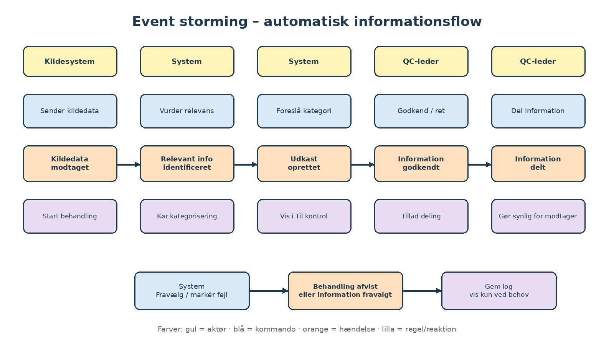

Figur 9. Gul: aktør. Blå: kommando. Orange: indtruffet hændelse i datid. Lilla: regel eller efterfølgende reaktion. Den nederste række viser fravalg eller fejl som alternativt forløb.

| Event | Trigger og betingelse | Respons |
|---|---|---|
| E01 KildedataModtaget | Gyldig ny Outlook-/Teams-lignende post eller manuel note modtages. | Gem D1-kilde og start 2.0. |
| E02 RelevantInformationIdentificeret | Relevansregler matcher, eller posten kræver manuel vurdering. | Fortsæt til kategorisering og resumé. |
| E03 UdkastOprettet | Strukturering og lagring lykkes. | Vis posten i Til kontrol med kilde og forslag. |
| E04 UdkastRettet | Leder gemmer ændring med korrekt versionsnummer. | Forøg version og fjern tidligere godkendelse. |
| E05 InformationGodkendt | Leder godkender aktuel, gyldig version. | Gem godkender/tidspunkt og tillad deling. |
| E06 InformationDelt | Aktuel version er godkendt, og modtagere har adgang. | Gem snapshot/modtagere atomisk og gør information synlig. |

## 9 Datalag og ER diagram

Den relationelle model adskiller original kildedata fra den redigerbare informationspost og den delte version. Kilden gemmer hvilket kildesystem posten stammer fra samt et eksternt ID, så dubletter kan opdages. Kategorier indeholder de regler/nøgleord, som bruges ved relevans og kategorisering. PK angiver primærnøgle og FK fremmednøgle.

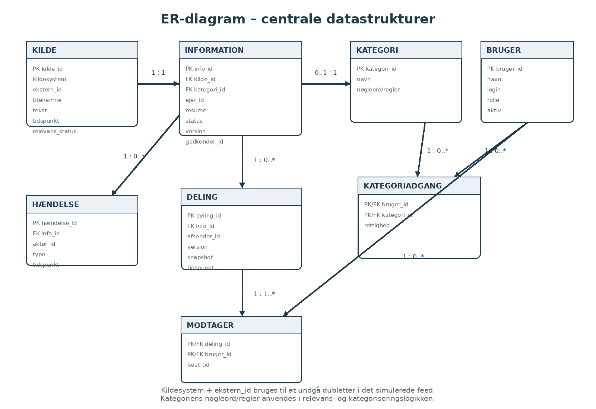

Figur 10. ER-diagram for prototypen. Kategoriadgang og Modtager er forbindelsestabeller med sammensat primærnøgle. Kilde → Information bevarer sporbarhed tilbage til det oprindelige Outlook-/Teams-lignende testinput.

Brugerrelationer er angivet som FK i entiteterne for at holde figuren læsbar: Bruger 1 til 0..* Information som ejer; Bruger 0..1 til 0..* Information som godkender; Bruger 1 til 0..* Deling som afsender; Bruger 1 til 0..* Modtager; Bruger 1 til 0..* Hændelse som aktør. Information har 0..1 kategori, indtil systemet eller lederen har fastlagt placering; en kategori kan indeholde 0..* poster.

## 9 Datastrukturer og integritet

| Entitet | Centrale felter og typer | Regler |
|---|---|---|
| Bruger | bruger_id INT; navn VARCHAR(100); login VARCHAR(100); password_hash VARCHAR(255); rolle ENUM; aktiv BOOL | Rolle: leder, medarbejder eller administrator. Adgang kræver aktiv bruger. |
| Kategori | kategori_id INT; navn VARCHAR(100); nøgleord JSON; aktiv BOOL | Kategori-ID er stabilt. Nøgleord/regler bruges ved relevans og kategoriforslag. |
| Kategoriadgang | bruger_id INT; kategori_id INT; rettighed ENUM | Unikt par. Rettighed er læs eller redigér. |
| Kilde | kilde_id INT; kildesystem ENUM; ekstern_id VARCHAR(200) NULL; afsender VARCHAR(200) NULL; titel VARCHAR(200); tekst TEXT; tidspunkt DATETIME; behandlingsstatus ENUM | Unikt kildesystem + ekstern_id, hvis ID findes. Original kildetekst ændres ikke ved resumérettelser. |
| Information | info_id INT; kilde_id INT; ejer_id INT; titel VARCHAR(200); kategori_id INT NULL; resumé TEXT; status ENUM; version INT; godkender_id INT NULL; godkendt_tid DATETIME NULL | kilde_id er unik for ledervendte poster. Status: udkast eller godkendt. Godkendt kræver kategori og godkender. |
| Deling | deling_id INT; info_id INT; afsender_id INT; version INT; snapshot TEXT; tidspunkt DATETIME; request_id VARCHAR(100) | Snapshot gemmer godkendt titel, resumé, kategori og kildehenvisning. request_id er unik pr. afsender. |
| Modtager | deling_id INT; bruger_id INT; læst_tid DATETIME NULL | Unikt par. En gennemført deling har mindst én modtager. |
| Hændelse | hændelse_id INT; kilde_id INT NULL; info_id INT NULL; aktør_id INT NULL; type VARCHAR(60); tidspunkt DATETIME; detaljer JSON NULL | Import-, behandlings-, godkendelses- og delingshændelser logges og kan ikke redigeres fra brugerfladen. |

Deling, modtagere og hændelseslog gemmes atomisk. Ved fejl rulles hele transaktionen tilbage. Kildesystem + ekstern_id anvendes til idempotent import, så samme eksterne post ikke oprettes flere gange. Forventet_version kontrolleres ved rettelse, godkendelse og deling, så ændringer fra en anden session ikke overskrives.

Testdata: tre lederkonti, fem medarbejderkonti, én administrator, fire emnekategorier og mindst 30 fiktive kilder fordelt på Outlook- og Teams-lignende poster samt få manuelle noter. Datasættet skal indeholde relevante, irrelevante og tvetydige eksempler. Et særskilt datasæt med 1.000 informationsposter bruges til svartidstest.

## 10 Visuelt design

### Lightning demos

Lightning demos tager udgangspunkt i velkendte mønstre fra eksisterende arbejdsværktøjer: Outlooks mapper/søgning og Teams’ samlede møde- og kanalvisninger inspirerer henholdsvis kategorisering, kildeangivelse og samlet overblik. Inspirationen bruges som designmønster; den dokumenterer ikke effekt hos AGC.

### Crazy 8s

Otte skitseforslag udforsker systemets centrale visninger: automatisk Til kontrol-kø, kategorier, kildefeed, kontrol af kilde mod resumé, søgning, deling, historik og forklaring af relevansmatch. Manuel indtastning er derfor ikke hovedindgangen til systemet.

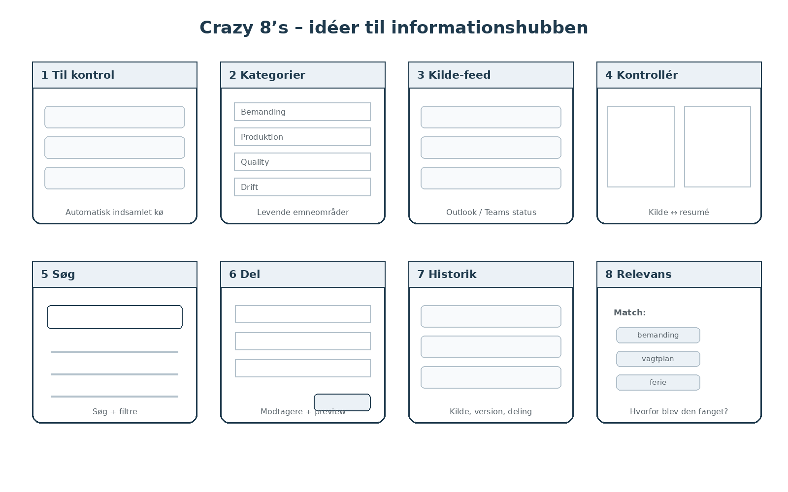

Figur 11. Otte konceptskitser. De er designforslag; en gennemført Crazy 8s workshop eller brugerpræference er ikke dokumenteret.

### Valgt udtryk

Brugerfladen skal have rolig baggrund, tydelige overskrifter og ensartede knapper. “Til kontrol” er lederens primære startside. Hver post skal vise kildesystem, tidspunkt, foreslået kategori og status. Original kilde og systemets resumé skal kunne sammenlignes direkte, så automatiseringen er gennemsigtig og kan korrigeres.

## 10 Wireframes til webportalen

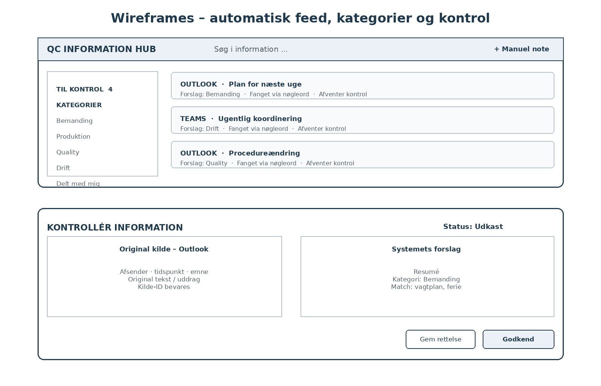

Figur 12. Øverst: automatisk indsamlet Til kontrol-kø med kildesystem og kategoriforslag. Nederst: kontrol af originalkilde ved siden af systemets resumé, kategoriforslag og de nøgleord, der udløste matchet.

Lederen skal kunne se, hvorfor en post er havnet i Til kontrol, og ændre kategori eller resumé uden at ændre originalkilden. Godkend er først aktiv, når titel, resumé og kategori er gyldige. Manuel note findes som sekundær handling og er ikke hovedvejen for at få information ind i systemet.

## 10 Wireframes til kildefeed, manuel note og deling

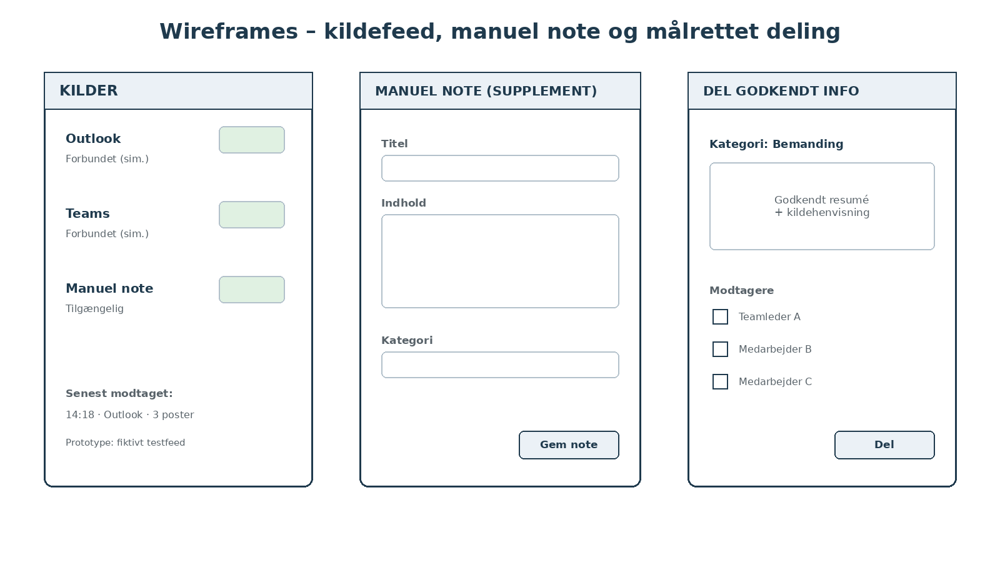

Figur 13. Venstre: status for de simulerede Outlook- og Teams-kilder. Midt: manuel note som supplement. Højre: målrettet deling af en allerede godkendt informationspost.

Webportalen samler de relevante informationer, som kildesystemerne leverer. Brugeren arbejder primært med automatisk indsamlede poster, hvor systemet har vurderet relevans og foreslået struktur. Manuel note bruges kun, når informationen ikke kan komme fra de tilsluttede kilder, fx efter en telefonsamtale.

I første prototype betyder en “forbundet” Outlook- eller Teams-kilde, at et kontrolleret testfeed kan sende fiktive poster til systemets connector-interface. Det er en simulation af dataflowet, ikke en rigtig AGC-integration. Del information gør den godkendte version synlig for valgte testbrugere i den interne indbakke.

### Krav til udseende

NF01: De samme labels og statusbetegnelser skal anvendes på alle skærme. Accept: Udkast og Godkendt vises ens i indbakke, detaljevisning og delingspanel, og ingen status formidles alene med farve.

## 11 Brugervenlighed

NF02: Efter højst to minutters introduktion skal mindst fire af fem testbrugere kunne åbne en automatisk indsamlet post, kontrollere kilde og kategoriforslag, rette ved behov, godkende og dele uden hjælp. NF03: Kernefunktionerne skal kunne anvendes i browser ved minimum 1280 pixels bredde uden vandret rulning i hovedvisningen. Testene gennemføres med fiktive data.

## 12 Ydeevne og robusthed

NF04: Søgning blandt 1.000 testposter skal have en 95-percentil på højst to sekunder ved fem samtidige testbrugere og 30 søgninger pr. bruger på det dokumenterede testmiljø. NF05: Et fiktivt connector-input skal enten oprette/behandle en kilde eller returnere fejl inden for tre sekunder; gem og del skal give kvittering eller fejl inden for tre sekunder under samme testbelastning.

NF06: Ved simuleret databasefejl under deling må hverken deling, modtagere eller succeslog stå tilbage delvist. Ved genforsøg med samme request_id må der højst eksistere én deling. Accept: Dette kontrolleres i database og brugerflade.

## 13 Driftsmiljø

NF07: Kerneforløbet skal virke i de versioner af Chrome og Safari, som registreres ved testen. Prototypen skal kunne startes i et dokumenteret udviklingsmiljø med særskilt testdatasæt og simulerede connector-feeds. Ingen produktionsadgang til Outlook, Teams eller AGCs øvrige systemer er en forudsætning for demonstrationen.

## 14 Vedligeholdelse og support

NF08: Præsentation, connector/API-logik, forretningslogik og databaseadgang skal være adskilt i implementeringen. En ny relevans- eller kategoriregel skal kunne tilføjes uden at ændre brugerfladens kode. Accept: Tilføj et nøgleord og vis, at et nyt testinput ændrer relevans eller kategoriforslag. Projektgruppen dokumenterer opsætning og nulstilling af testdata.

## 15 Sikkerhed

NF09: Rolle- og adgangskontrol skal udføres på serveren ved alle læse- og skrivekald. Accept: En medarbejder kan hverken godkende eller se en anden brugers private udkast, heller ikke med et manuelt ændret ID. NF10: Fiktive testkonti skal anvendes; adgangskoder må ikke lagres som klartekst. En eksternt tilgængelig prototype skal bruge HTTPS.

## 16 Sprog og arbejdskultur

NF11: Første prototype bruger dansk og entydige faglige betegnelser. Navne og indhold skal kunne indeholde æ, ø, å og engelske fagudtryk. Accept: Testdata med disse tegn gemmes og vises korrekt. Sprogvalg til en eventuel pilot afklares med brugerne.

## 17 Juridiske og organisatoriske forhold

NF12: Demonstrationen må kun bruge fiktive person-, mail- og Teams-data. Før en pilot med virkelige integrationer skal AGC afklare adgang, behandlingsgrundlag, persondata, fortrolighed, opbevaring, sletning og eventuelle kvalitetskrav med de ansvarlige funktioner. Automatisk indsamling må ikke sættes i drift alene på baggrund af prototypen.

## 18 Åbne spørgsmål

Hvilke Outlook-postkasser, Teams-rum eller andre interne kilder må indgå? Hvilke metadata må connectoren hente? Hvem ejer relevans- og kategorireglerne? Hvilke QC-teams og kategorier skal indgå? Hvem må se originalkilder? Hvor længe skal kildedata opbevares? Spørgsmålene afklares med QC, IT, informationssikkerhed og relevante kvalitetsfunktioner før en pilot.

## 19 Standardløsninger og komponenter

Mapper, søgning, samlet informationsvisning og connector-baseret dataudveksling er standardmønstre, som bør genbruges frem for at bygge alt fra bunden. Før en produktionsløsning skal AGC vurdere, hvilke eksisterende godkendte integrationsmuligheder der kan anvendes. Prototypen bruger kun simulerede connector-input og standardkomponenter til login, databaseadgang og tekstbehandling.

## 20 Nye problemer

Automatisk indsamling kan skabe nye problemer, hvis for meget irrelevant information fanges, samme post importeres flere gange eller et resumé/kategoriforslag er forkert. En ekstra platform kan også skabe flere notifikationer. Derfor skal løsningen have deduplikering, kildehenvisning, lederkontrol og mulighed for at fravælge eller korrigere systemets forslag.

## 21 Opgaver

| Rækkefølge | Leverance | Ansvar |
|---|---|---|
| 1 | Validér kilder, kategorier, nøgleord og hovedforløb med en QC-leder. | Projektgruppe og kontaktperson |
| 2 | Etablér datamodel, testkonti og fiktive Outlook-/Teams-feeds. | Projektgruppe |
| 3 | Byg connector-endpoint, relevansfilter, kategorisering, Til kontrol og lederkontrol. | Projektgruppe |
| 4 | Tilføj godkendelse, deling, søgning, manuel note, fejlvisning og log. | Projektgruppe |
| 5 | Gennemfør accepttest og brugertest; ret fundne fejl og regelmatch. | Projektgruppe og testbrugere |

## 22 Overgang til produktet

Der migreres ingen virkelige data i prototypen. En eventuel pilot bør afgrænses til ét team, få kategorier og få godkendte kilder. Eksisterende systemer forbliver autoritative kilder. Connector-adgang, regler for hvilke data der må hentes, ejerskab, support og en procedure for at afslutte piloten fastlægges før opstart.

## 23 Risici

| Risiko | Håndtering og kontrol |
|---|---|
| Forkert relevans, resumé eller kategori | Vis originalkilde og matchgrundlag; kræv ledergodkendelse og tillad rettelser/fravalg. |
| Uønsket adgang til information | Kontrollér adgang på serveren; begræns kilder/kategorier og afprøv uautoriserede opslag. |
| Integrations- og datakvalitetsrisiko | Brug simulerede feeds i prototypen; valider felter, deduplikér og afklar produktionsadgang med IT før pilot. |
| Mere informationsbelastning | Filtrér før Til kontrol, vis matchgrundlag og mål antal irrelevante poster samt køens størrelse. |
| Lav anvendelse | Test med repræsentative brugere og registrér, om kontrolarbejdet reelt er lettere end manuel indsamling. |

## 24 Omkostninger

Foreløbigt estimat for prototypen. Timerne er et planlægningsforslag og omfatter ikke en produktionsløsning.

| Arbejde | Estimerede gruppetimer |
|---|---|
| Afklaring og design | 8–12 |
| Datamodel, connector-simulation og logik | 18–28 |
| Brugerflade, Til kontrol og systemfunktioner | 18–28 |
| Test, rettelser og dokumentation | 10–16 |
| I alt | 54–84 |

En økonomisk vurdering skal senere medtage udvikling og vedligeholdelse af integrationer, licenser, drift, træning, kontroltid og fejlbehandling. Mulig årlig tidsværdi beregnes som brugere × sparede minutter pr. dag ÷ 60 × arbejdsdage × timeomkostning. Besparelsen skal måles mod den nuværende tid til at finde, sortere og videreformidle information.

## 25 Brugerdokumentation

En kort vejledning beskriver Til kontrol, kildehenvisning, relevansmatch, kategoriforslag, rettelse, godkendelse, deling, søgning, manuel note samt markeringen af simulerede integrationskilder.

## 26 Waiting room

Produktionsklar autentificering og realtidsintegration til AGCs Outlook-/Teams-miljø, eventuel møde-transskription, øvrige interne kilder, dagsbrief, automatiske modtagerforslag og eksterne notifikationer prioriteres efter brugertest og organisatorisk afklaring. Den første prototype demonstrerer kun disse kilders dataflow gennem fiktive feeds.

## 27 Idéer til videre udvikling

Senere kan løsningen afprøve flere datakilder, mere avanceret relevansklassifikation, forslag til modtagere, tidslinje og dagsbrief. Idéerne vurderes efter deres effekt på informationsbelastningen og må ikke fjerne lederens mulighed for at kontrollere og stoppe deling.

## Accepttest og sporbarhed

Testene beskriver planlagt verifikation. Der er ikke registreret gennemførte test eller brugerresultater i denne kravspecifikation.

| Test | Scenarie og forventet resultat | Sporbarhed |
|---|---|---|
| T01 | Send samme fiktive Outlook-post to gange. Præcis én Kilde oprettes pga. kildesystem + ekstern_id. | F02; 1.0; Kilde |
| T02 | Send en relevant Teams-post med definerede nøgleord. Den vises automatisk i Til kontrol med kilde, resumé og kategoriforslag. | F02–F05; PUC 01; 1.0–2.0 |
| T03 | Send et klart irrelevant testinput. Det opretter ikke en normal ledervendt post, men behandlingen kan spores i loggen. | F03, F11; 2.2; E01–E02 |
| T04 | Afprøv entydigt kategorimatch, intet match og ligelig score. Kun entydigt match giver kategori; øvrige giver Uklassificeret. | F04; BR6; 2.3.1–2.3.3 |
| T05 | Ret et automatisk udkast og godkend version 1. Ret igen. Ny version er udkast og kan ikke deles før ny godkendelse. | F06–F07; BR3–BR5; 3.0 |
| T06 | Del godkendt version med to autoriserede brugere. Begge kan læse samme snapshot; andre kan ikke. | F07, F09; E06; Deling og Modtager |
| T07 | Forsøg at dele med en bruger uden kategoriadgang. Hele delingen afvises. | F01, F07, NF09; D3 |
| T08 | Søg på titel og filtrér efter kategori og kildesystem. Resultaterne er korrekte og adgangsbegrænsede. | F08; 4.0; D2–D4 |
| T09 | Simulér ugyldigt connector-input og databasefejl under deling. Ingen halv/dobbelt post eller deling må stå tilbage. | F02, F11, NF06; 1.0/3.0 |
| T10 | Gennemfør hovedforløbet fra automatisk testfeed til kontrol, godkendelse og deling. Registrér hjælp, fejl, tid og brugerens vurdering. | NF02–NF05; PUC 01 |

### Vurdering af forretningsværdi

Brug tilsvarende fiktive informationsopgaver i to forløb: (A) brugeren skal selv finde relevante oplysninger i separate mail-/Teams-lignende testmaterialer og strukturere dem, og (B) samme oplysninger leveres automatisk til Til kontrol gennem testfeedet. Mål tid til korrekt identificering, kategorisering og deling, antal fejl og oplevet overblik. En lille prototypetest giver indikationer til videre arbejde, ikke dokumentation for effekt i hele QC.

## Kilder og modelgrundlag

[K1] Ideudvikling med teknologi, Forløb 3.1. Vedhæftet undervisningsmateriale document (2).pdf. Afsnittene The Template og Aflevering af kravspecifikation er grundlag for dokumentets indhold og disposition.

[K2] Microsoft Support. Organize email by using folders in Outlook. Tilgået 24. september 2026. https://support.microsoft.com/en-us/outlook/training/organize-email-by-using-folders-in-outlook

[K3] Microsoft Support. Recap in Microsoft Teams. Tilgået 24. september 2026. https://support.microsoft.com/en-us/teams/meetings/recap-in-microsoft-teams

Casegrundlag: Projektets beskrevne scope for QC-ledere med personaleansvar og løsningskonceptet med en central informationshub, der kobles til eksisterende informationskanaler, identificerer relevante oplysninger via regler/nøgleord, organiserer dem i kategorier og understøtter menneskelig kontrol og målrettet videreformidling. I første prototype simuleres Outlook-/Teams-input med fiktive data.

### Sammenhæng med afleveringskravene

| Afleveringskrav | Placering i dokumentet |
|---|---|
| The Template med 27 punkter | Afsnit 1–27 |
| Business use case og BPMN diagrammer | Afsnit 7, figur 1–2 |
| Product use case og user journey map | Afsnit 8, PUC 01 og rejsetabel |
| Tre lags arkitektur | Afsnit 8, figur 3 |
| DFD context og level 0, 1, 2 og 3 | Afsnit 9, figur 4–8 |
| Procesbeskrivelser og dataflowdefinitioner | Afsnit 9, proces- og flowtabeller |
| Events, event storming og eventtabel | Afsnit 9, figur 9 og E01–E06 |
| Datalag og ER diagram | Afsnit 9, figur 10 og datastrukturer |
| Lightning demos, Crazy 8s og wireframes | Afsnit 10, figur 11–13 |
| Funktionelle og nonfunktionelle krav | Afsnit 9 og 10–17, F01–F14 og NF01–NF12 |
