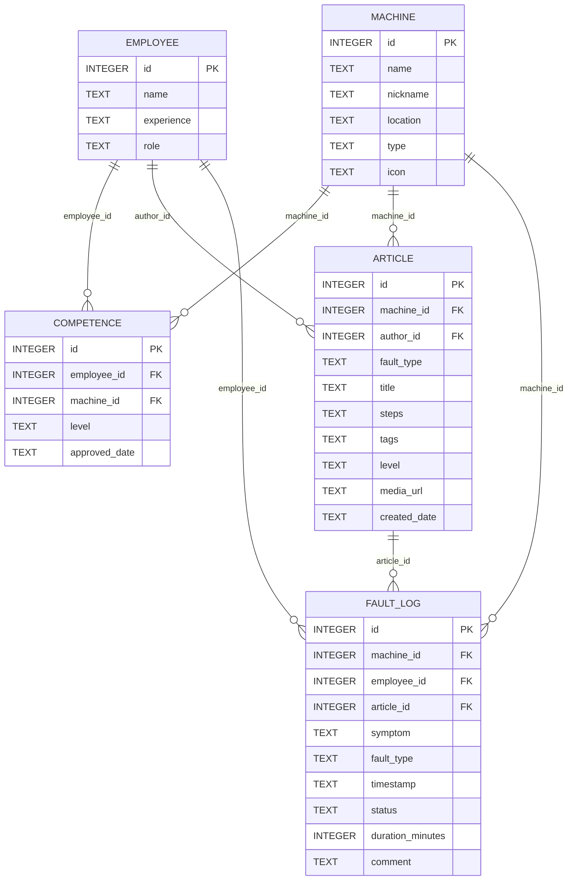
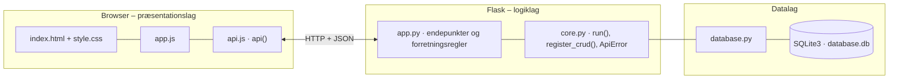

# Solum – vidensdeling og fejlfinding – dokumentation af prototypen

En app til Solums driftsmedarbejdere, der skal gøre **tavs viden om maskinerne tilgængelig for alle**,
så nedetid ved fravær af nøglemedarbejdere mindskes. Medarbejderen vælger maskine og symptom og får trin-for-trin-guides.
Erfarne kolleger dokumenterer ny viden, og driftsledelsen ser, hvor sårbarheden er størst.

Kravgrundlag: [`Kravspecifikation-Vidensdeling-App-Solum-Samlet.md`](Kravspecifikation-Vidensdeling-App-Solum-Samlet.md)

## Hvad kan prototypen

| Skærm (jf. wireframes i del 5.1) | Funktion |
|---|---|
| **Maskiner** (startskærm) | Stort ikon pr. maskine med antal godkendte operatører (rød = højst én), guides og fejl de sidste 30 dage |
| **Fejlfinding** (maskineskærm og guide) | "Hvad er problemet?", *Find guide* / *Vis kendte fejl*, hyppige fejl, kolleger der kan hjælpe, nummererede trin samt *Løst* / *Jeg har stadig problemer* |
| **Bidrag med viden** | Opret, ret og slet vidensartikler (kun erfarne) |
| **Kompetenceoverblik** | Matrix med medarbejdere × maskiner. Klik på en celle for at ændre niveau |
| **Fejllog** | Alle registrerede fejl med guide, varighed og status |

Store trykflader og få tryk til en guide (krav 10–11).

## Fra krav til kode

| Krav (del 1, 3.3) | Implementering |
|---|---|
| 1 Vælg maskine fra oversigt | `GET /api/machines/overview` |
| 2 Trin-for-trin-guide tilpasset erfaringsniveau | `rank_articles()`: nyansatte får *grundlæggende* først, erfarne *dybdegående* |
| 3 Søg på symptom/fejlkode | `rank_articles()` matcher ord mod titel, fejltype, tags og trin |
| 4 Erfarne opretter/redigerer vidensartikler | CRUD `/api/articles` + `validate_article()` (nyansat → 403) |
| 5 Kompetenceoverblik | `GET /api/competence-matrix` + CRUD `/api/competences` |
| 6 Log om fejlen blev løst via guide | `POST /api/faults` → `POST /api/faults/<id>/resolve` |
| 7 Historiske fejlmønstre pr. maskine | `machine_details()` grupperer `fault_log` pr. fejltype |
| 8 Varsel om kendte fejlmønstre | Ikke implementeret: ligger i Waiting Room (punkt 26) pga. uafklaret datakvalitet. Fejlmønstrene vises dog |

**Rangering (DFD 1.3.1–1.3.3):** filtrér på maskine → match symptomord → sortér efter antal match, om niveauet passer til medarbejderen, og løsningsrate (`LØST / (LØST + ULØST)` fra `fault_log`).

**Events (del 5.2)**

| Event | Hvor |
|---|---|
| FejlRegistreret | `POST /api/faults` opretter en `fault_log`-række med status `ÅBEN` |
| GuideVist | Samme svar indeholder `guides` (rangeret) |
| FejlLøst / FejlUløst | `POST /api/faults/<id>/resolve`. Uløst returnerer `escalate_to` (godkendte kolleger) |
| VidensartikelOprettet | `POST /api/articles` |
| KompetenceOpdateret | `POST/PUT /api/competences` |

## Datamodel

Datamodellen følger ER-diagrammet i kravspecifikationens del 5.3:



## Eksempel på dataudveksling

Den nyansatte Mikkel registrerer, at sorteringsrobotten er stoppet. Systemet logger fejlen og returnerer rangerede guides samt kolleger, der kan hjælpe:

```bash
curl -X POST http://localhost:5105/api/faults \
  -H 'Content-Type: application/json' \
  -d '{"machine_id": 1, "employee_id": 3, "symptom": "robotten stopper nødstop"}'
```

Svar `201`:

```json
{
  "fault": {
    "id": 11,
    "machine_id": 1,
    "employee_id": 3,
    "article_id": null,
    "symptom": "robotten stopper nødstop",
    "fault_type": null,
    "timestamp": "2026-09-29 15:50:36",
    "status": "ÅBEN",
    "duration_minutes": null,
    "comment": null
  },
  "guides": [
    {
      "id": 1,
      "machine_id": 1,
      "author_id": 1,
      "fault_type": "Nødstop",
      "title": "Robotten står i nødstop efter fastklemt emne",
      "steps": [
        "Tryk på den gule reset-knap ved styreskabet",
        "Kontrollér at der ikke sidder emner fast ved griberen",
        "… (forkortet)"
      ],
      "tags": "nødstop,fastklemt,E-101,stopper,griber",
      "level": "grundlæggende",
      "media_url": null,
      "created_date": "2026-08-12",
      "author_name": "Jesper (erfaren)",
      "machine_name": "Sorteringsrobot",
      "solved": 4,
      "unsolved": 0,
      "…": "2 felter mere"
    }
  ],
  "no_guide_found": false,
  "experts": [
    {
      "id": 1,
      "name": "Jesper (erfaren)",
      "level": "ekspert"
    }
  ]
}
```

## Kør prototypen

```bash
cd backend
python3 -m venv .venv && source .venv/bin/activate   # første gang
pip install -r requirements.txt                       # første gang
python app.py
```

Terminalen skriver ` * Åbn http://localhost:5105`. Åbn adressen i browseren. Flask serverer både API'et (`/api/...`) og frontenden.

- **Port:** Prototypen bruger port **5105** (5100 + projektnummer). Er porten optaget, vælger `run()` i `core.py` selv den næste ledige og skriver fx ` * Port 5105 er optaget – bruger port 5106 i stedet`. Du kan også vælge port selv med `PORT=5200 python app.py`.
- **Stop serveren** med `Ctrl` + `C` i terminalen, hvor den kører.
- **Kodeændringer:** Serveren kører i debug-tilstand og genstarter selv, når du gemmer en `.py`-fil. Den bliver på samme port. Ændringer i `frontend/` kræver kun, at du genindlæser siden.
- **Database:** `backend/database.db` oprettes med testdata ved første start. Nulstil den med `python database.py --reset`, mens serveren er stoppet.
- **Tjek at backenden svarer:** `curl http://localhost:5105/api/health`

### Fejlfinding

| Problem | Årsag | Løsning |
|---|---|---|
| ` * Port 5105 er optaget – bruger port …` | En anden proces, ofte en glemt server, bruger porten | Brug den adresse, der står i terminalen. Se hvad der optager porten med `lsof -nP -iTCP:5105 -sTCP:LISTEN`. En Flask-server i debug-tilstand er to processer, så stop dem begge med `lsof -t -iTCP:5105 -sTCP:LISTEN \| xargs kill` |
| `ModuleNotFoundError: No module named 'flask'` | Det virtuelle miljø er ikke aktiveret, eller Flask er ikke installeret | `source .venv/bin/activate` og `pip install -r requirements.txt` |
| Siden viser "Kan ikke hente data fra backenden" | Serveren kører ikke, eller `index.html` er åbnet direkte fra disken, mens serveren kører på en anden port | Start serveren og åbn adressen fra terminalen i stedet for filen |
| Tallene passer ikke efter mange tests | Databasen indeholder testdata fra tidligere afprøvninger | Stop serveren og kør `python database.py --reset` |
| `no such table …` | `database.db` er tom eller ødelagt | `python database.py --reset` |

## Arkitektur

Prototypen følger holdets fælles tre-lags struktur (se [`../README.md`](../README.md)):



| Fil | Lag | Indhold |
|---|---|---|
| `frontend/index.html` | Præsentation | Skærmbilleder som faneblade og formularer. Projektets farver og `data-api-port` |
| `frontend/app.js` | Præsentation | Henter data med `api()`, tegner dem i DOM'en og sender formularer |
| `frontend/api.js` | Præsentation | Fælles for alle prototyper: `api()` (fetch + JSON), `h()`, `renderTable()`, `fillSelect()`, `formToJson()`, `bindCrudForm()` og `toast()` |
| `frontend/style.css` | Præsentation | Fælles responsivt design |
| `backend/app.py` | Logik | Projektets forretningsregler og endepunkter |
| `backend/core.py` | Logik | Fælles: `create_app()` (Flask, CORS, JSON-fejl), `run()` (start på ledig port), `ApiError` og `register_crud()` |
| `backend/database.py` | Data | Fælles: forbindelse, `query_all/query_one/execute`, `transaction()` og `init_db()` |
| `backend/schema.sql` · `seed.sql` | Data | Tabeller og fiktive testdata |

Alle fejl returneres som JSON (`{"error": "…", "path": "/api/…"}`) med statuskode 400, 401, 403, 404 eller 409 og vises som en rød besked i frontenden.
Nederst på siden kan man åbne **"Seneste JSON-svar fra API'et"** og se den rå dataudveksling.
Den fulde endepunktsliste står i [`backend/README.md`](backend/README.md).

## Design og responsivitet

- Samme stylesheet i alle prototyper. Kun farverne (`--brand`, `--brand-dark`, `--brand-soft`) sættes i `index.html`.
- Layoutet virker fra mobil (375 px) til desktop uden vandret scroll. Kort lægger sig under hinanden på små skærme, og brede tabeller scroller inde i deres kort.
- Formularfelter kan ikke blive bredere end deres kort. En `<select>` med lange valgmuligheder skubber altså ikke formularen ud over kanten.
- Beskeder vises kort i toppen (grøn = gennemført, rød = fejl fra serveren).


## Testdata

5 medarbejdere (nyansatte og erfarne), 8 maskiner (flere med kælenavne efter en medarbejder, fx "Jespers robot"),
13 kompetencer, 6 vidensartikler og 10 fejl i loggen, hovedsageligt på sorteringsrobotten.

## Afgrænsning

Ingen PLC- eller sensorintegration, offline-tilstand eller upload af medier (en URL til billede/video kan angives). Login simuleres med vælgeren *Jeg er*.
