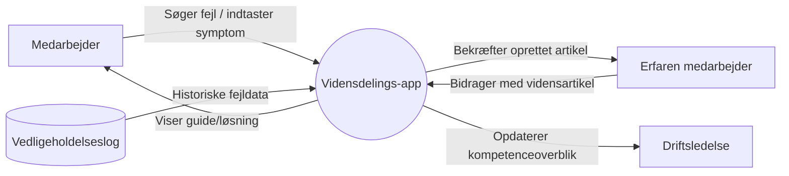
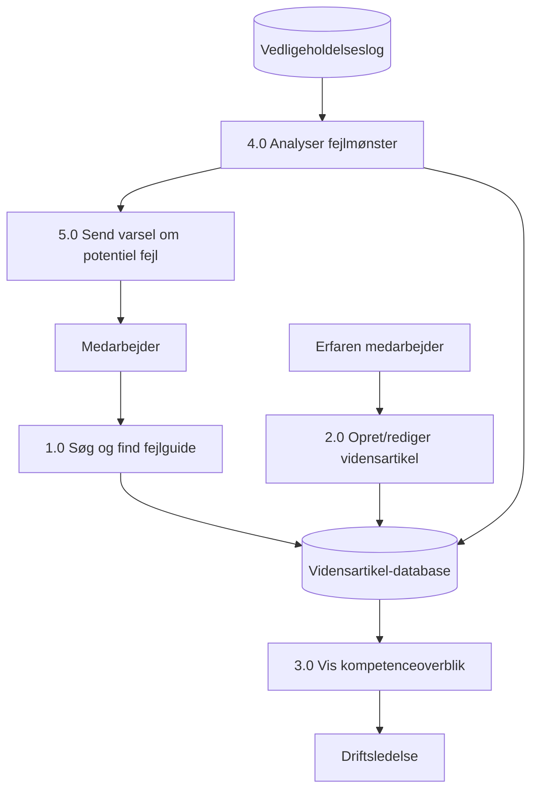
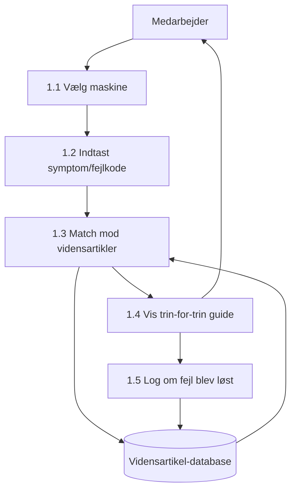
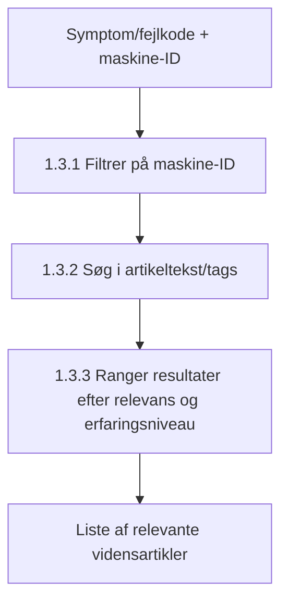
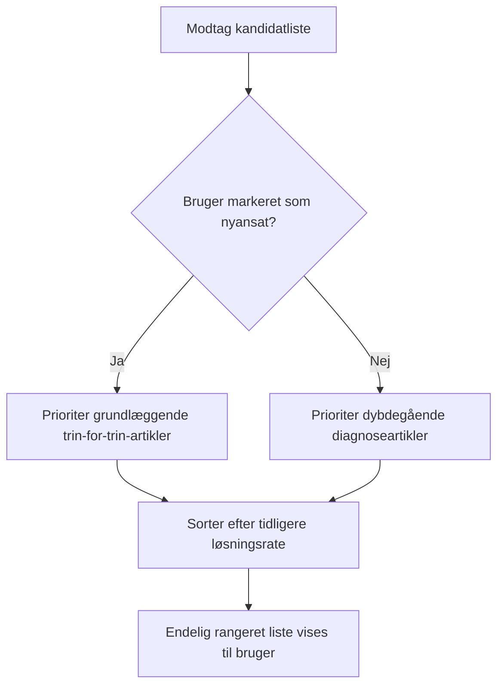
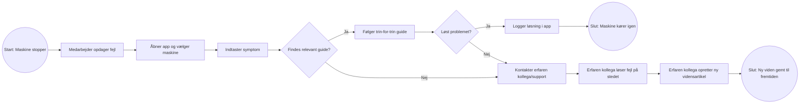
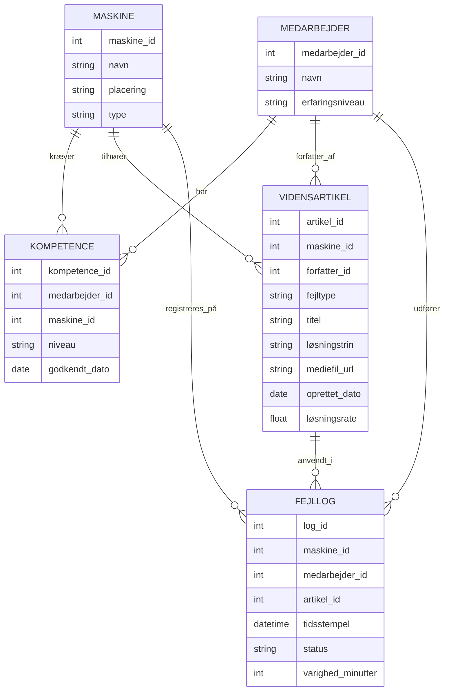

# Kravspecifikation: Vidensdelingsapp til Solum A/S

Gruppe 4 · Forløb 3.1 · Ideudvikling med teknologi og data · 24.09.2026

Prototypen er en **vidensdelings- og fejlfindingsapp** til Solums driftsmedarbejdere. Målet er at alle medarbejdere skal kunne operere alle maskiner på sorteringspladsen, så nedetid ved sygdom eller fravær af nøglemedarbejdere minimeres, og virksomhedens indtjening dermed ikke rammes negativt.

---

## Del 0: Analyse af krav

### 0.1 Quality Gateway

En Quality Gateway er et filter, som hvert enkelt krav skal passere, før det accepteres som en del af kravspecifikationen. Formålet er at sikre, at kravene er entydige, testbare og forankrede — og ikke bare vage ønsker. Nedenfor er gatewayen anvendt på fire centrale funktionelle krav.

| Krav | Kilde | Rationale | Fit criterion (målbart) | Ejer/prioritet |
|---|---|---|---|---|
| Systemet skal vise en trin-for-trin diagnoseguide, tilpasset erfaringsniveau | Value Proposition Canvas: pain "lang oplæringstid" + interview med Thomas Melgaard | Nyansatte kan i dag ikke fejlfinde selvstændigt, da viden er tavs og bundet til erfarne kolleger | Guiden skal kunne findes og vises på under 10 sekunder efter valg af maskine; 90 % af nyansatte skal kunne følge trinene uden at spørge en kollega | Driftsledelse / høj prioritet |
| Erfarne medarbejdere skal kunne oprette en vidensartikel (tekst/billede/video) | SECI-modellen (eksternalisering af tavs viden) + SWOT: "kritisk viden er tavs og bundet til enkeltpersoner" | Uden et sted at dokumentere viden forsvinder den, når en nøglemedarbejder er væk | En vidensartikel skal kunne oprettes på under 5 minutter af en bruger uden it-erfaring | Erfarne medarbejdere (bidragydere) / høj prioritet |
| Systemet skal vise et kompetenceoverblik pr. maskine | SWOT: 6 af 15 maskiner navngivet efter en medarbejder; Solum A/S, 2026a | Driftsledelsen kan i dag ikke se, hvor sårbarheden ved fravær er størst | Overblikket skal opdateres automatisk, når en ny kompetence godkendes, og vise alle 15 maskiner × alle medarbejdere | Driftsledelse / middel prioritet |
| Systemet skal kunne varsle ved kendte fejlmønstre | McKinsey (Dilda m.fl., 2017): prædiktiv vedligeholdelse reducerer nedetid 30-50 % | Nuværende registrering er kun deskriptiv (varighed), ikke prædiktiv | Skal afprøves som pilot på sorteringsrobotten først, da datakvaliteten i loggen er uafklaret | Projektgruppe / lav prioritet, afventer validering |

**Konklusion:** De tre første krav har en klar kilde, et dokumenteret rationale og et målbart fit criterion, og går derfor direkte ind i kravspecifikationen. Det fjerde krav (prædiktivt varsel) har et svagere fit criterion pga. uafklaret datakvalitet og placeres derfor i "Waiting Room" (punkt 26), ikke som fast krav til første version.

### 0.2 Øvrige elementer fra analysefasen

- **Project Blastoff:** Opstartsmøde og interview med Thomas Melgaard samt virksomhedsbesøg dannede grundlag for at afklare projektets rammer og den nuværende problemformulering.
- **Stakeholder Map:** Driftsledelse, driftsteknikere, maskinførere, nyansatte, erfarne nøglemedarbejdere samt indirekte erhvervskunder (HCS, Remondis, HC Container).
- **Trawling Requirements:** Krav er indsamlet via semistruktureret interview, observation på pladsen og gennemgang af Solums egen driftsopgørelse og vedligeholdelseslog.
- **Context Model:** Se Del 2.1 (Context Diagram) for den grafiske model af systemets grænser (BUC/PUC).
- **Business Event List:** FejlRegistreret, GuideVist, FejlLøst, FejlUløst, VidensartikelOprettet, KompetenceOpdateret (uddybet i Del 5.2, Event-tabel).

---

## Del 1: The Template — indhold i kravspecifikationen

### 1.0 Project Drivers

**1.1 The Purpose of the Project**
Formålet er at reducere Solums afhængighed af enkeltpersoners tavse viden om drift og fejlfinding. I dag kan kun udvalgte medarbejdere operere bestemte maskiner (fx sorteringsrobotten, der kun betjenes af én medarbejder). Business advantage: højere og mere stabil oppetid (udgangspunkt: 76,4 % oppetid, 17,3 % nedetid i august 2026), mindre sårbarhed ved sygdom/fravær, og hurtigere oplæring af nye medarbejdere.

**1.2 The Client, the Customer, and other Stakeholders**
- **Client:** Solum A/S, ved salgschef Thomas Melgaard.
- **Customer:** Solums driftsledelse (beslutter og finansierer løsningen).
- **Øvrige stakeholders:** driftsteknikere, maskinførere, nyansatte, erfarne nøglemedarbejdere (videnskilder), samt indirekte erhvervskunder (HCS, Remondis, HC Container).

**1.3 Users of the Product**
Solums 27 driftsmedarbejdere: maskinførere, teknikere og driftsledelse med fysisk adgang til pladsen. Spænder fra nyansatte uden erfaring til erfarne medarbejdere. Bruges ofte under tidspres med beskidte/våde hænder, hvorfor betjeningen skal være enkel og hurtig.

### 2.0 Project Constraints

**2.1 Requirements Constraints**
- Afgrænset til Solums anlæg på Sjælland og til intern vidensdeling om maskinparken.
- Løsningen skal være på dansk.
- Skal kunne bruges af medarbejdere uden it-erfaring, direkte ved maskinerne, gerne med delvis offline-adgang.
- Går ikke i dybden med selve AI-sorteringsteknologien eller konkrete it-leverandørvalg.

**2.2 Naming Conventions and Definitions**
- **Nedetid:** periode hvor en maskine er ude af drift, uanset årsag.
- **Fejlfinding:** processen hvor en medarbejder diagnosticerer og løser et driftsstop.
- **Nøglemedarbejder:** medarbejder med eksklusiv viden om en maskine.
- **Eneoperatørfunktion:** funktion der i dag kun kan udføres af én medarbejder.
- **Vidensartikel:** standardiseret beskrivelse af en konkret fejl og løsning i appen.

**2.3 Relevant Facts and Assumptions**
- Ingen formaliseret oplæring eller skriftlige driftsprocedurer i dag.
- Vedligeholdelsesloggen indeholder historiske fejlmønstre og kan genbruges som datagrundlag.
- 6 af 15 maskiner er navngivet efter en medarbejder frem for funktion/placering.
- Sorteringsrobotten havde 38,9 % tilgængelighed i august 2026 (7 ud af 18 dage).
- Det antages, at medarbejderne har adgang til en smartphone/tablet på pladsen.

### 3.0 Functional Requirements

**3.1 The Scope of the Work**
Domænet er intern vidensdeling og fejlfinding i driften af Solums maskinpark (sorteringsrobot, læssemaskiner, neddelere m.fl.) på anlæggene på Sjælland.

**3.2 The Scope of the Product**
En app der viser trin-for-trin fejlfindingsguides pr. maskine, lader erfarne medarbejdere dokumentere viden, viser et kompetenceoverblik, og kobler til den eksisterende vedligeholdelseslog. Appen styrer ikke selve maskinerne og integrerer ikke med PLC-systemet i denne version.

**3.3 Functional and Data Requirements**
1. Brugeren skal kunne vælge en maskine fra en oversigt over maskinparken.
2. Systemet skal vise en trin-for-trin diagnoseguide, tilpasset erfaringsniveau.
3. Brugeren skal kunne søge på symptom/fejlkode og få forslag til relevante vidensartikler.
4. Erfarne medarbejdere skal kunne oprette/redigere en vidensartikel (tekst, billede eller video).
5. Systemet skal vise et kompetenceoverblik: hvem er godkendt til at betjene hvilke maskiner.
6. Systemet skal logge, om en fejl blev løst via en guide, som grundlag for forbedring.
7. Systemet skal vise historiske fejlmønstre pr. maskine fra vedligeholdelsesloggen.
8. Systemet skal kunne varsle, hvis en maskine nærmer sig et kendt fejlmønster.
9. Data der behandles: maskine-ID, fejlkategori, løsningstrin, mediefil, medarbejder-kompetence, tidsstempel.

### 4.0 Non-functional Requirements

10. **Look and Feel:** Enkelt, ikonbaseret interface, store trykflader, dansk sprog.
11. **Usability:** Ingen oplæring nødvendig; maks. 2-3 tryk til relevant guide.
12. **Performance:** Guide skal findes på under 10 sekunder; op til 27 samtidige brugere.
13. **Operational/Environmental:** Skal fungere i støv/fugt/med handsker; delvis offline-adgang.
14. **Maintainability:** Erfarne medarbejdere skal selv kunne opdatere indhold uden udviklerhjælp.
15. **Security:** Kun Solum-medarbejdere har adgang; GDPR-overholdelse ved kompetencedata.
16. **Cultural:** Forankres via respekterede kolleger og praktiske demonstrationer, ikke klasseundervisning.
17. **Legal:** GDPR ved medarbejderdata; arbejdsmiljøregler ved video af maskinbetjening.

### 5.0 Project Issues

18. **Open Issues:** Er vedligeholdelsesloggen detaljeret nok til prædiktive varsler?
19. **Off-the-Shelf Solutions:** Eksisterende SOP/vidensdelingsplatforme kunne overvejes.
20. **New Problems:** Risiko for lav bidragsvilje fra erfarne medarbejdere; forældet indhold.
21. **Tasks:** Indsamling af tavs viden, opbygning af vidensbibliotek, test på pladsen.
22. **Migration:** Ingen eksisterende digital løsning; vedligeholdelsesloggen skal struktureres og importeres.
23. **Risks:** Lav adoption; datakvalitet i loggen kan være for lav til prædiktion.
24. **Costs:** Tid til vidensindsamling, udviklingsomkostning, løbende indholdsvedligehold.
25. **User Documentation:** Kort introduktionsvideo, ambassadør pr. skift ved lancering.
26. **Waiting Room:** Prædiktivt varsel (afventer datavalidering, jf. Quality Gateway); integration med robottens sensordata; flersprogethed ved ekspansion til Jylland/Fyn/Island.
27. **Ideas for Solutions:** QR-koder ved hver maskine der linker til guide; belønning for bidrag med viden.

---

## Del 2: Traditional Approach — Data Flow Diagrammer

### 2.1 Context Diagram (niveau 0)

**Procesbeskrivelse:** Systemet "Vidensdelings-app" modtager input fra to brugertyper (medarbejder i fejlsituation, erfaren medarbejder der bidrager med viden), trækker historiske data fra den eksisterende vedligeholdelseslog, og leverer output i form af guides til medarbejderen og et kompetenceoverblik til driftsledelsen.

### 2.2 Level 0 (hovedprocesser)

### 2.3 Level 1: Proces 1.0 "Søg og find fejlguide"

### 2.4 Level 2: Proces 1.3 "Match mod vidensartikler"

### 2.5 Level 3: Proces 1.3.3 "Ranger resultater"

**Data flow-definitioner:**
- *Symptom/fejlkode:* tekststreng eller valgt kategori indtastet af medarbejder.
- *Maskine-ID:* unik identifikator for hver af de 15 maskiner.
- *Vidensartikel:* datapakke med titel, maskine-ID, fejltype, løsningstrin, mediefil, forfatter, dato, løsningsrate.
- *Kompetencedata:* relation mellem medarbejder-ID og maskine-ID med niveau (nyansat/erfaren/godkendt).

---

## Del 3: Business Use Case (BPMN)

**Use case: "Medarbejder løser en maskinfejl med hjælp fra appen"**

Business use case'en viser den forretningsmæssige værdi: hver gang en ny fejltype løses af en erfaren kollega, bliver viden eksplicit og gemt i systemet, så den næste gang er tilgængelig for alle — direkte i tråd med SECI-modellens eksternalisering fra rapportens analyse.

---

## Del 4: Product Use Case (User Journey Map)

**Persona:** Nyansat maskinfører, 2 uger på jobbet, alene på skiftet.

| Fase | Handling | Tanke/følelse | Touchpoint | Smertepunkt i dag → løsning i app |
|---|---|---|---|---|
| 1. Opdager fejl | Sorteringsanlægget stopper pludseligt | Usikker, stresset, ved ikke hvad der er galt | Fysisk ved maskinen | I dag: ingen kollega med samme kompetence til at spørge → App: guide tilgængelig med det samme |
| 2. Søger hjælp | Åbner app, vælger maskinen fra listen | Lettelse over at kunne starte selv | Mobil/tablet-skærm | I dag: ringer rundt til kolleger → App: selvbetjent opslag |
| 3. Diagnosticerer | Indtaster symptom, får forslag til guide | Håb om hurtig løsning | App-søgefelt og resultatliste | I dag: prøver sig frem uden struktur → App: rangeret, erfaringstilpasset liste |
| 4. Løser fejl | Følger trin-for-trin-guide, evt. ser kort video | Voksende selvsikkerhed | Guide-visning med billeder/video | I dag: lang oplæringstid ved skygning af kollega → App: konkret handling med det samme |
| 5. Efter løsning | Logger at fejlen er løst, evt. tilføjer kommentar | Stolthed, følelse af selvstændighed | Bekræftelsesskærm i app | I dag: viden forsvinder igen → App: data bruges til at forbedre guide |
| 6. Eskalering (hvis uløst) | Kontakter erfaren kollega, som løser og dokumenterer | Lettelse, men afhængighed forbliver kortvarig | Direkte kontakt + app-oprettelse | I dag: viden bliver aldrig skrevet ned → App: ny vidensartikel gemmes permanent |

---

## Del 5: Tre-lags arkitektur

### 5.1 Præsentationslaget (visuelt design)

**Wireframe-beskrivelse (tekstlig):**
- **Startskærm:** Stort ikon pr. maskine (billede + navn), sorteret efter placering på pladsen.
- **Maskineskærm:** Søgefelt ("Hvad er problemet?"), knap "Vis kendte fejl", liste over hyppige fejl for netop denne maskine.
- **Guide-skærm:** Nummererede trin, hvert trin med billede/kort videoklip, knap "Løst" / "Jeg har stadig problemer".
- **Bidrag-skærm (kun erfarne/godkendte brugere):** Formular til at oprette ny vidensartikel: maskine, fejltype, trin, upload billede/video.
- **Kompetenceoverblik (driftsledelse):** Matrix-visning: medarbejdere (rækker) × maskiner (kolonner), farvekodet efter kompetenceniveau.

*Metoder anvendt i designprocessen:* Crazy 8's til at generere 8 skitser af guide-skærmen på 8 minutter; Lightning Demo af tilsvarende SOP-apps (fx Manual.to) som inspiration; simple papir-wireframes testet med en medarbejder inden digitalisering.

### 5.2 Logiklaget (forretningslogik)

**Centrale events (event storming):**
- `FejlRegistreret` — udløses når medarbejder vælger maskine + symptom.
- `GuideVist` — udløses når systemet returnerer en rangeret liste af artikler.
- `FejlLøst` — udløses når medarbejder markerer "Løst".
- `FejlUløst` — udløses når medarbejder eskalerer til kollega.
- `VidensartikelOprettet` — udløses når erfaren medarbejder gemmer ny artikel.
- `KompetenceOpdateret` — udløses når en medarbejder godkendes til en ny maskine.

**Event-tabel:**

| Event | Trigger | Aktør | Resulterende data | Konsekvens |
|---|---|---|---|---|
| FejlRegistreret | Vælger maskine + symptom | Medarbejder | Log-post (tid, maskine, symptom) | Starter søgeproces |
| GuideVist | Match fundet i database | System | Visningslog | Grundlag for ranking-forbedring |
| FejlLøst | Trykker "Løst" | Medarbejder | Statusopdatering på log-post | Øger artiklens løsningsrate |
| FejlUløst | Trykker "Stadig problemer" | Medarbejder | Eskaleringsflag | Trigger kontakt til kollega |
| VidensartikelOprettet | Gemmer formular | Erfaren medarbejder | Ny artikel i database | Udvider vidensbase |
| KompetenceOpdateret | Godkendelse registreres | Driftsledelse | Opdateret kompetencematrix | Ændrer fremtidig ranking pr. bruger |

### 5.3 Datalaget (ER-diagram)

**Beskrivelse:** `MEDARBEJDER` og `MASKINE` kobles via `KOMPETENCE` (mange-til-mange), som holder styr på, hvem der er godkendt til hvad. `VIDENSARTIKEL` tilhører en maskine og er skrevet af en medarbejder. `FEJLLOG` er transaktionstabellen, der registrerer hver fejlsituation, hvilken artikel der blev brugt, og om den løste problemet — dette datagrundlag gør det muligt senere at beregne løsningsrater og opbygge det prædiktive varselselement (punkt 26, Waiting Room).

---

## Del 6: Idéer vi er gået væk fra

Dette afsnit hører under punkt 27 "Ideas for Solutions" i The Template og viser transparent, hvilke løsningsretninger gruppen overvejede, før vidensdelings-appen blev valgt.

| Idé | Beskrivelse | Hvorfor den blev forkastet |
|---|---|---|
| Digitalisering af vejning-til-fakturering-flowet | Den oprindelige problemstilling fra gruppens første besøg: at automatisere flowet fra vejning af affald til fakturering | Virksomheden oplyste selv, at problemet ikke kunne løses inden for de nuværende systemer (vægt- og faktureringssystemerne kan ikke tale sammen), og at der endnu ikke findes en løsning på markedet, der løser det godt |
| Fuldautomatisk prædiktiv overvågning af sorteringsrobotten (sensordata) | En løsning der direkte kobler sig til robottens sensorer og automatisk forudsiger nedbrud | Kræver integration med ZenRobotics' egne systemer og teknisk dybde i selve AI-sorteringsteknologien, hvilket er afgrænset fra i opgaven |
| Ren papir-baseret SOP-manual (Standard Operating Procedures) | Skriftlige, fysiske procedurer til hver maskine, som erstatning for tavs viden | Løser ikke problemet med at hjælpen skal være tilgængelig med det samme ved anlægget, og papirmanualer er allerede identificeret i rapporten som et eksisterende, utilstrækkeligt alternativ |
| Ekstern konsulentløsning / off-the-shelf SOP-software (fx Manual.to) | Køb af en færdig kommerciel platform til vidensdeling | Overvejet under punkt 19 (Off-the-Shelf Solutions), men vurderet mindre attraktiv, da en skræddersyet løsning bedre kan tilpasses Solums specifikke maskinpark, sprog (dansk) og de 27 medarbejderes arbejdsgange |
| Klasseundervisning/kursusforløb i stedet for en app | Formaliseret, klassisk oplæring af alle medarbejdere i alle maskiner | Går imod Solums flade og uformelle kultur; kilder i analysen peger på, at nye arbejdsgange bedre forankres via korte, praktiske demonstrationer fra respekterede kolleger end klasseundervisning |

**Konklusion:** Fravalgene viser, at gruppen bevidst har bevæget sig fra en teknisk/systemintegrations-tung løsning (vejning-fakturering, sensordata) mod en videns- og menneske-centreret løsning, som matcher rapportens konklusion om, at Solums største uudnyttede ressource er vidensmæssig, ikke teknologisk.

---

## Opsummering: sammenhæng til rapporten

Kravspecifikationen omsætter direkte konklusionerne fra jeres Solum-rapport: SWOT-analysens fund om, at Solums største uudnyttede ressource er vidensmæssig frem for teknologisk; Value Proposition Canvas'ets pains (tavs viden, ingen backup, lang oplæring) adresseres af de funktionelle krav (punkt 1-9); og SMP-analysens målgruppevalg (nyansatte på eneoperatørfunktioner) afspejles i User Journey Map'en og i den erfaringstilpassede ranking-logik i Del 2.5.
