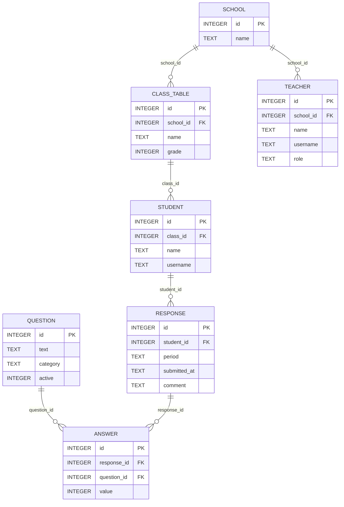
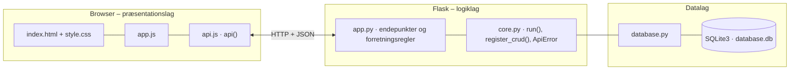

# Learnify – elevevaluering (Læringsrum 2.0) – dokumentation af prototypen

En platform, hvor **elever** nemt og trygt kan fortælle om trivsel, læring, møbler og miljø i klasselokalet,
og hvor **lærere** og **Læringsrum 2.0** får et samlet overblik med procenttal og udvikling over tid.

Kravgrundlag: [`Kravspecifikation.md`](Kravspecifikation.md)

## Hvad kan prototypen

| Rolle | Skærm | Funktion |
|---|---|---|
| Alle | **Log ind** | Brugernavn. Faneblade vises efter rolle |
| Elev | **Besvar** | Ugens spørgsmål med smiley-skala 1–5, valgfri kommentar og personlig feedback bagefter |
| Elev | **Min udvikling** | Egne gennemsnit pr. kategori uge for uge |
| Lærer | **Resultater** | Pr. klasse og uge: antal svar, % positive, gennemsnit pr. kategori og spørgsmål, fordeling og anonyme kommentarer |
| Lærer | **Udvikling over tid** | Gennemsnit og % positive pr. kategori pr. uge samt ændring siden første måling |
| Administrator | **Skoleoverblik** | Alle klasser: seneste uge sammenlignet med første måling |
| Administrator | **Spørgsmål og elever** | CRUD for spørgsmål (inkl. aktiv/inaktiv) og elever |

## Fra krav til kode

| Krav (afsnit 4–5) | Implementering |
|---|---|
| Eleven skal kunne logge ind | `POST /api/login` finder elev eller lærer ud fra brugernavn |
| Besvare spørgsmål om trivsel og møbler | `GET /api/survey` + `POST /api/responses` (alle aktive spørgsmål skal besvares, værdi 1–5) |
| Systemet skal gemme besvarelser | `response` + `answer`. Én besvarelse pr. elev pr. ISO-uge (`UNIQUE(student_id, period)`) |
| Læreren ser resultaterne samlet | `GET /api/results?class_id=&period=` |
| Statistiske procenttal | `summarise()`: gennemsnit, % positive (4–5), % negative (1–2) og fordeling |
| Sammenligne svar over tid | `GET /api/results/trend` og `GET /api/students/<id>/history` |
| Elevens data behandles sikkert | Læreren ser kun samlede tal og anonyme kommentarer. Resultater vises først ved mindst **3** besvarelser (`MIN_RESPONDENTS`) |
| Personlig feedback (user journey) | `FEEDBACK` giver et forslag til den kategori, eleven scorede lavest |
| Virksomheden har adgang til svarene | `GET /api/overview` til administrator (Læringsrum 2.0) |
| Computer og tablet | Fælles responsivt design |

**Dataflow (BPMN, bilag 1–3):** Elev besvarer → `response/answer` gemmes → `summarise()` behandler og kategoriserer → lærer/virksomhed ser resultater og tendenser.

## Datamodel

Følger ER-skitsen *Elev → Besvarelse → Spørgsmål → Resultat* (resultater beregnes ved opslag):



## Eksempel på dataudveksling

Læreren henter det samlede resultat for 5.A (seneste uge med mindst 3 besvarelser):

```bash
curl -X GET http://localhost:5106/api/results?class_id=1
```

Svar `200`:

```json
{
  "period": "2026-W39",
  "periods": [
    "2026-W36",
    "2026-W37",
    "… (forkortet)"
  ],
  "hidden": false,
  "respondents": 5,
  "overall": {
    "answers": 40,
    "average": 3.27,
    "positive_pct": 42,
    "negative_pct": 15,
    "distribution": {
      "1": 2,
      "2": 12,
      "3": 42,
      "4": 40,
      "5": 2
    }
  },
  "categories": {
    "trivsel": {
      "answers": 10,
      "average": 3.3,
      "positive_pct": 50,
      "negative_pct": 20,
      "distribution": {
        "1": 0,
        "2": 20,
        "3": 30,
        "4": 50,
        "5": 0
      }
    },
    "læring": {
      "answers": 10,
      "average": 3.2,
      "positive_pct": 30,
      "negative_pct": 20,
      "distribution": {
        "1": 0,
        "2": 20,
        "3": 50,
        "4": 20,
        "5": 10
      }
    },
    "møbler": {
      "answers": 10,
      "average": 3.3,
      "positive_pct": 40,
      "negative_pct": 10,
      "distribution": {
        "1": 0,
        "2": 10,
        "3": 50,
        "4": 40,
        "5": 0
      }
    },
    "miljø": {
      "answers": 10,
      "average": 3.3,
      "positive_pct": 50,
      "negative_pct": 10,
      "distribution": {
        "1": 10,
        "2": 0,
        "3": 40,
        "4": 50,
        "5": 0
      }
    }
  },
  "questions": [
    {
      "id": 3,
      "text": "Jeg kan koncentrere mig i timerne",
      "category": "læring",
      "active": 1,
      "answers": 5,
      "average": 3.4,
      "positive_pct": 40,
      "negative_pct": 20,
      "distribution": {
        "1": 0,
        "2": 20,
        "3": 40,
        "4": 20,
        "5": 20
      }
    },
    {
      "id": 4,
      "text": "Jeg forstår, hvad jeg skal lave i timerne",
      "category": "læring",
      "active": 1,
      "answers": 5,
      "average": 3.0,
      "positive_pct": 20,
      "negative_pct": 20,
      "distribution": {
        "1": 0,
        "2": 20,
        "3": 60,
        "4": 20,
        "5": 0
      }
    },
    "… (forkortet)"
  ],
  "comments": [
    "Stolene er hårde",
    "Jeg kan godt lide de nye sækkestole"
  ]
}
```

## Kør prototypen

```bash
cd backend
python3 -m venv .venv && source .venv/bin/activate   # første gang
pip install -r requirements.txt                       # første gang
python app.py
```

Terminalen skriver ` * Åbn http://localhost:5106`. Åbn adressen i browseren. Flask serverer både API'et (`/api/...`) og frontenden.

- **Port:** Prototypen bruger port **5106** (5100 + projektnummer). Er porten optaget, vælger `run()` i `core.py` selv den næste ledige og skriver fx ` * Port 5106 er optaget – bruger port 5107 i stedet`. Du kan også vælge port selv med `PORT=5200 python app.py`.
- **Stop serveren** med `Ctrl` + `C` i terminalen, hvor den kører.
- **Kodeændringer:** Serveren kører i debug-tilstand og genstarter selv, når du gemmer en `.py`-fil. Den bliver på samme port. Ændringer i `frontend/` kræver kun, at du genindlæser siden.
- **Database:** `backend/database.db` oprettes med testdata ved første start. Nulstil den med `python database.py --reset`, mens serveren er stoppet.
- **Tjek at backenden svarer:** `curl http://localhost:5106/api/health`

### Fejlfinding

| Problem | Årsag | Løsning |
|---|---|---|
| ` * Port 5106 er optaget – bruger port …` | En anden proces, ofte en glemt server, bruger porten | Brug den adresse, der står i terminalen. Se hvad der optager porten med `lsof -nP -iTCP:5106 -sTCP:LISTEN`. En Flask-server i debug-tilstand er to processer, så stop dem begge med `lsof -t -iTCP:5106 -sTCP:LISTEN \| xargs kill` |
| `ModuleNotFoundError: No module named 'flask'` | Det virtuelle miljø er ikke aktiveret, eller Flask er ikke installeret | `source .venv/bin/activate` og `pip install -r requirements.txt` |
| Siden viser "Kan ikke hente data fra backenden" | Serveren kører ikke, eller `index.html` er åbnet direkte fra disken, mens serveren kører på en anden port | Start serveren og åbn adressen fra terminalen i stedet for filen |
| Tallene passer ikke efter mange tests | Databasen indeholder testdata fra tidligere afprøvninger | Stop serveren og kør `python database.py --reset` |
| `no such table …` | `database.db` er tom eller ødelagt | `python database.py --reset` |

## Arkitektur

Prototypen følger holdets fælles tre-lags struktur (se [`../README.md`](../README.md)):



| Fil | Lag | Indhold |
|---|---|---|
| `frontend/index.html` | Præsentation | Skærmbilleder som faneblade og formularer. Projektets farver og `data-api-port` |
| `frontend/app.js` | Præsentation | Henter data med `api()`, tegner dem i DOM'en og sender formularer |
| `frontend/api.js` | Præsentation | Fælles for alle prototyper: `api()` (fetch + JSON), `h()`, `renderTable()`, `fillSelect()`, `formToJson()`, `bindCrudForm()` og `toast()` |
| `frontend/style.css` | Præsentation | Fælles responsivt design |
| `backend/app.py` | Logik | Projektets forretningsregler og endepunkter |
| `backend/core.py` | Logik | Fælles: `create_app()` (Flask, CORS, JSON-fejl), `run()` (start på ledig port), `ApiError` og `register_crud()` |
| `backend/database.py` | Data | Fælles: forbindelse, `query_all/query_one/execute`, `transaction()` og `init_db()` |
| `backend/schema.sql` · `seed.sql` | Data | Tabeller og fiktive testdata |

Alle fejl returneres som JSON (`{"error": "…", "path": "/api/…"}`) med statuskode 400, 401, 403, 404 eller 409 og vises som en rød besked i frontenden.
Nederst på siden kan man åbne **"Seneste JSON-svar fra API'et"** og se den rå dataudveksling.
Den fulde endepunktsliste står i [`backend/README.md`](backend/README.md).

## Design og responsivitet

- Samme stylesheet i alle prototyper. Kun farverne (`--brand`, `--brand-dark`, `--brand-soft`) sættes i `index.html`.
- Layoutet virker fra mobil (375 px) til desktop uden vandret scroll. Kort lægger sig under hinanden på små skærme, og brede tabeller scroller inde i deres kort.
- Formularfelter kan ikke blive bredere end deres kort. En `<select>` med lange valgmuligheder skubber altså ikke formularen ud over kanten.
- Beskeder vises kort i toppen (grøn = gennemført, rød = fejl fra serveren).


## Testdata og testbrugere

| Rolle | Brugernavne |
|---|---|
| Elev 5.A | `emma`, `noah`, `ida`, `oscar`, `freja` |
| Elev 7.B | `william`, `alma`, `karl`, `clara`, `malik` |
| Lærer / administrator | `lise` / `anna` |

8 spørgsmål (2 pr. kategori) og besvarelser for uge 36–39. I 5.A bliver møbler og miljø bedre over tid, så udviklingen kan ses.
De aktuelle ugers besvarelser kan afgives af eleverne selv.

## Afgrænsning

Login uden adgangskode. Ingen lærer–klasse-kobling (en lærer ser alle klasser) og ingen eksport af rapporter.
