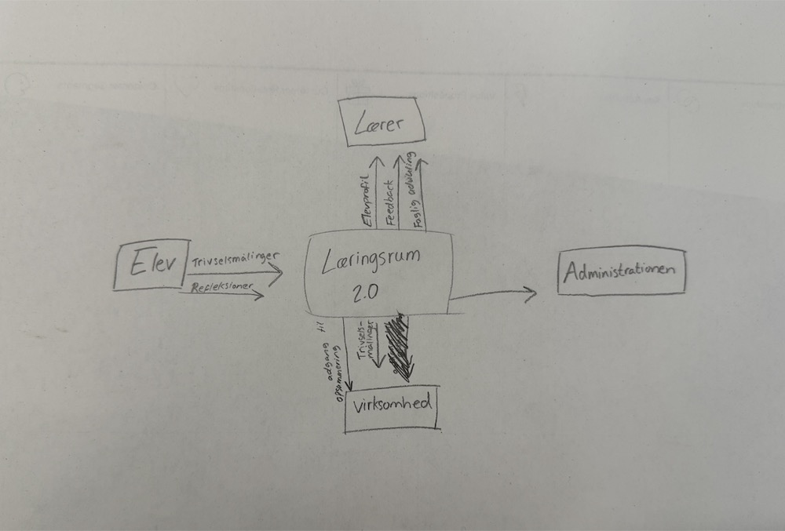
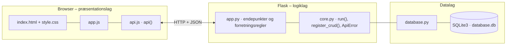

# Learnify – elevevaluering (Læringsrum 2.0) – dokumentation af prototypen

En platform, hvor **elever** hver måned fortæller om trivsel, læring, møbler og miljø i klasselokalet og om deres **arbejdsstil** – med mulighed for at **uddybe** med egne ord.
**Lærere** ser hver enkelt elevs besvarelser i procent pr. måned og en **personlig elevprofil**, og **virksomheden** (Læringsrum 2.0) kan **filtrere** de anonyme besvarelser til idéudvikling.

Kravgrundlag: [`Kravspecifikation.md`](Kravspecifikation.md) og ændringerne i [`Ændriger til vores produkt (1).docx`](<Ændriger til vores produkt (1).docx>) (version 2 af prototypen).



*Kontekstdiagram fra ændringsdokumentet: eleven sender trivselsmålinger og refleksioner, læreren får elevprofil, feedback og faglig udvikling, og virksomheden får adgang til en opsummering af trivselsmålingerne.*

## Hvad kan prototypen

| Rolle | Skærm | Funktion |
|---|---|---|
| Alle | **Log ind** | Ny loginside i stil med eksemplet: lilla gradient, logo og et hvidt kort. Vælg **Elev**, **Lærer** eller **Virksomhed**, og log ind med e-mail og adgangskode |
| Elev | **Forside** | Personlig elevprofil (navn, klasse, alder, læringsstil, arbejdstempo, seneste trivselsscore x/10, ønsker og holdning til klasselokalet), diagram over egne svar pr. måned og en knap til månedens test |
| Elev | **Månedens test** | Spørgsmål om trivsel, læring, møbler, miljø og arbejdsstil med smiley-skala 1–5, tekstfeltet *Uddyb* under hvert spørgsmål og felter til ønsker, klasselokale og andet |
| Lærer | **Elever** | Hver elev i klassen med navn, klasse, trivselsscore, læringsstil, tempo og andel positive svar pr. måned. Klik på en elev for at se elevprofilen med diagram og uddybninger |
| Lærer | **Klassens resultater** / **Udvikling over tid** | Klassens samlede tal pr. måned (vises ved mindst 3 svar) og ændring siden første måling |
| Virksomhed | **Besvarelser** | Filtrér på klasse, klassetrin, måned, kategori, negative svar og kun svar med uddybning. Viser nøgletal, anonyme svar ("Elev 7.B-3") og elevernes ønsker og holdning til klasselokalet |
| Virksomhed | **Skoleoverblik** / **Spørgsmål og elever** | Alle klasser sammenlignet med første måling og CRUD for spørgsmål (inkl. arbejdsstil) og elever |

## Ændringer i version 2

| Ændringsønske | Implementering |
|---|---|
| Elev: tekstfelt, så man kan uddybe | `answer.note` (feltet *Uddyb* under hvert spørgsmål) samt `response.comment`, `wishes` og `classroom` |
| Visuelt flottere og en flottere loginside | Gradient, kort med skygge og en loginside som eksemplet. Kun projektets egen CSS i `index.html` – det fælles `style.css` er uændret |
| Vælg mellem elev og lærer ved login | `POST /api/login` med `role`, `email` og `password` (adgangskoder gemmes som hash). Elev → forsiden, lærer → elevernes besvarelser. Virksomheden har sin egen rolle |
| Læreren ser hver elevs besvarelser i procent pr. måned med navn og klasse | `GET /api/teacher/students` (kun lærerens egen klasse – `teacher.class_id`) og `GET /api/students/<id>/profile` |
| Diagram | Søjlediagram pr. måned og kategori på elevprofilen (forstået som "diagram over elevens svar" – "Vpm diagram" er ikke uddybet i dokumentet) |
| Spørgsmål om arbejdsstil | Kategorien `arbejdsstil` med `style` = visuel, auditiv, praktisk eller tempo. Bruges til profilen, ikke til procenttal |
| Virksomheden ser besvarelser og kan filtrere | `GET /api/company/answers` med filtre. Eleverne er anonymiseret |
| Personlig elevprofil (grundlæggende information) | `student_profile()`: læringsstil = stilarter med svar 4–5, arbejdstempo ud fra tempo-spørgsmålet, trivselsscore = trivselsgennemsnit 1–5 omregnet til 1–10, seneste ønsker og holdning til klasselokalet |
| Testen udføres hver måned | `response.period` er nu en måned (`2026-10`) i stedet for en uge. Én besvarelse pr. elev pr. måned |

**Vigtig ændring i privatliv:** I version 1 så læreren kun anonyme klassetal. Nu ser læreren den enkelte elevs svar, som ændringsdokumentet ønsker. Eleven får det at vide i testen ("din lærer kan se dine svar").
Læreren ser kun sin egen klasse. Virksomheden ser aldrig navne, og klassens samlede tal vises stadig først ved mindst 3 besvarelser.

## Fra krav til kode

| Krav (afsnit 4–5) | Implementering |
|---|---|
| Eleven skal kunne logge ind | `POST /api/login` (rolle + e-mail + adgangskode). Derefter sendes `X-User-Id: rolle:id` |
| Besvare spørgsmål om trivsel og møbler | `GET /api/survey` og `POST /api/responses` (alle aktive spørgsmål skal besvares med 1–5) |
| Systemet skal gemme besvarelser | `response` + `answer`. Én besvarelse pr. elev pr. måned (`UNIQUE(student_id, period)`) |
| Læreren ser resultaterne samlet | `GET /api/results` og `GET /api/teacher/students` |
| Statistiske procenttal | `summarise()`: gennemsnit, % positive (4–5), % negative (1–2) og fordeling |
| Sammenligne svar over tid | `GET /api/results/trend` og månederne i elevprofilen |
| Styrer brugerrettigheder | `current_user(*roles)` og `check_student_access()` (401/403). `password_hash` fjernes fra alle svar (`hide_password_hashes()`) |
| Virksomheden har adgang til elevernes svar | `GET /api/company/answers` (anonymt, filtrerbart) og `GET /api/overview` |

## Datamodel

```mermaid
erDiagram
    SCHOOL ||--o{ CLASS : "school_id"
    CLASS ||--o{ STUDENT : "class_id"
    SCHOOL ||--o{ TEACHER : "school_id"
    CLASS ||--o{ TEACHER : "class_id"
    STUDENT ||--o{ RESPONSE : "student_id"
    RESPONSE ||--o{ ANSWER : "response_id"
    QUESTION ||--o{ ANSWER : "question_id"
    SCHOOL {
        INTEGER id PK
        TEXT name
    }
    CLASS {
        INTEGER id PK
        INTEGER school_id FK
        TEXT name
        INTEGER grade
    }
    STUDENT {
        INTEGER id PK
        INTEGER class_id FK
        TEXT name
        TEXT username
        TEXT email
        TEXT password_hash
        INTEGER age
    }
    TEACHER {
        INTEGER id PK
        INTEGER school_id FK
        INTEGER class_id FK
        TEXT name
        TEXT username
        TEXT email
        TEXT password_hash
        TEXT role
    }
    QUESTION {
        INTEGER id PK
        TEXT text
        TEXT category
        TEXT style
        INTEGER active
    }
    RESPONSE {
        INTEGER id PK
        INTEGER student_id FK
        TEXT period
        TEXT submitted_at
        TEXT comment
        TEXT wishes
        TEXT classroom
    }
    ANSWER {
        INTEGER id PK
        INTEGER response_id FK
        INTEGER question_id FK
        INTEGER value
        TEXT note
    }
```

## Eksempel på dataudveksling

Læreren Lise (7.B) åbner Emma Jensens elevprofil:

```bash
curl http://localhost:5106/api/students/6/profile -H 'X-User-Id: lærer:1'
```

Svar `200` (forkortet):

```json
{
  "student": { "id": 6, "name": "Emma Jensen", "class_name": "7.B", "age": 13 },
  "learning_style": "Visuel + Praktisk",
  "work_pace": "Langsomt/moderat",
  "wellbeing_score": 8,
  "classroom_score": 5,
  "wishes": "Planter og bedre lys i klassen",
  "classroom": "Jeg kan godt lide læsehjørnet",
  "latest_period": "2026-09",
  "months": [
    { "period": "2026-08", "categories": { "trivsel": { "positive_pct": 100 }, "læring": { "positive_pct": 100 }, "møbler": { "positive_pct": 50 }, "miljø": { "positive_pct": 0 } } },
    { "period": "2026-09", "categories": { "trivsel": { "positive_pct": 67 }, "læring": { "positive_pct": 100 }, "møbler": { "positive_pct": 0 }, "miljø": { "positive_pct": 0 } } }
  ]
}
```

En anden lærers elev giver `403`, og virksomheden får også `403`, fordi den kun ser anonyme besvarelser.

## Kør prototypen

```bash
cd backend
python3 -m venv .venv && source .venv/bin/activate   # første gang
pip install -r requirements.txt                       # første gang
python app.py
```

Terminalen skriver ` * Åbn http://localhost:5106`. Åbn adressen i browseren. Flask serverer både API'et (`/api/...`) og frontenden.

- **Port:** Prototypen bruger port **5106** (5100 + projektnummer). Er porten optaget, vælger `run()` i `core.py` selv den næste ledige og skriver fx ` * Port 5106 er optaget – bruger port 5107 i stedet`. Du kan også vælge port selv med `PORT=5200 python app.py`.
- **Stop serveren** med `Ctrl` + `C` i terminalen, hvor den kører.
- **Kodeændringer:** Serveren kører i debug-tilstand og genstarter selv, når du gemmer en `.py`-fil. Den bliver på samme port. Ændringer i `frontend/` kræver kun, at du genindlæser siden.
- **Database:** `backend/database.db` oprettes med testdata ved første start. Nulstil den med `python database.py --reset`, mens serveren er stoppet.
- **Tjek at backenden svarer:** `curl http://localhost:5106/api/health`

### Fejlfinding

| Problem | Årsag | Løsning |
|---|---|---|
| ` * Port 5106 er optaget – bruger port …` | En anden proces, ofte en glemt server, bruger porten | Brug den adresse, der står i terminalen. Se hvad der optager porten med `lsof -nP -iTCP:5106 -sTCP:LISTEN`. En Flask-server i debug-tilstand er to processer, så stop dem begge med `lsof -t -iTCP:5106 -sTCP:LISTEN \| xargs kill` |
| `ModuleNotFoundError: No module named 'flask'` | Det virtuelle miljø er ikke aktiveret, eller Flask er ikke installeret | `source .venv/bin/activate` og `pip install -r requirements.txt` |
| Siden viser "Kan ikke hente data fra backenden" | Serveren kører ikke, eller `index.html` er åbnet direkte fra disken, mens serveren kører på en anden port | Start serveren og åbn adressen fra terminalen i stedet for filen |
| Tallene passer ikke efter mange tests | Databasen indeholder testdata fra tidligere afprøvninger | Stop serveren og kør `python database.py --reset` |
| `no such table …` | `database.db` er tom eller ødelagt | `python database.py --reset` |

## Arkitektur

Prototypen følger holdets fælles tre-lags struktur (se [`../README.md`](../README.md)):



| Fil | Lag | Indhold |
|---|---|---|
| `frontend/index.html` | Præsentation | Skærmbilleder som faneblade og formularer. Projektets farver og `data-api-port` |
| `frontend/app.js` | Præsentation | Henter data med `api()`, tegner dem i DOM'en og sender formularer |
| `frontend/api.js` | Præsentation | Fælles for alle prototyper: `api()` (fetch + JSON), `h()`, `renderTable()`, `fillSelect()`, `formToJson()`, `bindCrudForm()` og `toast()` |
| `frontend/style.css` | Præsentation | Fælles responsivt design |
| `backend/app.py` | Logik | Projektets forretningsregler og endepunkter |
| `backend/core.py` | Logik | Fælles: `create_app()` (Flask, CORS, JSON-fejl), `run()` (start på ledig port), `ApiError` og `register_crud()` |
| `backend/database.py` | Data | Fælles: forbindelse, `query_all/query_one/execute`, `transaction()` og `init_db()` |
| `backend/schema.sql` · `seed.sql` | Data | Tabeller og fiktive testdata |

Alle fejl returneres som JSON (`{"error": "…", "path": "/api/…"}`) med statuskode 400, 401, 403, 404 eller 409 og vises som en rød besked i frontenden.
Nederst på siden kan man åbne **"Seneste JSON-svar fra API'et"** og se den rå dataudveksling.
Den fulde endepunktsliste står i [`backend/README.md`](backend/README.md).

## Design og responsivitet

- Samme stylesheet i alle prototyper. Kun farverne (`--brand`, `--brand-dark`, `--brand-soft`) sættes i `index.html`.
- Layoutet virker fra mobil (375 px) til desktop uden vandret scroll. Kort lægger sig under hinanden på små skærme, og brede tabeller scroller inde i deres kort.
- Formularfelter kan ikke blive bredere end deres kort. En `<select>` med lange valgmuligheder skubber altså ikke formularen ud over kanten.
- Beskeder vises kort i toppen (grøn = gennemført, rød = fejl fra serveren).


## Testdata og testbrugere

Alle testbrugere har adgangskoden **`learnify`**.

| Rolle | E-mail | Bemærkning |
|---|---|---|
| Elev 7.B | `emma@elev.learnify.dk` | Emma Jensen, 13 år (eksemplet fra ændringsdokumentet). Også `william@`, `alma@`, `karl@` og `malik@elev.learnify.dk` |
| Elev 5.A | `noah@elev.learnify.dk` | Også `ida@`, `oscar@`, `freja@` og `sofia@elev.learnify.dk` |
| Lærer 7.B | `lise@learnify.dk` | Ser kun 7.B |
| Lærer 5.A | `mads@learnify.dk` | Ser kun 5.A |
| Virksomhed | `anna@laeringsrum.dk` | Læringsrum 2.0 |

13 spørgsmål (9 om trivsel, læring, møbler og miljø og 4 om arbejdsstil). Besvarelser for august og september 2026 med uddybninger, ønsker og holdning til klasselokalet. I 5.A bliver møbler og miljø bedre.
Månedens test for den aktuelle måned kan eleverne selv tage.

## Afgrænsning

Adgangskoder hashes, men der er ingen rigtig session eller token. Brugeren sendes i headeren `X-User-Id`, og "Glemt adgangskode?" viser kun en besked. Ingen eksport af rapporter.
Læringsstil og arbejdstempo beregnes ud fra elevens egne svar og er et udgangspunkt for lærerens vurdering, ikke en diagnose.
