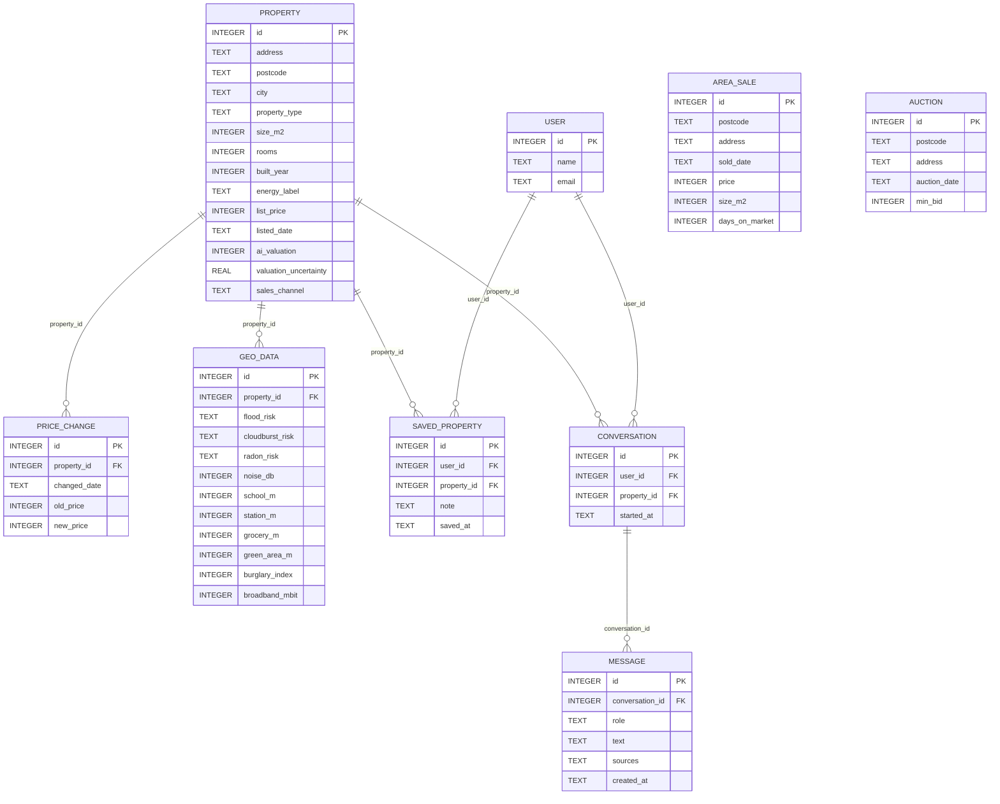
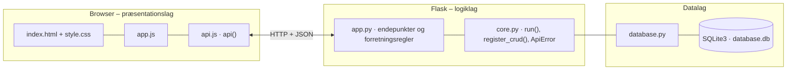

# Boliga Insight Hub – dokumentation af prototypen

Et samlet data-dashboard, der lægger sig oven på et boligopslag og **samler Boligas spredte data**
(Boliga.dk, DinGeo, Tvangsauktioner og Selvsalg) ét sted. En **AI-sparringspartner** forklarer dataene i almindeligt sprog.

Kravgrundlag: [`Kravspecifikation.md`](Kravspecifikation.md)

## Hvad kan prototypen

| Skærm (jf. user journey) | Funktion |
|---|---|
| **Søg bolig** | Søg på adresse, by eller postnummer, maks. pris, min. m² og type. Kort med pris, m²-pris, liggetid og prisfald |
| **Insight Hub** | AI-resumé, nøgletal, DinGeo-risici og nabolag, prishistorik, solgte boliger i området og tvangsauktioner (progressiv disclosure med sammenfoldelige sektioner) |
| **AI-chat** (i Insight Hub) | Spørgsmål i fritekst eller hurtigknapper. Svaret viser kilder, og samtalen gemmes pr. bruger og bolig |
| **Gemte og sammenlign** | Gem boliger og sammenlign 2–4 side om side |
| **Boligdata (admin)** | CRUD for boliger |

## Fra krav til kode

| Krav | Implementering |
|---|---|
| FK1 Boliga.dk-data: pris, liggetid, prisnedslag | `boliga_data()`: `days_on_market`, `price_per_m2`, `total_price_drop_pct`, `valuation_diff_pct` |
| FK2 DinGeo: risiko, miljø, nabolag | Tabellen `geo_data` |
| FK3 Spørgsmål i naturligt sprog | `POST /api/properties/<id>/ask` |
| FK4 Svar baseret på boligens data | `answer_question()` bruger kun `insight()`-konteksten og returnerer `sources`. Kendes emnet ikke, siger den det i stedet for at gætte |
| FK5 Automatisk AI-resumé | `make_summary()` |
| FK6 Gem og sammenlign | `/api/users/<id>/saved` + `GET /api/compare?ids=1,5` |
| FK7 Samtaler logges pr. bruger | Tabellerne `conversation` (én pr. bruger og bolig) og `message` |
| FK8 Tvangsauktioner og Selvsalg | Tabellen `auction` (samme postnummer) og `sales_channel = Selvsalg` |
| Markedssammenligning | `market_data()`: gennemsnitlig m²-pris og liggetid for solgte boliger i postnummeret |
| Vedligehold: AI-modulet skal kunne skiftes | Hele AI-logikken ligger i `answer_question()` og `make_summary()`. API'et er det samme, hvis de skiftes til et LLM med RAG |

**Events (event storming)**

| Event | Hvor |
|---|---|
| BoligValgt → BoligDataAggregeret | `GET /api/properties/<id>/insight` |
| AISpoergsmaalStillet → AISvarGenereret | `POST /api/properties/<id>/ask` |
| SamtaleGemt | Samme kald: spørgsmål og svar gemmes i `message` i én transaktion |

**AI-emner:** pris, liggetid, oversvømmelse/skybrud, støj, skole/familie, transport, energi, tryghed, radon og tvangsauktion (`TOPICS`).

## Datamodel



## Eksempel på dataudveksling

Familien Hansen spørger AI-sparringspartneren om prisen på Solsikkevej 12. Svaret bygger på boligens egne data og angiver kilderne:

```bash
curl -X POST http://localhost:5107/api/properties/1/ask \
  -H 'Content-Type: application/json' \
  -d '{"user_id": 1, "question": "Er prisen for høj?"}'
```

Svar `201`:

```json
{
  "question": "Er prisen for høj?",
  "answer": "Udbudsprisen er 5.495.000 kr. (38.697 kr. pr. m²). Boligas AI-vurdering er 5.210.000 kr. (±6.6 %), så prise…",
  "sources": [
    "Boliga AI-vurdering",
    "Boliga salgsdata for postnummeret",
    "… (forkortet)"
  ],
  "conversation_id": 1
}
```

## Kør prototypen

```bash
cd backend
python3 -m venv .venv && source .venv/bin/activate   # første gang
pip install -r requirements.txt                       # første gang
python app.py
```

Terminalen skriver ` * Åbn http://localhost:5107`. Åbn adressen i browseren. Flask serverer både API'et (`/api/...`) og frontenden.

- **Port:** Prototypen bruger port **5107** (5100 + projektnummer). Er porten optaget, vælger `run()` i `core.py` selv den næste ledige og skriver fx ` * Port 5107 er optaget – bruger port 5108 i stedet`. Du kan også vælge port selv med `PORT=5200 python app.py`.
- **Stop serveren** med `Ctrl` + `C` i terminalen, hvor den kører.
- **Kodeændringer:** Serveren kører i debug-tilstand og genstarter selv, når du gemmer en `.py`-fil. Den bliver på samme port. Ændringer i `frontend/` kræver kun, at du genindlæser siden.
- **Database:** `backend/database.db` oprettes med testdata ved første start. Nulstil den med `python database.py --reset`, mens serveren er stoppet.
- **Tjek at backenden svarer:** `curl http://localhost:5107/api/health`

### Fejlfinding

| Problem | Årsag | Løsning |
|---|---|---|
| ` * Port 5107 er optaget – bruger port …` | En anden proces, ofte en glemt server, bruger porten | Brug den adresse, der står i terminalen. Se hvad der optager porten med `lsof -nP -iTCP:5107 -sTCP:LISTEN`. En Flask-server i debug-tilstand er to processer, så stop dem begge med `lsof -t -iTCP:5107 -sTCP:LISTEN \| xargs kill` |
| `ModuleNotFoundError: No module named 'flask'` | Det virtuelle miljø er ikke aktiveret, eller Flask er ikke installeret | `source .venv/bin/activate` og `pip install -r requirements.txt` |
| Siden viser "Kan ikke hente data fra backenden" | Serveren kører ikke, eller `index.html` er åbnet direkte fra disken, mens serveren kører på en anden port | Start serveren og åbn adressen fra terminalen i stedet for filen |
| Tallene passer ikke efter mange tests | Databasen indeholder testdata fra tidligere afprøvninger | Stop serveren og kør `python database.py --reset` |
| `no such table …` | `database.db` er tom eller ødelagt | `python database.py --reset` |

## Arkitektur

Prototypen følger holdets fælles tre-lags struktur (se [`../README.md`](../README.md)):



| Fil | Lag | Indhold |
|---|---|---|
| `frontend/index.html` | Præsentation | Skærmbilleder som faneblade og formularer. Projektets farver og `data-api-port` |
| `frontend/app.js` | Præsentation | Henter data med `api()`, tegner dem i DOM'en og sender formularer |
| `frontend/api.js` | Præsentation | Fælles for alle prototyper: `api()` (fetch + JSON), `h()`, `renderTable()`, `fillSelect()`, `formToJson()`, `bindCrudForm()` og `toast()` |
| `frontend/style.css` | Præsentation | Fælles responsivt design |
| `backend/app.py` | Logik | Projektets forretningsregler og endepunkter |
| `backend/core.py` | Logik | Fælles: `create_app()` (Flask, CORS, JSON-fejl), `run()` (start på ledig port), `ApiError` og `register_crud()` |
| `backend/database.py` | Data | Fælles: forbindelse, `query_all/query_one/execute`, `transaction()` og `init_db()` |
| `backend/schema.sql` · `seed.sql` | Data | Tabeller og fiktive testdata |

Alle fejl returneres som JSON (`{"error": "…", "path": "/api/…"}`) med statuskode 400, 401, 403, 404 eller 409 og vises som en rød besked i frontenden.
Nederst på siden kan man åbne **"Seneste JSON-svar fra API'et"** og se den rå dataudveksling.
Den fulde endepunktsliste står i [`backend/README.md`](backend/README.md).

## Design og responsivitet

- Samme stylesheet i alle prototyper. Kun farverne (`--brand`, `--brand-dark`, `--brand-soft`) sættes i `index.html`.
- Layoutet virker fra mobil (375 px) til desktop uden vandret scroll. Kort lægger sig under hinanden på små skærme, og brede tabeller scroller inde i deres kort.
- Formularfelter kan ikke blive bredere end deres kort. En `<select>` med lange valgmuligheder skubber altså ikke formularen ud over kanten.
- Beskeder vises kort i toppen (grøn = gennemført, rød = fejl fra serveren).


## Testdata

6 boliger i Storkøbenhavn (villa, ejerlejlighed, rækkehus, én selvsalg), prisfald, DinGeo-data til alle,
11 solgte boliger til markedssammenligning, 2 tvangsauktioner og 2 brugere.

## Afgrænsning

Alle data er simulerede. Der er ingen integration til Datafordeleren, BBR eller DinGeo og ingen rigtig LLM.
AI-sparringspartneren er regelbaseret, så den ikke kan hallucinere (jf. afsnit 20). Brugeren vælges i toppen i stedet for login.
