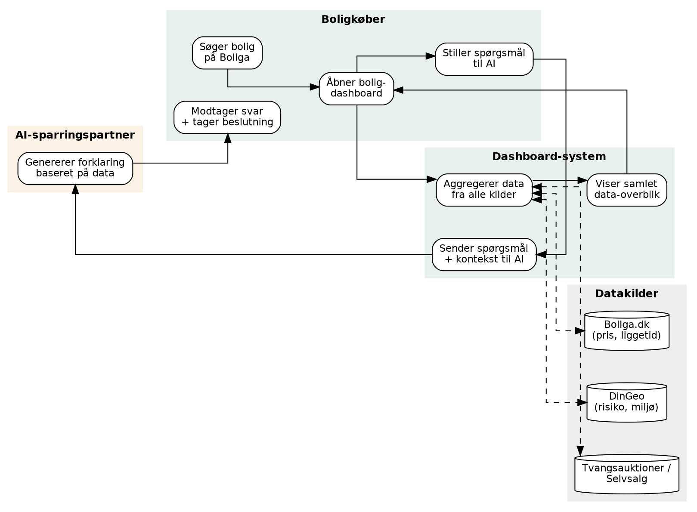
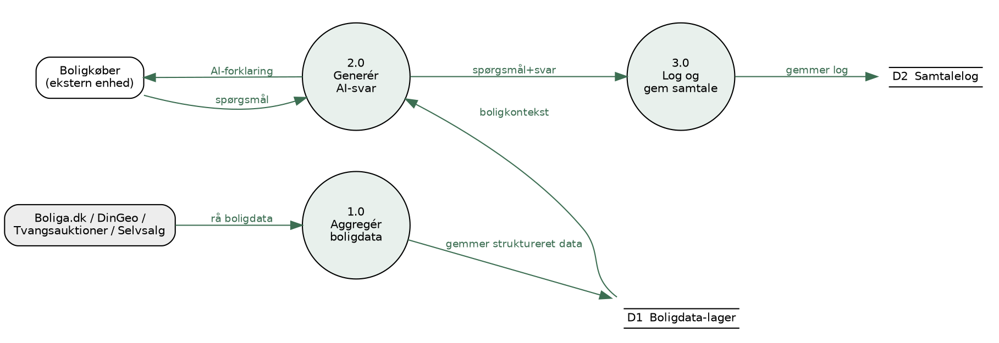
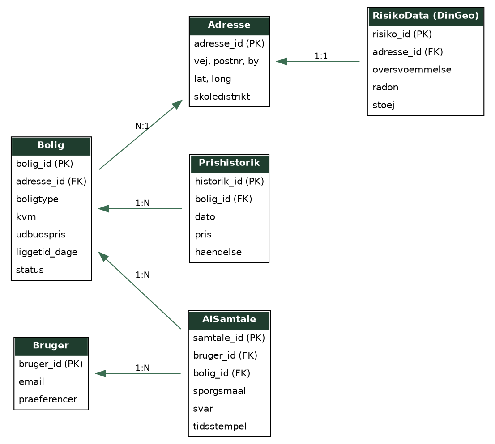

# Kravspecifikation (Volere-skabelon): Boliga Insight Hub

> Konverteret til markdown fra `Kravspecifikation_Boliga_Insight_Hub.docx`. Tekst og figurer er gengivet som i originaldokumentet.

*Et samlet, AI-forklaret data-dashboard for boligkøbere på tværs af Boligas platforme*

## Project Drivers

### 1. The Purpose of the Project

*reasonen for at investere i produktet*

Boliga sidder på store mængder unik data (Boliga.dk, DinGeo, Tvangsauktioner, Selvsalg), men dataen er spredt og – ifølge Boliga selv – svær at aktivere internt ("Big Data snakker Martin om, men ingen forstår det"). Samtidig er der et konkret ønske internt i Boliga om en AI-løsning ("Martin siger: lav en chatbot"). Formålet med projektet er at bygge et samlet AI-drevet dashboard, der aktiverer denne i dag uudnyttede konkurrencefordel og gør Boligas data forståelig for boligkøbere, samtidig med at Boliga differentierer sig yderligere fra det mægler-/bankejede Boligsiden-økosystem.

### 2. The Client, the Customer, and other Stakeholders

*de personer med interesse i eller indflydelse på produktet*

| Rolle | Beskrivelse |
|---|---|
| Klient | Boliga A/S – den uafhængige boligportal, projektet udvikles for |
| Kunde/beslutningstager | Martin (salg/forretningsudvikling) og Boligas ledelse |
| IT/data-afdeling | Boligas interne team, der ejer datainfrastruktur og skal drifte/vedligeholde løsningen |
| Ejendomsmæglere | Indirekte stakeholder – kan være skeptiske over for øget transparens, jf. tidligere modstand mod "liggetid" |
| Vores projektgruppe | Udviklere af prototypen til innovationsfestivalen |

### 3. Users of the Product

*de tilsigtede slutbrugere, og hvordan det påvirker produktets brugbarhed*

- Primær bruger: Boligkøbere, der aktivt undersøger konkrete boliger på Boliga.dk – typisk børnefamilier (Boligas største kundesegment), med varierende teknisk indsigt.
- Sekundær bruger: Boligsælgere, der ønsker indsigt i egen bolig og markedsposition.

Da brugerne ikke har faglig baggrund inden for ejendomsdata, skal grænsefladen og AI-svarene være i almindeligt sprog og undgå at virke som et teknisk data-værktøj.

## Project Constraints

### 4. Requirements Constraints

*begrænsninger på projektet og produktet*

- Prototypen skal være klar til præsentation for dommere på innovationsfestival ultimo november.
- Løsningen skal bygges på Boligas eksisterende, offentligt tilgængelige datakilder (Datafordeleren, BBR, DAR, DAWA, Danmarks Statistik, DinGeo).
- Løsningen må ikke basere sig på scraping af konkurrenters data (jf. Boligas historiske konflikt med Boligsiden.dk om netop dette).
- Begrænset udviklingstid og -ressourcer som studerende, uden direkte adgang til Boligas interne systemer under prototype-fasen.

### 5. Naming Conventions and Definitions

*projektets fagudtryk*

| Begreb | Definition |
|---|---|
| Liggetid | Antal dage en bolig har været til salg – et Boliga-introduceret nøgletal |
| Oser | Bruger der browser boliger uden reel købsintention (ca. 30% af trafikken) |
| DinGeo | Boligas geodata-platform med risiko-, miljø- og nabolagsdata pr. adresse |
| Premiummægler | Boligas model hvor én mægler køber eksklusiv synlighed pr. postnummer |
| Insight Hub | Projektets navn for det AI-drevne data-dashboard |
| AI-sparringspartner | Chatmodul der forklarer boligdata i naturligt sprog |

### 6. Relevant Facts and Assumptions

*fakta og antagelser der påvirker udviklingen*

#### Facts (fra interview med Boliga):

- Boliga er privatejet og markedsfører sig som Danmarks største uafhængige boligside.
- Boligas AI-vurderingsmodel (v4.14) har 6,6% usikkerhed mod konkurrenters ca. 20%.
- Boliga får salgsdata med måneders forsinkelse sammenlignet med Boligsiden.
- AI/scraping udgør en strategisk trussel mod oplysningsportaler som Boliga og DinGeo.

#### Antagelser:

- Boliga vil (i et reelt samarbejde) stille data til rådighed via API eller tilsvarende adgang.
- Brugerne har adgang til dashboardet via samme flow som i dag på Boliga.dk.
- Et LLM (fx via API) kan anvendes til AI-sparringspartneren frem for en model bygget fra bunden.

## Functional Requirements

### 7. The Scope of the Work

*det forretnings- eller domæneområde der undersøges*

Domænet er formidling af boligmarkedsdata til private boligkøbere/-sælgere, afgrænset til den del af Boligas forretning, der vedrører dataindsigt og beslutningsstøtte – ikke selve annoncerings-, mægler- eller lånesamarbejdsforretningen.

*Figur 1: Procesdiagram (BPMN-inspireret) for forretningsprocessen omkring Insight Hub*

### 8. The Scope of the Product

*definition af produktets grænser og forbindelser til andre systemer*

Produktet er et web-dashboard, der lægger sig oven på en eksisterende boligside (fx et boligopslag på Boliga.dk). Det trækker data fra Boliga.dk, DinGeo, Tvangsauktioner og Selvsalg, og tilføjer et AI-chatlag. Produktet ændrer ikke selve kildesystemerne, men konsumerer og præsenterer deres data.

#### User journey map (product use case):

| Fase | Brugerhandling | Touchpoint | Mulighed for Boliga |
|---|---|---|---|
| Søgning | Søger boliger ud fra kriterier | Boliga.dk søgefunktion | Guide brugeren mod relevante boliger |
| Boligvisning | Åbner en konkret bolig | Boligopslag | Vis at mere data findes ét klik væk |
| Dashboard | Åbner Insight Hub for boligen | Insight Hub-dashboard | Samle spredt data ét sted, progressivt |
| AI-dialog | Stiller spørgsmål til AI | AI-chatpanel | Differentiere Boliga fra Boligsiden m.fl. |
| Beslutning | Vurderer om boligen passer | Dashboard + AI-svar | Fastholde bruger, foreslå relaterede boliger |

### 9. Functional and Data Requirements

*det produktet skal gøre, og den data det skal håndtere*

| ID | Krav | Prioritet |
|---|---|---|
| FK1 | Systemet skal aggregere og vise data fra Boliga.dk (pris, liggetid, prisnedslag) for en valgt bolig. | Must |
| FK2 | Systemet skal aggregere og vise DinGeo-data (risiko, miljø, nabolag) for boligens adresse. | Must |
| FK3 | Brugeren skal kunne stille naturligt-sprog spørgsmål til en AI-sparringspartner om den viste data. | Must |
| FK4 | AI-svar skal baseres på og henvise til boligens faktiske data, ikke generiske svar. | Must |
| FK5 | Systemet skal generere et kort automatisk AI-resumé af hver bolig ved åbning af dashboardet. | Should |
| FK6 | Brugeren skal kunne gemme og sammenligne flere boliger i Insight Hub. | Should |
| FK7 | AI-samtaler skal logges pr. bruger, så samtalen kan genfindes ved senere besøg. | Should |
| FK8 | Systemet skal vise data fra Tvangsauktioner og Selvsalg, hvor relevant for boligen. | Could |

#### Data flow (logiklag):

*Figur 2: Data flow-diagram (niveau 0)*

#### Event storming – centrale events:

| Event | Trigger | Resulterende handling |
|---|---|---|
| BoligValgt | Bruger åbner en bolig | Dashboard begynder at hente/aggregere data |
| BoligDataAggregeret | Alle kildesystemer har svaret | Dashboard renderes for bruger |
| AISpoergsmaalStillet | Bruger sender besked i chatpanel | Forespørgsel sendes til AI-modul med boligkontekst |
| AISvarGenereret | AI-modul returnerer svar | Svar vises i chatpanel til bruger |
| SamtaleGemt | Svar er vist til bruger | Samtale logges i datalaget |

#### Datastruktur (ER-diagram):

*Figur 3: ER-diagram for kernedatamodellen*

## Non-functional Requirements

### 10. Look and Feel Requirements

*produktets tilsigtede udseende*

Dashboardet skal visuelt matche Boligas eksisterende design (farver, typografi, ikonografi), så det opleves som en integreret del af Boliga.dk og ikke et løsrevet værktøj. AI-chatpanelet designes let og uformelt for at sænke brugerens tærskel for at stille spørgsmål.

### 11. Usability and Humanity Requirements

*hvad produktet skal for at være brugbart, og krav til dets tilgængelighed*

- Data skal præsenteres med progressiv disclosure – overblik først, detaljer ved klik – for at undgå informationsoverload.
- AI-svar skal formuleres i hverdagssprog uden fagjargon.
- Grænsefladen skal kunne bruges af brugere uden teknisk eller ejendomsfaglig baggrund.

### 12. Performance Requirements

*hvor hurtigt, sikkert og præcist produktet skal fungere*

- Data-overblikket skal indlæses på under 2 sekunder ved normal belastning.
- AI-sparringspartnerens svar skal returneres inden for 5 sekunder.

### 13. Operational and Environmental Requirements

*det miljø produktet skal fungere i*

- Skal fungere på web (desktop og mobil) i de gængse browsere, i tråd med Boligas eksisterende platform.
- Skal kunne skalere til Boligas nuværende trafikniveau (1,1+ mio. besøgende/md.).

### 14. Maintainability and Support Requirements

*hvor foranderligt produktet forventes at være*

- Nye datakilder (fx flere DinGeo-datasæt) skal kunne tilføjes uden at ændre kernearkitekturen.
- AI-modulet skal kunne opdateres/skiftes (fx ny LLM-udbyder) uden større ombygning af resten af systemet.

### 15. Security Requirements

*produktets sikkerhed, fortrolighed og integritet*

- Persondata og AI-samtalelog skal behandles og opbevares i overensstemmelse med GDPR.
- Adgang til brugerdata skal være autentificeret og logget.

### 16. Cultural Requirements

*menneskelige og sociologiske faktorer*

- Produktet skal være på dansk og bruge danske adresse- og enhedsformater (m², DKK).
- Tone og sprog skal afspejle Boligas positionering som den transparente, brugervenlige portal.

### 17. Legal Requirements

*overensstemmelse med gældende lovgivning*

- Overholdelse af GDPR ved behandling af bruger- og samtaledata.
- Dataindsamling skal ske inden for rammerne af ejendomsmæglerloven og aftaler om datadeling – ikke via uautoriseret scraping af konkurrenters data.

## Project Issues

### 18. Open Issues

*endnu uløste spørgsmål med indflydelse på succes*

- Vil Boliga stille data til rådighed via en reel API, eller skal prototypen bruge simuleret/offentlig data?
- Hvordan finansieres den løbende drift af AI-modulet (API-omkostninger pr. forespørgsel)?

### 19. Off-the-Shelf Solutions

*færdige komponenter der kan bruges frem for at bygge fra bunden*

- Et eksisterende LLM (fx via API) anvendes til AI-sparringspartneren frem for at træne en model fra bunden.
- Standard kortbiblioteker (fx til visning af DinGeo-geodata) frem for eget kortmodul.

### 20. New Problems

*problemer introduceret af den nye løsning*

- Risiko for at AI-modulet 'hallucinerer' eller fejlfortolker data, hvis det ikke er tilstrækkeligt afgrænset til boligens faktiske data.
- Øgede driftsomkostninger ift. i dag, da hver AI-forespørgsel koster penge.

### 21. Tasks

*de opgaver der skal udføres for at bygge produktet*

- Dataintegration fra Boliga.dk, DinGeo m.fl.
- Design af præsentationslag (wireframes, visuel identitet).
- Udvikling af logiklag og AI-orkestrering (prompt-design).
- Test af AI-svarenes præcision og brugervenlighed.

### 22. Migration to the New Product

*opgaver ift. konvertering fra eksisterende systemer*

Da Insight Hub lægger sig oven på Boligas eksisterende platform frem for at erstatte den, kræves ingen datamigration – men eksisterende brugere skal introduceres til den nye funktion, fx via en kort onboarding første gang de åbner dashboardet.

### 23. Risks

*risici der kan påvirke projektets succes*

- Ejendomsmæglere kan modarbejde øget transparens, ligesom tidligere set med "liggetid" og prisnedslag.
- Afhængighed af en ekstern LLM-udbyder (pris, tilgængelighed, politik).
- AI/scraping-truslen mod oplysningsportaler kan gøre nogle datakilder (som DinGeo) mindre værdifulde over tid.

### 24. Costs

*tidlige omkostningsestimater*

- Udviklingsomkostninger til dataintegration og UI (engangsudgift).
- Løbende AI-API-omkostninger pr. forespørgsel (variabel driftsudgift, skalerer med trafik).

### 25. User Documentation

*planen for brugervejledning og dokumentation*

- Kort onboarding-flow ved første besøg på dashboardet.
- Indbygget FAQ/tooltips forklarende centrale begreber (fx "liggetid", risikodata).

### 26. Waiting Room

*krav der endnu ikke skal indgå, men gemmes til senere*

- Sammenligning af flere boliger side om side i samme AI-samtale.
- Talestyret interaktion med AI-sparringspartneren.

### 27. Ideas for Solutions

*designidéer til at opfylde kravene*

- Brug af Retrieval-Augmented Generation (RAG), så AI-modulet henter præcis boligdata før det svarer, i stedet for at 'gætte'.
- Et point-/interesse-system (jf. Boligas eksisterende brugerprofilering) til at skræddersy hvilke data-insights der fremhæves for den enkelte bruger.
