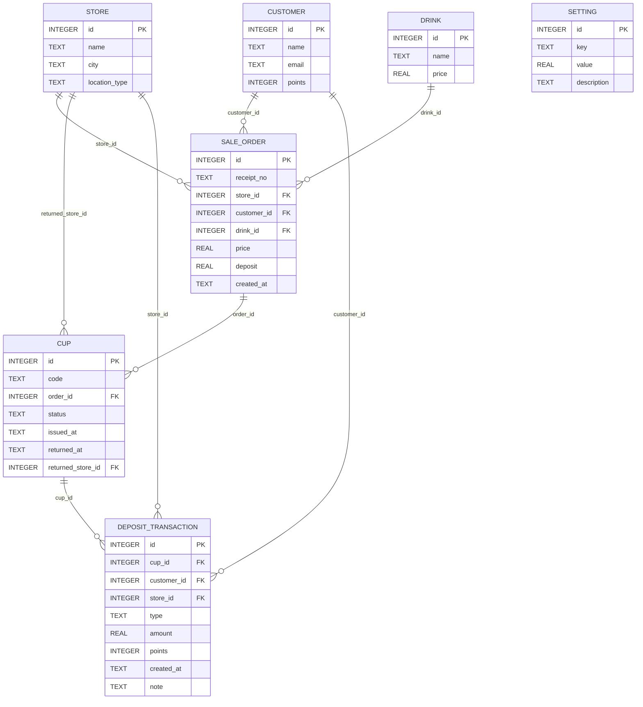
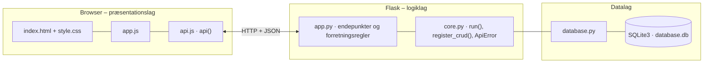

# Joe & The Juice – pant på kopper – dokumentation af prototypen

Kunden betaler **pant** oveni drikken og får en kop med en **unik kop-kode**. Når koppen afleveres i en hvilken som helst butik,
scannes koden, og pantet krediteres som **point i appen**. Samme kop kan kun indløses én gang.
Prototypen viser både POS-skærmen bag disken, kundens app og en bæredygtighedsrapport.

Kravgrundlag: [`Kravspecifikation.md`](Kravspecifikation.md)

## Hvad kan prototypen

| Skærm | Funktion |
|---|---|
| **Kasse (POS)** | Salg med pant-kop (kvittering viser pris, pant og kop-kode) og *Retur – scan kop* med tydeligt grønt/rødt resultat |
| **Kunde-app** | Pointsaldo og værdi, kopper at aflevere (*Scan for at aflevere*), historik, indløsning af point og badge "Kop-helt" ved 3+ returneringer |
| **Bæredygtighed** | Udleverede og returnerede kopper, returrate, pant opkrævet, point krediteret, solgt uden app, tal pr. butik og transaktionslog |
| **Indstillinger** | Pantbeløb og pointkurs (centralt styret), CRUD for drikke og kunder |

Butikken vælges i toppen.

## Fra krav til kode

| Krav | Implementering |
|---|---|
| FR-01 Pant opkræves som del af ordren | `create_order()`: `deposit` læses fra `setting` |
| FR-02 Unik, scanbar kop-kode koblet til ordre | `new_cup_code()` (`secrets`, fx `JOE-7F3A91C2`). `cup.code UNIQUE`, `cup.order_id` |
| FR-03 Retur i alle butikker | `return_cup()` gemmer `returned_store_id`, som kan være en anden butik end købsbutikken |
| FR-04 POS scanner og markerer som returneret | `POST /api/returns` → `status = RETURNERET` |
| FR-05 Automatisk pointkreditering | Samme transaktion: `customer.points += deposit × points_per_krone` |
| FR-06 Saldo og historik i appen | `GET /api/customers/<id>/wallet` |
| FR-07 Ingen dobbelt indløsning | Status-tjek → 409 og logges som `RETUR_AFVIST` |
| FR-08 Automatisk registrering uden dobbeltarbejde | Pant logges automatisk ved salg (`PANT_BETALT`) |
| FR-09 Log til bæredygtighedsrapportering | Tabellen `deposit_transaction` + `GET /api/sustainability` |
| FR-10 Kunder uden app kobles ved retur | `customer_id` (app-konto der scanner) og evt. `receipt_no`. Uden konto afvises med forklaring |
| Vedligehold: pant og kurs justeres uden ny kode | Tabellen `setting` + `PUT /api/settings/<id>` |
| Sikkerhed: svære at forfalske, revisionslog | Tilfældige koder, og alle forsøg (også afviste) logges |

**Events:** Pant betalt (`PANT_BETALT`) → Kop udleveret (`cup UDLEVERET`) → Kop afleveret + Retur godkendt (`RETUR_GODKENDT`) → Point krediteret (`customer.points`).

## Datamodel



## Eksempel på dataudveksling

Koppen `JOE-C41290AA` (købt af Jonas i JOE Fields) afleveres i JOE Strøget. Pantet på 5 kr. bliver til 50 point:

```bash
curl -X POST http://localhost:5108/api/returns \
  -H 'Content-Type: application/json' \
  -d '{"cup_code": "JOE-C41290AA", "store_id": 1}'
```

Svar `201`:

```json
{
  "approved": true,
  "cup_code": "JOE-C41290AA",
  "customer": "Jonas App-bruger",
  "points_added": 50,
  "new_balance": 100,
  "message": "Tak! 50 point er lagt på Jonas App-brugers konto."
}
```

## Kør prototypen

```bash
cd backend
python3 -m venv .venv && source .venv/bin/activate   # første gang
pip install -r requirements.txt                       # første gang
python app.py
```

Terminalen skriver ` * Åbn http://localhost:5108`. Åbn adressen i browseren. Flask serverer både API'et (`/api/...`) og frontenden.

- **Port:** Prototypen bruger port **5108** (5100 + projektnummer). Er porten optaget, vælger `run()` i `core.py` selv den næste ledige og skriver fx ` * Port 5108 er optaget – bruger port 5109 i stedet`. Du kan også vælge port selv med `PORT=5200 python app.py`.
- **Stop serveren** med `Ctrl` + `C` i terminalen, hvor den kører.
- **Kodeændringer:** Serveren kører i debug-tilstand og genstarter selv, når du gemmer en `.py`-fil. Den bliver på samme port. Ændringer i `frontend/` kræver kun, at du genindlæser siden.
- **Database:** `backend/database.db` oprettes med testdata ved første start. Nulstil den med `python database.py --reset`, mens serveren er stoppet.
- **Tjek at backenden svarer:** `curl http://localhost:5108/api/health`

### Fejlfinding

| Problem | Årsag | Løsning |
|---|---|---|
| ` * Port 5108 er optaget – bruger port …` | En anden proces, ofte en glemt server, bruger porten | Brug den adresse, der står i terminalen. Se hvad der optager porten med `lsof -nP -iTCP:5108 -sTCP:LISTEN`. En Flask-server i debug-tilstand er to processer, så stop dem begge med `lsof -t -iTCP:5108 -sTCP:LISTEN \| xargs kill` |
| `ModuleNotFoundError: No module named 'flask'` | Det virtuelle miljø er ikke aktiveret, eller Flask er ikke installeret | `source .venv/bin/activate` og `pip install -r requirements.txt` |
| Siden viser "Kan ikke hente data fra backenden" | Serveren kører ikke, eller `index.html` er åbnet direkte fra disken, mens serveren kører på en anden port | Start serveren og åbn adressen fra terminalen i stedet for filen |
| Tallene passer ikke efter mange tests | Databasen indeholder testdata fra tidligere afprøvninger | Stop serveren og kør `python database.py --reset` |
| `no such table …` | `database.db` er tom eller ødelagt | `python database.py --reset` |

## Arkitektur

Prototypen følger holdets fælles tre-lags struktur (se [`../README.md`](../README.md)):



| Fil | Lag | Indhold |
|---|---|---|
| `frontend/index.html` | Præsentation | Skærmbilleder som faneblade og formularer. Projektets farver og `data-api-port` |
| `frontend/app.js` | Præsentation | Henter data med `api()`, tegner dem i DOM'en og sender formularer |
| `frontend/api.js` | Præsentation | Fælles for alle prototyper: `api()` (fetch + JSON), `h()`, `renderTable()`, `fillSelect()`, `formToJson()`, `bindCrudForm()` og `toast()` |
| `frontend/style.css` | Præsentation | Fælles responsivt design |
| `backend/app.py` | Logik | Projektets forretningsregler og endepunkter |
| `backend/core.py` | Logik | Fælles: `create_app()` (Flask, CORS, JSON-fejl), `run()` (start på ledig port), `ApiError` og `register_crud()` |
| `backend/database.py` | Data | Fælles: forbindelse, `query_all/query_one/execute`, `transaction()` og `init_db()` |
| `backend/schema.sql` · `seed.sql` | Data | Tabeller og fiktive testdata |

Alle fejl returneres som JSON (`{"error": "…", "path": "/api/…"}`) med statuskode 400, 401, 403, 404 eller 409 og vises som en rød besked i frontenden.
Nederst på siden kan man åbne **"Seneste JSON-svar fra API'et"** og se den rå dataudveksling.
Den fulde endepunktsliste står i [`backend/README.md`](backend/README.md).

## Design og responsivitet

- Samme stylesheet i alle prototyper. Kun farverne (`--brand`, `--brand-dark`, `--brand-soft`) sættes i `index.html`.
- Layoutet virker fra mobil (375 px) til desktop uden vandret scroll. Kort lægger sig under hinanden på små skærme, og brede tabeller scroller inde i deres kort.
- Formularfelter kan ikke blive bredere end deres kort. En `<select>` med lange valgmuligheder skubber altså ikke formularen ud over kanten.
- Beskeder vises kort i toppen (grøn = gennemført, rød = fejl fra serveren).


## Testdata

Pant 5 kr., 10 point pr. krone og 0,10 kr. pr. point (markeret som antagelser, jf. afsnit 3.3).
4 butikker (gade, storcenter, lufthavn), 3 app-kunder, 5 drikke og 6 ordrer. Kop `JOE-99D0B3F1` er solgt uden app og kan bruges til at afprøve FR-10.

## Afgrænsning

Ingen rigtig betaling, pantautomat, RFID/kamera-scanning (koden indtastes) eller kontant udbetaling (Waiting Room).
