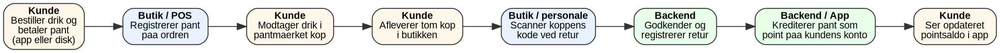
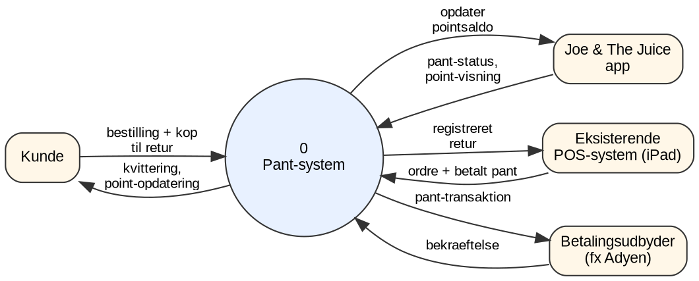
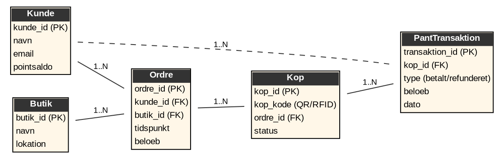

# Kravspecifikation: Pantsystem for genanvendelige kopper – Joe & The Juice

> Konverteret til markdown fra `Kravsspecifikation_Pantsystem_JoeTheJuice.docx`. Tekst og figurer er gengivet som i originaldokumentet.

*Udarbejdet med udgangspunkt i “The Template” (Volere-kravsspecifikationsmodel)*

Fag: Ideudvikling med teknologi og data

Dato: 24. september 2026

*Bemærk: Pantbeløb, konkret pointomregning og valg mellem genbrug/genanvendelse af koppen er markeret som antagelser og åbne spørgsmål i dokumentet, da de kræver en beslutning fra virksomheden/gruppen.*

## 1. Idé-resume

Joe & The Juice indfører et pantsystem på deres kopper. Kunden betaler et pantbeløb oveni prisen på drikken, som lægges på kopperne. Ved at aflevere kop tilbage i butikken får kunden pantet krediteret som point i Joe & The Juice-appen i stedet for kontant refusion. For at systemet skal give mening, opgraderes koppens materiale/kvalitet, så den er mere robust og velegnet til retur, genanvendelse eller genbrug frem for den nuværende engangskop.

Formålet er dels at styrke virksomhedens bæredygtighedsprofil, dels at øge brugen af og loyaliteten til appen, da point kun kan indløses digitalt.

## 2. Project Drivers

### 2.1 Formålet med projektet

Projektet skal reducere mængden af engangsemballage, der ender som affald, og give Joe & The Juice et konkret svar på den kritik, virksomheden tidligere har fået for fortsat at sælge drikke i plastkopper på trods af indskærpede krav til plastreduktion (jf. interview med virksomhedens bæredygtighedschef, Impactloop). Samtidig er formålet at drive mere trafik ind i appen, da pant kun kan udbetales som point og dermed kræver et login.

- Forretningsmæssig fordel: styrket bæredygtighedsprofil og differentiering fra konkurrenter som KCAL Factory, WeDo og GRØD.
- Forretningsmæssig fordel: øget app-tilknytning og datafangst på kunderne, som kan bruges til mersalg og personalisering.
- Risiko for formålet: hvis pantet reelt opleves som en prisstigning uden reel returmulighed, kan det skade brandet i stedet for at styrke det (uddybes under Risici, afsnit 8.6).

### 2.2 Klient, kunde og øvrige interessenter

| Interessent | Rolle / interesse i projektet |
|---|---|
| Joe & The Juice (ledelsen) | Klient/ordregiver. Ønsker bæredygtighedsgevinst og styrket app-brug uden at gå på kompromis med den hurtige ekspedition, kæden er kendt for. |
| Cafégæster (slutbrugere) | Skal betale et ekstra pantbeløb og opleve, at det er let og meningsfuldt at aflevere koppen igen. |
| Butikspersonale ("juicere") | Skal håndtere modtagelse og scanning af returnerede kopper oveni den almindelige ekspedition. |
| IT-/produktafdeling | Skal udvide det eksisterende POS- og app-system (jf. deres egenudviklede IT-infrastruktur og API-opsætning) med pant- og retur-funktionalitet. |
| Bæredygtighedsansvarlig | Skal kunne dokumentere den faktiske effekt af ordningen, da virksomheden tidligere er blevet udfordret på sine bæredygtighedspåstande. |
| Kopleverandør | Skal levere en kop af bedre/mere holdbar kvalitet, evt. med indbygget kode (QR/RFID). |

### 2.3 Brugere af produktet

De primære brugere er cafégæster, der enten sætter sig ned (dine-in) eller tager drikken med (to-go), samt personalet bag disken. En observation i en Joe & The Juice-butik gav følgende fordeling, som er relevant for at forstå, hvor i kunderejsen retursystemet skal fungere:

| Observation | Optælling |
|---|---|
| Bestiller fysisk ved kassen | 7 |
| Afhenter bestilling (forudbestilt/app) | 13 |
| Tager med (to-go) | 6 |
| Sætter sig ned (dine-in) | 13 |
| Rydder selv op efter sig | 9 |
| Efterlader emballage på bordet | 2 |

Det er et lille, ikke-repræsentativt stikprøve fra én observation, men det peger på to ting, der har betydning for kravene: en stor andel afhenter allerede bestillinger via app, hvilket understøtter en app-baseret pantløsning, og et flertal rydder allerede selv op, hvilket er et positivt signal for viljen til at aflevere en kop korrekt. Det siger dog intet om, hvor mange der reelt vil gå tilbage til disken for at aflevere en tom kop for et pointantal.

## 3. Project Constraints

### 3.1 Krav-begrænsninger

- Løsningen skal kunne bygges oven på Joe & The Juice's eksisterende, skræddersyede IT-infrastruktur (iPad-baseret POS og mobilapp), som i forvejen taler sammen i realtid via API-integrationer.
- Løsningen må ikke sænke ekspeditionshastigheden i disken, da hurtig service er en del af virksomhedens kerneværdi og markedsposition.
- Pant og retur skal kunne indløses i alle butikker uafhængigt af beliggenhed (storcentre, gader, lufthavne).
- Løsningen skal virke uden at kræve en fysisk automat i første version, da det er en markant investering pr. butik (se Afsnit 8.2, Off-the-Shelf Solutions).

### 3.2 Navnekonventioner og definitioner

| Begreb | Definition |
|---|---|
| Pant | Det ekstra beløb, kunden betaler ved køb, og som krediteres tilbage som point ved returnering af koppen. |
| Retur-status | Koppens tilstand: "udleveret" eller "returneret". |
| Kop-kode | Unik QR- eller RFID-kode påført/indstøbt i hver kop, der identificerer den enkelte kop. |
| Point | Den digitale valuta i Joe & The Juice-appen, som pantet konverteres til ved godkendt retur. |
| Juicer | Butikspersonale, jf. virksomhedens egen betegnelse for medarbejdere bag disken. |

### 3.3 Relevante fakta og antagelser

Følgende antagelser er lagt til grund for resten af dokumentet, fordi de ikke er endeligt besluttet, og de bør bekræftes eller ændres af gruppen/virksomheden, før løsningen bygges:

- Antagelse: Kopperne indsamles til genanvendelse (materialegenvinding) og ikke til vask/genbrug af samme kop, da genbrug ville kræve industriel opvask i hver butik, som der ikke er infrastruktur til i dag.
- Antagelse: Pant udbetales udelukkende som app-point, ikke kontant – dette er en bevidst forretningsbeslutning for at drive app-brug, men se den juridiske risiko herved i afsnit 7.7 og 8.6.
- Antagelse: Konverteringskursen mellem pant og point samt selve pantbeløbets størrelse er ikke fastlagt i dette dokument og skal besluttes særskilt.
- Fakta: Virksomheden har tidligere fået kritik for fortsat brug af plastkopper til trods for forbud/krav (Impactloop-interview med bæredygtighedschef), hvilket er en del af projektets afsæt.
- Fakta: Virksomhedens IT-systemer er allerede bygget til realtidsintegration mellem app og POS via API-nøgler, hvilket denne løsning kan bygge videre på i stedet for at opbygge ny grundinfrastruktur.

## 4. Business Use Case

Nedenstående procesdiagram viser forretningsprocessen på tværs af kunde, butik og backend/app-system, fra kunden betaler pant, til pantet er krediteret som point.

*Figur 1: Procesdiagram (BPMN-lite) for pant-flowet*

## 5. Product Use Case – User Journey Map

Kunderejsen beskriver oplevelsen set fra kundens perspektiv, inklusive de punkter hvor oplevelsen kan gå galt.

| Fase | Kundens handling | Touchpoint | Potentielt irritationsmoment |
|---|---|---|---|
| 1. Bestilling | Bestiller drik i app eller ved disk og betaler pris + pant | App / POS | Pant opleves som en skjult prisstigning, hvis det ikke er tydeligt kommunikeret |
| 2. Modtagelse | Får udleveret drik i kop med kop-kode | Disk | Kunden lægger ikke mærke til, at koppen kan afleveres for point |
| 3. Forbrug | Drikker undervejs eller ved bord | Café/on-the-go | Ingen retur-mulighed uden for butikken, hvis kunden går videre |
| 4. Retur | Går tilbage til disk/retur-punkt og afleverer tom kop | Disk / evt. retur-station | Kø ved disken; ekstra tid kunden ikke havde regnet med |
| 5. Godkendelse | Koppens kode scannes og godkendes | POS/personale | Fejlscanning eller kop afvist (fx beskadiget kode) |
| 6. Belønning | Ser opdateret pointsaldo i app | App | Point kan ikke bruges som kontanter eller udbetales |
| 7. Genkøb | Bruger point ved næste køb eller fortsætter loyalitet | App | Lav oplevet værdi hvis pointkurs er urimelig |

## 6. Tre-lags arkitektur

### 6.1 Præsentationslag

Præsentationslaget er de skærmbilleder, kunde og personale møder:

- Kunde-app: ny sektion "Mine kopper / Pant" der viser antal kopper til retur, aktuel pointsaldo og en simpel "scan for at aflevere"-funktion.
- POS/iPad (personale): en retur-knap i det eksisterende salgsflow, der åbner en scanner til koppens kode og bekræfter godkendt retur med lyd/visuelt signal – designet til at tage få sekunder, så det ikke bremser disken.
- Fysisk kop: tydelig, letgenkendelig markering af, at koppen kan afleveres for pant, samt en synlig kode.

Wireframes/skitser er ikke udarbejdet i dette dokument, men bør laves som lightning demos eller crazy 8's, inden løsningen designes endeligt.

### 6.2 Logiklag

Logiklaget håndterer selve pant- og pointforretningen: validering af kop-koder, forhindring af dobbelt indløsning, beregning af pointkreditering samt kommunikation mellem POS, backend og app. Context-diagrammet (data flow, niveau 0) nedenfor viser, hvordan pant-systemet som proces udveksler data med de omkringliggende systemer og aktører.

*Figur 2: Context-diagram (DFD niveau 0) for pant-systemet*

Centrale events i logiklaget: "Pant betalt", "Kop udleveret", "Kop afleveret", "Retur godkendt", "Point krediteret". Disse events bør indgå i en event-tabel og eventuel event storming-session, når løsningen detaljeres videre, så det er tydeligt, hvilket system der ejer hvilken handling.

### 6.3 Datastrukturer

Datalaget skal understøtte sporing af den enkelte kop fra udlevering til retur, samt de tilhørende pant-transaktioner. ER-diagrammet nedenfor viser et forslag til datastruktur.

*Figur 3: ER-diagram for pant-systemet*

## 7. Funktionelle krav

### 7.1 Scope of Work

Projektet omfatter forretningsområdet salg og retur af drikkevarer i Joe & The Juice's caféer, herunder integrationen mellem fysisk POS-salg, kopidentifikation og det digitale loyalitetssystem i appen.

### 7.2 Scope of Product

Produktet afgrænses til pant- og retur-funktionaliteten samt den tilhørende pointkreditering. Selve betalingsflowet for drikkevarer, appens øvrige loyalitetsfunktioner og valg af fysisk kopmateriale/leverandør ligger uden for dette dokuments detaljering, men grænseflader til dem er beskrevet, da pant-systemet er afhængigt af dem.

### 7.3 Funktionelle krav og datakrav

| ID | Krav | Prioritet |
|---|---|---|
| FR-01 | Systemet skal kunne opkræve et pantbeløb som en del af ordren, når en drik sælges i en pant-kop. | Must |
| FR-02 | Hver kop skal have en unik, scanbar kop-kode (QR eller RFID), der kan kobles til en ordre. | Must |
| FR-03 | Kunden skal kunne aflevere en tom kop i en hvilken som helst Joe & The Juice-butik. | Must |
| FR-04 | Personalet/POS-systemet skal kunne scanne koppens kode og markere den som returneret. | Must |
| FR-05 | Systemet skal automatisk kreditere kundens app-konto med point svarende til pantet, senest få minutter efter godkendt retur. | Must |
| FR-06 | Appen skal vise kundens aktuelle pointsaldo og historik over pant-transaktioner. | Must |
| FR-07 | Systemet skal forhindre, at samme kop-kode indløses mere end én gang. | Must |
| FR-08 | Pantregistrering skal ske automatisk via det eksisterende POS/app-system uden manuelt dobbeltarbejde for personalet. | Should |
| FR-09 | Systemet skal logge hver pant-transaktion (kop-id, kunde, beløb, tidspunkt, butik) til brug for bæredygtighedsrapportering. | Should |
| FR-10 | Kunder uden en oprettet app-konto skal kunne identificeres ved retur, fx ved at koble kop-koden til kvitteringen (afklares som åbent punkt, se afsnit 8.1). | Could |

## 8. Non-funktionelle krav

#### Look and Feel

Alle nye skærmbilleder i app og på POS skal følge Joe & The Juice's eksisterende visuelle identitet (farver, tone, energiske stil) og ikke fremstå som et påklistret tredjepartsmodul.

#### Usability og Humanity Requirements

At aflevere en kop skal opleves lettere end at smide den ud – processen bør tage under 10 sekunder pr. kop, og kunden skal ikke skulle logge ind manuelt hver gang, hvis app'en allerede er koblet til kontoen.

#### Performance Requirements

Pointkreditering bør ske i realtid eller senest inden for få minutter, så koblingen mellem handling (retur) og belønning (point) opleves umiddelbar, i tråd med den realtidsintegration virksomheden allerede har mellem app og POS.

#### Operational and Environmental Requirements

Løsningen skal fungere ens på tværs af alle lokationstyper (indkøbscentre, gadebutikker, lufthavne) og på den eksisterende iPad-hardware, uden krav om ny fysisk infrastruktur i første version.

#### Maintainability and Support Requirements

Pantbeløb og pointkurs skal kunne justeres centralt (fx pr. land/marked) uden at kræve ny kodeudrulning, så virksomheden selv kan finjustere ordningen.

#### Security Requirements

Kop-koder skal være svære at forfalske eller genbruge, pant-transaktioner skal logges til revision, og kundedata skal behandles i overensstemmelse med GDPR, særligt fordi løsningen kobler køb, retur og identitet tættere sammen end i dag.

#### Cultural Requirements

Løsningen skal kunne tilpasses de markeder, Joe & The Juice opererer i (sprog og lokal valuta), da kæden findes i flere lande med forskellige holdninger til og lovgivning om pantsystemer.

#### Legal Requirements

Det bør juridisk afklares, om en ordning, hvor "pant" udelukkende kan indløses som ikke-kontante app-point, lever op til forbrugeres forventning til et pantbegreb, og om det kræver tydeligere markedsføring for ikke at fremstå vildledende. I Danmark administreres pant på drikkevareemballage normalt gennem Dansk Retursystem, og det bør undersøges, om denne ordning berøres af eller skal koordineres med den lovgivning.

## 9. Project Issues

### 9.1 Open Issues

- Skal koppen genbruges (vaskes og sættes i cirkulation igen) eller kun indsamles til materialegenvinding? Dette er ikke afklaret og har stor betydning for både hygiejnekrav og omkostninger.
- Hvad er det konkrete pantbeløb, og hvad er omregningskursen til point?
- Kan kopper afleveres i en anden butik end der, hvor de er købt?
- Hvad sker der, hvis en kunde ikke har appen – mistes pantet reelt, eller skal der findes en alternativ løsning?

### 9.2 Off-the-Shelf Solutions

Fysiske pantautomater (kendt fra dansk dagligvarehandel) kunne på sigt automatisere modtagelsen af kopper uden at belaste personalet, men er en betydelig investering pr. butik og indgår derfor ikke i førsteversionen.

### 9.3 New Problems

- Ekstra arbejdsbelastning for personalet i spidsbelastningsperioder, når kopper skal scannes ved siden af almindeligt salg.
- Risiko for kø eller ventetid ved retur, som er i modstrid med kædens fokus på hurtig ekspedition.
- Mulig snyd, hvor kunder forsøger at indløse ikke-officielle eller genbrugte kop-koder.

### 9.4 Tasks

- Fastlægge pantbeløb og pointomregning.
- Vælge og indkøbe kop af bedre kvalitet med indbygget/påsat kode.
- Udvikle scanner- og godkendelsesflow i det eksisterende POS-system.
- Udvikle visning af pant og point i appen.
- Undervise personalet i den nye retur-proces.
- Udarbejde kundekommunikation (skiltning, app-notifikationer, evt. kampagne ved lancering).

### 9.5 Migration to the New Product

Overgangen fra den nuværende engangskop til den nye pant-kop bør ske gradvist, fx butik for butik eller marked for marked, så eventuelle fejl i scanning eller pointkreditering opdages i lille skala, før løsningen rulles ud i alle butikker.

### 9.6 Risks

| Risiko | Konsekvens |
|---|---|
| Lav returrate blandt kunder | Pantet opleves reelt som en prisstigning uden modydelse, hvilket kan skade brandet i stedet for at styrke bæredygtighedsprofilen. |
| Point i stedet for kontant refusion opfattes som vildledende | Juridisk og omdømmemæssig risiko, særligt i markeder med streng forbrugerlovgivning. |
| Højere kop-omkostning end pant-indtægt | Den forbedrede kop-kvalitet kan koste mere end det, ordningen sparer i affalds- eller materialeomkostninger. |
| Ekstra tid i disken ved retur | Går imod virksomhedens kerneværdi om hurtig ekspedition og kan påvirke kundetilfredshed negativt. |
| Hygiejnehåndtering af returnerede kopper | Hvis kopperne indsamles/håndteres forkert i butikken, kan det give hygiejniske problemer for personalet. |
| Eksklusion af kunder uden app | Kunder der ikke bruger appen, kan reelt ikke få deres pant tilbage, hvilket kan opfattes som urimeligt. |

### 9.7 Costs

- Udvikling og integration af scan-/godkendelsesflow i eksisterende POS- og app-systemer.
- Merpris pr. kop ved overgang til bedre kvalitet/kop med indbygget kode.
- Eventuel ekstra personaletid pr. retur.
- Løbende drift og vedligeholdelse af den nye funktionalitet.

### 9.8 User Documentation

Der bør udarbejdes en kort FAQ i appen samt skiltning i butikkerne, der forklarer, hvordan man afleverer en kop, og hvordan pantet omsættes til point.

### 9.9 Waiting Room

- Automatiseret retur-station/pantautomat i butikkerne.
- Mulighed for at vælge kontant udbetaling af pant som alternativ til point.
- Retur på tværs af lande/markeder.

### 9.10 Ideas for Solutions

- RFID i stedet for QR-kode for hurtigere og mere robust scanning i en travl disk.
- Gamification, fx badges eller statistik i appen for antal returnerede kopper og sparet affald.
- Kobling til virksomhedens bæredygtighedsrapportering, så den reelle effekt af ordningen kan dokumenteres og kommunikeres udadtil.
