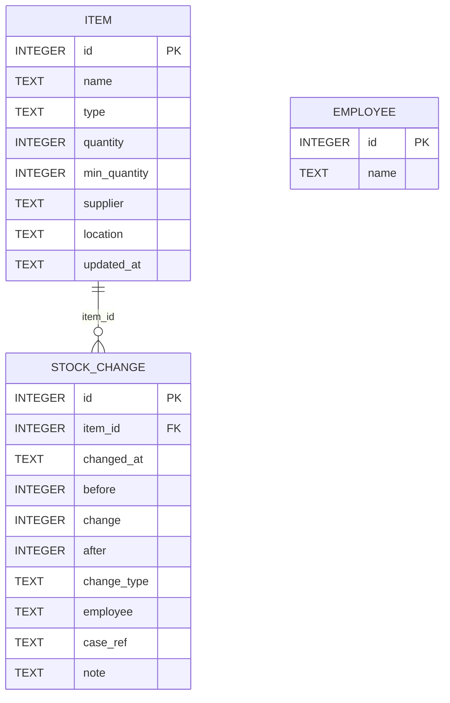
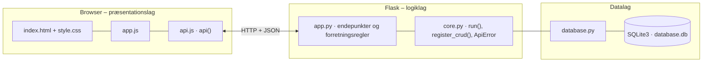

# Den Sidste Rejse – lager i EG – dokumentation af prototypen

En **lagerfunktion bygget ind i EG**, som erstatter den manuelle håndtering af urner, kister og andre varer.
Medarbejderen kan hurtigt se, hvad der er på lager, registrere varer, der kommer ind eller bliver brugt,
og se hvilke varer der skal bestilles hjem. Hver ændring gemmes med før, ændring og efter, så man altid kan se, hvorfor et antal har ændret sig.

Kravgrundlag: [`Kravspecifikation.md`](Kravspecifikation.md)

## Hvad kan prototypen

| Skærm | Funktion |
|---|---|
| **Lageroversigt** | Søgning (navn, leverandør, placering), filter på type, *kun lav beholdning*, sortering, statusmærker (OK / Lav beholdning / Udsolgt) og knapperne *Brug*, *Modtag* og *Korrigér* |
| **Historik** | Alle ændringer eller én vare: dato, type, før, ændring, efter, medarbejder og sag/note |
| **Genbestilling** | Varer under minimum grupperet pr. leverandør med foreslået antal samt de mest brugte varer de sidste 90 dage |
| **Varer** | Opret og redigér varer (navn, type, minimum, leverandør, placering) |

Medarbejderen vælges i toppen og gemmes på hver ændring.

## Fra krav til kode

| Krav | Implementering |
|---|---|
| Samlet oversigt, antal og type | `GET /api/inventory` |
| Søg efter en vare | `?q=` søger i navn, leverandør og placering |
| Opret og redigér vare | CRUD `/api/items`. Antal kan kun sættes ved oprettelse |
| Registrér nye varer på lager | `POST /api/items/<id>/receive` |
| Registrér varer taget fra lageret (evt. koblet til sag) | `POST /api/items/<id>/use` med `case_ref` |
| Automatisk opdatering af beholdning | `change_stock()` er den **eneste** vej til at ændre `quantity` |
| Markering under minimum | `stock_status()` → `LAV` / `UDSOLGT`. Svaret indeholder `low_stock_warning` |
| Manuel korrektion | `POST /api/items/<id>/adjust` kræver en begrundelse (`note`) |
| Gem ændringer og historik (før/ændring/efter) | Tabellen `stock_change`. `GET /api/history?item_id=` |
| Ekstra: genbestillingsliste | `GET /api/reorder-list` (foreslår op til 2 × minimum) |
| Ekstra: filtrering, sortering, mest brugte | `?type=&low=1&sort=quantity`, `GET /api/stats/most-used` |
| Ekstra: leverandør og placering | Felterne `supplier` og `location` |
| Ikke mere administrativt arbejde | Ét klik på *Brug* og ét antal. Standardværdien er 1 |

**Flowet fra kravspecifikationen:**
*vare modtages → `receive` → beholdning opdateres → varen bruges → `use` → systemet viser ny beholdning og advarer ved lav beholdning.*

## Datamodel

Følger skitsen *Vare* og *Lagerændring* fra kravspecifikationen:



## Eksempel på dataudveksling

Karen tager en urne fra lageret til en sag. Beholdningen går fra 7 til 6, og ændringen gemmes i historikken:

```bash
curl -X POST http://localhost:5109/api/items/1/use \
  -H 'Content-Type: application/json' \
  -d '{"amount": 1, "employee": "Karen", "case_ref": "SAG-2026-330"}'
```

Svar `200`:

```json
{
  "item": {
    "id": 1,
    "name": "Urne model X (sort)",
    "type": "Urne",
    "quantity": 6,
    "min_quantity": 4,
    "supplier": "Nordisk Urne ApS",
    "location": "Lager A, hylde 1",
    "updated_at": "2026-09-29 15:50:36",
    "status": "OK",
    "reorder_quantity": 0
  },
  "change": {
    "before": 7,
    "change": -1,
    "after": 6
  },
  "low_stock_warning": null
}
```

## Kør prototypen

```bash
cd backend
python3 -m venv .venv && source .venv/bin/activate   # første gang
pip install -r requirements.txt                       # første gang
python app.py
```

Terminalen skriver ` * Åbn http://localhost:5109`. Åbn adressen i browseren. Flask serverer både API'et (`/api/...`) og frontenden.

- **Port:** Prototypen bruger port **5109** (5100 + projektnummer). Er porten optaget, vælger `run()` i `core.py` selv den næste ledige og skriver fx ` * Port 5109 er optaget – bruger port 5110 i stedet`. Du kan også vælge port selv med `PORT=5200 python app.py`.
- **Stop serveren** med `Ctrl` + `C` i terminalen, hvor den kører.
- **Kodeændringer:** Serveren kører i debug-tilstand og genstarter selv, når du gemmer en `.py`-fil. Den bliver på samme port. Ændringer i `frontend/` kræver kun, at du genindlæser siden.
- **Database:** `backend/database.db` oprettes med testdata ved første start. Nulstil den med `python database.py --reset`, mens serveren er stoppet.
- **Tjek at backenden svarer:** `curl http://localhost:5109/api/health`

### Fejlfinding

| Problem | Årsag | Løsning |
|---|---|---|
| ` * Port 5109 er optaget – bruger port …` | En anden proces, ofte en glemt server, bruger porten | Brug den adresse, der står i terminalen. Se hvad der optager porten med `lsof -nP -iTCP:5109 -sTCP:LISTEN`. En Flask-server i debug-tilstand er to processer, så stop dem begge med `lsof -t -iTCP:5109 -sTCP:LISTEN \| xargs kill` |
| `ModuleNotFoundError: No module named 'flask'` | Det virtuelle miljø er ikke aktiveret, eller Flask er ikke installeret | `source .venv/bin/activate` og `pip install -r requirements.txt` |
| Siden viser "Kan ikke hente data fra backenden" | Serveren kører ikke, eller `index.html` er åbnet direkte fra disken, mens serveren kører på en anden port | Start serveren og åbn adressen fra terminalen i stedet for filen |
| Tallene passer ikke efter mange tests | Databasen indeholder testdata fra tidligere afprøvninger | Stop serveren og kør `python database.py --reset` |
| `no such table …` | `database.db` er tom eller ødelagt | `python database.py --reset` |

## Arkitektur

Prototypen følger holdets fælles tre-lags struktur (se [`../README.md`](../README.md)):



| Fil | Lag | Indhold |
|---|---|---|
| `frontend/index.html` | Præsentation | Skærmbilleder som faneblade og formularer. Projektets farver og `data-api-port` |
| `frontend/app.js` | Præsentation | Henter data med `api()`, tegner dem i DOM'en og sender formularer |
| `frontend/api.js` | Præsentation | Fælles for alle prototyper: `api()` (fetch + JSON), `h()`, `renderTable()`, `fillSelect()`, `formToJson()`, `bindCrudForm()` og `toast()` |
| `frontend/style.css` | Præsentation | Fælles responsivt design |
| `backend/app.py` | Logik | Projektets forretningsregler og endepunkter |
| `backend/core.py` | Logik | Fælles: `create_app()` (Flask, CORS, JSON-fejl), `run()` (start på ledig port), `ApiError` og `register_crud()` |
| `backend/database.py` | Data | Fælles: forbindelse, `query_all/query_one/execute`, `transaction()` og `init_db()` |
| `backend/schema.sql` · `seed.sql` | Data | Tabeller og fiktive testdata |

Alle fejl returneres som JSON (`{"error": "…", "path": "/api/…"}`) med statuskode 400, 401, 403, 404 eller 409 og vises som en rød besked i frontenden.
Nederst på siden kan man åbne **"Seneste JSON-svar fra API'et"** og se den rå dataudveksling.
Den fulde endepunktsliste står i [`backend/README.md`](backend/README.md).

## Design og responsivitet

- Samme stylesheet i alle prototyper. Kun farverne (`--brand`, `--brand-dark`, `--brand-soft`) sættes i `index.html`.
- Layoutet virker fra mobil (375 px) til desktop uden vandret scroll. Kort lægger sig under hinanden på små skærme, og brede tabeller scroller inde i deres kort.
- Formularfelter kan ikke blive bredere end deres kort. En `<select>` med lange valgmuligheder skubber altså ikke formularen ud over kanten.
- Beskeder vises kort i toppen (grøn = gennemført, rød = fejl fra serveren).


## Testdata

11 varer (urner, kister, tekstiler, tryksager, pynt), hvoraf flere er under minimum og én er udsolgt, samt 13 historiske ændringer og 3 medarbejdere.

## Afgrænsning

Prototypen er en selvstændig webside, der viser, hvordan funktionen kunne se ud i EG. Der er ingen integration til EG's sager, login, stregkode/QR eller automatisk bestilling hos leverandør.
