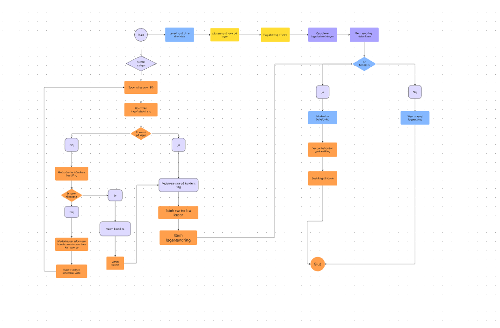

# Kravspecifikation: Prototype – Den Sidste Rejse

> Konverteret til markdown fra `prototype Den Sidste Rejse.docx`. Tekst og figurer er gengivet som i originaldokumentet.

Videreudvikling af Den Sidste Rejses eksisterende IT-system, EGsoftware. I stedet for at udvikle et helt nyt system vil vi undersøge, hvordan EG kan udbygges med funktioner, som kan gøre nogle af virksomhedens arbejdsprocesser mere overskuelige og mindre manuelle.

Baseret på vores analyser har vi især fået øje på behovet for bedre overblik og mere effektive arbejdsprocesser. Samtidig er det vigtigt, at en eventuel digital løsning ikke kommer til at gå ud over den personlige kontakt, som er en vigtig del af Den Sidste Rejses arbejde.

Vi vil arbejde videre med lagerstyring. Vi har fået indblik i, at lageret blandt andet bliver håndteret manuelt, og at der ikke er et samlet digitalt overblik over fx urner. Derfor vil vi undersøge muligheden for at lave en lagerfunktion direkte i EG.

Tanken er, at medarbejderen skal kunne gå ind i en lageroversigt i EG og hurtigt se, hvilke varer der er på lager, hvor mange der er, og eventuelt hvilke varer der er ved at være udsolgt.

Det kunne fx være:

- Varenavn
- Varetype
- Antal på lager
- Minimumsbeholdning
- Status
- Eventuelt placering
- Seneste ændring

Når der kommer nye varer på lager, skal medarbejderen kunne registrere dem. Når en vare bliver brugt, skal lagerbeholdningen kunne ændres. På den måde kan systemet løbende give et mere aktuelt billede af lageret.

Et muligt flow kunne være:

*Vare modtages → medarbejder registrerer varen → lagerbeholdning opdateres → varen bruges → medarbejder registrerer ændringen → systemet viser den nye beholdning.*

**Eventuelt en form for markering, hvis en vare kommer under en bestemt minimumsbeholdning. Det kunne gøre det lettere for medarbejderen at opdage, hvis noget skal bestilles hjem.**

Det er dog vigtigt, at vi undersøger den nuværende arbejdsgang først. Vi ved derfor endnu ikke præcis, hvilke funktioner der skal være med i den endelige prototype. Lager er vores udgangspunkt, men vi vil også undersøge, om der er andre dele af EG eller andre manuelle processer, hvor en videreudvikling kunne give mening.

## Funktionelle krav

Systemet skal kunne:

- vise en samlet oversigt over lageret
- vise antal af den enkelte vare på lager
- vise hvilken type vare der er tale om
- søge efter en bestemt vare
- oprette en ny vare
- redigere oplysninger om en vare
- registrere når nye varer kommer på lager
- registrere når varer tages fra lageret
- automatisk opdatere lagerbeholdningen efter en ændring
- vise hvis en vare kommer under en bestemt minimumsbeholdning
- vise hvilke varer der har lav beholdning
- give medarbejderen mulighed for manuelt at korrigere lagerbeholdningen
- gemme ændringer i lagerbeholdningen

Vi kunne også have en historik, så medarbejderen kan se, hvornår en lagerændring er lavet, og hvad ændringen var.

Fx:

**Urne model X** Før: 8 stk. Ændring: -1 Efter: 7 stk. Dato: xx/xx/2026

Det kan gøre det nemmere at finde ud af, hvorfor et antal på lager har ændret sig.

## Mulige ekstra funktioner

Hvis vi finder ud af, at det giver mening, kunne vi også undersøge nogle ekstra funktioner.

En mulighed er *automatisk genbestilling eller en genbestillingsliste.* Hvis en vare kommer under minimumsbeholdningen, kan den blive markeret, så medarbejderen kan se, at den skal bestilles.

En anden mulighed er *filtrering*, så medarbejderen fx kan vælge kun at se urner eller kun varer med lav beholdning.

Man kunne også have en *lagerhistorik*, hvor man kan se tidligere ændringer.

En anden mulighed kunne være at koble lageret sammen med en sag. Hvis en bestemt urne bliver valgt til en kunde, kan systemet registrere, at den er taget fra lageret. Det vil dog være noget, vi skal undersøge nærmere, da vi ikke ved endnu, om det er realistisk eller nødvendigt.

Man kunne også forestille sig at der er:

- søgefunktion
- kategorier
- sortering efter antal
- “lav beholdning”-markering
- oversigt over mest brugte varer
- genbestillingsliste
- lagerhistorik
- mulighed for at registrere leverandør
- mulighed for at registrere placering på lageret
- eventuelt stregkode/QR-kode, hvis det viser sig at være relevant

Vi skal dog passe på med at få for mange funktioner med. Det vigtigste er, at løsningen faktisk løser det problem, vi har fundet, og ikke bare bliver et stort system med en masse funktioner.

## Brugerrejse

Vi forestiller os umiddelbart en medarbejder, der allerede bruger EG i sit arbejde.

En mulig brugerrejse kunne være:

1. Medarbejderen logger ind i EG.
2. Medarbejderen går ind på lager.
3. Der vises en oversigt over lageret.
4. Medarbejderen søger efter eller vælger en bestemt vare.
5. Medarbejderen kan se den aktuelle beholdning.
6. Hvis en vare er brugt, registreres ændringen.
7. Systemet opdaterer lagerbeholdningen.
8. Hvis beholdningen er lav, bliver det vist for medarbejderen.

Vi vil gerne holde brugerrejsen så simpel som muligt, fordi det netop skal være en funktion, der gør arbejdet lettere og ikke kræver en masse ekstra tid.

## Tre-lags arkitektur

I præsentationslaget vil vi vise det, medarbejderen rent faktisk ser. Her kunne vi fx lave en wireframe af en lageroversigt i EG med søgefelt, vareoversigt, antal og status.

I logiklaget ligger de funktioner, der får lageret til at fungere. Fx at systemet trækker én fra lageret, når en vare registreres som brugt, eller markerer en vare, når den kommer under minimumsbeholdningen.

I datalaget ligger de informationer, systemet skal gemme.

Vi forestiller os fx:

**Vare**

- VareID
- Navn
- Type
- Antal
- Minimumsbeholdning
- Leverandør
- Placering

**Lagerændring**

- ÆndringsID
- VareID
- Dato
- Antal
- Type ændring
- Medarbejder

Det kan senere bruges til at lave vores ER-diagram.

## Non-funktionelle krav

Ud over hvad systemet skal kunne, skal vi også stille nogle krav til, hvordan funktionen skal fungere.

Den skal:

- være nem at bruge
- være overskuelig
- være hurtig at navigere i
- kræve så få ekstra klik og indtastninger som muligt
- fungere sammen med det eksisterende EG-system
- være stabil
- sikre de data, der bliver gemt
- kun være tilgængelig for relevante medarbejdere
- give et tydeligt overblik
- ikke skabe mere administrativt arbejde end nødvendigt

Særligt brugervenligheden er vigtig, fordi funktionen skal bruges af medarbejdere i deres normale arbejdsdag og ikke være noget, der kræver en masse ekstra oplæring.

Vi skal også tænke over sikkerhed, fordi EG allerede håndterer oplysninger om kunder og sager. Vi skal derfor undersøge, hvilke data der er nødvendige for vores løsning, og hvordan de skal beskyttes.

## Afgrænsning??

Vi vil i første omgang fokusere på lagerstyring og ikke forsøge at videreudvikle hele EG.

Vores prototype skal derfor primært vise, hvordan en lagerfunktion kunne fungere, og hvordan den kunne integreres i det eksisterende system.

Vi skal stadig undersøge, om der er andre funktioner, som er mere relevante, eller om lagerfunktionen kan kombineres med andre områder. Det vil vi blandt andet kunne finde ud af ved at undersøge den nuværende arbejdsgang hos Den Sidste Rejse.

Det er også vigtigt, at vores løsning ikke erstatter den personlige kontakt med de pårørende. Den skal i stedet hjælpe med nogle af de praktiske arbejdsopgaver, så medarbejderne forhåbentlig får mere tid til den del af arbejdet, hvor den menneskelige kontakt er vigtig.

## Ting vi stadig skal have undersøgt

- Hvordan fungerer lagerstyringen helt konkret i dag?
- Hvilke varer skal være med?
- Hvor ofte ændrer lagerbeholdningen sig?
- Hvem har ansvaret for lageret?
- Hvordan registrerer de varer i dag?
- Hvilke problemer oplever medarbejderne med den nuværende metode?
- Kan EG allerede noget af det, vi gerne vil lave?
- Hvordan kan vores funktion kobles til EG?
- Hvilke oplysninger skal gemmes?
- Hvilke funktioner er vigtigst for medarbejderne?
- Er der andre manuelle processer, som bør prioriteres højere end lageret?

## Figur

