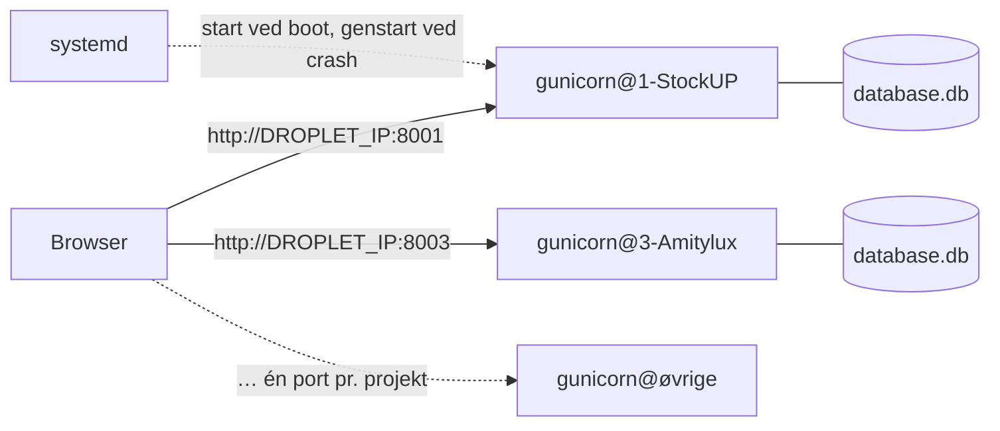

# Hold A – prototyper

Hver gruppemappe indeholder en prototype bygget ud fra gruppens kravspecifikation:

- `backend/`: Python Flask API med en SQLite3-database og CRUD
- `frontend/`: HTML, CSS og JavaScript, der henter JSON fra API'et over HTTP og viser det i DOM'en

| # | Projekt | Port | Port på server | Prototype | Dokumentation |
|---|---|---|---|---|---|
| 1 | StockUP | 5101 | 8001 | Lager af kaffesække og kaffeposer (ristning, salg, bevægelseslog) | [DOCS](1-StockUP/DOCS.md) · [API](1-StockUP/backend/README.md) |
| 2 | GreenMobility | 5102 | 8002 | Reservation af hotspotparkering med 20 min. frist | [DOCS](2-GreenMobility-UrbanMotion/DOCS.md) · [API](2-GreenMobility-UrbanMotion/backend/README.md) |
| 3 | Amitylux | 5103 | 8003 | Oplevelsesvælger, anbefaling og forespørgsels-brief (engelsk UI) | [DOCS](3-Amitylux/DOCS.md) · [API](3-Amitylux/backend/README.md) |
| 4 | AGC | 5104 | 8004 | QC-informationshub: connectors, relevans, kontrol, godkendelse og deling | [DOCS](4-AGC/DOCS.md) · [API](4-AGC/backend/README.md) |
| 5 | Solum | 5105 | 8005 | Fejlfindingsguides, vidensartikler og kompetenceoverblik | [DOCS](5-Solum/DOCS.md) · [API](5-Solum/backend/README.md) |
| 6 | Learnify | 5106 | 8006 | Elevevaluering af trivsel og læringsmiljø med resultater over tid | [DOCS](6-Learnify/DOCS.md) · [API](6-Learnify/backend/README.md) |
| 7 | Boliga | 5107 | 8007 | Insight Hub med samlet boligdata og AI-sparringspartner | [DOCS](7-Boliga/DOCS.md) · [API](7-Boliga/backend/README.md) |
| 8 | JOE | 5108 | 8008 | Pant på kopper: kop-kode, retur og point i appen | [DOCS](8-JOE/DOCS.md) · [API](8-JOE/backend/README.md) |
| 9 | Den Sidste Rejse | 5109 | 8009 | Lagerfunktion i EG med historik og genbestillingsliste | [DOCS](9-Den-Sidste-Rejse/DOCS.md) · [API](9-Den-Sidste-Rejse/backend/README.md) |
| 10 | Ejner Hessel | 5110 | 8010 | Min Hessel: biler, service, reparationsstatus, booking og dokumenter | [DOCS](10-Ejner-Hessel/DOCS.md) · [API](10-Ejner-Hessel/backend/README.md) |

*Port* bruges, når prototypen køres lokalt. *Port på server* bruges, når prototyperne kører med Gunicorn på DigitalOcean-Droplet'en – se [Deployment på DigitalOcean](#deployment-på-digitalocean).

**Dokumentation i hver mappe**

- **`DOCS.md`** beskriver implementeringen: hvad prototypen kan, hvordan kravene er omsat til kode, forretningsregler, ER-diagram, et eksempel på HTTP/JSON-dataudveksling, kørsel og fejlfinding, testdata og afgrænsning.
- **`backend/README.md`** indeholder den fulde liste over endepunkter.

## Kør en prototype

```bash
cd 1-StockUP/backend
python3 -m venv .venv && source .venv/bin/activate   # første gang
pip install -r requirements.txt                       # første gang
python app.py                                         # → * Åbn http://localhost:5101
```

- **Porte:** Hver prototype har sin egen port (5100 + projektnummer), så flere kan køre samtidig i hver sin terminal.
- **Optaget port:** Er porten optaget, vælger serveren automatisk den næste ledige og skriver adressen i terminalen. En anden port kan vælges med `PORT=5200 python app.py`.
- **Stop** en server med `Ctrl` + `C` i dens terminal.
- **Kodeændringer:** Serveren genstarter selv, når en `.py`-fil gemmes, og bliver på samme port.
- **Nulstil databasen** til testdata med `python database.py --reset`, mens serveren er stoppet.

## Fejlfinding

| Problem | Løsning |
|---|---|
| ` * Port 5101 er optaget – bruger port …` | Brug adressen fra terminalen. Find den proces, der optager porten, med `lsof -nP -iTCP:5101 -sTCP:LISTEN`. En Flask-server i debug-tilstand er to processer, så stop dem begge med `lsof -t -iTCP:5101 -sTCP:LISTEN \| xargs kill` |
| Se alle kørende prototyper | `lsof -nP -iTCP -sTCP:LISTEN \| grep ':51'` |
| `ModuleNotFoundError: No module named 'flask'` | `source .venv/bin/activate` og `pip install -r requirements.txt` |
| Siden viser "Kan ikke hente data fra backenden" | Start serveren, og åbn adressen fra terminalen frem for `index.html`-filen |
| Tallene passer ikke efter mange tests / `no such table` | Stop serveren og kør `python database.py --reset` |

Hvert projekts `DOCS.md` har samme tabel med projektets egen port.

## Fælles struktur

Alle prototyper er bygget ens, så man kan læse én og forstå dem alle:

```
<projekt>/
├── DOCS.md                        dokumentation af implementeringen
├── backend/                       LOGIKLAG + DATALAG
│   ├── app.py                     projektets forretningsregler og endepunkter
│   ├── core.py                    FÆLLES: Flask-app, CORS, JSON-fejl, run(), register_crud()
│   ├── database.py                FÆLLES: SQLite3-forbindelse, query_all/query_one/execute/transaction, init_db
│   ├── schema.sql                 tabeller
│   ├── seed.sql                   fiktive testdata
│   ├── requirements.txt           Flask
│   ├── README.md                  endepunkter
│   └── database.db                oprettes ved første start
└── frontend/                      PRÆSENTATIONSLAG
    ├── index.html                 skærmbilleder (faneblade), projektfarver og data-api-port
    ├── style.css                  FÆLLES responsivt stylesheet
    ├── api.js                     FÆLLES: api() med fetch + JSON, h() DOM-hjælper, tabeller, CRUD-formularer
    └── app.js                     projektets præsentationslogik
```

Filerne markeret FÆLLES er identiske i alle ti mapper.

### Byggeklodser

**Backend**

- **`run(app, PORT)`** starter serveren på den ønskede port eller den næste ledige.
- **`register_crud(app, "items", "item", fields=[...])`** giver `GET/POST /api/items` og `GET/PUT/DELETE /api/items/<id>`. Med `validate=` kan en forretningsregel tjekkes før gemning.
- **Forretningsregler** står i `app.py` som almindelige funktioner, der kaster `ApiError("besked", status)`. Klienten får `{"error": "besked"}` som JSON.
- **Flere ændringer, der hører sammen,** skrives i `with transaction() as db:`, så enten gemmes alt eller intet.

**Frontend**

- Frontenden kalder altid **`api("/sti", { method, body })`** og tegner svaret med `renderTable()` eller `h()`.
- **`bindCrudForm()`** kobler en formular til et CRUD-endepunkt: tomt id → opret, udfyldt id → ret.
- Nederst på hver side vises **det seneste rå JSON-svar**, så dataudvekslingen mellem klient og server kan ses.

**Samspil**

- Flask serverer frontenden på `/`, så klient og API ligger på samme adresse.
- `index.html` kan også åbnes direkte fra disken. Så bruges porten i `data-api-port`.

### Design

- **Samme stylesheet:** Alle prototyper bruger samme `style.css`. Hvert projekt sætter kun sine farver (`--brand`, `--brand-dark`, `--brand-soft`) i `index.html`.
- **Mobil til desktop:** Layoutet er responsivt fra 375 px uden vandret scroll. Kort lægger sig under hinanden, og brede tabeller scroller inde i deres kort.
- **Formularer:** Felter kan ikke blive bredere end det kort, de står i.

### Ændringer i de fælles filer

En rettelse i en fælles fil laves ét sted og kopieres derefter til alle ti mapper, fx:

```bash
for d in */backend; do [ "$d" != 1-StockUP/backend ] && cp 1-StockUP/backend/core.py "$d/"; done
md5 -q */backend/core.py | sort -u | wc -l     # skal give 1 = alle filer er ens
```

## Deployment på DigitalOcean

Alle ti prototyper kører på **én Droplet** (`ek-droplet-prototyper`, Ubuntu). Hver prototype kører for sig selv med Gunicorn som en systemd-service og kan åbnes på sin egen port,
fx `http://DROPLET_IP:8001` (StockUP) og `http://DROPLET_IP:8003` (Amitylux).

| Egenskab | Værdi |
|---|---|
| Server | DigitalOcean Droplet, 512 MB RAM (458 MB brugbar) |
| Swap | 1 GB swapfil |
| Projektmappe | `/root/Hold-A-kravspecifikationer/<projekt>/backend` |
| WSGI-server | Gunicorn, 1 worker pr. prototype |
| Processtyring | systemd, én fælles skabelon: `gunicorn@.service` |
| Porte | 8001–8010 (8000 + projektnummer) |
| Entry point | `app:app` (Flask-objektet `app` i `app.py`) |



- **Gunicorn** kører hver Flask-app i sin egen proces med sin egen venv. Går én prototype ned, påvirker det ikke de andre.
- **systemd** starter prototyperne ved boot og genstarter dem, hvis de crasher. Alle ti bruger den samme service-skabelon.
- **Frontenden** serveres af Flask på `/` og kalder API'et på samme adresse, så der skal ikke ændres noget i koden.

> ⚠️ **Kør aldrig `python app.py` på serveren.** Den starter Flasks udviklingsserver i debug-tilstand, og debuggeren lader enhver, der kan nå den, køre kode på serveren. På serveren bruges Gunicorn som beskrevet nedenfor.

Alle kommandoer køres på Droplet'en som `root` (`ssh root@DROPLET_IP`), og projektet ligger i `/root/Hold-A-kravspecifikationer`.

### 1. Forudsætninger

```bash
apt update
apt install -y python3-venv python3-pip
```

### 2. Swap (én gang pr. Droplet)

Med kun 512 MB RAM er swap nødvendigt. Uden swap løb Droplet'en tør for hukommelse og frøs, så SSH ikke længere svarede.

```bash
fallocate -l 1G /swapfile
chmod 600 /swapfile
mkswap /swapfile
swapon /swapfile
echo '/swapfile none swap sw 0 0' >> /etc/fstab
free -h                                        # linjen "Swap:" skal vise 1.0Gi
```

### 3. Venv, pakker og port for hvert projekt

Hvert projekt får sin egen venv i `backend/venv`, Gunicorn og projektets pakker installeret og en fil `gunicorn.env` med sin port (8000 + projektnummer):

```bash
cd /root/Hold-A-kravspecifikationer
for d in */backend; do
  name=$(dirname "$d")                         # fx 1-StockUP
  echo "== $name"
  (cd "$d" && python3 -m venv venv && venv/bin/pip install gunicorn -r requirements.txt)
  echo "PORT=$((8000 + ${name%%-*}))" > "$d/gunicorn.env"
done
grep . */backend/gunicorn.env                  # vis portene
```

> **Tip:** Løkken installerer ét projekt ad gangen. Kør aldrig flere `pip install` samtidig, for på 512 MB kan det få Droplet'en til at fryse.

**Test en app manuelt (valgfrit):** Før systemd sættes op, kan du tjekke, at en app overhovedet starter:

```bash
cd /root/Hold-A-kravspecifikationer/1-StockUP/backend
venv/bin/gunicorn --bind 0.0.0.0:8000 app:app  # åbn http://DROPLET_IP:8000, stop med Ctrl+C
```

### 4. Opret databaserne

Gunicorn kører ikke `if __name__ == "__main__":`-blokken i `app.py`, så `init_db()` bliver aldrig kaldt. Databaserne oprettes derfor én gang her. Uden dette trin svarer API'et med `no such table`.

```bash
cd /root/Hold-A-kravspecifikationer
for d in */backend; do (cd "$d" && venv/bin/python database.py); done

# AGC: lever de første 8 testposter, så "Til kontrol" ikke er tom (kun første gang)
cd /root/Hold-A-kravspecifikationer/4-AGC/backend && venv/bin/python -c "import app; app.deliver_initial_feed()"
```

### 5. Systemd-skabelon

I stedet for 10 separate service-filer bruges én skabelon. `%i` erstattes af det, der står efter `@` i servicenavnet, altså projektmappens navn.

Kommandoen er skrevet på én linje, fordi heredocs (`<< EOF`) kan gå i stykker, når de indsættes i terminalen:

```bash
printf '[Unit]\nDescription=Gunicorn for %%i\nAfter=network.target\n\n[Service]\nUser=root\nWorkingDirectory=/root/Hold-A-kravspecifikationer/%%i/backend\nEnvironmentFile=/root/Hold-A-kravspecifikationer/%%i/backend/gunicorn.env\nExecStart=/root/Hold-A-kravspecifikationer/%%i/backend/venv/bin/gunicorn --workers 1 --bind 0.0.0.0:${PORT} app:app\nRestart=always\nOOMScoreAdjust=500\n\n[Install]\nWantedBy=multi-user.target\n' > /etc/systemd/system/gunicorn@.service
cat /etc/systemd/system/gunicorn@.service
```

Resultatet skal se sådan ud:

```ini
[Unit]
Description=Gunicorn for %i
After=network.target

[Service]
User=root
WorkingDirectory=/root/Hold-A-kravspecifikationer/%i/backend
EnvironmentFile=/root/Hold-A-kravspecifikationer/%i/backend/gunicorn.env
ExecStart=/root/Hold-A-kravspecifikationer/%i/backend/venv/bin/gunicorn --workers 1 --bind 0.0.0.0:${PORT} app:app
Restart=always
OOMScoreAdjust=500

[Install]
WantedBy=multi-user.target
```

> Filnavnet skal være præcis `gunicorn@.service`, med `@` og intet mellem `@` og `.service`. Ellers fungerer det ikke som skabelon, og du får fejlen `Unit file gunicorn@1-StockUP.service does not exist`.

| Linje | Betydning |
|---|---|
| `WorkingDirectory` | Gunicorn kører fra projektets `backend`-mappe, så `app:app` kan findes |
| `EnvironmentFile` | Indlæser `PORT` (og evt. andre variabler) fra projektets `gunicorn.env` |
| `ExecStart` | Bruger projektets egen venv, så hvert projekt har sine egne pakker |
| `--workers 1` | Én proces pr. prototype for at spare hukommelse |
| `Restart=always` | systemd genstarter prototypen, hvis den crasher |
| `OOMScoreAdjust=500` | Løber hukommelsen tør, dræber Linux en Gunicorn-proces i stedet for SSH eller systemet |
| `WantedBy=multi-user.target` | Gør det muligt at starte servicen automatisk ved boot |

Indlæs skabelonen. Det skal gøres hver gang filen ændres:

```bash
systemctl daemon-reload
```

### 6. Start og aktivér prototyperne

Start prototyperne **én ad gangen**, og tjek hukommelsen efter hver:

```bash
systemctl enable --now gunicorn@1-StockUP && sleep 3 && free -h
systemctl enable --now gunicorn@2-GreenMobility-UrbanMotion && sleep 3 && free -h
systemctl enable --now gunicorn@3-Amitylux && sleep 3 && free -h
systemctl enable --now gunicorn@4-AGC && sleep 3 && free -h
systemctl enable --now gunicorn@5-Solum && sleep 3 && free -h
systemctl enable --now gunicorn@6-Learnify && sleep 3 && free -h
systemctl enable --now gunicorn@7-Boliga && sleep 3 && free -h
systemctl enable --now gunicorn@8-JOE && sleep 3 && free -h
systemctl enable --now gunicorn@9-Den-Sidste-Rejse && sleep 3 && free -h
systemctl enable --now gunicorn@10-Ejner-Hessel && sleep 3 && free -h
```

Hold øje med **Swap used**: under ca. 200 MB er fint. Over ca. 500 MB, eller hvis terminalen bliver langsom, så stop og start ikke flere.

| Kommando | Starter nu | Starter ved boot |
|---|---|---|
| `systemctl start` | ✅ | ❌ |
| `systemctl enable` | ❌ | ✅ |
| `systemctl enable --now` | ✅ | ✅ |

En prototype, der kun er startet med `start`, forsvinder efter en genstart af serveren. Brug altid `enable --now`.

### 7. Firewall

```bash
ufw status
```

- `inactive`: alle porte er åbne, og der skal ikke gøres mere.
- `active`: åbn SSH og prototypernes porte:

```bash
ufw allow OpenSSH
ufw allow 8001:8010/tcp
```

> **Husk altid `ufw allow OpenSSH`**, før firewallen aktiveres, ellers låser du dig selv ude.

### 8. Test

```bash
systemctl list-units 'gunicorn@*' --all --no-pager   # alle 10 skal stå som "loaded active running"
systemctl is-enabled gunicorn@{1-StockUP,2-GreenMobility-UrbanMotion,3-Amitylux,4-AGC,5-Solum,6-Learnify,7-Boliga,8-JOE,9-Den-Sidste-Rejse,10-Ejner-Hessel}   # "enabled" 10 gange

for p in $(seq 8001 8010); do echo -n "$p: "; curl -s -o /dev/null -w "%{http_code}\n" http://localhost:$p/api/health; done
```

- `200` betyder, at prototypen kører. `000` betyder, at intet svarer på porten.
- Hukommelse pr. prototype: `ps -eo rss,args --sort=-rss | grep [g]unicorn | awk '{printf "%4d MB  %s\n", $1/1024, $3}'`

**Genstart-test:** Kør `reboot`, vent ca. et minut, log ind igen og kør `systemctl list-units 'gunicorn@*' --all --no-pager` og `free -h`. Alle 10 skal være `running`. Med alle 10 kørende lå forbruget efter genstart på ca. 320 MB RAM og 170 MB swap, hvilket er stabilt.

### Drift

**Efter ny kode i et projekt:**

```bash
cd /root/Hold-A-kravspecifikationer/8-JOE
git pull
systemctl restart gunicorn@8-JOE
```

Er der kommet nye pakker i `requirements.txt`, så kør `venv/bin/pip install -r requirements.txt` i projektets `backend` før genstarten.

| Opgave | Kommando |
|---|---|
| Overblik over alle | `systemctl list-units 'gunicorn@*' --no-pager` |
| Status for én | `systemctl status gunicorn@8-JOE` |
| Genstart én / alle | `systemctl restart gunicorn@8-JOE` / `systemctl restart 'gunicorn@*'` |
| Stop én / alle | `systemctl stop gunicorn@8-JOE` / `systemctl stop 'gunicorn@*'` |
| Start ikke længere ved boot | `systemctl disable gunicorn@8-JOE` |
| Seneste 30 loglinjer | `journalctl -u gunicorn@8-JOE -n 30` |
| Følg loggen live | `journalctl -u gunicorn@8-JOE -f` |
| Hukommelse og swap | `free -h` |
| Nulstil én database | `systemctl stop gunicorn@8-JOE && cd /root/Hold-A-kravspecifikationer/8-JOE/backend && venv/bin/python database.py --reset && systemctl start gunicorn@8-JOE` |

**Miljøvariabler:** Har en prototype brug for fx en secret key, tilføjes den i projektets `gunicorn.env`, og servicen genstartes:

```bash
echo "SECRET_KEY=noget-langt-og-tilfaeldigt" >> /root/Hold-A-kravspecifikationer/8-JOE/backend/gunicorn.env
systemctl restart gunicorn@8-JOE
```

**Andet entry point end `app:app`:** Ligger Flask-appen fx i `main.py` eller bruger en app factory, så tilføj `APP_MODULE=app:app` i **alle** projekters `gunicorn.env` og `APP_MODULE=main:app` (eller `app:create_app()`) i det afvigende projekt. Ret derefter skabelonen:

```bash
sed -i 's/ app:app$/ ${APP_MODULE}/' /etc/systemd/system/gunicorn@.service
systemctl daemon-reload
systemctl restart 'gunicorn@*'
```

### Fejlfinding på serveren

| Problem / fejl i loggen | Årsag og løsning |
|---|---|
| `Unit file gunicorn@<projekt>.service does not exist` | Skabelonen findes ikke eller har forkert navn. Tjek `ls -l /etc/systemd/system/gunicorn@.service`, opret den igen (trin 5), og kør `systemctl daemon-reload` |
| Servicen står som `failed` | Se `journalctl -u gunicorn@<projekt> -n 30` |
| `ModuleNotFoundError: No module named 'x'` | `venv/bin/pip install x` i projektets `backend`, derefter `systemctl restart` |
| `Failed to find attribute 'app' in 'app'` | Entry pointet er ikke `app:app`, se *Drift* |
| `No such file or directory ... venv/bin/gunicorn` | Venv'en mangler. Kør trin 3 for projektet |
| `no such table` | Databasen er ikke oprettet. Kør trin 4 for projektet |
| `Address already in use` | En anden proces bruger porten, fx en manuelt startet Gunicorn. Find den med `ss -tlnp \| grep 80` |
| `KeyError` / manglende config | Prototypen mangler en miljøvariabel. Tilføj den i `gunicorn.env` |
| Prototypen forsvinder efter genstart | Den er startet, men ikke aktiveret: `systemctl enable --now gunicorn@<projekt>` |
| SSH blokeret af firewall | Log ind via Droplet Console i panelet, og kør `ufw allow OpenSSH` |

**Droplet'en fryser, eller SSH svarer ikke:** Årsagen er næsten altid, at hukommelsen er løbet tør. Bekræft det efter login med `dmesg | grep -i -E "out of memory|killed process" | tail`. Sådan kommer du ind igen:

1. **DigitalOcean-panelet → Access → Launch Droplet Console.** Virker også, når SSH er blokeret.
2. Svarer konsollen heller ikke: **Power → Power cycle** (hård genstart).
3. Stop prototyperne straks efter genstart, før hukommelsen fyldes igen: `ssh root@DROPLET_IP "systemctl stop 'gunicorn@*'"`
4. Tjek swap og workers (trin 2 og 5), og start prototyperne én ad gangen igen (trin 6).

### Begrænsninger og videre forbedringer

**Hukommelse:** Opsætningen har næsten ingen margin: 10 prototyper bruger ca. 320 MB RAM plus 100–200 MB swap. Det fungerer, fordi de er små og har lidt trafik. Prototyper, der har været inaktive, er delvist swappet ud, så den første forespørgsel kan tage et sekund eller to.
Bliver det for langsomt, så opgradér: **DigitalOcean-panelet → Resize → CPU and RAM only → 1 GB eller 2 GB** (Droplet'en skal være slukket, og disken ændres ikke, så du kan skalere ned igen). Med 2 GB RAM kan `--workers` sættes op til 2:

```bash
sed -i 's/--workers 1/--workers 2/' /etc/systemd/system/gunicorn@.service
systemctl daemon-reload
systemctl restart 'gunicorn@*'
```

**Sikkerhed:**

- **Prototyperne kører som root.** En sårbarhed i ét studenterprojekt giver fuld adgang til Droplet'en. For prototyper er det acceptabelt, men i længere drift bør de køre som en separat bruger (`adduser --system --group --home /srv/apps apps`). Så skal stierne og `User=` i skabelonen rettes, og alle venvs genskabes, fordi venvs indeholder absolutte stier.
- **Ingen HTTPS og ingen login.** Trafikken går ukrypteret over porte 8001–8010, og alle kan oprette, rette og slette data.

**Nginx foran (valgfrit):** Med Nginx som reverse proxy kan prototyperne få rigtige domænenavne og HTTPS via Certbot i stedet for portnumre. Gunicorn bindes så til `127.0.0.1:${PORT}` i stedet for `0.0.0.0:${PORT}`, og portene 8001–8010 lukkes i firewallen:

```nginx
server {
    listen 80;
    server_name stockup.example.dk;

    location / {
        include proxy_params;
        proxy_pass http://127.0.0.1:8001;
    }
}
```

```bash
apt install -y nginx certbot python3-certbot-nginx
certbot --nginx -d stockup.example.dk
```
